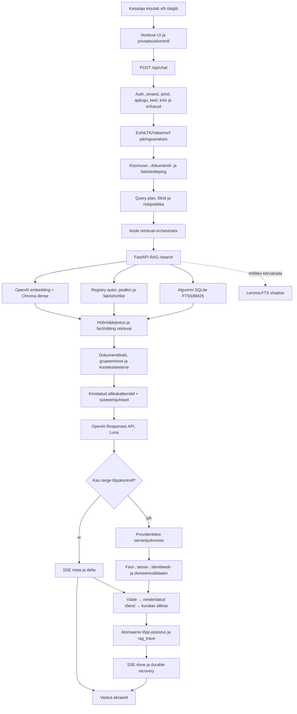
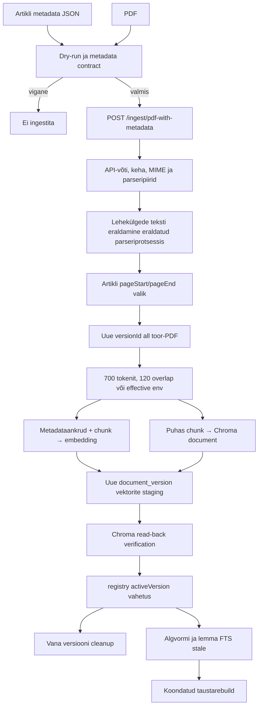

# SotsiaalAI RAG-süsteemi masterkaart

Uuendatud: 31.08.2026
Ulatus: autentitud vestlus, RAG-otsing, dokumendi ingest, indeksid, soojendus, tõendikontroll, allikad ja käitus
Rakenduse RAG-loogika: käesoleva koodiversiooni arhitektuur

§27 sisaldab omaniku analüüside märkmeid; §28 koondab neist produktsiooniks arendamise tervikplaani. Mõlemad on ettepanekud ja teostusnõuded, mitte juba valmis arhitektuuri või produktsioonikõlblikkuse tõend.

## 0. Dokumendi roll ja tõeallikad

See on SotsiaalAI RAG-süsteemi üks tehniline põhikaart. Siin kirjeldatakse tervikut, mitte ühe auditi või ühe küsimuse parandust:

- mida teeb süsteem alates kasutaja küsimusest kuni ekraanile jõudva vastuse ja allikateni;
- mida teeb süsteem artikli, PDF-i, DOCX-i, teksti, HTML-i või URL-i ingestimisel;
- kus elavad originaalid, metaandmed, chunk'id, embeddingud ja indeksid;
- kuidas töötavad Chroma dense-otsing, algvormi FTS5 ja EstNLTK/Vabamorfi kihid;
- kuidas valitakse õige dokument, kaetakse kõik küsitud faktid ja tõkestatakse tõendamata vastus;
- kuidas toimub käivitus, indeksi soojendus, cache, tervisekontroll, uuendus ja kustutus;
- millised vead on fail-closed ja mida kasutaja nende korral näeb.

Dokument ei kanna projekti tööjärjekorda. Aktiivse töö seisu ainus allikas on `docs/platvormi arendus/SotsiaalAI.md`. Käesoleva kaardi autoriteetsuse järjekord on:

1. tegelik rakenduskood ja Prisma skeem;
2. teenuse käivitamisel laaditud keskkonnaseaded;
3. RAG-teenuse `registry.json` koos aktiivse Chroma kollektsiooniga;
4. `/health`, otsingu trace ja autentitud vestluse runtime-tõend;
5. käesolev dokument.

Kui dokument ja kood lähevad lahku, on kood tõene ning see fail tuleb samas muudatuses parandada. Saladusi, API-võtmeid, seansiküpsiseid ega kasutajate toorsisu siia ei kirjutata.

## 1. Süsteem ühe pilguga

SotsiaalAI ei ole pelgalt „vektorotsing + mudel”. See on mitmekihiline tõenditoru:



Põhireegel on: **otsingutulemus, mudeli kontekst, vastuse väide ja kasutajale kuvatav allikas on neli eri kihti**. Ühe kihi õnnestumine ei tõenda järgmise kihi õigsust.

Madala riskiga teel võivad `meta` ja `delta` sündmused jõuda kasutajani enne lõpp-püsistust; püsistus peab õnnestuma enne lõplikku `done` sündmust. Range exact-fact tee puhverdatakse ning valideerimata tekst kasutajani ei jõua.

## 2. Tootmistopoloogia ja protsessid

### 2.1 Põhiprotsessid

| Protsess | Roll | Põhiport või liides | Põhiseaded |
|---|---|---|---|
| Next.js frontend/backend | `/vestlus`, `/api/chat`, admin, püsistus, planner, kontekst, mudel, validatsioon ja allikad | `127.0.0.1:3000` ning avalik HTTPS | `/etc/sotsiaalai/frontend.env` |
| Python FastAPI RAG | ingest, parser, chunkimine, embedding, Chroma, registri- ja hübriidotsing, indeksid | `127.0.0.1:8000` | `/etc/sotsiaalai/rag.env` |
| PostgreSQL | kasutajad, vestlused, pöörded, admini RAG-kirjed, SourcePackage snapshotid, kasutusarvestus | Prisma | `DATABASE_URL` frontendi env-is |
| Research worker | pikkade uurimistööde järjekord; ei ole tavavestluse sünonüüm | systemd worker | frontendi env |

Teenused on systemd üksused `sotsiaalai-frontend.service`, `sotsiaalai-rag.service` ja `sotsiaalai-research-worker.service`. RAG käib ühe Uvicorn worker'iga käsureal `main:app --host 127.0.0.1 --port 8000 --workers 1`. Avalik veeb ei pöördu Chroma poole otse. Next.js suhtleb RAG-teenusega sisevõrgus ja lisab `X-API-Key`.

### 2.2 Põhihoidlad

```text
PostgreSQL
├─ Conversation / ConversationMessage / ChatTurn
├─ RagDocument                       # admini rakenduskirje, mitte kogu indeksi tõde
├─ SourcePackageSnapshot             # versioonitud allikapaketi snapshot
└─ kasutus-, tagasiside- ja töövooandmed

RAG_STORAGE_DIR
├─ registry.json                     # aktiivversiooni ja dokumendi metadata register
├─ registry.json.last-good           # viimane atomaarne varukoopia
├─ chroma/                           # püsiv Chroma kollektsioon ja embeddingud
├─ lexical-index.sqlite3             # algvormi FTS5
├─ lexical-index.sqlite3.stale       # stale-märgis, kui olemas
├─ lemma-index.sqlite3               # EstNLTK lemma-FTS shadow
├─ lemma-index.sqlite3.stale         # lemmaindeksi stale-märgis
├─ docs/<doc-hash>/versions/...      # ingestitud failide/URL-snapshotide versioonid
└─ .document-locks/                  # dokumendipõhised SHA256 lock-failid
```

`master_sources_final.json` on allikate korrastamise ja ingestimise kaart. Aktiivse otsingukorpuse tehniline tõde on `registry.json` + Chroma aktiivversioonid, mitte master-list ega ainult Prisma `RagDocument`.

### 2.3 Käituse effective põhisätted

Püsiv teenusekonfiguratsioon kasutab järgmisi põhisätteid; tabelis puuduvate valikute puhul rakendub vastava koodirea fallback:

| Kiht | Effective väärtus |
|---|---|
| RAG hoidla | `/var/lib/sotsiaalai-rag` |
| Chroma collection | `sotsiaalai` |
| embeddingmudel | `text-embedding-3-large` |
| chunkimine | tokenid; 700 tokenit, overlap 120, ühe chunk'i piir 1200 |
| maksimaalne fail | 25 MiB |
| chat-mudel | `gpt-5.6-luna` |
| reasoning / verbosity | `medium` / `medium` |
| retrieval | `topK=12`, timeout 30 000 ms, kuni 8 gruppi |
| mudelikonteksti RAG-osa | 8 500 märki; ühe grupi body kuni 1 500 märki |
| MMR lambda | 0,60 |

Need on süsteemi käitussätted, mitte eraldi „serveriversioon” arhitektuurist. Koodi fallback-tabelid allpool dokumenteerivad varukäitumist juhul, kui vastav env-seade puudub.

## 3. Kasutaja küsimuse täielik rada

### 3.1 Sisend brauseris

`app/vestlus/page.js` renderdab `/vestlus` serverlehe. `components/alalehed/ChatBody.jsx` ja `components/chat/hooks/useChatStream.js` viivad nii klaviatuuriteksti kui hääletranskriptsiooni samasse sõnumitorusse. Häälel ei ole eraldi, lihtsustatud RAG-i.

Enne saatmist klient:

1. kontrollib, et sõnum ei ole tühi ja eelmine saatmine ei ole pooleli;
2. loob või kontrollib vestluse `ensureConversationBeforeSend` kaudu;
3. loob stabiilse `clientTurnKey`-võtme;
4. lisab UI-sse optimistliku kasutajasõnumi ja tühja assistendisõnumi;
5. saadab `POST /api/chat` päringu.

Päringu leping võib sisaldada:

- kasutaja sõnumit;
- piiratud vestlusajalugu;
- `convId`, rolli, UI keelt ja vastuse keele vihjet;
- `stream`, `persist`, `inputModality` ja privaatsusotsust;
- ajutise kasutajadokumendi chunk'e;
- `combineSources`, `forceSources` või teadlikku töörežiimi;
- korduse/idempotentsuse võtmeid.

Kliendi tavaline vestlusrežiim on `rag`. Deep Research on eraldi püsiv järjekorratöövoog.

### 3.2 API eelkaitsed

`app/api/chat/route.js:POST` kutsub esmalt `lib/chat/requestBootstrap.js:bootstrapChatRequest`. Enne RAG-i või mudelit kontrollitakse:

- serverisessiooni ja autentimist;
- POST rate limit'i;
- JSON-keha, sõnumipikkust ja väljade kuju;
- vestluse omandit või ruumiliikmesust;
- vestluse arhiveerimist ja säilitusaega;
- rolli ja rollipõhiseid piiranguid;
- privaatsuskontrolli kinnitust;
- tellimuse ja kasutusühiku õigust;
- kliendiajaloo mahtu ning serverist loetud usaldatud taastumiskonteksti;
- sisendi keelt ja soovitud vastuse keelt;
- kriisisignaali;
- tervituse, dokumenditöövoo ja abisoovi/abipakkumise eriharusid.

Koodi vaikepiirid tavavestluses on:

| Piir | Vaikeväärtus |
|---|---:|
| kasutaja sõnum | 4000 märki |
| ajalugu | 8 elementi |
| ühe ajalooelemendi tekst | 800 märki |
| ajutised dokumendichunk'id | 80 |
| ühe ajutise chunki tekst | 1800 märki |
| kliendi dokumendikontekst | 1800 märki; kombineeritult 1200; kuni 4 chunk'i |
| spetsialisti dokumendikontekst | 2600 märki; kombineeritult 1600; kuni 6 chunk'i |
| tavavestluse POST rate | 24 päringut / 60 s |

Need on koodi fallback'id; keskkonnaseade võib neid kitsendada või laiendada. Lõplik pöördelimiit jõustatakse hiljem atomaarse `ChatTurn` claim'i sees, mitte ainult eellugemise põhjal.

### 3.3 Erirajad enne üldist RAG-i

Kõik sõnumid ei pea tegema korpuseotsingut.

| Rada | Käitumine |
|---|---|
| tühi esimene tervitus | deterministlik tervitus; RAG-i ei käivitata |
| tervitus koos sisulise küsimusega | läbib tavalise RAG-toru |
| kriis | kriisiohutus on ülimuslik; tõendit võib kasutada, kuid abi ei jäeta RAG-i taha |
| dokumendi loomine või muutmine | `handleDocumentWorkflowBranch` |
| abisoov või abipakkumine | `handleHelpWorkflowBranch` |
| lihtne assistendi võimekuse küsimus | üldjuhul välist allikat ei vajata |
| ajutise faili analüüs | kasutaja failikontekst; soovi korral kombineeritakse üldise RAG-iga |
| KOV-i mitmetähenduslik nimi | deterministlik täpsustusküsimus enne KOV-filtriga otsingut |

RAG-i puudumine ei tähenda automaatselt viga. Viga on siis, kui sisuline, allikapõhine küsimus liigitatakse ekslikult vestluseks või kasutajaliidese meta-küsimuseks.

### 3.4 Idempotentsus ja kasutusarvestus

Enne uut tasulist tööd kontrollib route sama `clientTurnKey` lõpetatud replay'd. Vestluse ja RAG-i kasutusühikud reserveeritakse eraldi ning idempotentselt. Edu korral need commititakse, katkestuse või teenuserikke korral vabastatakse.

See hoiab ära olukorra, kus:

- brauseri retry tekitab kaks vastust;
- kaks vahekaarti ületavad koos pöördelimiidi;
- võrguvea järel arvestatakse sama RAG-otsing kaks korda;
- klient peab katkenud SSE-d ekslikult uueks kasutajaküsimuseks.

## 4. Keel, EstNLTK ja morfoloogia õiges kihis

### 4.1 Kus morfoloogia töötab

`lib/chat/retrievalContextAssembler.js:assembleRetrievalContext` kutsub eesti või ebaselge ladina kirjas küsimuse puhul enne küsimuseplaani `lib/chat/retrievalOrchestrator.js:analyzeRagQuery`. See saadab kuni 2,5-sekundilise päringu RAG-teenuse `/analyze-query` endpointi.

`rag-service/main.py:/analyze-query` kasutab `rag-service/lemma_index.py:EstonianLemmaAnalyzer` klassi. Analüsaatori versioon on `estnltk-vabamorf-1.7.5-v2`.

Analüüs tagastab piiratud kujul:

- tokenid;
- võimalikud lemmad;
- liitsõnajuured;
- pärisnime span'id;
- keele vihje ja kindluse;
- analüüsi kestuse ning põhjuse, kui analüüs pole saadaval.

### 4.2 Mida morfoloogia ei tee

Morfoloogia **ei kirjuta kasutaja lauset ümber** ega asenda algteksti ühe ennustatud „õige” lausega. Näiteks sõnajärjega „täna piim mina ostma” säilib algne pindkuju, kuid planner ja leksikaalne päring saavad juurde `piim/piima` ja `ostma/ostan` tüüpi morfoloogilised kandidaadid.

Sama põhimõte kehtib nime, teenuse, dokumendipealkirja ja mis tahes muu sõna kohta:

- algtekst jääb dense-embeddingu ja täpse fraasi jaoks alles;
- pärisnime pindkuju säilib;
- lemma- ja vormivariandid lisatakse recall'i jaoks;
- algtekstist leitud tugev autor, pealkiri või faktislot võidab kanoonilise fallback'i;
- kanooniline kuju täidab ainult algtekstist puuduva semantilise välja.

Kui `/analyze-query` ebaõnnestub, jätkub küsimus algtekstiga. Morfoloogiateenuse tõrge ei tohi muuta sotsiaalvaldkonna küsimust automaatselt teemaväliseks.

### 4.3 Kaks eri lemmakihti

EstNLTK-d kasutatakse kahes eri kohas, mida ei tohi segi ajada:

1. **päringuülene morfoloogia enne planner'it ja retrieval'it** — see on aktiivne tootmisloogika ning aitab käänete, liitsõnade, nimekujude ja keele tuvastamisel;
2. **püsiv lemma-FTS indeks** — see on praegu shadow/observability kõrvalrada. Ta mõõdab, mida lemmaotsing oleks leidnud, kuid ei muuda tootmistulemuste järjestust.

Seega käändetaluvus ei sõltu praegu shadow-indeksi promotion'ist. Seda kannavad päringu morfoloogilised terminid, algvormi FTS, dense-embedding ja metadataankrud koos.

Arvsõnade ja arvuliste kvalifikaatorite normaliseerimine toimub sellest hiljem, lõplikus piiratud faktilepingu kihis. See ei ole EstNLTK lemmaotsing ega lemmaindeksi promotion. `lib/chat/factRelationSemantics.js` annab tõendi sidumisele, kaetuse kontrollile ja vastuse valideerimisele ühise piiratud suhtevõrdluse. Näiteks `rühmavestlus` ja `grupiintervjuu` võivad tähistada sama intervjuuliiki, kuid individuaal- ja rühmaintervjuu jäävad eri kategooriateks. Mitmesõnaline `täiendav abi` saab päris tekstivahemikuga mõistetokeni; pelk `abi` seda seost ei tõenda. See kiht ei kirjuta nimesid ümber ega võrdsusta suvalisi sarnase algusega sõnu tähenduse poolest.

## 5. Küsimuse semantiline leping

### 5.1 `questionPlanner`

`lib/chat/questionPlanner.js:buildQuestionPlan` teeb algsest küsimusest struktureeritud plaani. Plaan eristab vähemalt:

- tavalist teadmusküsimust;
- professionaalset meetodijuhist (`professional_method_guidance`);
- kliendi enda eluolukorra juhendamist (`life_situation_guidance`);
- konkreetse dokumendi või uuringu küsimust;
- autorit ja autori tööde inventari;
- KOV-teenust, toetust, kontakti ja kohalikku õigusakti;
- täpset paragrahvi või õigusviidet;
- ajaperioodi, trendi ja aastavõrdlust;
- mitmeallikalist sünteesi;
- numbrilist või kvalitatiivset täppisfakti;
- allikate jätkuküsimust.

Planner ei säilita ainult märksõnu. Ta koostab semantilised kandidaadid:

- `current_turn_document_identity`;
- `year_role_mentions`;
- `requested_numeric_slots`;
- `requested_fact_slots`;
- numbrilise väärtuse tüübi ja mõõdiku;
- relation-term'id ja morfoloogilised variandid;
- kvalitatiivse tegevuse, objekti ja polaarsuse;
- autori või autorite nimekujud;
- pealkirjavihje ja dokumendiliigi.

Sõnaselge `ajakiri Sotsiaaltöö` määrab väljaande ulatuse ka siis, kui kasutaja ei lisa sõnu `eri artiklid` või `ülevaade`. Teemaküsimus läheb ajakirja sünteesirajale; puuduva teemakohase artiklitõendi korral öeldakse seda, mitte ei küsita uuesti juba määratud väljaande tähendust.

#### Professionaalne meetodijuhis

`professional_method_guidance` on üldine sotsiaalvaldkonna tööprotsessi rada: küsimus küsib, kuidas hinnata, aidata, toetada või sekkuda. Planner ühendab protsessiküsimuse, tegevuse ja sotsiaalvaldkonna objekti signaalid ning eristab fookuseid `assessment`, `victim_support` ja `practice`. Rada ei nõua sessioonis spetsialisti rolli; tuvastatud kliendi eluolukorra küsimus, allikaotsing või mitme allika ülevaade suunatakse oma kavatsuserajale. Nimetatud dokumendi, autori, täpse õiguse ning KOV-teenuse erilepingud lahendatakse oma reeglite järgi. Üldine sõna `juhend` ei ole veel konkreetse dokumendi identiteet: selleks on vaja pealkirja või selget viidet konkreetsele dokumendile. Juhendi leidmise küsimus jääb allikaotsinguks, mitte meetodijuhiseks.

Plaan kasutab `retrieval_strategy=authoritative_guidance_then_complementary_evidence`, `selection_strategy=professional_method_guidance` ja `query_order=authoritative_guidance_first`. Esmased päringud otsivad aktiivset mitteajaloolist juhendit, seejärel lisatakse täiendavate meetodite päring ning säilivad algsed ja filtreerimata fallback-päringud. Seega on juhend esmane eelistus, mitte garantii, et otsing tagastab ainult ametlikke juhendeid. Riskipoliitika märgib raja `medium` / `actionable` / `current_authoritative_guidance` ning eelistab tugevat juhenditõendit.

`selectProfessionalMethodGuidanceGroups` valib kuni neli eri dokumendi kontekstigruppi. Ta jätab välja `inactive`, `archived` ja `stale` kandidaadid ning arvestab teemasobivust: vähemalt pool küsimuse teematerminitest ja vähemalt kaks terminit peavad sobima (ühe teematermini korral piisab ühest). Alles selle järel eelistatakse põhiallikaks aktiivset mitteajaloolist ametlikku juhendit või standardit, selle puudumisel aktiivset meetodi- või infomaterjali. Pelk ametlik päritolu ei tõsta teise teema juhendit esimeseks. Kui põhijuhendit ei kinnitata, võib säilida muu asjakohane tõend olekuga `primary_guidance_status=unconfirmed`; tühi valik on `missing`. Hindamisküsimus võib lisada pealkirja või tagide mudeli-/meetodisignaaliga täiendava allika, ülejäänud kohad täidab MMR. Konteksti mitmekesisus ei tähenda nelja kuvatava allika ega kõigi võimalike meetodite nõuet. Lisaks välistab küsimuses sõnaselgelt määratud lapse või täiskasvanu sihtrühm vastupidise ainsa sihtrühmaga allikapealkirja; ühine „abivajaduse hindamise” sõnavara ei kaalu seda vastuolu üles. Mõlemat sihtrühma käsitlev pealkiri jääb valitavaks. See on pealkirja konfliktikaitse, mitte kõigi tekstis leiduvate sihtrühmade ammendav klassifikaator.

### 5.2 Kõik faktislotid säilivad

Mitmeosalise küsimuse iga küsitud osa peab jääma eraldi slotiks. Näiteks „millised neli osakaalu ja kui palju inimesi neile vastas?” ei ole üks üldine numbriküsimus, vaid viis seosega faktislot'i.

Rinnastatud liitsõna ellips taastatakse kategooriana: `individuaal- ja rühmavestlused` annab eraldi individuaalvestluse ja rühmavestluse suhted. Üldsõnu ega asesõnu nagu `need` ei nõuta tõendis kohustusliku nähtusesildina.

Slot sisaldab vajaduse järgi:

- järjekorranumbrit;
- väärtusetüüpi (`count`, `proportion`, `calendar_year`, `duration`, kvalitatiivne jne);
- relation-term'e ja nende lemma-/vormivariante;
- eksplitsiitset ulatust või kategooriat;
- eeldatud kardinaalsust;
- tegevus–objekt sidet;
- eitust või jaatust;
- päritolu (`original` või `canonical_fallback`).

Planner'i slot ei ole veel tõendatud vastuseväärtus. Numbriline slot muutub pöörde rangeks lepinguks alles siis, kui kõrge kindlusega dokumendiidentiteet on lukus ja kõik küsitud slotid saab üheselt siduda sama lõpliku renderdatud allikabloki tõendiga. Piiratud arvsõnaparser tunneb eesti keeles arve 0–10 ning inglise ja vene keeles arve 1–10 koos toetatud käändevormidega. Parser tuvastab esmalt arvsõna ja seob alles seejärel vahetult järgneva toetatud ühiku, et näiteks „Neist kuus” ei neelduks ekslikult kuu-ühikuks. Kui tõendi arvsõna on sama sloti küsimusepoolses relation-term'is (näiteks „neljal kohtumisel”), jääb see ulatuseks ega muutu küsitud vastuseväärtuseks. Kandidaadiskoor eelistab arvule vahetult järgnevat või eelnevat nähtusesilti sama fragmendi kaugemale relation-term'ile; liiga lähedased konkureerivad täissobitused jäävad endiselt mitmetähenduslikuna fail-closed. See on faktilepingu arvunormaliseerimine, mitte EstNLTK lemmaotsing.

Kui küsimus palub selgitada küsimuses juba nimetatud arvude tähendusi, kannab iga arv eraldi `explicit_value_relation` slotti. Väärtus ei ole siis vastus iseeneses: sama lukustatud renderdatud tõend peab kinnitama ka selle kohaliku nähtuse või rühma, mida arv tähistab. Esmane provisional assignment lubab ainult täielikus explicit-slot'ide partiis iga sloti üht unikaalset sõnaselgelt küsitud arvuväärtust ega nõua, et küsimuse üldsõnad („näitaja”, „arv”) korduksid tõendilauses. Sama rada kasutatakse ka renderdatud tõendi coverage'is; mõlemad loevad ainult pealkirja- ja metapäiseta lõplikku `evidenceText`-i ning küsimuse ja tõendi arvujärjekord ei pea kattuma. Contract kasutab seejärel tõendist tuletatud arvulähedast descriptor-ankrut. Kui samas fragmendis kordub sama descriptor mitme arvu juures, lisatakse eristuseks kõrvalasuva faktirühma unikaalne descriptor; mitme tõendifragmendi korral kasutatakse eristavat sündmuseankrut. Segatud või korduvate requested-value slot'ide partii, sama väärtuse teine ankurdatud tõendikoht sõltumata skoorivahest, puuduv ankur või jätkuvalt eristamatu ankruskeem ei aktiveeri lepingut.

Arvu ja kategooria sidumine arvestab ka kohalikku süntaktilist piiri. `Kord kuus` ei tähenda arvu kuus; `kolme osalejaga grupiintervjuu` osalejate arv ei asenda intervjuude arvu. Kirjavahemärgi külge liitunud joonealuse märkuse number ei muutu mõõdikuks, samas säilib järgarvulise aastakirjutuse `2018. aastal` seos. Rinnastatud kategooriate eristav termin peab olema sama kohaliku arvuakna ja sulutaseme sees; kõrvalise sulgudes oleva protsendi või teise kategooria ankrust ei piisa. Semantilise lisatokeni loomine ei vähenda arvsõna kõrval kontrollitavate päris sõnade arvu.

PDF-i ühe reavahetusega katkenud lause võib siduda kategooria järgmise rea arvuga kuni 160 märgi ulatuses sama tõendiploki sees. Lõpetatud lause, tühi rida, teine plokk, vahepealne arv või teine sulutase seda kohalikku kategooriaseost üle ei kanna.

### 5.3 Jooksva pöörde dokumendiidentiteet

Tugevad identiteedisignaalid on:

- täpne pealkiri;
- kõik küsimuses nimetatud autorid;
- allika aasta, eraldi andmete või juhtumi aastast;
- dokumendiliik;
- olemasolev usaldatud `doc_id` jätkukontekstis.

Jooksva pöörde selge pealkiri või autor võidab eelmise vestluse dokumendi. Nõrk teema- või sisusarnasus ei tohi tugevat identiteeti üle kirjutada.

Täpselt nimetatud pealkiri on esmane. Kui kasutaja nimetab baaspealkirja, võib identiteedikiht arvestada ainult selle kanoonilisi `<pealkiri>[u] kokkuvõte` ja `<pealkiri>[u] lühikokkuvõte` õdesid, prioriteediga **täpne pealkiri > kokkuvõte > lühikokkuvõte**. Kui kasutaja nimetab kokkuvõtte või lühikokkuvõtte ise, on see eraldi dokument, mitte perepäring. Kaks sama prioriteediga eri `doc_id`-d jäävad mitmetähenduslikuks; vana usaldatud `doc_id` ei tohi jooksva pealkirja kõrgema prioriteediga vastet ületada.

### 5.4 `semanticTurnContract` ja sotsiaalvaldkonna scope

`lib/chat/semanticTurnContract.js` ühendab algteksti, morfoloogia, entity'd, planner'i ja olemasoleva tõendi ühe pöörde lepinguks. Domeeniscope ei põhine ainult ühel märksõnaloendil.

Kui küsimuse enda sõnavara on ebakindel, kuid RAG leiab selgelt sotsiaalvaldkonna materjali, võib valitud tõend scope'i sotsiaalvaldkonnaks tõsta. See väldib vale vastust „vastan ainult sotsiaaltöö küsimustele” olukorras, kus küsimus või leitud allikas on tegelikult valdkondlik.

## 6. Ajalugu, anafoor ja täpsustused

`lib/chat/retrievalOrchestrator.js:shouldUseAnswerHistory` lubab vastuseajalugu ainult siis, kui pöörde kuju seda vajab. Pelgalt sõna `selles`, `neid` või lühike lause ei anna ajaloole õigust tugevat jooksva pöörde identiteeti üle kirjutada.

Usaldatud jätk võib kasutada:

- eelmise vastuse kuvatud allikakomplekti;
- serverisse salvestatud RAG recovery-state'i;
- pooleliolevat KOV-täpsustust;
- sama dokumendi tõendatud `doc_id`-d;
- sama vestluse lõpetatud pöörde replay'd.

Kliendi saadetud vabatekstiline ajalugu ei ole iseseisvalt autoriteetne omandi, allika ega taastumise tõend.

Lühike käsk nagu `Räägi sellest paragrahvist lähemalt` on jätkuküsimus: `räägi` ei ole asesõna kohalik sisuline eelkäija. Kui jooksvas küsimuses puudub oma `§`-viide, võib query-plan kasutada vahetult eelmise kasutajapöörde üht sõnaselget paragrahvi koos tuvastatud seadusega. Rohkem kui üks varasem paragrahv ei anna selle raja kaudu üheselt määratud viidet; jooksva küsimuse selge viide võidab alati. Kohalik sisuline eelkäija samas küsimuses ei anna automaatselt põhjust vestlusajalugu kaasata.

### 6.1 KOV-i mitmetähendus

Kui kohanimi võib tähendada eri omavalitsusüksust ja küsimus sõltub KOV-ist, ei valita vaikimisi üht. Süsteem küsib näiteks „Kas mõtled Tartu linna või Tartu valda?”.

Järgmine lühivastus `linn` või `vald` seotakse serveris talletatud pakutud valikutega. Täisnimi töötab samuti. Kui eelnevat usaldatud täpsustust ei ole, ei tohi paljast `linn`/`vald` suvalise KOV-iga siduda.

## 7. Query plan ja Node'i retrieval-orchestrator

### 7.1 Päringute koostamine

`lib/chat/queryPlanner.js:buildRagQueryPlan` toodab:

- ühe või mitu semantilist päringut;
- algvormi leksikaalterminid;
- metadatafiltrid;
- soovitud retriever'id;
- `topK` ja dokumendisisese süvaotsingu mahu;
- valikustrateegia;
- audience-, KOV-, aasta-, autori-, pealkirja- või `doc_id` piirid.

Konkreetse uurimisfakti puhul võib `buildDocumentScopedResearchFactQueries` luua puuduva sloti järelpäringu, milles on sama pealkiri, kõik autorid ja lukustatud `doc_id`. See ei ole uus üle-korpuse küsimus, vaid sama dokumendi piires taastamine.

Laia sünteesi staatus üksi ei luba kasutada varasema vastuse allikaid. Sõltumatu küsimus ei päri eelmise teema pealkirju ega dokumendifiltreid ka siis, kui kasutab sõnu „mainitakse” või „mainitud”. Sama source-history värav kehtib nii põhipäringu tekstile kui ka lisapäringutele. Ehtne ainsuslik allikajätk piirdub viimase allikaga; mitmuslik „nende artiklite” jätk kasutab varasema tõendatud allikakomplekti ühendfiltrit. Nende selgete jätkude piir rakendub enne üldist laia sünteesi haru.

### 7.2 Filtrid

Filtreid ei kirjutata üksteisega üle. Need komponeeritakse `AND`/`OR` kujul ning võivad hõlmata:

- `audience` või `audiences`;
- `doc_id`/`document_id`;
- `source_type`, `item_type`, `resource_type`;
- `collection_id`;
- `municipality_id`, maakonda või jurisdiction'i;
- autorit või author-token'eid;
- aastat ja ajaloolisust;
- aktiivset/current versiooni;
- canonical item'i või SourcePackage'i.

Tavakasutaja ei saa planner'i kaudu RAG-teenuse suvalist filtrit otse määrata.

### 7.3 Mitme päringu ühendamine

`lib/chat/retrievalOrchestrator.js:searchRagQueries`:

1. deduplikeerib sisuliselt samad query'd;
2. käivitab piiratud paralleelsusega kuni kolm otsingut korraga;
3. säilitab põhipäringu tugevama kaalu;
4. ühendab vähemalt kahe mittetühja tulemuskogumi tulemused ankurdatud reciprocal-rank fusion'i kaudu; kui ainult üks kogum sisaldab lubatud tulemusi, tagastab selle muutmata skooride, järjekorra ja kandidaadi-metaandmetega;
5. koondab timings/partial/degraded info;
6. eemaldab fail-closed keelatud või tagasivõetud teenuseprofiili tulemused.

Kõigi päringute ebaõnnestumine on tehniline RAG-viga. Mõne päringu ebaõnnestumine võib anda osalise tulemuse, kuid seda ei esitata trace'is täieliku otsinguna. Tühi õnnestunud päring pole fusion'i panustav kanal; samuti ei tohi tühi või ebaõnnestunud lisapäring ainsa sisulise tulemuskogumi skoore uuele skaalale teisendada. Iga alampäringu timing ja viga jäävad nähtavaks ka ühe sisulise kogumi kiirteel. Nõusolekuvärav rakendub endiselt enne tulemuste ühendamist iga otsingu väljundile.

## 8. RAG-teenuse otsing

### 8.1 `/search` sisend ja autentimine

Node saadab `POST ${RAG_API_BASE}/search` päringu koos:

- `query` ja võimalike batch-query'dega;
- `top_k` väärtusega;
- normaliseeritud filtritega;
- soovitud kanalitega;
- faktisegmendi/dokumendisügavuse seadetega;
- query keele ja leksikaalterminitega;
- ühe loogilise pöörde `X-Request-Id` ning piiratud observability-päistega;
- `X-API-Key` võtmega.

FastAPI endpoint on `rag-service/main.py:/search`; põhiloogika on `_execute_search`.

### 8.2 Dense-kanal

1. Küsimus ja vajaduse korral faktisegmendid pakitakse ühte embedding-batch'i.
2. Vaikimisi embeddingmudel on `text-embedding-3-large`.
3. Sama loogilise retrieval'i identsed embeddingusisendid kasutavad single-flight jagamist.
4. Chroma `collection.query` otsib kogu aktiivsest vektorruumist.
5. Kandidaadibaas kasvab `top_k` järgi ning on teenuses piiratud.
6. Tulemusse jäävad dokumendi- ja chunk-metadata, distance/dense score ja retrieval-kanal.

Embeddinguteenuse 502/503 vea korral võib otsing jätkata kohaliku leksikaalse fallback'iga, kui leksikaalkanal oli küsitud. Vastus märgitakse `partial=true`, `degraded=true`, `dense_retrieval.available=false`. Ilma töötava tõendikanalita ei tagastata tühja rohelist tulemust.

### 8.3 Registripõhised täppiskanalid

`registry.json` võimaldab enne või kõrval Chroma semantilist rankingut teha piiratud shortlist'e:

- täpse või morfoloogiliselt sobiva autori järgi;
- pealkirja järgi;
- dokumendi kirjelduse faktisõnade järgi, kui identiteet kitseneb ühele aktiivsele allikale;
- aktiivse autori tööde täieliku inventari jaoks;
- kindla `doc_id` kõigi aktiivsete chunk'ide lugemiseks.

Need kanalid ei asenda sisutõendit. Registrikirje võib tõendada dokumendi identiteeti või olemasolu, kuid pelk registri metadata ei tohi olla lõpliku faktilise väite ainus allikas.

### 8.4 Algvormi FTS5/BM25

`rag-service/lexical_index.py:PersistentLexicalIndex` hoiab aktiivsete chunk'ide püsivat SQLite FTS5 indeksit. Schema versioon on `fts5-v2` ja tokenizer `unicode61 remove_diacritics 2`. FTS tabelis on eraldi kaalutavad väljad `title`, `body`, `authors`, `tags` ja `terms`; kõrvalolev tavapärane `chunks` tabel hoiab `chunk_id`, `doc_id`, `document_version`, kogu dokumenditeksti ja metadata JSON-i filtrite rakendamiseks. `body` välja läheb kuni 12 000 märki chunki algusest. `terms` lisab normaliseeritud pealkirja-, keha-, autori- ja tagiväljade 5- ning 8-märgilised prefiksiterminid.

Päringu ajal:

1. leksikaalterminid normaliseeritakse;
2. koostatakse FTS `MATCH` avaldis;
3. planner'i filter kompileeritakse SQL-i;
4. FTS tagastab piiratud kandidaadid ja `bm25` rank'i;
5. teenus arvutab coverage'i, nime-/pealkirjakatte ja exact phrase'i signaali;
6. kandidaat ühendatakse dense- ja teiste kanalitega.

Kui püsiv indeks pole registry generation'iga kooskõlas, ei märgita seda valmis indeksiks. Kui persistent FTS on lubatud, tagastab see kanal seisundi `persistent_fts5_unavailable`; dense- ja õnnestunud registrikanalid võivad jätkata, kuid stale indeksit ega peidetud korpuseskanni ei esitata valmis FTS-ina. Piiratud korpuseskann on legacy fallback ainult siis, kui püsiv indeks on konfiguratsioonis välja lülitatud või teadlikult vahele jäetud. Trace peab näitama kasutatud strateegiat ja täielikkust.

### 8.5 Lemma-FTS shadow

`rag-service/lemma_index.py:PersistentLemmaIndex` ehitab EstNLTK lemmadest eraldi SQLite FTS5 indeksi:

- schema `lemma-fts-shadow-v2`;
- analyzer `estnltk-vabamorf-1.7.5-v2`;
- pealkirjalemmad ja kehalemmad eraldi;
- iga rida seotakse aktiivse `chunk_id`, `doc_id` ja `document_version`-iga;
- generation peab kattuma registri generation'iga.

Lemmaindeksi vaatlus on asünkroonne kõrvalrada. Esmane päring võib saada `lemma_fts_shadow` objektis ainult `scheduled=true`; taustaworker arvutab tulemuse ja paneb selle piiratud observation-cache'i, kust korduspäring võib saada `async_cached` vaatluse. Neid tulemusi võrreldakse tootmisretrieval'iga, kuid neid ei lisata tootmise hübriidjärjestusse. Promotion vajaks eraldi mõõdetud otsust.

### 8.6 Hübriidjärjestus

Teenuse aktiivsed kanalid on:

- `dense`;
- `author_match`;
- `title_match`;
- `exact_phrase`;
- `bm25`;
- piiratud juhtudel `registry_fact`.

`_apply_hybrid_ranking` ühendab dense score'i, leksikaalskoori, RRF-signaali, kanaliboostid, BM25 coverage'i, nime-/pealkirjasignaali ning faktisegmendi signaali. `RAG_RRF_K` fallback on 60.

Täpset valemit ei tohi käsitleda tõenäosusena. See on järjestusfunktsioon. Kõrgeim skoor ei anna õigust ületada dokumendiidentiteedi, audience'i, versiooni või faktilepingu piiri.

### 8.7 Faktisegmendid ja sibling-chunk'id

Mitme faktiga või dokumendisisese küsimuse korral:

1. põhiküsimuse baseline säilib;
2. küsimus jagatakse piiratud faktisegmentideks;
3. valitakse tugevate dokumentide shortlist;
4. otsitakse segmentide kaupa sama dokumendi seest;
5. lisatakse parima chunki vahetud naabrid, et PDF-i piiril jätkuv lause ei kaoks;
6. sibling-kandidaate ei kärbita uuesti üldise väikese leksikaalpiiri taha;
7. lõppvalik peab katma faktisegmendid, mitte ainult andma kõrge keskmise skoori.

### 8.8 RAG-teenuse vastus Node'ile

RAG-teenus tagastab:

- `results` — chunk-taseme tulemused;
- `groups` — dokumendi/artikli järgi grupeeritud tulemused;
- `retrievers_used` ja `search_strategy`;
- `merge_strategy` ja kanalistatistika;
- `partial`/`degraded`;
- dense- ja lexical-kihi seisud;
- lemma-shadow vaatlus;
- strategy decisions;
- request ID ja etapitimings.

`partial=false` tähendab ainult otsinguteenuse lepingu täielikkust selles päringus. See ei tõenda, et õige fakt jõudis mudelikonteksti või lõppvastusesse.

## 9. Dokumendi valik ja konteksti koostamine

### 9.1 Grupeerimine

Ajakirja kaant ja sisukorda ei käsitleta artikli sisulise tõendina pelgalt artikli metadata tõttu. Ühine `evidenceContent.isJournalFrontMatter` nõuab ajakirjaallikat ning mitut kooskõlalist kaane/sisukorra tunnust (väljaandenumber koos ISSN-iga ja küsimusekujuliste pealkirjade või toimetusandmetega; või sisukorramärgis koos loendstruktuuriga). Üksik ISSN sisulises tekstis ei välista lõiku. Mitte-sisulised lõigud eemaldatakse grupeerimisel body-loendist ja uuesti kontekstiehituse sisendist; sama dokumendi sisulised lõigud ning autoripealkirja metadata säilivad. Tühja sisuga metadata-kirje ei lähe sisulisse genereerimiskonteksti. See kontroll ei muuda registrit ega indeksit ning ei hangi vaikimisi naaberartiklit asemele.

Node grupeerib chunk'id stabiilse artikli/dokumendiidentiteedi järgi, kasutades `articleId`, `doc_id` ja pealkirja. Ühe grupi sisse koondatakse:

- body chunk'id;
- lehed ja lehevahemikud;
- autorid, aasta, ajakirjanumber ja sektsioon;
- source type, canonical item ja KOV-metadata;
- retrieval-kanalid ning skoorid;
- värskuse ja ajaloolisuse info.

### 9.2 Täpse dokumendi lukk

Konkreetse uurimuse või artikli küsimuses lukustatakse dokument ainult kõrge kindlusega jooksva pöörde identiteeditõendi korral. Lukk võib tugineda täpsele jooksva pöörde pealkirjale, otsustavale kitsale kokkuvõttepere vastele, usaldatud jooksva pöörde autori kinnitusele või kõigi nimetatud autorite ja allika-aasta ühisele kinnitusele ning üheselt valitud aktiivsele `doc_id`-le.

Pärast lukku:

- puuduvat faktislotti otsitakse sama `doc_id` seest;
- naaberdokumendi sama number või sarnane sõnastus ei täida lepingut;
- recovery-query säilitab kõik autorid ja pealkirja;
- fact-search ja puuduva sloti recovery kasutavad sama `doc_id` filtrit ning hindavad iga lisatulemuse järel identiteedi uuesti;
- muu dokumendi valik kaotab luku fail-closed;
- identity mismatch annab täpsustuse või tõendipuuduse, mitte lähima dokumendi vastuse.

### 9.3 KOV-kontekst ja Service Map

Praegused KOV-kontaktid võivad tulla PostgreSQL-i Teenusekaardi registrist, mitte RAG-i vanast kontaktikoopiast. `retrievalContextAssembler` eristab:

- KOV-teenuse ja toetuse sisulist tõendit;
- õigusakti;
- ametlikku praegust kontakti;
- kontaktide seire-/värskuse meta-küsimust.

Teenusekaart võib olla kontaktide autoriteetne kontekst, kuid ei tohi täita ajakirja või uuringu faktislotti.

Taotlusvormi ja pöördumiskoha küsimus (`mis vorme on vaja ja kelle poole pöörduda`) on esmalt menetlusjuhis, kui kasutaja ei küsi nimelist, telefoni-, e-posti- või ajakohast kontakti. Puuduv kontrollitud isikukontakt ei tohi eemaldada ametliku teenuseallikaga tõendatud vormi- ja asutuseinfot. Kui vastus siiski sisaldab täpset isikukontakti, telefoninumbrit või e-posti, rakendub kontaktide range tõendikontroll; menetlusjuhise rada ei anna luba neid oletada.

### 9.4 Kontekstieelarve

`lib/chat/ragContext.js` renderdab ainult valitud tõendiplokid. `lib/chat/settings.js` koodi fallback'id on:

| Seade | Fallback |
|---|---:|
| `RAG_TOP_K` | 12 |
| `RAG_CONTEXT_GROUPS_MAX` | 8 gruppi |
| `RAG_CTX_MAX_CHARS` | 6000 märki |
| `RAG_CTX_HEADROOM` | 15% |
| `RAG_GROUP_BODY_MAX_CHARS` | 1100 märki |
| `RAG_MMR_LAMBDA` | 0,5 |
| `RAG_TIMEOUT_MS` | 30 000 ms |

Režiim võib kasutada spetsiifilisemat dokumendi- või grupieelarvet. Valitud `specific_research_fact` ja `professional_method_guidance` rada välistavad üldise sünteesi toorsõna-heuristika: näiteks sõna „kogemused” nimetatud artikli pealkirjas ei tohi käivitada ülevaate väiksemat chunk'i- ega body-eelarvet. Oluline pole ainult üldmaht, vaid see, et:

- kõik kohustuslikud faktislotid jõuaksid renderdatud blokki;
- ühe vale dokumendi paljud chunk'id ei täidaks kogu eelarvet;
- valitud body span'id ja nende kärped oleksid trace'is nähtavad;
- allika `evidenceText` oleks täpselt sama tekst, mida mudel nägi.

#### Lõplik renderdatud tõendileping

Temaatilise ja ülevaatesünteesi kontekst nõuab iseseisvalt mõistetavaid katkendeid (`requireSelfContainedPassages`). Ajakirjakatkend, mis algab lahendamata üldviitega nagu „Teenuse eelarve…”, ei või võtta teenusenime teisest, otsingujärjestuses kõrval olevast katkendist. Selline body jäetakse enne eelarve jagamist kõrvale. Üks konkreetset liitsõnalist referenti nimetav kitsas allikapealkiri võib üldviite lahendada; mitu teenust nimetav pealkiri ei lahenda. Sama body sees oleva eelneva lause seos säilib. See piiratud leksikaalne kaitse ei ole üldine asesõnade lahendaja ega puuduva naaber-chunk'i automaatne taastamine.

Samas sünteesirežiimis lõpeb kärbitud body viimase eelarvesse mahtuva terviklause juures. Aastaarvu järgarvupunkt (`2018. aastal`, ka `2018. ja 2019. aastal`) ei ole lauselõpp. Kui ühtegi terviklauset ei mahu, jäetakse sisutühi plokk lõppvalikust välja; `used`, `renderedBlocks` ja viitenumeratsioon jäävad vastavusse. Üldist märgieelarvet ei suurendata ning täpse uurimisfakti rada seda sünteesifiltrit ei kasuta.

Numbriline faktileping ehitatakse valitud `budgeted.used` grupist ja sama indeksiga lõplikust `renderedBlocks[index]` tekstist; kvalitatiivne leping kasutab samast renderdatud tekstist koostatud `renderedEvidenceGroups` vaadet. Laiem grupi toorsisu ei tohi tõendada väärtust, mida mudelile tegelikult ei renderdatud.

Leping aktiveerub ainult siis, kui planner'i slotiloend on täielik, dokumendiidentiteet on kõrge kindlusega ning kõik slotid seotakse üheselt ühe renderdatud `source_id`/`doc_id` tõendiga. Mitmetähenduslik, kärbitud või puudulik mapping jääb välja lülitatuks ja vastamine jätkub fail-closed piiriga.

Iga seotud slot kannab vähemalt väärtusetüüpi ja tõendiväärtust ning vajaduse järgi ühikut, kvalifikaatorit, relation-term'e, ulatust, kardinaalsust ja minimaalset relation-term'ide kattuvust. Builder märgib aktiveeritud lepingu puhul `used_for_generation=true`, kuid jätab `used_for_validation=false`. Viimane muutub vastuse töötlejas alles kontrollitud lepingu valideerimistulemuse põhjal; lepingu olemasolu üksi ei ole käivitustõend. Renderdatud tõendi räsi seob lepingu tegeliku kontekstiga.

### 9.5 EvidencePackage ja SourcePackage

Kõrgema riski, täpse õiguse, KOV-paketi või pakendatud allika korral võib süsteem ehitada:

- `EvidencePackage` — konkreetse pöörde valitud tõendid ja nõuded;
- `SourcePackage` — canonical item'i versioonitud allikakomplekt, jaotised, puuduvad osad ja display-kandidaadid;
- section attribution — milline allikasektsioon tohib millist väitetüüpi toetada.

Puuduv kohustuslik jaotis ei muutu mudeli üldteadmisega „täidetuks”.

## 10. Prompt ja vastuse genereerimine

### 10.1 Mudelile mineva sisendi järjekord

`lib/chat/promptBuilder.js:toResponsesInput` koostab Responses API sisendi selles järjekorras:

1. stabiilne rolli-, keele-, kuupäeva- ja kriisisüsteemijuhis;
2. explicit prompt-cache breakpoint;
3. vajaduse korral dokumendianalüüsi juhis;
4. `Kinnitatud allikakatkendid` ehk renderdatud RAG-kontekst;
5. vajaduse korral nõrga või puuduva grounding'u teade;
6. ainult lubatud piiratud ajalugu;
7. pöördepõhised lisasüsteemijuhised, sealhulgas grounding'u-, riski-, KOV-i-, õiguse-, faktisloti- ja allikapiir;
8. kasutaja praegune küsimus.

Kui allikakonteksti ei ole, ütleb material message seda otseselt. Mudelile ei anta luba täita korpuseauku üldteadmisega.

#### Professionaalse meetodijuhise vastuseleping

Raja vastuseleping on `answer_contract=evidence_backed_method_phases_and_complementary_models`. `lib/chat/retrievalContextAssembler.js:buildProfessionalMethodGuidanceInstruction` koostab `PROFESSIONAL_METHOD_GUIDANCE_MODE` juhise, mis lisatakse `extraSystemInstructions` kaudu samasse vastusemudelikutsesse. Vastus peab lähtuma valitud juhenditõendist ning selgitama praktilisi samme ja otsustuskohti, mitte piirduma esimese tuttava mudeliga:

- hindamisfookuses eristatakse tõendi olemasolul kohest turvalisust või kiiret ohuhinnangut, eelhindamist, põhjalikku hindamist, tegevusplaani ja kordushindamist;
- muus abistamisfookuses eristatakse tõendi olemasolul turvalisust, toetavat kontakti, praktilisi tegevusi ning abi juurde suunamist või järeltegevust.

Need on prompti kaetuse kontrollpunktid, mitte automaatselt lisanduv tõend. Hindamisvaldkondi ei esitata eraldi meetoditena; valitud allikates olevad täiendavad mudelid ja nende roll selgitatakse eraldi. Ajaloolist praktikat ega täiendavat mudelit ei muudeta kohustuslikuks praeguseks menetluseks. Puuduvat sammu, mudelit, kohustust või kohalikku kättesaadavust ei leiutata ning olulise tõendamata etapi või meetodi piir nimetatakse lühidalt. `missing` või `unconfirmed` põhijuhendi korral lisatakse eraldi juhis mitte väita praegu ametlikult nõutavat menetlust ega ammendavat meetodiloendit.

See on genereerimise tõendiga piiratud vastuseleping, mitte eraldi deterministlik täieliku meetodivastuse validaator. Olemasolevad identiteedi-, faktiväite-, riski- ja allikaatributsiooni piirid jäävad kehtima; uus rada ei lisa teist vabalt genereerivat mudelikõnet.

### 10.2 Mudel ja cache

`lib/chat/settings.js` fallback'id:

- mudel `gpt-5.6-luna`;
- reasoning `low`;
- text verbosity `medium`;
- rollipõhine väljundlagi `promptBuilder.js` kaudu.

Prompt-cache võti on `sotsiaalai:chat:v2:<role>:<lang>:<crisis>`, TTL 30 min. Cache-breakpoint lõpeb enne RAG-konteksti, ajalugu ja kasutajaküsimust. See on providerile saadetav cache-leping, mitte garantii, et iga kutse saab cache hit'i. Kasutajate dünaamilist sisu ei jagata stabiilse prefiksi osana.

### 10.3 Stream ja puhverdamine

Tavalisel madala riskiga vastusel võib Responses API tekst voolata SSE delta'dena. Kui exact-fact või muu range tõendileping vajab lõppteksti terviklikku kontrolli, puhverdatakse provideriväljund serveris. Kasutaja ei näe valideerimata numbrit või väidet hetkekski.

## 11. Lõppvastuse validaator

`lib/chat/factContract.js:validateExactFactAnswer` kontrollib lõplikku vastust selle sama renderdatud tõendi ja query-plan'i vastu.

### 11.1 Kontrollitavad lepingud

- iga küsitud numbriline slot on olemas;
- sloti väärtusetüüp on õige;
- vastuse slotid seotakse globaalse üks-ühele sobitusega, mitte vastuse lausete või arvude järjekorra järgi;
- tõendiväärtus, protsendiliik, kohalik relation, ulatus ja vajaduse korral kvalifikaator peavad kõik sama slotiga sobima;
- `over`, `under`, `at_least`, `at_most` ja `about` säilivad; arvvahemikku ei teisendata üheks punktväärtuseks;
- korduv sama väärtus ei saa pelga `expected_cardinality` arvu abil relation-kontrollist mööduda; kõik ootamatud lisaarvud jäävad keelatuks ning kategooriate arv kontrollitakse ainult siis, kui kategooriasildid on eraldi tõendatud;
- protsent ja vastajate arv pole omavahel valesti tuletatud;
- arv on seotud kohaliku kategooria/relation-term'iga;
- küsimuses olev ulatusarv, näiteks vanus, ei muutu vastuse mõõdikuks;
- grupi kardinaalsus ei muutu koguarvuks;
- aastaarvul on õige roll: source-year, data-year, decision-year või episode-year;
- kvalitatiivne tegevus on seotud õige objektiga;
- tegevuse polaarsus säilib;
- kontakt kuulub õigesse KOV-i ja rolli;
- täpne õigusviide on valitud tõendis;
- väited tulevad lukustatud dokumendist;
- temporal aggregate ei muutu leiutatud aastareaks;
- allikakomplekti jätkuküsimus säilitab sama tõendatud komplekti.

Null või mitu täielikku sloti-assignment'i, puuduv lõplik renderdatud tõend, ebapiisav dokumendilukk või ootamatu lisaarv annavad esmalt `FAIL`. Ootamatu lisaarvu puhul võib rakenduda allpool kirjeldatud kitsas, täielikku kordusvalideerimist nõudev taastamine. Kui täielik renderdatud faktileping on olemas, ei eeldata mudelilt planner'i algset arvujärjekorda: otsustab üheselt tõendatud seos.

Võrdsete rühmasuuruste ja sama valimi koguarvu jaoks on eraldi piiratud seosekontroll. See rakendub ainult kahele loendusslotile: rühma suurus koos oodatud rühmade arvuga ja koguarv. Allika sõnaselgest „igast rühmast viis, kokku viisteist” seosest võib tuletada rühmade arvu, kui jagatis on täisarv vahemikus 2–20; seda hoitakse eraldi allikas sõnaselgelt öeldud kardinaalsusest. Vastus peab kas ütlema üheselt, et igas nimetatud arvus rühmas oli sama palju osalejaid, või nimetama kõik eri tõendatud osalejarollid. Sama rolli käändeline kordamine ei täida uut rühma; kohtute, asutuste ja omavalitsuste arv ei ole osalejate arv. Koguarv peab esinema üks kord ning kõrvalarvud ei pääse sellest harust kontrollita läbi.

Meetodisloti tõendiankruks valitakse analüüsi või meetodi sisuline täpsustus, näiteks `temaatiline`, mitte pelgalt `intervjuude analüüs` ega sulgudes viidatud autori nimi. Vastuse meetod peab selle ankruga sobima. Osaliste hinnangute küsimuses ei korva õige järelhindamise kestus puuduvat osapoolt: nii arvuline kui ka kvalitatiivne leping peavad läbima. Koordineeritud rollipaari tõendiankur vajab osalemise või hindamise klausi ning mõlemal poolel osalist tähistavat nimisõna; koolituse teemade „ja/ning” loend ei ole isikute loend ega täida osapoolte lepingut.

Sama nähtuse kategooriaid eristavad määrangud (`palju`, `suur`, `väike`, `keskmine` jne) on nõutavad siis, kui kaas-slot jagab nähtuse põhisõna, kuid mitte määrangut. Üldised rahvastiku- või tegusõnad ei võistle kategooriamääranguga arvu kaugusseostamisel. Allika enda kohalik väljend „palju abi” võib anda vastava lisabi-alamkategooria ühele numbrilisele slotile `abi` variandi; see ei muuda `abi` ja `lisabi` üle süsteemi samatähenduslikuks. Määrangu puudumine, vale riskirühm või kategooriate arvude vahetamine jäävad blokeerituks.

Rühmade arvu jagatis tuletatakse ainult täpsetest operandidest: `vähemalt`, `kuni`, `üle`, `alla` ja `umbes` ei anna täpset kardinaalsust. Ka eraldi rühmakontrollis peab kvalifikaator säilima allika, slotilepingu ja iga vastusearvu vahel. Nimeline meetod võib olla ka predikaat või tegevuse objekt (`uurimismeetodiks oli vaatlus`, `andmekogumiseks kasutati osalusvaatlust`); see ei pea alati eelnema sõnale `analüüs`.

Vastuses eraldatakse ka `ja`/`ning` abil algav uus silt–arv klausel, kui sidesõna järel ja enne arvu on uue küsitud mõõdiku seos. See takistab eelmise arvu sidumist järgmise kategooriasildiga. Pelk sidesõna ühikute vahel ei lõika seost automaatselt läbi. Konkureerivate siltide kaugus arvust mõõdetakse tokeni ja arvuspani servadest, mitte sõna keskpunktist: pikk liitsõna nagu `individuaalintervjuu` ei jää oma kõrval oleva arvu suhtes eelmise koguarvu lühisildist halvemasse seisu. Sama osalejarolli käändelised kordused deduplikeeritakse nii allika rühmade arvu tuletamisel kui ka vastuse täielikkuse kontrollimisel.

Konkureeriv arvusilt peab täitma ka oma sloti kohaliku seosesignatuuri. Pelk ühine liitsõnaosa, näiteks hooldustegevuse mainimine hoolduskoormuse riskinäitaja kõrval, ei muuda teist sloti sobivaks konkurendiks. Konkurendi enda kategooriamäärang on eristamisel esmane ka siis, kui kontrollitaval üldisemal slotil määrang puudub. Vahetult arvu kõrval olev silt kuulub oma lähimale arvule: rasvane kiri, numeratsioon, taanded ega koopula „oli/olid” ei nihuta arvupositsioone või anna silti naaberarvule. Võrdse kauguse korral ei leiutata omanikku ning ülejäänud seoseväravad jäävad jõusse.

### 11.2 Vale vastuse korral

Soovitusfakti katvust kontrollitakse juba enne genereerimist. `hasQualitativeRecommendationIntent` nõuab tuvastatud tegevusega ettepaneku-/soovitusmärki, tegevusega seotud kohustuslikkust või direktiivset lause-/loendialgust. Pelk positiivne omadussõna, tingimuslik „võib olla vajalik” või olukorrakirjelduses esinev muutus ei kinnita autori soovitust. `tagama` tuvastus kasutab tegusõnavorme; nimisõnad „tagajärg”, „tagasiside” ja „tagatis” ei anna tegevust `provide`. Alles soovitusrolli värava läbinud lõikudest valitakse seose ja tegevusobjektiga sobiv tõend. Sama värav töötab algses katvuses, puuduva tõendi taastamise otsuses ja lõplikus renderdatud lepingus. Kui soovitust pole, jääb slot puudulikuks ning olemasolev otsing otsib sama lukustatud dokumendi seest lisatõendit. See on piiratud keeleline tõendivärav, mitte kõigi võimalike lausekujude mõistmise garantii; faili pikkus või arvamuse positiivne toon ei asenda tõendit.

Meetodi tõendis tuntakse ka liitsõnu `uurimismeetod` ja `sisuanalüüs`. Täpsustav ankur peab kuuluma samasse fraasi, mitte eelmisse lausesse; pealkirja „uuringu metoodika” üldsõna ega lauselõpu „näiteid” ei ole meetodinimetus. Tõendifragmentide ja vastuseüksuste lausepiir arvestab lõppjutumärki: tsitaadi arv ei või laenata järgmisest lausest osalemise või muu tegevuse seost. Järgarvulised aastad ja kuupäevad jäävad tervikuks.

`qualitativeTimeSemantics` nõuab aja-slotilt tegelikku kalendripunkti/-vahemikku või toetatud suhtelist aega. Eesti kuunimed, kuupäevad ja aastad seotakse oma ajapunktiga; sama aastaarvu tokenit ei omistata uuesti järgmise kuu ette. Vastus säilitab vahemiku mõlemad otspunktid, suhtelise aja puhul kestuse, suuna ja võrdlussündmuse. Üldise „millal tehti” seob leping tegeliku uuringu läbiviimise predikaadiga, mitte sõnaga „tegemist” või alamrühma intervjuuperioodiga. Parser on piiratud ega taga kõigi keelte ja ajaväljendite katet. Sisuta ajaankur jätab sloti puuduvaks; olemasolev dokumendi-ID-ga lukustatud taastamisotsing kasutab puuduva sloti seosesõnu koos väärtusetüübi ankrutega (`uurimismeetod/andmekogumine/andmeanalüüs`, `läbiviimine/aeg/periood`).

Kahe seosesõnaga soovituse tõend peab kinnitama mõlemad. Soovituste eraldi mõisteseosevärav säilitab tuletise: „otsuste” ei ole sõna „otsustamine” kääne ning „toetamine” ei asenda täiendit „toetatud”. Lemma- ja liitsõnavariandid aitavad käänet leida, kuid lühike tüveosa ei tõenda tervet mõistet; kesksõnaline täiend peab paiknema oma küsitud nimisõnalise põhisõna lähedal. See piirang ei muuda arvuliste faktide seoseparserit.

Soovituse põhitegevust eristatakse lõpus olevast selgitavast relatiivlausest ainult siis, kui kõik lausega sobinud küsitud objektid säilivad põhilauses. Tegevusnimed ja omadussõnalised vormid, näiteks „toetamise” või „pakutavates”, ei ole lisapredikaadid. Koma ja sidesõna eraldavad tegelikke tegevusi, mitte sama tegevuse objektiloendit. Lepingu tegevused peavad seostuma küsitud objektiga; pelk soovituse saaja või kõrvaline korraldustegevus kohustusi juurde ei tekita. Selgituse modaalne „mis võimaldab” ei ole iseseisev soovitus, kuid sõnaselgelt küsitud teine tegevus–objekt, näiteks korduvate hindamiste vältimine, jääb kohustuslikuks. Tegevuse vahetamine keelamiseks või eitamine ei läbi kontrolli. Võrdse tõendiskooriga fragmentidest eelistatakse lühemat; tegevuste rohkus iseenesest ei paranda asetust.

Ainult soovitusi sisaldava lepingu vastuseüksused on üksikud laused ja kuni kaheksa järjestikuse lause aknad sama loendipunkti või lõigu sees. Nii võib üks soovitus paikneda mitmes lauses. Maksimaalse katvuse otsing kasutab eksklusiivseid lausevahemikke: teise sloti lauset ei tohi enda tõendiks laenata. Otsingul on 10 000 sammu piir; selle täitumine ei muuda puuduvat katvust läbituks. Küsimuse kordamine pealkirjana ei anna vale tegevuse jaoks objekti. Lokaalne asesõna või tõendiga seotud sisuline objekti kirjeldus võib säilitada parafraasi; üks üldsõna („inimene”, „lahendus”) ei ava kontrolli. Puuduv mõisteseos jätab sloti puuduvaks ja lubab olemasolevat sama dokumendi piires tehtavat tõenditaastamisotsingut, mitte ei kuuluta katvust täielikuks.

Täielikult läbitud renderdatud count/proportion-leping on oma sama allika kategooriaseoste autoriteetne kontroll. Kui dokumendiidentiteet on kohustuslik, sobiv ja kõrge kindlusega, kõik slotid on üheselt seotud ning leping viitab sobivale renderdatud allikale, ei rakendata neile lisaks vana pelgalt sõnavastavusel põhinevat kategooriaparserit. Arvude allikakate, protsendi/arvu seosed, aasta, üldkogumi piir ja kõik varasemad typed-slot'i väravad jäävad kehtima. Täieliku lepingu puudumisel jääb üldine kategooriakontroll jõusse.

Validaatori läbikukkumine ei ole kasutajale nähtava vale teksti järel tehtav logimärge. Süsteem teeb fail-closed valiku:

- kasutab deterministlikult tõendatud vastuseosa;
- jätab toetamata sloti välja ja nimetab puuduva info;
- küsib täpsustuse;
- annab tõendipuuduse vastuse;
- taastab usaldatud recovery-state'i, et kasutaja saaks jätkata.

Tavapärane validator ei tee teist vabalt genereerivat paranduskutset. See piirab nii kulu kui ka võimalust, et „parandus” lisab uue tõendamata väite.

Lepingu ehitus ja vastusevärava käivitamine on eri sammud. `shouldValidateExactFactAnswer` loeb lõplikust `queryPlan.semantic_turn_contract` väljad `requested_facts` ja `requested_fact_contract`; vana `semantic_candidates.requested_fact_slots` on ainult tagasiühilduv fallback. Puudulikku kanoonilist plaani ei asendata vana täieliku plaaniga. Valmis `requestedQualitativeSlotContract` käivitab samuti vastuse kontrolli, ka siis, kui ajutine planneri pesa enam query-plan'is puudub. Pelk sünteesiplaani `text_relation` ilma täppisfakti režiimi või seotud kvalitatiivlepinguta ei käivita universaalset arvukontrolli. Tegelikku käivitust ja tulemust näitavad `validation_applied`, `production_path` ning faktivalideerimise trace.

`recoverSupportedReplyAfterNumericValidation` saab taastada täielikult vastatava täpse dokumendifakti, kui ainus arvuvärava tõrge on `requested_metric_unexpected_numeric_claim`. Nõutavad on täielik `final_rendered_evidence` leping, kohustuslik ja kõrge kindlusega sobiv dokumendiidentiteet ning olemasolevad allikad. Taastamine piirdub üksikute count/proportion-slottidega ilma ulatusarvude või mitmekordse kardinaalsuseta. Arvuread ehitatakse renderdatud tõendi väärtusest, seosesildist, protsendiliigist ja kvalifikaatorist; kvalitatiivsed vastuseüksused säilivad ainult juba läbitud slotiseose alusel. Kõik küsitud kvalitatiivsed slotid peavad olema kaetud. Uus tekst läbib uuesti kogu `validateExactFactAnswer` kontrolli samade allikate ja metaandmetega. Puuduv meetod, vale põhiarv, nõrk identiteet või kordusvalideerimise tõrge ei muutu edukaks vastuseks. Mudeli lisaarvu ei kinnitata, uut mudelikutset ei tehta.

Sama allikapõhine rekonstruktsioon on lubatud ka `requested_metric_relation_mismatch` korral, kuid ainult siis, kui mudelitekstis on olemas iga küsitud sloti õige väärtus ja protsendiliik. Vigast mudeliteksti ei märgita edukaks: see asendatakse allikalepingu järgi ehitatud ja täielikult uuesti kontrollitud tekstiga. Kui mõni põhiarv puudub, tee jääb suletuks.

Mudeli vastust saab täpsustusküsimusena normaliseerida ainult siis, kui see on üks lühike küsimusekujuline lause: keelekohane küsimuse algus, üks lõpus olev küsimärk, puuduv eelnev sisulause ning olemasolev pikkuspiir. Sama kujundivärav ja kasutaja küsimuse pelga kordamise keeld eelnevad ka jutumärkides kasutajatermi turvalisele täpsustusele. Tsiteeritud ühe sõna või ajakirjanime esinemine sisuvastuses ei muuda vastust täpsustuseks.

### 11.3 Domeenipiir pärast generatsiooni

Ka teemavälisuse kontroll toimub tõendipaketi kontekstis. Kui küsimus oli leksikaalselt ebaselge, kuid valitud materjal tõendab sotsiaalvaldkonna seost, ei tohi lõppvastust asendada üldise keeldumisega.

## 12. Allikaatributsioon

### 12.1 Neli allikakomplekti

Trace eristab vähemalt:

1. `retrieved_source_ids` — otsing leidis;
2. `selected_context_source_ids` / `model_context_source_ids` — jõudis mudelile;
3. `answer_source_ids` / claim support — toetab lõppvastuse väidet;
4. `displayed_source_ids` — kuvatakse kasutajale.

Need komplektid ei pea kogu torus olema võrdsed. Source-attribution'i universaalne konstruktsioonisuhe on:

```text
answer_sources ⊆ displayed_sources
```

`answer_source_ids` on kuvatavate kandidaatide alamhulk, millele claim- või validaatoritugi kinnitati. Tavapärases claim-põhises default-harus pääseb kuvasse ainult toetatud kandidaat, mistõttu kehtib selles harus ka vastassuund ja `answer_sources = displayed_sources`. Spetsialiseeritud harude allikavaliku lepingud jäävad eraldi; nende puhul mõõdab trace endiselt `displayed_not_in_answer_source_ids` ja `displayed_sources_subset_of_answer`. Samuti mõõdetakse `displayed_sources_subset_of_selected`, mitte ei eeldata seda tõendita.

`retrieved_source_ids` täielik toorkiht tuleb raw RAG retrieval metadata'st. `selected_context_source_ids` võib lisaks sisaldada kasutaja ajutise dokumendi konteksti, SourcePackage'i display-allikat või Service Map kontaktallikat, mis ei tulnud raw RAG `matches` hulgast. Seetõttu ei ole `selected_context_sources ⊆ retrieved_sources` universaalne seos. Exact validaatori eraldi toetav source ID võib vastuseallikasse siseneda ainult siis, kui see oli sama renderdatud konteksti osa.

### 12.2 Claim → source

Kaane/sisukorra tekst ei kinnita sisulist väidet ka siis, kui vastuses esineb artikli täpne pealkiri. Sünteesijuhis nõuab teenuse-, sihtrühma- ja ajapiiri säilitamist ning allikapealkirja paigutamist täpselt selle lause juurde, mida see toetab; eri allikate näiteid ei koondata ühe viite alla. See on genereerimisjuhis, mitte automaatne tõend iga vabatekstilise väite täieliku semantilise õigsuse kohta.

Autori teoste inventar on erand ainult bibliograafilisele väitele: täpne pealkiri, autor ja ilmumisandmed võivad toetuda registri metadatale ka siis, kui ainus leitud body oli sisukord. Selleks eemaldatakse sisukorra body ja nõutakse autori-teoste otsingu režiimi ning bibliograafilist lausekuju. Lisatud sisulist väidet see erand ei kinnita.

Kirjastuse tellimisreklaami tuvastus nõuab ajakirjaallikat, body alguses ajakirja/e-uudiskirja tellimiskutset ning teist tellimise/kaastöö tunnust. Ainult rubriik „Reklaam” ei välista kasulikku teenuseinfot. Samad mitte-sisulise teksti piirid kehtivad enne konteksti ja allikaatributsioonis.

Režiimides overview_synthesis, thematic_synthesis ja professional_method_guidance arvutatakse ajakirjaallika sisuväite sõna-/fraasitugi renderdatud body pealt, eemaldades nummerdatud metadata päise. Ajakirja nimi, autor, rubriik või pealkirjamainimine üksi sisuväidet ei kinnita. Ilmumisaasta võib tulla sama allika year-metadatast siis, kui selle esinemisel on bibliograafiline roll: näiteks aasta on seotud käsitluse/ajakirja nimetusega või täpse pealkirja järel sulgudes. Ülejäänud sisuline tugi peab leiduma bodys. Sama aasta kõik esinemised peavad vastama lubatud rollile; artikli ilmumisaasta ei tõenda teenuse algust või muud sündmust samal aastal. Bibliograafiline inventar säilitab oma erandi. See on kitsas leksikaalne tugi, mitte semantilise entailment'i tõestus. Kui teenuse reegli katkend ei nimeta teenuse liiki, nõuab sünteesijuhis reegli väljajätmist või selle ulatuse ebakindluse nimetamist; puuduvat antecedenti ei hangita selle juhisega automaatselt.

Nimelise mudeli või meetodi kirjeldamise aastaväljend („2024. aastal kirjeldatud/käsitletud”, samuti „kirjeldati/käsitleti”) võib olla bibliograafiline ka ilma artikli täispealkirjata. Erand eeldab sama allika year-metadatat, kogu nime ankrut renderdatud sisutekstis ning eraldi sisulist sõna-/fraasituge. „Rakendatud”, teenuse algus või mõõdetud tulemus ei saa selle erandi kaudu sündmuse kuupäeva; sama aasta teine esinemine või muu arv peab samuti läbima oma kontrolli. Nime olemasolu ainult metadatas ei piisa.

Nõrgima kahe pika tokeni kattuvuse korral, kui puudub ühine bigramm, peavad mõlemad tokenid esinema samas allikalauses. Eri lausete üldsõnad ei tekita nii näilist ainulaadset väitetuge. Küsimust vormistava asesõna „milline” käändevormid („millised”, „milliseid”, „millistel” jne) ei lähe sisuliste võrdlustokenite hulka: asesõna ja üldise verbi kattuvus ei kinnita küsimuse teemat. Küsimusi ega nende sisulisi sõnu tervikuna ei eemaldata; tõendatud hindamisküsimus võib endiselt lisada omaette allika. Tugevama sõnakatte või fraasitoega mitmelauseline süntees säilib; kõigilt parafraasidelt ei nõuta sõnasõnalist kopeerimist. Need võrdlusreeglid ei muuda kasutaja teksti, EstNLTK päringuanalüüsi ega indekseid.

Nendes kolmes sünteesi-/meetodirežiimis peab jutumärkides nimelise mudeli, meetodi, raamistiku, tööriista, programmi või teenuse otsene väide sisaldama ka vastava nime ankrut renderdatud sisutekstis. Nimi tuvastatakse vahetult jutumärkidele eelneva/järgneva tüübisõna või sama osalause kuni kaheksa tokeni pikkuse „on/oli” kirjelduse järgi; lubatud on ka liittüübinimi nagu „juhtumikorraldusmudel”. Kogu nime tokenid peavad sobima samas järjestikuses tekstiaknas. Lisaks senisele prefiksivõrdlusele lubatakse mitmesõnalise nime tokenite EstNLTK lemmaühisosa (näiteks „märgid/märkide” → „märk”); ei kasutata edit-distance'i ega oletatavat nimeasendust. Üks üldine ühissõna, eri lausetes paiknevad sõnad, metadata pealkiri ega renderdatud nummerdatud päis ei piisa. PDF-ist tulnud jutumärgisisene lahutatud algustäht liidetakse ainult võrdluskoopias; algne tõend, räsi ja kasutajale renderdatud tekst ei muutu. Nimeankur on lisatingimus, mitte iseseisev väitetugi: sõna-/fraasi- ja arvukontrollid jäävad kehtima. Autori puhta bibliograafia, default- ja õigusvastuse rajale seda tingimust ei lisata.

`lib/chat/sourceAttribution.js:buildSourceAttribution` jagab kogu lõppvastuse väideteks ja võrdleb neid iga allika täpse `evidenceText`-iga. `evidenceText` ei ole kogu algdokument ega kõik retrieve'itud chunk'id, vaid mudelile päriselt renderdatud blokk. Järgarvuline aastaväljend nagu „2026. aasta” jääb sama väite osaks; rea alguses olevat neljakohalist aastaarvu ei eemaldata loendinumbri pähe. Nii ei kao allikaseosest väite ajaline määrang.

Enne lõplikku allikaseost kasutab `sourceAttributionLanguage.js` samas kolmes režiimis olemasolevat `/analyze-query` EstNLTK-teenust. Ühe vastuse kohta tehakse maksimaalselt üks 2,5-sekundilise tähtajaga päring: kuni 120 sõna / 6000 märki vastuse ja renderdatud body jutumärgifraasidest ning võimalikest jaotisepealkirjadest. Täisvastust ega kogu dokumenti uuesti ei analüüsita. Analüüs on ajutine võrdlusandmestik; päringuteksti, allika sisu ja indeksite muutmist ei toimu. Katkenud, puudulik või kättesaamatu analüüs ei luba uut lemmaühisosa ega pealkirja eemaldamist: säilib konservatiivne senine käitumine.

Jaotisepealkiri eristatakse enne loendimärgi eemaldamist: nummerdatud või Markdown-pealkirja järel peab olema tühi rida ja eraldi sisutekst, pealkiri on kuni 12 sõna, ilma arvude ja lauselõpumärkideta ning morfoloogiliselt nimisõnaline. Verbilise tõlgendusega juhist ei eemaldata; rippliitsõna prefiks nagu „kaitse- ja riskitegurite” on eraldi süntaktiline erand. Pelk jaotisesilt ei saa nii iseseisvat claim-indeksit ega hoia üleliigset taustaallikat alles. Arvulised faktid, täislaused, imperatiivid ja tavalised lühivastuste loendid säilivad. See on piiratud struktuuri- ja morfoloogiline kontroll, mitte iga võimaliku pealkirja või väite semantilise õigsuse tõestus.

Kuvada ei tohi allikat, mis:

- oli ainult retrieval-kandidaat;
- ei jõudnud konteksti;
- toetas teist dokumenti või teist KOV-i;
- on pelk registriviide ilma sisutõendita;
- ei toeta ühtegi kasutajale antud väidet;
- kuulub validaatori järgi vigase vastuse juurde.

Puhas täpsustusküsimus, tõendipuuduse vastus või `factValidation.passed=false` tähendab null kuvatavat allikat.

Väide selle kohta, et kasutatud allikad ei kinnita vastust või vajalikku infot ei leitud, on teadmise piiri kirjeldus, mitte allikaga toetatav sisufakt. See jäetakse claim-loendist välja ka alusega algava sõnastuse („Saksamaa maksumust ei saa kinnitada”) või puuduva tulevase tõendi vajaduse korral. Kui vastus sisaldab ainult selliseid lauseid, on allikapaneel tühi; kui kõrval on iseseisvalt tõendatud sisuline vastuseosa, säilib selle allikatugi. Vastandav `kuid/aga` sisulise väite ees takistab terve lause käsitamist pelga tõendipuudusena. Tavaline faktieitus (`teenus ei sisalda transporti`) ei ole iseenesest tõendipuuduse lause.

#### Default-haru claim-cover ja redundantse toe kärbe

Default-haru vähendab juba tõendi- ja claim-toe kontrolli läbinud kandidaatide redundantsust. Allikad järjestatakse claim-support'i skoori järgi kahanevalt, võrdse skoori korral säilib sisendjärjekord. Ühe deterministliku läbimise käigus jääb allikas alles, kui ta lisab vähemalt ühe seni katmata claim-indeksi; hilisem kandidaat peidetakse põhjusega `claim_support_subsumed` ainult siis, kui tema täielik claim-indeksite hulk on varem hoitud allikate ühendiga juba kaetud. Sisemine võrdlus ja claim-support graph kasutavad kogu vastusest eraldatud väitehulka: 64-väitelist sisulist katkestuspiiri ei ole. 32-indeksi piir rakendub ainult serialiseeritud otsuse diagnostikale, mitte tõendikatte arvutusele. Välise puuduliku support-info korral allikas säilib, sest tema üleliigsus pole tõendatud. Registriviide ei suurenda kaetud claim-indeksite hulka ega saa seetõttu sisulist tõendiallikat redundantseks muuta.

See on score-järjestuses greedy redundantsuskärbe, mitte matemaatiliselt väikseima allikakomplekti otsing ega semantilise entailment'i lisatõend. Ta ei rakenda fikseeritud allikaarvu, ei muuda retrieval'it ega mudelile antud konteksti ning ei eemalda allikat, mille teadaolev claim-tugi lisab uue väite. `claim_supported_source_ids` võib endiselt sisaldada peidetud redundantseid kandidaate; kasutajale kuvatav hulk ja `answer_source_ids` kirjeldavad lõplikult alles jäetud allikaid.

`professional_method_guidance` kasutab samuti seda generic claim-attribution haru: tema `needs_multiple_sources=true` lubab konteksti eri juhendeid või täiendavaid käsitlusmudeleid, kuid ei nõua kõigi kontekstiallikate kuvamist. Sünteesi eriharu kasutab kitsast sama claim-cover'i varianti ainult siis, kui vastus nimetab vähemalt ühe toetatud allika täispealkirja: kõik nimetatud allikad säilivad, nimetamata kandidaat säilib uue väite lisamisel. See eemaldab üldise sissejuhatusega kattuva redundantse tausta, mitte sisulist allikaloendit. Nimeliste viideteta mitmeallikavastus säilitab senise valiku.

Kärbe ei laiene edukalt faktivalideeritud vastusele, ajalisele rajale, täpsele õigusele, SourcePackage'ile, valideeritud kontaktidele, autorirajale, võrdlusele, kliendi eluolukorra juhendamisele, KOV-erirajale, allikate leidmisele ega allikakomplekti loendamisele, sealhulgas seda küsivale jätkuküsimusele. Nende harude senised allikavaliku lepingud jäävad muutmata.

### 12.3 Allikapaneel

`components/chat/hooks/useConversationSources.js` eelistab alati sõnumi `displayed_sources` välja. `components/alalehed/chat/ChatSourcesPanel.jsx` kuvab:

- viimase vastuse või kogu vestluse allikad;
- pealkirja, autorid, aasta, lehed/sektsiooni;
- URL-i või failiallika;
- värskus- ja ajaloolisusinfo;
- allikavea tagasiside.

UI ei rekonstrueeri allikaid toorest retrieval-trace'ist.

## 13. Püsistus, replay ja trace

### 13.1 Atomaarne pöördeclaim

`lib/chat/turnRegistry.js:claimChatTurn` kontrollib DB-luku/tehingu sees:

- kasutaja ja vestluse omandit;
- arhiveerimist;
- `clientTurnKey` replay'd või pooleliolevat sama pööret;
- teist aktiivset konkureerivat pööret;
- sessiooni pöördelimiiti.

Püsivas `clientTurnKey`-ga eravestluses luuakse samas tehingus `RagAttempt` **enne kasutuse reserveerimist ja allikaotsingut**. Kasutajasõnum kirjutatakse eraldi omandikontrolliga tehingus pärast edukat kasutuse reserveerimist: kvoodikeeld ei tarbi USER-sõnumi sessioonikohta. Ka kordus peab välistama teise aktiivse pöörde; varem kvoodikeelu saanud ja küsimuseta kordus kontrollib sessioonipiiri uuesti. Replay, in-flight, busy, session-limit, owner/archive ega `conversation_unavailable` korral uut otsingut või providerikutset ei tehta. Võtmeta, mittepüsivad ja eraldi töövooharud ei saa sellest automaatselt uut katsekirjet.

### 13.2 Assistendisõnum

`lib/chat/responseFinalizer.js` ja `lib/chat/persistence.js` kirjutavad lõpptehingus:

- kasutajale antud lõppteksti;
- ainult `displayed_sources` komplekti;
- `displayed_source_ids`;
- sanitiseeritud `rag_trace`;
- attribution decisions;
- workflow-, kriisi-, faili- ja orchestration-metadata;
- pöörde completion status'e;
- kasutusühiku lõpliku seisu.

Uue katsemudeliga rajal kuuluvad sellesse tehingusse ka `RagAttempt` lõppseis ja muutumatu katse seos. Enne sõnumit, kokkuvõtet ja arveldamist kontrollitakse katse ID-d, `ChatTurn.id`/katse numbrit, kasutajat/vestlust, RUNNING-seisu ning kehtivat lease'i. Vana katse ei või kirjutada uuema katse eest. Salvestamise ebaõnnestumise varurada lõpetab omanikukatse ja arveldab samas tehingus; nähtava osalise katkestuse senine tasupoliitika säilib. Juba arveldatud RAG-otsingut ei vabastata hilisema mudeli- või salvestustõrke tõttu.

Kui durable püsistus ebaõnnestub, ei saadeta kliendile eksitavat `done` sündmust.

### 13.3 Trace sisu ja privaatsus

`rag_trace` võib sisaldada:

- allikakihtide ID-komplekte;
- valitud konteksti pealkirju, sektsioone, piiratud body preview'd ja räse;
- retrieval-kanaleid, skoori- ja rank-välju;
- query-plan'i sanitiseeritud lepingut;
- dokumendiidentiteedi kinnitust;
- faktislot-, relation- ja validaatoritulemust;
- faktilepingu kvalifikaatorit, eeldatud kardinaalsust, minimaalset seosekatet, fragmendi- ja mainimisindekseid ning `used_for_generation`/`used_for_validation` lippe;
- partial/degraded state'i;
- etapikestusi;
- SourcePackage ja section-attribution kokkuvõtet.

Trace'i ei lisata uusi tooreid kasutaja relation-term'e, tegevusfraase ega PII-laadseid debug-loendeid. Logides ja trace'is kasutatakse piiratud pikkusi, enum'e, ID-sid, räse ja kokkuvõtteid.

Arvuseose tõrge kannab piiratud `requested_metric_missing_slot_index` välja ja kuni kuue arvukandidaadi diagnostilisi indekseid, sobivate/nõutud relation-term'ide loendureid ning kolme värava tõeväärtusi: minimaalne sõnakate, nõutud kategooriamäärang ja üheselt seotud silt. Lõpliku sloti trace näitab ka allikatõendist lisatud sõnavariantide arvu. Need väljad ei avalda valideerimiseelset mudelivastust, väärtuste toorloendit ega uusi sõnaankruid; puuduva või piirist väljuva sisendi korral kasutatakse puuduvat/null-välja.

Edukas täieliku faktilepingu taastamine lisab ainult tõeväärtuse `requested_metric_recovery` ja piiratud põhjuse `recovery_original_reason` (`requested_metric_unexpected_numeric_claim` või `requested_metric_relation_mismatch`). Taastamiseelset vastust ja kõrvalarvu ei avaldata selle diagnostika kaudu.

### 13.4 SSE taastamine

SSE sündmused on `meta`, `delta`, `done` ja `error`; ühenduse elushoidmiseks saadetakse keepalive. Katkenud voo järel loeb klient sama pöörde `/api/chat/run` kaudu.

`app/api/chat/run/route.js` nõuab sessiooni, omandit ja mittearhiveeritud vestlust. Ta tagastab püsiva teksti ja metadata `displayed_sources`-iga. Vaikimisi loetakse 180 sekundi järel seisma jäänud run stalled-olekuks.

Stop/abort salvestab ainult tegelikult kasutajale emititud teksti `ABORTED` olekus. Range validaatori taga puhverdatud, kuid kuvamata provideritekst visatakse ära.

### 13.5 Vastuse diagnostika ja automaatne vestlusaruanne

Administraatori enda eravestluses avab vastuse kõrval olev „Vaata vastuse diagnostikat” selle **püsiva assistendisõnumi** kirje. „Diagnostikaaruanne” avab kogu vestluse koondi. Vaade laaditakse ainult avamisel ning värskendatakse avatud vaates uue pöörde lõppedes; käsitsi värskendus on samuti olemas. Ruumi- ja teiste kasutajate vestlustele uut ligipääsu ei lisata.

`ConversationMessage.metadata.rag_diagnostics` salvestatakse lõpptehingus koos vastuse, lõpetamisoleku ja kasutusega. See sisaldab piiratud tõendiprojektsiooni, vaatlusastmeid ning pöörde, katse ja kasutajasõnumi seost. UI viide on `message:<assistantMessageId>`, mitte kohalik sõnumi järjekorranumber ega korduskatsel taaskasutatav `ChatTurn.id`. Katse varasem vastus säilib oma message-ID all; tema küsimus seotakse ainult salvestatud seosetõendi abil. Vanade paaristamata sõnumite puhul ei oletata seost ajalise läheduse järgi. Puuduv üksikvastuse viide ei ava viimase vastuse diagnostikat.

`GET /api/chat/conversations/[id]/diagnostics` nõuab korraga administraatoriõigust, vestluse omandit ja mittearhiveeritud vestlust. Vastus on `no-store` ja päringupiiranguga. Koond tuletatakse `RagAttempt` + `ChatTurn` + `ConversationMessage` kirjetest; `?format=md&lang=et` annab automaatselt koostatava Markdowni dokumendi. Iga kirje sisaldab salvestatud küsimust ja vastust, katset, tehnilist olekut, esimest täheldatud tõrget, allikakihtide ID-sid ning piiratud kontrollitõendeid. Vastuseta katse viide on `attempt:<id>`; vana katset ei asendata uusima `ChatTurn` andmetega. Kvoodist tagasi saadetud katse küsimusetekst võib puududa, sest USER-sõnumit ei kirjutatud. Fail on allalaadimishetke koopia, mitte taustal muudetav Wordi fail. Katsekirje järgib vestluse kustutust `ChatTurn` kaskaadi kaudu. Ühe väljavõtte piir on 1000 katset / 1000 pööret / 2000 sõnumit; piiri korral on tulemus nähtavalt **osalise aruandena** märgitud. Uus katsetabel nõuab §13.6 migratsiooni; vana serveriversiooni aruandel seda tabelit pole.

Diagnoos eristab planeerimist, otsingut, dokumendiidentiteeti, mudelikonteksti, faktivalideerimist, allikate kuvamist ja salvestamist. `BLOCKED` näitab salvestatud blokeerinud kontrolli, **mitte tõendatud algpõhjust**. `NO_FAILURE_OBSERVED` ei ole vastuse sisulise õigsuse PASS. Sisuline õigsus jääb automaatselt `NOT_PROVEN`; uue katse algpõhjus on `UNKNOWN` ja inimhinnang `NOT_REVIEWED` (vanal diagnostikal algpõhjus `NOT_PROVEN`). Null otsingutulemust ei tõesta allika puudumist korpusest. `RagAttempt` aegumine tuletatakse tema `leaseExpiresAt` järgi, legacy-pööre kasutab endist `/api/chat/run` tuletust; raport säilitab nii algse kui tuletatud oleku. Need ei ole sama aegumistaimer.

`lib/chat/ragDiagnostics.js` kasutab võtmete lubatud loendit: ID-d, räsid, enum-id, tõeväärtused, loendurid ja päriselt toodetud ajastused. Uusi prompt'e, body preview'sid, valideerimiseelset mudelimustandit ega vabatekstilisi planneri ankruloendeid projektsiooni ei lisata. Kärped, puuduvad sektsioonid ja puuduva versioonitõendi väljad on märgitud; `BOUNDED` ei tähenda täielikku toorjälge. Üldine `ChatLog` saab eraldi `rag_diagnostic_log_v1` projektsiooni, et vana 30 võtme piir ei kaotaks validaatorit ja kuvatud allikaid. Kriisifilter kasutab endiselt säilitatud `isCrisis` lippu; üldise privaatsusredaktori piiranguid ei lõdvendata.

`rag_diagnostics_v2` lisab jagatud UI/Markdowni selgituse „Miks süsteem nii otsustas?”: planneri allikaaastad ja mõõtmisperiood, aastamainimiste rollid ning lõppankrutest välja jäänud aastad; kandidaadi ID/aasta ja otsustava dokumendiluku tingimused; eraldi päringu-, otsingu- ja mudeliajaloo loendurid ning valikupõhjused. Aastamainimised tulevad tegelikust `answer_validation_contract_shadow.planner.fields.year_role_mentions` rajast. Otsus salvestatakse samas väravas, mis annab lukustusloa, enne kandidaadi tühjendamist. Täpse pealkirja alternatiivset lukutingimust ei muudeta; refresh/recovery otsus kasutab oma kandidaati, mitte algset. Lõpppõhjus säilib eraldi 20 põhjuse piirist, kärbe saab loenduri. Vanast puuduvast väljast ei tehta nullvastet ega nullajalugu. Uued aastad, boolean'id, loendurid ja koodid läbivad lubatud loendi; `subject:`/`body_subject:`/`author_match:` vabatekstilisi ankruid diagnostikaprojektsioon ei väljasta.

`history_message_count` on tagasiühilduv **mudelisse valitud** ajaloo loendur, mitte DB vestluse kogupikkus. `history_selection` näitab eraldi päringuga saabunud ja normaliseeritud hulka, otsingu sisendit/valikut, mudeli saadaolevat/valitud hulka ning taastamise või iseseisva küsimuse valikupõhjust. Ajaloovalikupoliitikat ei muudeta. Puuduv v1 tõend jääb `NOT_PROVEN`; uut detailset otsust ei kirjutata vanade vastuste külge tagantjärele.

Koodirelease `dba8e06d` lisab samasse v2 projektsiooni piiratud `metric_contract` tõendi: seotud/küsitud arvuliste faktide arv, täielikkus, lubatud põhjuskood, kandidaatide ja fragmentide arv, mitmetimõistetavus ning vahemiku nõutud otspunktide arv. Validaatori `metric_bindings.claim_indexes` näitab, mitu vastuse arvumainimist nõudega tegelikult seoti. UI ja Markdown kuvavad sama tõendi; projektsiooni ei lisata tooreid arvuväärtusi, allikateksti ega mudelimustandit. Puuduv vana täielikkus ei muutu ebaõnnestumiseks ega eduks. Nii saab eristada täielikku küsimuseplaani, kuid puudulikku tõendi sidumist (`0/1`, kandidaate `0`) edukast atomaarse vahemiku sidumisest (`1/1`, nõutud ja kinnitatud piire `2`).

Sama parandusahel hoiab selgesõnalise mõõtmisperioodi lahus artikli ilmumisaastast ning kannab protsendivahemiku mõlemad piirid ühe faktina renderdatud tõendist vastuse kontrollini. Piirid, ühik ja mõõdiku seos peavad sobima; ühe otspunkti, muudetud/ümberpööratud piiride, ligikaudsuse või konkureerivate vahemikega vastust ei vabastata. See on üldine protsendivahemiku leping, mitte F02 küsimuse või 40–60 väärtuste erand. Dokumendiluku, faktiplaani täielikkuse ja toetamata väidete väravaid ei lõdvendata.

Serverisse mitte jõudnud küsimusel ega salvestuse täielikul ebaõnnestumisel ei pruugi koondis kirjet olla. Need piirid ja puuduv jälg peavad jääma nähtavaks, mitte muutuma automaatselt edukaks tulemuseks.

31.08 F04–F08 järelploki kohalik täiendus lisab `qualitative_contract` projektsiooni: seotud/küsitud nõuded, piiratud põhjuskoodid ning valitud avaliku tõendifragmendi SHA256. `validation.qualitative_gate_checks` salvestab iga nõude kontrollitud vastuseüksuste/kandidaatide arvu, omistamise ja konflikti ning esimese keeldumisvärava loendurid. Need on järjestikuse kontrolli esimesed tagasilükkamised, mitte hilisemate kontrollide sõltumatud tulemused. UI ja MD kuvavad samu loendureid; puuduv vana jälg on teadmata. Mustandit, ankrusõnu ega tooreid väärtusi ei lisata. Seotud 2/2 tähendab ainult seostatud fragmente, mitte automaatset semantilist õigsust: F06/F08 tõid esile eksliku üldise tekstikatkendi sidumise ja järjekorra kontrolli puuduse.

Sama ploki arvuline parandus kannab selgesõnalise nimega võrdlusrühmade seose planeerimisest vastuse kontrollini. Ainult selle kitsalt tuvastatud pere sees võib allika arvude järjekord erineda küsimusest; iga arv peab endiselt siduma oma nime. Vaatluse selge punkt-aasta eristatakse allika ilmumisaastast. Decimal-komad ja aastaarvu järgarvupunkt ei ole arvuseose lausepiirid. Korpus, indeks, dokumendilukk ja üldised lävendid ei muutu. Serveritõend lisatakse [olemasolevasse aruandesse](../../eval/rag-uus75-kontroll-2026-08-31.md); F05–F08 muud diagnoositud puudused ei ole selle muudatusega lahendatud.

31.08.2026 arenduse sihttõend: `TZ=UTC` diagnostika 18 sihttesti, muudetud JS-failide ESLint, `i18n:check`, `git diff --check` ja lõpliku koodipuu build läbisid. Kohalik sünteetilise admini käsitsi brauserirada tõendas ühe päriselt salvestatud küsimuse püsiviite, `technical_retrieval_failure` õige etapi, Markdowni allalaadimise ning 1440 × 1000 / 390 × 844 paigutuse ja Escape-sulgemise. See ei ole edukate RAG-vastuste kvaliteedimaatriks ega omaniku serverisessiooni kontroll.

V1 omaniku autenditud in-app serverikontroll `e9669a36`: kolm põhiküsimust eraldi ja järjest, kokku 3 PASS / 1 PARTIAL / 2 FAIL; automaatne koond näitas kolme kirjet, vana vastuse püsiviide säilis ja MD allalaadimissündmus kinnitati. [Täisvastused ja uuritud põhjused](../../eval/rag-uus75-kontroll-2026-08-31.md). F02 tõrge paljastas puuduva aastarolli/lõppvärava tõendi ja F01 PARTIAL tehnilise läbimise piirangu. Omaniku seejärel nõutud v2 on koodirelease'il `058ad4c3` serveris. Läbisid 23 UTC sihttesti, scoped ESLint, tõlkekontroll, diff-check ning Windowsi ja Linuxi tootmisbuild. Autenditud in-app F02 järelküsimus tõendas otse aruandest allikaaasta 2023 vastuolu nõutud 2019/2022-ga, välja jäänud 2023, autorikinnituse, `source_years_unconfirmed` lõpppõhjuse ning päringuajaloo 6 → otsing0 / mudel0 koos valikupõhjustega. MD allalaadimissündmus kinnitati; 762 × 699 paneelis keritud põhjuseplokk oli loetav. RAG-vastus ise jääb FAIL-iks, sest aastarollide valikureeglit ega korpust selles plokis ei parandatud. Muude tuvastamata algpõhjuste automaatne selgitamine jääb `NOT_PROVEN`.

31.08 järgnenud RAG-parandus jõudis serverisse koodirelease'il `dba8e06d8cb82f23d9d9aaf100469c88eaea915d` (build `kDAqeRc59ock3wOuMJUDt`). Aastarollide paranduse järel paljastunud järgmine tõrge oli renderdatud protsendivahemiku kõrvalejätmine: täielik küsimuseplaan, kuid tõendiga seotud 0/1 fakti. Atomaarse vahemiku paranduse järel läbis F02 kaks sõnastust nii eraldi kui samas vestluses: **4/4 käsitsi hinnatud vastust PASS**, igaühel õige 40–60% / võlanõustamisele suunatute nimetaja / 2019–2022 periood, avatud õige 2023 allikas ning täielik 1/1 sidumine ja kaks kinnitatud piiri. Kahekirjeline koond, esimese vastuse püsiviide, MD allalaadimissündmus ja uute ridade loetavus 762 × 699 in-app vaates kontrolliti. Läbisid 25 diagnostika- ja 52 seotud RAG-sihttesti ning mõlema keskkonna build. [Lõppkontroll ja piirid](../../eval/rag-uus75-kontroll-2026-08-31.md#lõppväljalase-dba8e06d-f02-kaks-sõnastust-eraldi-ja-järjest--44-pass). F01 varasem PARTIAL ja kogu maatriksi NOT_PROVEN ei muutu; samuti jäävad trace'i enda puuduva versioonitõendi väljad nähtavaks. Selle kontrolliringi release/build/index seos on eraldi keskkonnatõend, mitte üldine iga pöörde täielik versioonijälg.

### 13.6 Katsete elutsükkel ja nõuete shadow — kohalik arendus, serveris veel puudub

31.08.2026 kohalik teostus lisab `RagAttemptStatus` ja `RagAttempt` mudeli migratsiooniga `20260831203000_rag_attempt_lifecycle`. Migratsioon on lisav, ajaloolisi katseid sõnumite põhjal ei oletata. Enne seda rakendusversiooni käivitamist peab migratsioon olema rakendatud ja Prisma klient genereeritud. Selle lõigu kontrollhetkes pole migratsiooni üheski DB-s käivitatud ega uut koodi serverisse viidud.

`lib/chat/ragAttemptStore.js` hoiab `(chatTurnId, attempt)` unikaalsust, sequence-CAS-i ja päringupõhist südamelööki. Lease vaikimisi 15 minutit (`CHAT_TURN_LEASE_MS`); südamelöök 30 sekundi järel. Olemasolev `research-worker` kontrollib aegunud katseid käivitumisel ja seejärel 60 sekundi järel, loeb expiry sama vestlusluku all uuesti ning ei sulge uuemat katset. `finally` peatab töötaimeri, kuid ei ole protsessi tapmise järel püsistuse garantii. Aegumise koristaja ei vabasta vana hetkepildi järgi kasutusreservatsioone; nende säilitus jääb kasutusarvestuse teenusele. Arveldusvõti on endiselt `scope + clientTurnKey`, mitte katse ID.

`ragAttemptEvidence.js` salvestab ainult lubatud etappe/põhjuseid, ajastusi, ID-sid, loendureid ja räse. Kuni 12 eraldi mudelikutsest säilib tegelikult saadetud sisendi ja sätete räsi, seadistatud mudel ning vastusest saadud tegelik mudel; puuduv vastus ei saa oletatud mudelinime. Etappide ja kutsete kärped on loendatud. Build-ID külmutatakse Nexti kompileeritud koodi sisse ja kattub `BUILD_ID`-ga; Git SHA salvestatakse ainult puhta Git-puu build'il. Määrdunud või Gitita build'i SHA jääb teadmata. Indeksi/registri põlvkonna väljade tootja pole selle plokiga lisatud: puuduvat versiooni ei täideta viimase health-päringu oletusega. Uut mudelikutsumust ega prompt'i/sätete muutust see jälg ei lisa.

`questionRequirements.js` lisab eraldi `question_requirements_shadow_v1` vaatleja. Ta loeb algset kasutajaküsimust (taastamisrajal mitte sünteetiliselt laiendatud päringut), säilitab UTF-16 poolavatud algtekstivahemikud ja eristab piiratud reeglitega etteantud protsendi tõlgendust, aja-, arvulist ja järjekorranõuet. Sõnaselgelt artikli pealkirjaks märgitud tsitaat ning kitsas allikat kirjeldav „…, mida võrreldakse … artiklis” ei tekita uusi shadow-nõudeid. Iseseisev „ja mida artiklis võrreldakse?” säilib. Vaade on `BOUNDED_HEURISTIC`, mitte täieliku keeleanalüüsi garantii. Toorobjekt ei lähe püsijälge; sinna jõuavad ainult räsi, liigid, vahemikud ja loendurid. Olemasolev `semantic_turn_contract.requested_facts` jääb ainsaks tootmise nõuete autoriteediks; kõik uue vaatleja `used_for_*` lipud on `false`. Shadow ei lahenda veel F05/F08 tootmisplanneri ega semantilise validaatori puudusi.

Kohalik tõend: 194 asjakohast RAG-sihttesti läbisid UTC-s; kahe viimase lisakontrolliga katsete/nõuete/diagnostika 49 testi läbisid uuesti (kokku 196 eri testi). Muudetud failide ESLint, tõlgete kooskõla, Prisma validate/generate ja lõpliku koodipuu tootmisbuild läbisid (kompileerimine 33,8 s). Testides kasutati süstitud sünteetilisi sõltuvusi, mitte päris DB-tehinguid ega providerit. DB-migratsioon, protsessi tapmine/reaper, päris konkureerivad tehingud, katkestatud SSE, autenditud aruande uus katserada ja F04 serverivastus on `NOT_PROVEN`. F05–F08 sisuline parandus, täielik kanooniline nõuete mudel, kandidaatide valikuobjekt ja kontrollitud replay-snapshot jäävad järgnevateks plokkideks.

### 13.7 Teadaoleva protsendi tähendus ja viidatud uuringuperiood — kohalik F05 parandus

31.08 jätkuplokk muudab tootmise olemasolevat `requested_fact_slots` → `semantic_turn_contract.requested_facts` lepingut, mitte §13.6 shadow autoriteeti. „Mida tähendab N%?” annab `text_relation` + `payload_kind: known_value_interpretation` ja küsimusest pärit `known_anchor`. Uuringu ajaküsimus annab eraldi `timepoint` + `referenced_study_period`; protsent ei kandu selle `explicit_values` hulka. Klauslisisene arvude sidumine väldib ka kahe eri tähendusküsimuse ankrute segamist. Selgelt kinnitatud autori algtekstispann maskeeritakse sisutermidest, kuid säilib dokumendiidentiteedis. Plannerisse ei lisata allika vastusearve, sugu, vanust, sagedust ega uuringu õiget perioodi.

`knownValueSemantics.js` on piiratud ühine tõendi- ja vastuseparser. See lubab kontrollitud otsese nimetaja või sõnaselge „… seas: selles rühmas …” konstruktsiooni, ühe vanuse/ühiku, sihtrühma, küsitletute tingimuse, tuntud nähtuse ja sageduse. Tundmatud grammatikaosad, teine nimetaja/predikaat ja ebamäärased kvalifikaatorid ei saa pelga märksõnakatte alusel kinnitust. Toetatud keel/konstruktsioonid on piiratud; see ei ole üldine semantilise tõlgenduse garantii. Ühes lauses olevad sõltumatud tähendus- ja ajaväited saab enne vastusega sidumist eraldada aatomväideteks.

Viidatud uuringuperiood seotakse sama body sees esmalt kinnitatud tähenduspropositsiooniga, mitte üksnes sama protsendinumbriga. Klauslite/lausepiiri ületamisel on nõutud kummagi poole üks ja sama bibliograafiline viitevõti. Viite aastaarv ei saa uuringu ajaväärtuseks; mitme uuringu või viitega määramatu seos jääb lubamata. Aega võib küsida enne tähendust: sõltuvus tuvastatakse nõude indeksi, mitte töötlemisjärjekorra järgi. Vastus võib kasutada küsimusega seotud „uuring / viidatud uuring” viidet, kuid teine võistlev uuring või vastuoluline lisaväide ei tohi ühe õige lause taha peituda.

Kinnitatud payload läheb samal kujul generation-juhisesse ja validaatorisse (`exact_numeric_fact_v7`). Tõendi puudumine ja vastuolu on erinevad tulemused; vastuolulist body't ei kustutata sobiva body kõrval `null`-filtriga. Vastuolu kandub `qualitative_evidence_conflict` põhjuse ja nõuete indeksitena kanoonilisse jälge. Vastuse kontroll eristab kontrollimatut tähendust, valet populatsiooni/vanust, nähtust, sagedust, uuringuperioodi ja vastuolulist lisaväidet. Püsijälge lähevad liigid, sõltuvusindeks, loendurid ja fragmendiräsi, mitte payload'i toorsisu ega allikatekst.

F05 aktiivne originaal kontrolliti serveri GET-lugemisega; chunk-räsi kattus külmutatud manifestiga. 160 seotud UTC-sihttesti (sh 17 uut tüübitud lepingu testi), scoped ESLint, i18n, diff-check ja lõplik tootmisbuild läbisid (kompileerimine 34,1 s; build `bdf431eb-7541-4bad-96a8-6a284e437e26`). Uusi pärisvestluse küsimusi, commit'i, push'i, deploy'd ega migratsiooni ei tehtud. F05 serverivastus on endiselt `NOT_PROVEN`; ajalooline 1 PASS / 9 FAIL ei muutu. F06 jaotuse/loetelu, F07 sõltumatu autoriteema valiku ja loenduste ning F08 suunatud järjekorra parandus on eraldi järgmised plokid.

### 13.8 Jaotus, liikmeloetelu ja toetatud osavastus — kohalik F06 plokk

Teostus arendati `C:/Users/rauds/Desktop/SotsiaalAI-repair-a` harus `codex/repair-a` ning integreeriti omaniku käsul „vii maini ja testi” kohalikku main'i. P0/F04/F05 muutmata 33-faililine sõltuvusbaas on commit'is `d4b31e9a1`, 15-faililine F06 delta commit'is `32e25ad2b`; baaside võrdsus ja F06 rebase'i-eelse/järgse Git-puu samasus kontrolliti. Kõrvalisi tõendikaustu ega omaniku analüüsifaile koodipaketti ei lisatud. Serveripaigaldust ega migratsiooni ei tehtud; järgnev ei ole kogu RAG-i ega autenditud runtime'i DONE.

`questionPlanner` eristab nüüd „kuidas jaotati / jagunesid” puhul `group_distribution` ning küsitud sekkumis-/kontrollrühma täieliku liikmesuse puhul `group_membership` nõuet. Küsimusest kanduvad nõude indeks, rühmaroll ja olemasolul projekti ulatus; arvud ega kohanimed ei tule küsimuse vastusevõtmest. Eitav või toetamata nõue ei muutu jaatavaks liikmesusnõudeks. `groupFactSemantics.js` seob piiratud eestikeelses konstruktsioonis koguarvu, vahetult järgneva „nendest / ülejäänud” jaotuse, tegevuse polaarsuse ja täieliku nimehulga. Ühine järelosa säilib: „Kuressaare ja Põltsamaa linn ning Põlva vald” tähendab kahte linna ja ühte valda nende ajalooliste nimedega. Näited ega loetelu osad ei tõenda täielikkust; vale summa, duplikaat, vastuolu, teine projekt või kontrollimata väiteraam ei anna selle parseri kaudu kinnitust.

`ragContext` kannab iga teksti päritolu edasi eraldi body-provenance'ina. Sama 120 märgi algus ei ole enam deduplitseerimise alus: hiljem erinev tekst, erinev versioon või staatus peab kontrollini jõudma. `groupFactContract.js` nõuab kõrge kindlusega dokumendiidentiteeti, aktiivseks märgitud uurimis-/ajakirjaallikat, lubatud küsimuse ulatust ning täpset seost renderdatud ja algse chunk'i vahel. Locator sisaldab dokumendi/allika/chunk'i ID-d, tagastatud `document_version`-it, chunk'i ja fragmendi räsisid ning mõlema UTF-16 koordinaadialuse vahemikke. Validaator kontrollib nõude indeksit/rolli/ulatust, täpset viidatud fragmenti, tervikliku body vastuolusid ja renderdaja sõltumatut algteksti positsiooniseost. Kärpimine ei või kaotada algse väite tingimuslikkust. Kui URL-i kuvateisendus ei luba täpset algtekstiseost tõendada, ei leiutata chunk'i offset'i.

Lubatud F06 vastus koostatakse kinnitatud payload'ist deterministlikult ET/EN/RU-s; vabalt genereeritud mustandit ei lubata pelga arvude või nimede kattumisega. `responsePolicy.js` eristab täielikku nõuete katet ja tegeliku teksti avaldamisluba. Ohutu osavastuse puhul jääb `passed=false`, `semantic_outcome=PARTIAL`, kuid räsiga seotud kontrollitud vastus säilib koos toetava allikaga. Puuduv nõue on indeksina kirjas ja tekst ütleb, et täielik loetelu jäi kinnitamata. Recovery, allikavalik, JSON/SSE ning salvestamise sisend kasutavad sama vastust; hilisem keeld või vastuseteksti muutus tühistab loa. Seda luba ei rakendata teistele üldistele RAG-radadele.

Olemasolev diagnostika ja Markdown-eksport säilitavad avaldamisotsuse, puuduvad nõuded ning piiratud locator'id, mitte liikmenimesid ega uut toorallikateksti. Osavastuse kontrollietapp on `PARTIAL`, mitte võltsitud `PASSED`; allikatoe ID-d säilivad ka koondjäljes. Sisuline õigsus ja algpõhjuse tõendatus jäävad automaatraportis `NOT_PROVEN`. Kontroll: 76 kitsast UTC-sihttesti (21 F06, 17 F05, 8 F04, 27 diagnostika ning 3 konteksti/kaaneteksti kaitset), scoped ESLint, i18n, diff-check ja tootmisbuild PASS; build-ID `a034e3d5-a9fb-48e3-ae23-9dec195128b9`, kompileerimine 46 s. Handleri testis oli salvestaja asendatud sünteetilise sõltuvusega; see ei tõenda DB-d ega autentitud UI-d.

**Piirid ja väljalaske värav:** parser on piiratud konstruktsioonide tugi, mitte kõigi loendite, keelte, eituste või projektilugude üldine mõistmine. Ta ei tõenda kogu dokumendi/korpuse konfliktivabadust; tundmatu konstruktsioon võib endiselt vajada recovery't. Locator tõendab tagastatud dokumendiversiooni, mitte sõltumatut registri aktiivversiooni uuesti kontrolli avaldamishetkel. Uut ACL-/aktiivversiooni fence'i, üldist olukorramälu ega kõigi RAG-radade osavastusepoliitikat siin ei lisatud. F06 kaks sõnastust eraldi ja samas pärisvestluses, allikapaneeli avamine ning diagnostika/MD kooskõla on `runtime: not_run`. Katsete varasem migratsioon ja selle käsitsiväravad jäävad enne väljalaset nõutuks. Commit ja kohalik main-integratsioon on tehtud; push ja deploy on tegemata. Järgmised sisulised plokid on F07 ja F08. Tagasipöördumine tähendab selle nimelise F06 koodiploki eemaldamist, mitte varasema P0/F04/F05 töö ega tõendiandmete kustutamist.

**Main-integratsiooni järelkontroll:** 98 olemasolevat sihttesti PASS UTC-s: 73 F04/F05/F06/diagnostika, 4 nõuete shadow, 18 katsete elutsükli ja 3 konteksti/kaaneteksti testi. Route'i importiv elutsüklitest käivitub Node'i `--conditions=react-server` tingimusega; esimene ilma selleta käivitatud laadimine katkestati `server-only` kaitsega, rakenduskoodi selle pärast ei muudetud. Prisma validate, i18n ja diff-check PASS. Sama muutumatu koodipuu varasemat edukat build'i ei korratud commit'ide mehaanilise eraldamise ega dokumentatsiooni pärast. Kohaliku PostgreSQL-i read-only kataloogipäring kinnitas, et `RagAttempt` tabel puudub; päris chat-rada ei nimetata läbituks. F07 arendus jätkub puhtas main'iga sünkroonitud repair-a tööpuus.

### 13.9 Autor ja sõltumatu sisuteksti teema — F07 esimene kohalik plokk

Omaniku „ja siis jätka arendusega” järel algas F07 arendus puhtas, main'iga commit'il `c54b6b4db` sünkroonitud `codex/repair-a` tööpuus. See on **F07 PARTIAL**, mitte kogu autorivaliku või arvulise vastuse DONE. Algne Tartu rändekava küsimus ja teine sõnastus kordasid sama esimest kõrvalekallet: õige teos oli `matched=true`, aga `document_anchor_not_confirmed` keelas luku. Sõnastuste vaatlusaastat 2017 ei tõstetud selle parandamiseks ilmumisaastaks.

`buildCurrentTurnAuthorConfirmation` eristab nüüd vana autorimetandmete kinnitust uuest `author_body_topic_v1` tõendist. Ilma sõnaselge pealkirja/ilmumisaastata nõuab uus rada täpset praeguse pöörde autorivastet, vähemalt kaht sõltumatut sisuteema terminit ning kõigi allesjäänud terminite esinemist ühe põhiteksti kuni 1200 UTF-16 märgi aknas. Autor, aastaarv, üldised küsilaused ja loenduse/operatsiooni sõnad ei täida teemakinnitust. Üks liitsõnatoken ei või anda mitut sõltumatut vastet. Pealkiri, märksõnad, kanalinimi ja otsinguskoor ei asenda põhiteksti.

Tõend peab kandma päris dokumendi/allika/chunk'i ID-d, sama aktiivseks märgitud uurimisallika versiooni, teksti- ja fragmendiräsi ning piirides UTF-16 koordinaate. `ragContext` säilitab autori identiteedi räsid sama chunk'i päritolureas; koondgrupi autorihulk ei või kinnitada teise autori teksti. Identse teksti erinev autor/metaallikas ei kao enam deduplitseerimisel. Vastuolulised versioonid, puuduv päritolu, muudetud locator või chunk'i pikkusest väljuv offset ei läbi.

Erinevate kinnitatud dokumentide arv loetakse enne skoori ja diagnostika kärpimist: 0 jääb kinnitamata; 1 võib saada `current_turn_author_topic_confirmation` luku; 2+ jääb `multiple_author_topic_documents` seisundiks ka pealesurutud trusted-ID või suure skoorivahe korral. Ühe dokumendi korduvad chunk'id ei ole mitu teost. Esmane lukk võrdleb uuesti kogu locator'it; dokumendisisese ja recovery-otsingu ajal säilivad algne versioon ning põhiteksti räsi. Uus faktikatkend ei või märkamatult asendada identiteedi kinnitanud teksti.

Diagnostika säilitab eraldi kinnituse/põhjuse, dokumendiarvu, sõltumatute vastete arvu ja piiratud locator'id. Räsiväljad nõuavad SHA-256 kuju; ID-del on sama 180 märgi piir kinnitamisel ja projektsioonis. Tekste, päringu teematermineid ega uusi autorinimesid koondjälge ei lisata. Kärpimine jääb nähtavaks. Dokumendi leidmine ei muuda numbrilist vastust õigeks: olemasolev faktivärav jääb eraldi jõusse ning automaatne `answer_correctness`/`root_cause_status` ei muutu PASS-iks.

Kontroll: **91/91 UTC-sihttesti PASS** — 21 uut F07 juhtumit, 27 diagnostika, 21 F06 ja 22 olemasolevat dokumendiidentiteedi/ilmumisaasta/pealkirjapere testi. Kaks vana identiteedifixtuuri uuendati pelgast autorist/pealkirjast päris sünteetilisteks body+versiooni+päritolu kirjeteks; autor on neis sõnaselgelt nimetavas käändes, mitte selles plokis lahendamata nimekäände oletus. Scoped ESLint, i18n, diff-check ja tootmisbuild PASS (kompileerimine 36,9 s; build `27bcb88e-5744-4676-be90-3008d259f9d9`). Säilis kohaliku e-posti transpordi puudumise hoiatus. Prisma skeemi ega migratsioone ei muudetud.

**Piirid / järgmiseks:** tegu on piiratud leksikaalse kinnitusrajaga tagastatud kandidaadihulgas, mitte semantilise mõistmise ega kogu korpuse ammendava unikaalsuse tõendiga. Kõik autori nimekäänded, transliteratsioonid ja parafraasid ei ole selle uue range raja kaudu lahendatud. Aktiivversiooni/ACL-i sõltumatut avaldamisaegset kontrolli ei lisatud. Tegelik mitme teose valikute pakkumine ja serveri vestluse/operatsiooni/sõnumi/revisjoniga seotud „teine/mõlemad” jätkurada on järgmine F07 plokk; seejärel leibkondade ja inimeste ühikud ning F08. Uusi serveri chat/search/model-kutseid 0. Pärisvestlus, avatud allikad ja värske diagnostika/MD on `runtime: not_run`; ajalooline U75 tulemus jääb 1 PASS / 9 FAIL. F07 main-integratsiooni, push'i, deploy'd ega puuduvat katsete DB-migratsiooni ei tehtud.

## 14. Dokumendi ja artikli ingest

### 14.1 Ingesti sisenemispunktid

RAG-teenus pakub järgmisi põhiradu:

| Endpoint | Kasutus |
|---|---|
| `POST /analyze` | ajutise faili parse ja chunkimine ilma püsistuse või indeksita |
| `POST /ingest/file` | JSON/base64 fail ingest |
| `POST /upload` | multipart fail ingest |
| `POST /ingest/text` | valmis teksti või tekstichunk'ide ingest |
| `POST /ingest/pdf-with-metadata` | PDF + range metadata, sh Sotsiaaltöö artiklid |
| `POST /ingest/url` | kontrollitud URL-i HTML-snapshot |
| `POST /ingest/articles` | struktureeritud artiklipakk |
| `POST /ingest/articles/{doc_id}` | ühe artiklipaki versioonitud asendus |

Admini UI kasutab kitsalt lubatud Next.js admin-proxy radu dokumentide, upload'i, PDF-i, artiklite, URL-i, reindexi, metadata, kustutuse ning algvormi leksikaalindeksi status/rebuild halduseks. Toored `/ingest/file`, `/ingest/text`, `/analyze`, `/search`, `/analyze-query` ja lemmaindeksi endpointid on server-to-server rajad ega ole brauseri catch-all proxy kaudu üldiselt avatud. Batch- ja allikaperekonna skriptid kasutavad sama API-võtmega teenuselepingut otse.

### 14.2 Sotsiaaltöö artikli konkreetne rada

`scripts/ingest-ajakiri-sotsiaaltoo.mjs` eeldab artikli JSON-i ja vastavat PDF-i.



Skript:

1. leiab issue-kaustad ja JSON/PDF paarid;
2. lahendab stabiilse `doc_id` ning kontrollib `article_id` sisaldumist identiteedis;
3. tõkestab duplikaatse article ID või doc ID;
4. valideerib nõutud metadata;
5. toetab `--dry-run`, `--resume`, `--skip-existing`, piiratud concurrency't ja append-only logi;
6. saadab multipart `file` + `metadata_text` teenuse `/ingest/pdf-with-metadata` rajale.

### 14.3 Metadata leping

RAG metadata schema fallback on `v2.5`. Kõigil allikatel pole kõik väljad kohustuslikud, kuid identiteedi ja õiguste jaoks kasutatakse muu hulgas:

- `doc_id` / `document_id` / `source_id`;
- `title`, `description`;
- `authors`;
- `source_type`, `legacy_source_type`;
- `article_id`, `journal_title`, `issue_id`, `issue_label`;
- `year`, `pages`, `pageRange`, PDF page start/end;
- `language`, `audience`, `audiences`;
- `authority`, `url_canonical`, `source_url`, `source_path`;
- `retrieved_at`, `last_checked`, `valid_from`, `valid_to`;
- `historical`, `source_status`, `content_status`;
- `canonical_item_id`, `collection_id`, `content_hash`;
- KOV, maakonna, district'i ja jurisdiction'i väljad;
- item/resource type;
- section index, heading path ning lubatud/keelatud claim type'id.

Metadata on nii dokumendi registrikirjes kui chunk'idel, et filter ja kuvatav allikas kirjeldaksid sama sisu.

RAG core ei tee kogu korpust läbivat automaatset `content_hash` dedupe'i. `doc_id` on asendamise ja versioonimise võti: sama `doc_id` loob uue aktiivversiooni, uus `doc_id` uue registrikirje. Allikaperekonna skriptid ja domeeniteenused peavad enne ingest'i ise jõustama oma identiteedi-, duplikaadi-, õiguse- ja lease-lepingud. Metadata `content_hash` on kirjeldav signaal, mitte RAG core'i globaalne unikaalsuspiir.

### 14.4 Sisendi turvapiirid

Enne kallist parserit või embeddingut rakenduvad:

- kohustuslik RAG API-võti;
- HTTP keha ülempiir;
- faili suuruse ülempiir;
- MIME tuvastus sisu, mitte ainult deklaratsiooni järgi;
- deklaratsiooni ja tegeliku sisu konfliktikontroll;
- DOCX ZIP expansion guard;
- PDF lehekülgede, objektide, CPU, mälu ja aja piir;
- teksti-, metadata-, chunk'i- ja query-pikkuse piir;
- failinime basename + storage-root containment;
- URL-ingestil skeemi, DNS-i, avaliku IP, redirect'i ja mahu kontroll.

Tootmise hardening võib lubatud MIME-loendit koodi üldisest fallback'ist kitsendada.

Koodi vaikimisi piirid on:

| Piir | Fallback |
|---|---:|
| fail | 20 MiB |
| tekstiingest | 2 000 000 märki |
| otsingupäring | 8 000 märki |
| explicit chunk'ide arv | 512 |
| üks explicit chunk | 32 000 märki |
| metadata fail | 1 MiB |
| PDF | 1 500 lehekülge / 250 000 objekti |
| parser | 30 s; toetatud platvormil 512 MiB / 20 s CPU |

URL-ingest lubab ainult kontrollitud avaliku IP-ga HTTP(S) sihtmärki, seob ühenduse DNS-kontrolli tulemusega ning järgib kõige rohkem viit redirect'i; iga järgmine siht läbib samad kontrollid.

### 14.5 Parser ja toormaterjal

- Parser käivitatakse eraldatud `spawn`-alamprotsessina. Parent timeout rakendub alati; mälu- ja CPU-piir rakendatakse operatsioonisüsteemil, kus Pythoni `resource` mehhanism on saadaval.
- PDF loetakse `pypdf` abil ning sellest säilitatakse `(page_number, text)` paarid.
- DOCX parsitakse `docx2txt` abil pärast ZIP expansion guard'i.
- HTML parsitakse `BeautifulSoup` abil; eemaldatakse `script`, `style` ja `noscript` elemendid ning normaliseeritakse whitespace. Eraldi `nav`- või sisupõhist boilerplate-filtrit parser selles kihis ei rakenda.
- TXT/Markdown dekodeeritakse tekstiks ja puhastatakse.
- URL-ingest salvestab allalaetud HTML-snapshoti; ta ei pretendeeri algseks PDF-iks.
- Fail-ingest hoiab versioonitud toorfaili kontrollitud RAG-hoidlas.

`source_path` metadata on päritolusilt. Faili lugemiseks kasutatav registri `path` peab jääma RAG-hoidla sisse; klient ei saa lasta teenusel suvalist serveriteed avada.

### 14.6 Chunkimine

Koodi fallback'id:

| Seade | Väärtus |
|---|---:|
| `RAG_CHUNK_MODE` | `tokens` |
| `RAG_CHUNK_TOKENS` | 700 |
| `RAG_CHUNK_TOKENS_OVERLAP` | 120 |
| üheks chunk'iks jäämise tokenipiir | 1200 |
| char-fallback chunk | 1200 märki |
| char-fallback overlap | 200 märki |
| üheks jäämise char-piir | vähemalt 3000 märki |

`RAG_ALWAYS_CHUNK=1` sunnib ka lühema materjali tükeldama. PDF-i chunk kannab lehte või lehelisti. Section index võib sundida chunkimist, et sektsioonimetadata ei kaoks.

Chunk ID põhineb `doc_id`, järjekorra ja chunk'i sisuräsi kombinatsioonil. Versioonitud Chroma ID lisab `document_version` väärtuse.

### 14.7 Mis läheb embeddingusse ja mis salvestatakse dokumendina

Embeddingusisend võib alata lühikeste ankrutega:

```text
[TITLE] ...
[AUTHORS] ...
[JOURNAL] ...
[ISSUE] ...
[SECTION] ...
[YEAR] ...
[ITEM_TYPE] ...
[STATUS] ...
[RESOURCE_TYPE] ...
[ADMIN_BODY] ...
[COUNTY] ...
[MUNICIPALITY] ...
<päris chunk'i tekst>
```

Chroma `document` väljal salvestatakse **ainult päris chunk'i tekst**. Dense-vektor on teadlikult arvutatud metadataankrute ja chunk'i koondist, seega pealkiri, autor, väljaanne ja muud lühikesed ankrud mõjutavad dense-skoori ka siis, kui neid Chroma body's ei korrata. Pikka description'it ei lisata iga chunki embeddinguprefiksisse.

Embeddingud pakitakse vaikimisi kuni 96 sisendiga ja kuni 200 000 tokeniga alambatch'idesse. Üle 8 000 tokeni pikk üksiksisend lükatakse tagasi; seda ei kärbita vaikides. Vastuses logitakse mudel, latency, input count ja tokenikasutus; embeddingu toorvektoreid trace'i ei kirjutata.

`POST /ingest/text` explicit `chunks` režiim on teadlik erand: valmis chunk'i tekst läheb nii embeddingusse kui Chroma `document` väljale ilma tavapärase metadataankrute prefiksita. Seetõttu peab explicit-chunk'i tootja ise andma piisava teksti ja kooskõlalise metadata.

### 14.8 Kaks artikliingesti mudelit

Süsteemis on kaks eri artiklikasutust, mida ei tohi omavahel segi ajada:

1. `scripts/ingest-ajakiri-sotsiaaltoo.mjs` saadab iga ajakirjaartikli PDF-i ja lehevahemiku `/ingest/pdf-with-metadata` rajale; iga artikkel saab oma stabiilse `doc_id` ning oma versioonitud allika.
2. RAG-teenuse `/ingest/articles` rada võtab juba registris oleva ühe parent-PDF-i, lõikab sellest mitu artiklivahemikku ja asendab selle **ühe parent `doc_id`** aktiivversiooni artiklichunk'ide koondiga. Artikleid eristavad chunk ID ja `article_id`, mitte eraldi registri `doc_id`.

### 14.9 Salvestatud allikas ja reindex

- `FILE` hoiab versioonikaustas ingestitud originaalbaiti.
- `TEXT` hoiab ingestile antud lähte-teksti või chunk'ide koondi failis `source.md`. Chroma jaoks rakendatakse sellele puhastus- ja chunkimisreegleid; snapshot ei pruugi olla byte-for-byte sama mis lõplik Chroma `document`.
- `URL` hoiab allalaetud HTML-i failis `source.html`.

Need on aktiivversiooni taastatavad snapshot'id, mitte kõigi ajalooliste versioonide arhiiv. Reindex loeb FILE-, TEXT- või URL-sisu registri aktiivse `path` snapshot'ist; URL-i ei tõmmata reindexi ajal uuesti võrgust. URL-i kasutajale avatav allikarada võib samal ajal suunata algsele live-URL-ile, seega „mida reindekseeriti” ja „milline veebileht praegu avaneb” on kaks eri tõendit.

## 15. Dokumendiversioon, aktiveerimine ja rollback

### 15.1 Aktiivversiooni leping

`rag-service/document_versions.py` kasutab dokumendipõhist file lock'i. Uue versiooni rada on:

1. genereeri uus `version_id`;
2. loe registry eelmine kirje ja vana versiooni Chroma ID-d;
3. lisa uued chunk'id Chroma ID-dega `<chunk-id>:version:<version-id>`;
4. loe uue versiooni kõik ID-d tagasi ja kontrolli täpset hulka;
5. kirjuta registry'sse `activeVersion=<new>`, `lifecycleState=ACTIVE`, `cleanupState=CLEAN`;
6. alles siis kustuta vana versiooni vektorid;
7. kui vana cleanup ebaõnnestub, jääb uus versioon aktiivseks ja `cleanupState=PENDING` teeb jäägi nähtavaks.

Otsingufunktsioon `is_active_document_version` lubab ainult registry aktiivversiooni. Vanad staged või cleanup'i ootavad chunk'id ei tohi vastusesse jõuda.

Kui registry aktiveerimine ebaõnnestub, kustutab stage uue versiooni Chroma read ja jätab senise registry osuti muutmata. Registry `.last-good` fail on operaatori taastamispunkt, mitte automaatne runtime rollback: katkise põhiregistri korral teenus annab vea ega vaheta seda omal käel backup'i vastu.

### 15.2 Faili ja vektori ühine commit

Fail-ingest hoiab uut toorfaili version source directory's. Kui vektorite või registri aktiveerimine ebaõnnestub, proovitakse uus staged vektoriversioon ja staged fail koristada; aktiivversiooni osuti ei vahetu, mistõttu võimalik orphan ei osale otsingus. Kui aktiveerimine õnnestub, vahetub registri `path` uuele versioonile ning vana allikas koristatakse kontrollitud best-effort järeltegevusena. Kui vana allikafaili koristus ebaõnnestub, proovitakse registry'sse kirjutada `fileCleanupState=PENDING`; selle markeri enda kirjutusviga ei muuda aktiivversiooni tagasi.

See on kompenseeritav versioonivahetus, mitte üks PostgreSQL tehing üle failisüsteemi ja Chroma. Autoriteetne commit-punkt on registry aktiivversiooni osuti.

### 15.3 Metadata update ja patch

- `POST /documents/{doc_id}/update-meta` töötab ainult FILE-dokumendiga: loeb salvestatud faili, parsib ja embedib selle uuesti ning teeb uue aktiivversiooni. Seda kasutatakse siis, kui metadata mõjutab ka embeddingu ankruid või PDF-i lehevahemikku.
- `POST /documents/{doc_id}/patch-meta` lubab piiratud skalaarvälju muuta ilma re-embeddinguta. Ta uuendab sama dokumendi füüsiliste Chroma ridade metadata ja registry kirje kooskõlaliselt. Kui Chroma update'i kontroll või registry commit ebaõnnestub, proovitakse vana metadata taastada ja viga tagastatakse. Chroma update/verify haru taastamise ebaõnnestumisel proovitakse kirjutada `metadataState=REPAIR_REQUIRED`; registry commit'i järel ebaõnnestunud Chroma rollback ei garanteeri praegu sama markerit, mistõttu operaator peab veateate korral registry ja Chroma kooskõla eraldi kontrollima.

Metadata muutus märgib mõlemad FTS indeksid stale'iks.

`POST /documents/{doc_id}/reindex` ei tõmba uut välist sisu. Ta loeb registry aktiivse FILE-, TEXT- või URL-snapshot'i, ehitab sellest uue vektoriversiooni ja säilitab olemasoleva dokumendiidentiteedi.

### 15.4 Kustutamine

Versionitud kustutuse õnnestunud rada on:

```text
ACTIVE
  -> DELETE_PENDING
  -> Chroma kõik doc_id vektorid kustutatud ja kontrollitud
  -> versioonitud allikas kustutatud
  -> DELETED + deletedAt + path=null + cleanupState=CLEAN
```

Kui esimene `DELETE_PENDING` registry-kirjutus ebaõnnestub, katkeb toiming enne vektorite või faili kustutamist ja vana kirje võib jääda `ACTIVE`; tagastatakse `TOMBSTONE_WRITE_FAILED`. Kui durable `DELETE_PENDING` on olemas, siis vektori või allika kustutuse viga proovitakse märkida `DELETE_FAILED`-iks. Lõpliku `DELETED` registry-kirjutuse viga võib jätta kirje `DELETE_PENDING` olekusse. Kõik registry's püsivalt nähtavad `DELETE_PENDING`, `DELETE_FAILED` ja `DELETED` kirjed on tootmisotsingust väljas.

## 16. Algvormi ja lemmaindeksi elutsükkel

### 16.1 Generation

Registry generation on kogu normaliseeritud registri SHA-256. Mõlemad SQLite indeksid talletavad generation'i, schema versiooni, chunk count'i, document count'i ja build time'i.

Indeks on `ready=true` ainult siis, kui:

- stale-marker puudub;
- SQLite fail on olemas ja loetav;
- schema/analyzer versioon klapib;
- olek on `ready`;
- indeksigeneration võrdub praeguse registry generation'iga;
- nõutud kontrollis läbib `PRAGMA quick_check`.

### 16.2 Atomaarne rebuild

Rebuild:

1. võtab indeksipõhise file lock'i;
2. loob uue ajutise SQLite faili;
3. loeb Chroma aktiivseid ridu lehekülgede kaupa;
4. jätab välja mitteaktiivsed versioonid;
5. kirjutab chunk'i, metadata ja FTS väljad;
6. lemmaindeksi puhul lemmatiseerib pealkirja ja kuni 12 000 märki keha;
7. kontrollib, et registry generation ei muutunud build'i ajal;
8. optimeerib FTS-i ja teeb `quick_check`;
9. fsync'ib faili;
10. vahetab ajutise faili `os.replace` abil aktiivseks;
11. eemaldab stale-marker'i.

Kui registry muutub ehituse ajal, uut indeksit ei aktiveerita.

### 16.3 Millal indeks stale'iks läheb

- dokumendiversiooni commit või rollback;
- ingest/reindex;
- metadata patch;
- tombstone/kustutus;
- administraatori explicit rebuild;
- generation-, schema- või analyzer mismatch.

Stale märgitakse kohe. Refresh schedule kasutab üht taustatöötajat ja koondab vahepeal saabuvad põhjused; iga ingest ei käivita korraga uut täisehitust.

## 17. Käivitus, külmkäivitus ja soojendus

FastAPI startup registreerib kolm järjestikust kihti.

### 17.1 Algvormi FTS startup

`_initialize_persistent_lexical_index`:

1. loeb registry;
2. kontrollib FTS state'i ja `quick_check`i;
3. kui indeks pole valmis, teeb startup'is sünkroonse rebuild'i;
4. logib chunkide, dokumentide ja faili mahu.

FTS startup-vea korral logitakse viga; health näitab indeksi mittevalmis olekut. Registry ja Chroma võivad olla endiselt kättesaadavad.

### 17.2 Lemma-FTS startup

`_initialize_lemma_fts_shadow`:

- kui generation ja analyzer klapivad, kasutatakse valmis indeksit;
- muidu märgitakse/loetakse põhjus ning ajastatakse background build;
- teenuse valmisolekut ei hoita lemma-shadow täisehituse taga.

See on teadlik, sest lemmaindeks ei juhi veel tootmisrankingut.

### 17.3 Dense warmup

`_warm_dense_index`:

1. loeb Chroma'st ühe olemasoleva embeddingu; tühja kollektsiooni korral lõpetab puhtalt ilma query-soojenduseta;
2. ei kutsu OpenAI-d ega kirjuta korpust;
3. teeb üldotsingu profiilid kandidaatmahuga 64, 96 ja 200;
4. võimaluse korral teeb sama dokumendi query, kolme faktisegmendi query ja bounded document read'i;
5. logib eraldi ajad.

Dense warmup'i tõrge peatab RAG-teenuse startup'i. Nii ei saa teenus muutuda „roheliseks” olukorras, kus esimene kasutaja avastaks loetamatu dense-indeksi.

### 17.4 Registri- ja spetsiaalradade warmup

`_warm_registry_and_lexical_paths` valib aktiivsest registrist sisuneutraalsed näidised ja soojendab:

- registry cache'i;
- autori shortlist'i ning bounded Chroma `get` rada;
- pealkirja shortlist'i;
- faktikirjelduse shortlist'i;
- ühe FTS5 päringu.

Selle spetsiaalwarmup'i tõrge logitakse warninguna. Dense valmisolek jääb eraldi tõeks.

### 17.5 Readiness ja health

Uvicorn ei raporteeri startup'i lõppu enne sünkroonse dense warmup'i valmimist. `/health`:

- loeb registry;
- loeb Chroma count'i;
- annab registry vea korral 503 `REGISTRY_*`;
- annab vector store'i vea korral 503 `VECTOR_STORE_UNAVAILABLE`;
- tagastab `vectors`, `documents`, algvormi FTS state'i ja lemma-shadow state'i.

Health 200 ei tõenda konkreetse küsimuse õiget vastust. See tõendab ainult hoidlate loetavust ja raporteeritud indeksite seisu.

## 18. Cache'id ja jõudluspiirid

### 18.1 Registry cache

`RegistryStore` hoiab immutable snapshot'i ning failisignatuuri. Muutumatu registry korduvlugemine ei parsi JSON-i iga kord uuesti. Commit on file lock + ajutine fail + fsync + `os.replace`; eelmine sisu säilib `.last-good` failis.

Katkine registry ei muutu vaikimisi tühjaks registriks. Ta on teenuserike.

### 18.2 Request-scoped Chroma read cache

Ühe loogilise chat retrieval'i sama `X-Request-Id` all võivad autor-, sibling- ja faktirajad küsida sama bounded `collection.get` tulemust. Single-flight cache:

- fallback `enabled=true`;
- TTL 30 s;
- max 48 kirjet;
- jagab ainult identset immutable read'i;
- ei jaga query score'i ega kasutajate filtreid väljaspool sama scope'i.

### 18.3 Embedding batch cache

Mitme query sama retrieval koondab korduvad embeddingusisendid ühte batch'i ja jagab sama batch'i tulemuse. Cache kasutab sama 30 s request-scope TTL-i ja hoiab kõige rohkem 8 kirjet. Search score arvutatakse endiselt iga query jaoks eraldi.

### 18.4 Muud protsessimälus cache'id

- tiktoken encoder luuakse laisalt üks kord ja hoitakse protsessis;
- EstNLTK/Vabamorfi teenus hoiab analüsaatori mudeli protsessis, et iga päring ei laadiks morfoloogiat uuesti;
- lemma-shadow vaatluscache hoiab kuni 32 viimast observation-objekti;
- registry immutable snapshot väldib muutumatu JSON-i korduvparse'i.

Süsteemis ei ole globaalset lõppvastuse ega kasutajatevahelist search-result cache'i. Päringutõend, filtrid, claim validation ja kuvatavad allikad arvutatakse pöörde kohta uuesti.

### 18.5 Prompt cache

Responses API cache-leping katab ainult stabiilse süsteemiprompti. Kasutaja ID-d ei kasutata sama prefiksi kunstlikuks killustamiseks; dünaamiline tõend ja ajalugu jäävad breakpoint'i järel. Tegelik cache hit/miss on provideri runtime-tulemus, mitte rakenduse eeldus.

### 18.6 Timeout'id

- morfoloogia `/analyze-query`: 2,5 s;
- Node → RAG search: fallback 30 s;
- kliendi tavavestluse pikk kaitseaeg: 180 s;
- parser: fallback 30 s ning eraldi CPU/mälu piir;
- URL fetch, ingest ja admini rajad kasutavad oma bounded timeout'e.

Timeout tähendab tehnilist katkestust, mitte „korpuses pole vastust”.

## 19. Turva- ja privaatsuspiirid

### 19.1 RAG-teenus

- teenus ei käivitu puuduva või nõrga API-võtmega;
- kõik haldus-, ingest-, dokument- ja search-endpointid peale health'i nõuavad võtit;
- teenus kuulab sisemisel aadressil;
- CORS ei asenda API-võtme kontrolli;
- request body piir rakendub enne parserit;
- MIME, ZIP, parseri ressursid ja URL-i SSRF on fail-closed;
- failitee peab jääma `RAG_STORAGE_DIR` sisse;
- otsingufiltrid normaliseeritakse lubatud lepinguks;
- kustutatud või mitteaktiivne versioon ei jõua vastusesse.

### 19.2 Vestlus

- sessioon ja vestluse omand kontrollitakse serveris;
- privaatsuskontroll toimub enne providerit;
- kliendiajalugu pole usaldatud recovery-state;
- usage ja turn claim on idempotentsed;
- kliendi abort katkestab võimaluse korral ka providerivoo;
- kuvatavad allikad tulevad serveri lõplikust atribuutikast;
- chat- ja RAG-vastused on `no-store`.

### 19.3 Allika õigused ja publik

Audience-filter ning source status rakenduvad enne kontekstivalikut. `CLIENT`, `SOCIAL_WORKER` ja `BOTH` ei ole ainult UI-silt. Tagasivõetud, ajaloolise või vales jurisdiktsioonis allika kasutamine peab olema kas blokeeritud või vastuses selgelt piiritletud vastavalt riskipoliitikale.

## 20. Observability ja tõendamine

### 20.1 Etapilogid

RAG-teenus logib piiratud observability-väljadega vähemalt:

- request ID;
- route ja stage;
- embeddingu latency ja kasutuse;
- dense, registry, lexical, sibling, fact segment ja total timing'u;
- cache hit/wait/miss/bypass loendurid;
- partial/degraded outcome'i;
- startup warmup'i tulemused;
- indeksi rebuild'i generation'i ja suuruse.

Node koondab retrieval timings, planner'i otsused, context source'id, validaatori ja attribution'i `rag_trace` objekti.

### 20.2 Neli eraldi kvaliteediväravat

Konkreetse küsimuse PASS vajab vajaduse järgi nelja eri tõendit:

1. **retrieval** — õige dokument ja õige chunk leiti;
2. **selected context** — vajalik tekst jõudis renderdatud mudelikonteksti;
3. **answer** — kasutajale antud fakt, seos ja ulatus on õiged;
4. **displayed sources** — kuvatud allikas toetab just seda vastust.

`/health`, direct `/search`, build või automaattest ei asenda autentitud vestluse lõppväravat.

### 20.3 Admini enesetest

Admini RAG-lehe käsitsi käivitatav enesetest kontrollib ühendust, otsingut ja OpenAI vastust. See on operatiivne tervisekontroll, mitte kogu 75 küsimuse kvaliteedihinne.

## 21. Vearežiimid ja kasutajale nähtav käitumine

| Rike või puudujääk | Süsteemi reaktsioon | Kasutajale nähtav põhimõte |
|---|---|---|
| sessioon puudub | 401/autoriseerimisviga | providerit ega RAG-i ei kutsuta |
| privaatsuskinnitus puudub | 409 kinnitusrada | sõnumit ei edastata |
| vestlus pole kasutaja oma | fail-closed | midagi ei genereerita |
| sama `clientTurnKey` kordub | replay või in-flight | topeltvastust ei tehta |
| registry katki | RAG 503 | ei teeselda tühja korpust |
| Chroma loetamatu | RAG 503/startup failure | ei teeselda „ei leidnud” |
| embedding provider 502/503 | lexical fallback, partial/degraded | vastus ainult siis, kui kohalik tõend piisab |
| algvormi FTS stale | `persistent_fts5_unavailable` + refresh; teised kanalid võivad jätkata | trace ei esita stale indeksit valmis FTS-ina |
| lemma-shadow stale | background rebuild | tootmisranking jätkub ilma shadow'ta |
| KOV mitmetähenduslik | täpsustusküsimus | linna/valda ei oletata |
| exact dokument või sama prioriteediga pealkirjapere õde ei kinnitu üheselt | täpsustus või tõendipuudus | naaberdokumendi fakte ei kasutata |
| üks faktislot puudu | rajapõhine recovery; range all-slot faktikontroll võib anda kogu vastuse keeldumise | garanteeritud ohutu osavastuse säilitamine ei ole veel üldine omadus; vt §27 |
| arv on olemas, kuid seos, ulatus, kvalifikaator või üksühene slotipaigutus ei kinnitu | fact validation fail | vale või mitmeti seostatav number ei jõua ekraanile |
| tegevus õige objekti juures puudub | qualitative validation fail | semantiliselt vastupidist tegevust ei esitata |
| RAG timeout | tehnilise töötluse veateade/retry | ei öelda „materjalides pole” |
| allikas ei toeta lõppväidet | attribution filter | allikat ei kuvata |
| püsistus ebaõnnestub | `done` jääb saatmata | klient taastab sama pöörde, mitte ei loo uut |
| klient katkestab | provider abort + ABORTED | ainult tegelikult kuvatud tekst säilib |
| ingest staging ebaõnnestub | uus versioon abort | vana aktiivversioon jääb kasutusse |
| vana cleanup ebaõnnestub | `cleanupState=PENDING` | uus aktiivversioon töötab, jääk on nähtav |
| esimene tombstone'i kirjutus ebaõnnestub | kustutus katkeb enne side effect'e | vana dokument võib jääda aktiivseks; tõrget ei nimetata kustutatuks |
| kustutus tõrgub pärast durable tombstone'i | `DELETE_PENDING` või `DELETE_FAILED` | dokument ei ole otsingus aktiivne |

Admini `GET /documents/{doc_id}/chunks` on füüsilise Chroma `where={doc_id}` vaade. Kui vana versiooni koristus on `cleanupState=PENDING`, võib see haldusvaade ajutiselt näidata ka vana versiooni ridu. Tootmisotsing rakendab lisaks `activeVersion` filtrit, mistõttu haldusrea olemasolu ei tähenda, et see rida võiks vastusesse jõuda.

## 22. Deploy ja operatiivne töövoog

### 22.1 Koodimuudatuse deploy

`scripts/deploy-server.mjs` teeb kontrollitud ahela:

1. kontrollib serveri branch'i ja dirty state'i;
2. fetchib ning fast-forwardib `origin/main`;
3. kontrollib RAG Python requirements hash'i ja uuendab venv-i ainult muutusel;
4. teeb `npm ci`;
5. peatab build'i ajaks frontendi, RAG-i ja research workeri;
6. säilitab eelmise frontendi artefakti;
7. teeb Prisma generate + tootmisbuild'i;
8. teeb migratsiooni preflight'i ja bounded `prisma migrate deploy`;
9. restardib RAG-i;
10. ootab kuni 90 s `/health` valmimist, mis sisaldab dense warmup'i;
11. restardib research workeri ja frontendi;
12. kontrollib kolme teenuse aktiivsust;
13. loob kontrollitud current frontend artefakti ja koristab aegunud backup'id.

### 22.2 Deploy-järgne minimaalne tõend

Pärast RAG-muudatust kontrollitakse eraldi:

- local/origin/server SHA kattuvus;
- serveri tööpuu puhtus;
- kolme systemd teenuse aktiivsus;
- loopback ja avalik `/vestlus` HTTP;
- RAG `/health` koos vector/document/FTS/lemma state'iga;
- muudetud käitumise direct retrieval, kui see on vajalik;
- autentitud äpis mõjutatud küsimused;
- nende vastused ja avatud allikapaneel.

Teenuste aktiivsus ja health ei ole kvaliteediküsimuste PASS.

### 22.3 Ingesti järel

Pärast sisumuudatust kontrollitakse:

- endpointi vastuse `docId`, `versionId` ja chunk count;
- registry aktiivversiooni;
- dokumendi `GET /documents/{id}` ja chunk'e;
- direct search'i õige teksti ning metadata vastu;
- algvormi ja lemmaindeksi stale/refresh state'i;
- vajaduse korral autentitud chat'i;
- vana versiooni või tombstone'i puudumist aktiivses otsingus.

## 23. Konfiguratsiooni vastutus

Sama nimega seadistus vales env-failis ei juhi teenust.

| Seadete perekond | Autoriteetne protsess/env |
|---|---|
| `OPENAI_MODEL`, chat reasoning/verbosity, `RAG_TOP_K`, Node context budget, Node RAG timeout | frontend `/etc/sotsiaalai/frontend.env` |
| `RAG_STORAGE_DIR`, Chroma collection, embedding model, chunkimine, Python lexical/lemma indeks, parseri piirid | RAG `/etc/sotsiaalai/rag.env` |
| DB ja vestluse säilitus | frontend env + Prisma |
| deploy host/app dir/venv | lokaalse deploy-käsu `DEPLOY_*` seaded |

Olulised koodi fallback'id on käesoleva dokumendi vastavates peatükkides. Runtime'i effective väärtus tuleb teenuse keskkonnast; seda ei järeldata teise protsessi env-failist.

## 24. Failikaart

### 24.1 Kasutaja küsimus ja vastus

| Fail | Vastutus |
|---|---|
| `app/vestlus/page.js` | vestluse serverleht |
| `components/alalehed/ChatBody.jsx` | vestluse põhi-UI ja send flow |
| `components/chat/hooks/useChatStream.js` | POST, SSE, retry, abort ja client state |
| `components/chat/hooks/useConversationSources.js` | sõnumi kuvatavate allikate valik |
| `components/alalehed/chat/ChatSourcesPanel.jsx` | allikapaneel |
| `app/api/chat/route.js` | põhi-API ja harude orkestreerimine |
| `app/api/chat/run/route.js` | sama pöörde durable taastamine |
| `lib/chat/requestBootstrap.js` | auth, privaatsus, roll, ajalugu, keel, kriis |
| `lib/chat/sourceNeed.js` | välise tõendi vajadus |
| `lib/chat/languagePlan.js` | UI/query/retrieval/answer keeleleping |
| `lib/chat/questionPlanner.js` | kavatsus, identiteet ja faktislotid |
| `lib/chat/semanticTurnContract.js` | pöörde semantika ja domeeniscope |
| `lib/chat/queryPlanner.js` | query'd, filtrid ja valikustrateegia |
| `lib/chat/retrievalOrchestrator.js` | RAG HTTP, parallelism, RRF, timings |
| `lib/chat/retrievalContextAssembler.js` | KOV, kanoonilise pealkirjapere lukk, selection, lõplik renderdatud tõend ja faktilepingud |
| `lib/chat/ragContext.js` | grupp, MMR, span'id ja kontekstieelarve |
| `lib/chat/evidenceContent.js` | ajakirja kaane/sisukorra eristamine sisulisest artiklitõendist |
| `lib/chat/evidencePackage.js` | pöörde tõendipakett |
| `lib/chat/sourcePackages.js` | allikapaketi runtime-kuju |
| `lib/chat/packageAwareContext.js` | package-aware kontekst |
| `lib/chat/sectionAttribution.js` | jaotise taseme väitepiir |
| `lib/chat/promptBuilder.js` | Responses API sisend ja cache breakpoint |
| `lib/chat/openaiRuntime.js` | Luna non-stream/stream kutse ja kasutuslogi |
| `lib/chat/mainResponseHandler.js` | turn claim, generatsioon, valideeritud lepingutrace ja SSE |
| `lib/chat/factContract.js` | arvsõnade normaliseerimine ning seose-, kvalifikaatori-, ulatuse- ja slot↔claim fail-closed valideerimine |
| `lib/chat/factRelationSemantics.js` | tõendi ja vastuse ühised piiratud suhtevastavused ning tekstivahemikuga mõistetokenid |
| `lib/chat/qualitativeActionSemantics.js` | tegevus–objekt ja polaarsus |
| `lib/chat/sourceAttribution.js` | claim-to-source ja displayed sources |
| `lib/chat/persistence.js` | kasutaja/assistendi püsistus |
| `lib/chat/responseFinalizer.js` | lõppmeta ja attachment'id |
| `lib/chat/turnRegistry.js` | idempotentne ChatTurn claim/replay |

### 24.2 RAG-teenus ja indeksid

| Fail | Vastutus |
|---|---|
| `rag-service/main.py` | API, ingest, embedding, search, warmup ja health |
| `rag-service/auth_config.py` | teenusevõtme fail-closed laadimine |
| `rag-service/request_limits.py` | HTTP body ja ingestieelarve |
| `rag-service/upload_limits.py` | MIME/container/response piirid |
| `rag-service/parser_worker.py` | ressursipiiriga parse |
| `rag-service/pinned_fetch.py` | URL-i public-IP pinning ja bounded fetch |
| `rag-service/search_security.py` | lubatud otsingufiltrid |
| `rag-service/storage_paths.py` | basename ja storage containment |
| `rag-service/registry_store.py` | lukustatud atomaarne registry |
| `rag-service/document_versions.py` | Chroma staging, activeVersion ja delete lifecycle |
| `rag-service/lexical_index.py` | algvormi püsiv FTS5 |
| `rag-service/lemma_index.py` | EstNLTK analyzer ja lemma-FTS shadow |

### 24.3 Ingest ja haldus

| Fail või pere | Vastutus |
|---|---|
| `app/api/rag/[...path]/route.js` | auditeeritud admin-proxy RAG-teenusele |
| `app/api/rag/selftest/route.js` | käsitsi operatiivne RAG enesetest |
| `app/api/admin/rag/**` | admini RAG töövood |
| `lib/admin/rag/**` | admini teenuseloogika ja õigused |
| `components/admin/rag/**` | ingest, dokumendid, KOV, RT ja SourcePackage UI |
| `scripts/ingest-ajakiri-sotsiaaltoo.mjs` | Sotsiaaltöö PDF + JSON |
| `scripts/ingest-kov-rag.mjs` | KOV veebikiht |
| `scripts/ingest-kov-web-batch.mjs` | KOV veebibatch |
| `scripts/ingest-kov-rt-batch.mjs` | KOV Riigi Teataja batch |
| `scripts/ingest-national-rt-xml.mjs` | riiklik RT XML |
| `scripts/ingest-organization-rag-folder.mjs` | organisatsiooni materjalid |
| `scripts/ingest-knowledge-doc-folder.mjs` | teadmuspõhised dokumendid |
| `scripts/ingest-source-master-pdfs.mjs` | master-source PDF-id |
| `scripts/reindex-rag-documents.mjs` | olemasoleva registry allika reindex |
| `scripts/backfill-rag-metadata.mjs` | metadata backfill |
| `scripts/inventory-master-sources.mjs` | master-listi ja aktiivse korpuse inventuur |

### 24.4 Andmemudel

| Prisma mudel | RAG-seos |
|---|---|
| `RagDocument` | admini ingest/dokumendikirje ja remote ID; ei asenda registry't |
| `SourcePackageSnapshot` | canonical item'i versioonitud package snapshot ja review state |
| `Conversation` | kasutaja vestlus, roll, TTL ja metadata |
| `ConversationMessage` | sisu ning `displayed_sources`/trace metadata |
| `ChatTurn` | serveripoolne idempotentsus, claim ja replay |
| `ConversationRun` | käimasoleva/taastatava vastuse olek |
| `RagEntity`, `RagRelation`, `RagChunkEntity` | graph-lite entity/relation kõrvalkiht; ei asenda põhiretrieval'i |

## 25. Hooldusreeglid

Seda dokumenti uuendatakse samas plokis, kui muutub mõni järgmistest:

- `/api/chat` põhijärjekord või eriharu;
- EstNLTK/morfoloogia asukoht või promotion;
- question/query plan'i leping;
- retriever-kanalid, ranking või fusion;
- kontekstieelarve või dokumendilukk;
- fact validator või source attribution;
- ingest endpoint, metadata schema või chunkimine;
- embeddingmudel või Chroma kollektsioon;
- registry/document version lifecycle;
- algvormi või lemmaindeksi roll;
- startup/warmup/readiness;
- püsistus, trace või allikapaneel;
- systemd/deploy topoloogia.

Enne kaardi muutmist kontrollitakse tegelikku koodi. Dünaamilisi korpusearve, latency't ja kvaliteedihindeid ei kirjutata arhitektuurifaktideks ilma kuupäeva ja runtime-tõendita.

## 26. Mõistete sõnastik

| Mõiste | Tähendus selles süsteemis |
|---|---|
| dokument | stabiilse `doc_id`-ga allikaüksus |
| document version | ühe dokumendi korraga aktiivne Chroma/toorfaili versioon |
| chunk | tükeldatud päris sisutekst koos lehe ja metadataga |
| embedding text | lühikesed metadataankrud + chunk; kasutatakse vektori arvutamiseks |
| stored document | puhas chunk, mida RAG tagastab ja konteksti renderdab |
| registry | aktiivversiooni, lifecycle'i ja dokumendimetadata fail-closed register |
| dense retrieval | embedding + Chroma vektorotsing |
| lexical retrieval | algvormi FTS5/BM25 ja täpse fraasi kanal |
| morphology | küsimuse EstNLTK analüüs enne planner'it; algteksti rikastamine |
| lemma-FTS shadow | mõõtev püsiv lemmaindeks, mis ei juhi veel tootmisrankingut |
| query plan | struktureeritud päringud, filtrid, kanalid ja valikustrateegia |
| fact slot | üks kasutaja küsitud numbriline või kvalitatiivne fakt koos seose, ulatuse, kvalifikaatori ja vajaduse korral eeldatud kardinaalsusega |
| document lock | täpse pealkirja, kitsa kanoonilise pealkirjapere või muu tugeva identiteeditõendiga kinnitatud `doc_id` piir, millest täppisfakti otsing ei välju |
| selected context | tekst, mis valiti mudelile renderdamiseks |
| EvidencePackage | ühe pöörde tõendite ja riskinõuete pakett |
| SourcePackage | canonical item'i jaotiste/allikate versioonitud pakett |
| fact validation | lõppvastuse väärtuse, seose, objekti, aja, kvalifikaatori ja identiteedi kontroll koos globaalse üksühese slot↔claim sobitusega |
| answer source | allikas, mis toetab kasutajale antud väidet |
| displayed source | answer source'i alamhulk, mida UI näitab |
| partial | konkreetse otsingulepingu osaline tulemus; mitte kvaliteedihinne |
| degraded | vähemalt üks oluline retrieval-kanal oli rikkis või fallback'is |
| NOT_PROVEN | käitumist ei ole nõutud runtime-rajal tõendatud; ei tähenda automaatselt FAIL-i |

## 27. Omaniku kolme arhitektuurianalüüsi märkmed — ettepanekud, mitte teostus

### 27.1 Ulatus ja hinnangu piir

31.08.2026 analüüsiti kolme omaniku edastatud teksti: [A — sihtarhitektuur ilma GraphRAG-ita](C:/Users/rauds/.codex/attachments/e1cfc394-ac4a-4efa-a052-59a92927a15b/pasted-text.txt), [B — mõõdetav „10/10” standard](C:/Users/rauds/.codex/attachments/eb76ef20-60bc-42a3-9dd5-1d86640bed53/pasted-text.txt), [C — range kontroll ilma põhjendamatu keeldumiseta](C:/Users/rauds/.codex/attachments/557b5a6a-6061-4d01-bbb3-e1d0fa2acdd5/pasted-text.txt). Need täiendavad üksteist: A põhjendab arhitektuuri, B kirjeldab kvaliteediväravaid, C lisab osavastuse ja piiratud paranduse põhimõtte. Kõige vajalikum uus rõhuasetus on C; üksikute rangete parserite lisamisest ei piisa, kui lõppotsus kustutab endiselt kogu vastuse.

Samal päeval lisandus omaniku täiendus tavakeelse mure mõistmisest enne küsimuselepingu koostamist; selle eraldi nõuded ja piirangud on §27.7-s. See laiendab sisendikihi sihti, mitte ei märgi uut kihti teostatuks.

Hinded „8,5–9/10”, „ideaali lähedane” ja „10/10 saavutatav” on hinnangud, mitte mõõtmistulemused. Külmutatud F04–F08 valimi 1 PASS / 9 FAIL on konkreetse vana versiooni kümne vastuse tulemus, mitte kogu RAG-i 10% täpsus ega kohaliku uue koodi hinnang. Selles dokumentatsiooniringis mõõdeti kohalik HEAD, värske `origin/main` remote-ref ja serveri HEAD: `5074b5e03f9fa7708b6ad3db9f8bb9ca243c8d08`; kohalikud commit'imata F04/F05/P0/P1 muudatused on kirjeldatud §13.6–13.7. See ei ole uus teenuse-, vestluse- ega kvaliteedikatse.

### 27.2 Võrdlus kontrollitud kohaliku teostusega

| Ettepanek | Mis on koodis olemas | Mis sellest veel ei järeldu |
|---|---|---|
| Üks kanooniline küsimuseleping | `semanticTurnContract.js` edastab `requested_facts`; `questionRequirements.js` on eraldi shadow; F05 eristab known-anchor'i ja uuringuaega. | Täielik kõigi küsimuseliikide/keelte `AnswerRequirementContract` pole sellega valmis. Uut konkureerivat nõuete autoriteeti ei tule luua. |
| Kandidaat enne admission'it | `knownValueSemantics.js` kontrollib piiratud konstruktsioone ja tagastab ADMITTED/AMBIGUOUS/UNCHECKABLE; assembler säilitab tuvastatud konfliktid. | Sama parseri kasutamine allikas ja vastuses ei ole sõltumatu semantiline kontroll. Ühine viga võib mõlemast läbi minna; §13.7 ei tõenda üldist proposition-verifier'it. |
| Kõik ohutud osaväited kasutajani | Valideerimine säilitab trace'is seotud ja puuduvate nõuete indeksid. | `factContract.js:validateExactFactAnswer` tagastab puuduliku tõendikatte või kvalitatiivse seose korral `requestedFactCoverageFailureReply`; `buildRequestedQualitativeSlotContract` lubab juhise alles täielikul kattel. Üldine väitepõhine PARTIAL-poliitika ei ole veel tagatud. |
| Katsete täielik jälgitavus | Kohalik RagAttempt, immutable fence, lease/reaper ja piiratud versiooni/räsiprojektsioon (§13.6). | Migratsioon/runtime on kontrollimata; indeksi/registri põlvkonna tootja ja kontrollitud replay-snapshot pole valmis. Võtmeta/eriharud pole automaatselt kaetud. |
| Deterministlik lõppvastus ja allikavalik | Olemas on kitsad deterministlikud taastamisrajad ja allikapiirangud. | Kõigi admitted väidete üldine mallipõhine renderer ning analüüsides kirjeldatud kanooniline `SourceSelectionState` ei ole nende olemasoluga tõendatud. |

Kolm täpsustust väldivad praeguse süsteemi liigset lihtsustamist. Dokumendilukk kasutab juba alternatiive (pealkiri / kanooniline pealkiri / usaldatud autorikinnitus / autor+aasta), mitte kõigi tunnuste korraga nõudmist; F07 küsimus on sõltumatult tõendatud autor+teema alternatiivis. `recoverSupportedReplyAfterNumericValidation` eemaldab kitsas rajaklassis tõendamata numbrilise lisaväite; see pole sama mis puuduva nõude ohutu osavastus. `conversationalRecovery.js` tunneb juba `technical_retrieval_failure` seisundit ja retry-rada; vaja on nende kooskõlalist kasutamist, mitte kõiki olekuid nullist luua.

F05 parandus sulgeb mõõdetud väärseosed, kuid lisab ka konservatiivseid `UNCHECKABLE` piire. Kas põhjendamatuid keeldumisi päris kasutuses vähenes, vajab eraldi vastusekatet ja parafraase mõõtvat kontrolli; rangem kontroll üksi seda ei garanteeri.

### 27.3 Vajalikud täpsustused enne teostamist

1. **Keskne vastuseotsus, mitte validaatorite eemaldamine.** Nõude-, dokumendi-, otsingu-, tõlgenduse- ja valideerimiskihid tagastavad struktureeritud tulemuse. Üks `ResponsePolicy` koostab kasutajavastuse ja otsustab täielikkuse/täpsustuse. Sisu tulemus ja tehniline tööseis peavad jääma eraldi telgedeks: näiteks `PARTIAL + DEGRADED` või `FULL + DEGRADED` võib olla õige, kui toimivast kanalist saadi piisav kontrollitud tõend. Tehnilist katkestust ei nimetata tõendipuuduseks.

2. **Luku ulatus peab järgima sõltuvusi.** Väitepõhine arvukontroll ei õigusta kõikide lukkude kohalikuks muutmist. Sessiooni, omandi, privaatsuse, avaldamisõiguse ja vigase juhtimisoleku piir võib peatada kogu päringu; ACL/publikufilter peab piirama juba otsingut, mitte ainult avaldatavat väidet. Kasutaja valitud konkreetne dokument piirab kõiki sellest sõltuvaid väiteid. „Lai discovery” tähendab lubatud korpuse sees kandidaatide leidmist, mitte teise teose faktiga exact-source küsimuse täitmist. Graaf ega dokumenditekst ei anna süsteemijuhiste või tööriistade juhtimisõigust.

3. **Osavastus on sõltuvuste suhtes terviklik alamhulk.** Säilitada saab kasuliku, lubatud ja iseseisvalt mõistetava väite koos kohustusliku subjekti, nimetaja, ühiku, aja ja tingimustega. Näiteks F05 protsenti ei avaldata ilma selle sihtrühmata; F06 koguarvu/jaotuse võib säilitada, kui nimeloend puudub ja jaotus on eraldi tõendatud. Puuduv osa ja piirang tuleb nimetada. Uus allikakonflikt, versioonivahetus või õiguse muutus võib varem kinnitatud väite kehtetuks teha: `VALIDATED_CLAIM_PRESERVATION` ei tähenda tingimusteta ega igavest säilitamist. Ka lõpp-renderdus ja kuvatavad allikad peavad vastama tegelikult avaldatud alamhulgale.

   See on mitmekihiline muutus: `mainResponseHandler.js:resolveDisplayedSources` eemaldab praegu `passed:false` korral kõik allikad ning `factBufferEnabled` hoiab faktiraja teksti puhvris. Ainult keeldumisteksti asendamisest ei piisa; osavastuse otsus, lõppteksti uus valideerimine, attribution, SSE, püsistus ja taastamine peavad kasutama sama kinnitatud väitehulka. Seda ei tohi lahendada globaalse `passed:true` sildi andmisega osaliselt kontrollitud vastusele.

4. **Dokumendi mitmetähenduslikkus ei võrdu otsingukeeluga.** Lubatud kandidaatide sisust võib otsida eristavaid tunnuseid juba enne lõplikku valikut. Kui ühesust ei saavutata, näidatakse teosevalikut. Autor + kõrge retrieval-skoor või konkurendi vasturääkivuse puudumine ei ole piisav lukutõend: vaja on sõltumatut autori/teema kooskõla enne trusted-ID tugevdamist. Puuduv pealkiri võib olla advisory ainult siis, kui seda ei nõuta identiteedi kinnitamiseks; puuduv ligipääsu- või aktiivversiooni tõend ei ole lihtsalt advisory.

5. **Parandusvajadus vajab eelarvet ja lõpetamise põhjust.** `StateDeficit` võiks kanda nõude/alamnõude ID-d, puuduva omaduse tüüpi, lubatud järgmisi samme, juba proovitud samme ja tõendiviiteid. Ühine päringueelarve piirab aega, token'e, kulu ja kordusi; no-progress tähendab uut samasisulist tõendit või sama lahendamata puudust, mitte pelgalt madalat skoori. Õigustatud retry arvestab eraldi ajutist teenusetõrget. FTS → naaberlõik → vector → verifier on näide, mitte kõigi päringute kohustuslik jada. Piiri saavutamine annab põhjusega PARTIAL/täpsustuse/keeldumise, mitte lõputu ringi.

6. **Tõendi viit ja tõlgenduse kontroll jäävad eri asjadeks.** Üldistatav `EvidenceLocator` vajab vähemalt dokumendi/versiooni/chunk'i identiteeti, täpset teksti- või tabelivahemikku, offset'i alust ja räsi. Tabelirea veerupäis, joonealune märkus ning trüki- ja faililehekülg vajavad eraldi päritolu. Fragment-räsi üksi ei ole taasesitatav locator. Deterministlik kontroll sobib tõendatud piiratud grammatika jaoks; keerulisele seosele vajalik lisakontroll peab dokumenteerima sõltumatuse ja ühise vea riski. Kahe sama mudeli nõusolek ei ole iseenesest sõltumatuse tõend. ADMITTED tähendab toetust konkreetsele allikaväitele, mitte allika absoluutset tõde või kehtivust.

7. **Kiire rada peab säilitama faktid ka renderdamisel.** Malli või constrained renderer'i võib valida alles admitted väidetest koos piisava tõendikattega. See peab säilitama nimetaja, polaarsuse, kvalifikaatorid, ajarolli, osavastuse piirangu ja claim–citation seose kõigis toetatud keeltes. Enne renderduskontrolli ei väljastata exact-fact mustandit SSE-na. Kiirust mõõdetakse, mitte ei eeldata; tundmatu grammatika korral jäetakse nõue kontrollimatuks või kasutatakse eelarvestatud kontrolli, mitte ei laiendata lubamist vaikimisi.

8. **Allikavalik on serveripoolne revision'iga olek.** „2”, „mõlemad” ja pealkirjaga jätk peavad seostuma sama vestluse, küsimuse operatsiooni, valiku väljastanud sõnumi ja kehtiva revisjoniga. Vaja on aegumist, tarbimise/idempotentsuse ja uue valikuga asendumise reegleid; kliendi ordinal ega vana sõnumi JSON ei ole autoriteet. Valiku parandamine ei tohi muuta dokumendi leidmist fakti tõendiks. See vajab eraldi andmemudeli ja kasutajavoo teostusplokki.

9. **Mõõdetav jälg, mitte piiramatu salvestamine.** Säilitada eraldi esimene täheldatud tõrge, blokeeriv kontroll ja juurpõhjuse tõendatus. Release/build/model/prompt/index/validator seose puudumine tuleb nähtavaks jätta. Räsid ei taasta toorsisendit; taasesitus eeldab volitatud, versioonitud snapshot'i ja selget säilitusaega. Pärisliikluse shadow-kogumine, diagnostika laiendatud sisu ning administraatori õigused vajavad eraldi kokkulepitud ligipääsu/TTL/auditi lahendust. Need analüüsid ei ole luba tootmiskasutajate sisu kogumiseks.

10. **GraphRAG on valikuline kandidaatide pakkuja.** Graaf võib aidata leida dokumente ja seoseid, kuid edge peab jõudma sama source/version/span ja admission-lepinguni. Juba olemasolevat graph-lite'i ei võrdsustata tekstides mainitud uue GraphRAG/IC-2 teostusega. Vajadus, täpsus ja kulu tuleb tõendada oma korpusel; seda ei saa tuletada teise valdkonna benchmark'ist.

### 27.4 Kvaliteedikriteeriumid ja otsust vajavad valikud

Põhjendamatu keeldumine peab olema eraldi vealiik, kuid mõõtmine ei tohi innustada tõendamata vastamist. Vajalik on koos näidata:

- **FalseRefusalRate:** üldise keeldumise saanud, sõltumatult vastatavaks hinnatud küsimused / kõik selliselt vastatavaks hinnatud küsimused. Teadmata vastatavus ei lähe vaikimisi nimetajasse; „allikas on korpuses” üksi ei kinnita kõigi nõuete vastatavust.
- **Vastusekate ja faktitäpsus koos:** kui palju nõutud iseseisvaid väiteid jõudis kasutajani ja kui palju avaldatud väiteid on õigesti toetatud. Ainult vastatud juhtumite accuracy või ainult vähene keeldumine on eksitav.
- **Ohutu osavastuse taastamise ja täpsustuse lahendamise määr:** eelnevalt määratletud sobivate juhtumite suhtes, mitte kõigi päringute segatud protsendina. `AvoidableAbstention` ja `FalseRefusal` tuleb kas eristada või üheks mõõdikuks koondada, mitte topelt lugeda.
- **LockInducedFailureRate:** ainult tuvastatud põhjusliku lukuveaga juhtumid; blokeeriva värava logi üksi ei tõenda juurpõhjust. **TimeToFirstValidatedClaim** ei ole mudeli esimese token'i aeg. Lisaks kogu vastuse p50/p95, kulu ja katkestuste määr küsimuseliigi, riski ning ET/EN/RU lõikes.

Release'i väitel peavad olema külmutatud juhtumid ja korpuse/prompt'i/mudeli/validaatori versioonid, valimi suurus, hindamisrubriik ning eraldi seni parandusteks kasutamata kontrolljuhtumid. Null viga määratletud kriitilises komplektis on vastuvõtutingimus, mitte universaalne eksimatuse garantii. U75/Golden37/põhiküsimuste tulemusi ei summeerita uueks tervikhindeks ilma kattuvuse ja hindamisaluse kontrollita; mõõtmata juhtumid jäävad `NOT_PROVEN`.

Analüüsi B nõuet käivitada igal release'il kõik smoke/U75/Golden37/turva/täiskorpuse/shadow kontrollid ei võeta automaatselt töökorraks: see läheks vastuollu `AGENTS.md` riskipõhise sihttestimise ja käsitsi runtime-kontrolli reegliga. Arendusplokis kontrollitakse muutuse riski; laiema release-kvaliteedivärava ulatus lepitakse eraldi kokku. Dokumentatsiooniring ise ei vaja uusi teste ega build'i.

Enne järgmisi vastavaid teostusplokke vajavad kinnitamist eelkõige osavastuse lubatud riskiklassid, ajakulu/tokeni/kulu eelarved, kvaliteedikünnised ja valimid, kontrollitud snapshot'i TTL ning allikavaliku oleku elutsükkel. Need märkmed ei muuda aktiivset tööjärjekorda ega anna commit'i/push'i/deploy/migratsiooni luba. GraphRAG ei ole nende baaslepingute arendamise eeltingimus.

### 27.5 Viidatud uurimuste kontroll

Kuus linki kontrolliti 31.08.2026 algallikatest. Need toetavad alljärgnevaid piiratud suundi, mitte SotsiaalAI hinnet või käitumisgarantiid:

- [PAVE](https://arxiv.org/abs/2603.20673) toetab küsimusepõhiste aatomfaktide eraldamist ja vastuse toetuse kontrolli/parandamist. Autorid kirjeldavad tulemust proof-of-concept'ina; sellest ei saa järeldada üldist veatut proposition-extraction'it.
- [ReClaim](https://aclanthology.org/2025.findings-naacl.55/) toetab peenemat viite–väite sidumist. Abstract'i 90% on viitetäpsus, mitte kõigi vastuste õigsus ega SotsiaalAI tulemus.
- [ERA](https://arxiv.org/abs/2604.20854) eristab ebakindlust ning mudeli siseteadmise ja leitud konteksti konflikti. See ei tõenda meie tehniliste ja semantiliste tõrgete täielikku diagnoosi.
- [Uplift-RAG](https://aclanthology.org/2025.findings-emnlp.511/) eristab relevantsust kasulikkusest mudeli siseteadmise suhtes. See kasulikkus ei võrdu exact-source nõude tõendikatte või avaldamisõigusega.
- [MIRAGE](https://aclanthology.org/2025.findings-naacl.157/) toetab retrieval'i ja generation'i eraldi hindamist, sh müra ja väärinterpretatsiooni mõõtmist. Eesti keele ja meie korpuse toimivust tuleb mõõta eraldi.
- [Polümeeride GraphRAG/VectorRAG võrdlus](https://arxiv.org/abs/2602.16650) kirjeldab precision/recall kompromissi oma PHA-artiklite korpusel. Sellest ei tulene sama paremusjärjestust või GraphRAG-i vajadust SotsiaalAI-s.

Analüüsis A mainitud **RAC** ei ole eraldi identifitseeritava viitega seotud; viidatud PAVE ei ole piisav alus selle nimetatud töö omistamiseks. See märge tähendab kontrollimata viidet, mitte väidet, et RAC-nimelist uurimistööd ei eksisteeri. Samuti ei ole nende allikatega tõendatud üldistused „parandab peaaegu kõiki RAG-i põhipuudusi” või „enamik RAG-e piirdub lihtlogidega”.

### 27.6 Järgmiste paranduste ulatus: F06 → F07 → F08

Omaniku 31.08 täpsustusel on järgmised kolm parandusteemat siin eraldi välja toodud. Aktiivset järjekorda ja teostusseisu kannab endiselt [SotsiaalAI.md S1.0](../platvormi%20arendus/SotsiaalAI.md#s10-aktiivne-tööots--loe-uues-aknas-seda-mitte-kogu-s1); allpool on tööde tehniline ulatus, mitte valmis paranduste loend.

1. **F06 — jaotus ja loetelud.** Siduda rollid, arvud, jaotus ning täielik liikmeloetelu tegeliku tõendisisuga. Pealkiri, autoririda ega teine samateemaline arv ei tohi asendada küsitud jaotust või nimesid. Kontrollitud koguarvu/jaotuse ohutu osavastus ja puuduva nimeloetelu piirang tuleb hoida eristatavana.
2. **F07 — autorivalik ja loendused.** Kinnitada autor koos sõltumatu sisuteksti teemakattuvusega enne dokumendi usaldatud ID tugevdamist. Mitme sobiva teose korral pakkuda kasutajale valikut ja siduda täpsustus valitud teosega, mitte nõuda tingimata pealkirja või ilmumisaasta etteteadmist. Leibkondade ja inimeste loendused tuleb siduda eraldi õigete subjektidega; dokumendi leidmine üksi ei tõenda arve.
3. **F08 — järjekorraseosed.** Siduda võrreldavate lähenemiste õiged subjektid ning suunatud ja samaaegne järjekord: „enne”, „pärast” ja „samal ajal” ei ole vahetatavad. Samade märksõnade olemasolu ei tohi lubada ümberpööratud seost. Allikat kirjeldav kõrvallause ei tohi muutuda kasutaja lisaküsimuseks.

Aluseks on [F04–F08 kontrolli leiud ja F05-järgne lahtine töö](../../eval/rag-uus75-kontroll-2026-08-31.md). Need on eraldi sidusad parandusplokid; nende kirjapanek ei tähenda teostust, uut testitulemust ega väljalaset.

### 27.7 Tavakeelne mure enne küsimuselepingut — sisendikihi täiendus

Alus: [omaniku 31.08 täiendus](C:/Users/rauds/.codex/attachments/2ad72648-9a2d-43fc-89d5-178032c25b26/pasted-text.txt). **Inimene ei pea teadma teenuse ametlikku nimetust, et abi küsida.** Elulise mure, väite, lühifraasi ja jätkuküsimuse mõistmine on esmane tootenõue, mitte täppisotsingu kõrvalfunktsioon. See on kavandatav kvaliteedinõue; siin ei mõõdetud kasutusjaotust ega tõendatud üldist tavakeele mõistmist.

**P1 kavandatav jaotus:** `P1A UserMeaningFrame → P1B InterpretationCandidates → P1C AnswerRequirementContract`. See on loogiline vastutusjaotus, mitte nõue lisada igale küsimusele kolm järjestikust mudelikutset. Tulemuseks peab jääma üks kanooniline küsimuseleping. Täpne allikaküsimus, valikuvastus ja lihtne jätk ei pea läbima elulise olukorra oletamist.

Praegune alus ei ole tühi: päringu morfoloogia ning algteksti ja nimeankrute säilitamine on kirjeldatud §4–6-s. `questionPlanner.js:detectLifeSituation` sisaldab juba rahapuuduse, eaka lähedase hooldusmure ja puudega lapse pere kolme piiratud reegliperekonda, mis ei nõua küsimärki. Planner pakub nende alusel `life_situation_guidance` rada; fikseeritud skoor ja üks `life_situation` koos teemadega ei ole siiski üldine tähendushüpoteeside mudel. See on koodivaatlus, mitte uute näidete runtime-katse.

`semanticTurnContract v2` võtab sisendiks juba koostatud plaani: `intent` tuleb selle režiimist ning `input_form` eristab algset ja kanoonilist päringut, mitte küsimust/väidet/fragmenti. Kohalik `questionRequirements.js` alustab nõudeid küsimussõnade järgi, mistõttu küsimussõnata „Mul pole süüa” ei anna seal nõuet; see ei tähenda automaatselt, et kogu planner sama sisendit ei mõista. Vaatleja on `BOUNDED_HEURISTIC` ning tema `used_for_retrieval/generation/validation` lipud on `false` (§13.6). Uus P1-jaotus on ettepanek neid vastutusi täiendada, mitte luba asendada töötav leping varirežiimi väljundiga.

Vajalikud lepingud ja täpsustused:

1. **Algtekst, kasutaja fakt ja süsteemi oletus jäävad eraldi.** `UserMeaningFrame` võiks kanda sõnumi/revisjoni viidet, algteksti vahemikke, lausungi vormi, võimalikku eesmärki, teadaolevaid ankruid ja vastust mõjutavaid ebaselgusi. Eristada tuleb kasutaja sõnaselget väidet, usaldatud vestlusviidet, kinnitatud täpsustust, tõlgenduskandidaati ja teadmata välja. Kõneleja ning inimene, kelle abivajadusest räägitakse, on eri rollid. „Ema ei saa kodus hakkama” ei tõenda diagnoosi, kindlat teenusevajadust, õigust toetusele ega seda, et abi vajab kõneleja ise. Ka abisaamise eesmärk võib algul olla kandidaat, mitte kasutaja antud korraldus.

2. **Normaliseerimine ei tohi muuta tähendust.** Algne väljend säilib koos mõistekandidaatide ja otsinguterminitega; lemmad, embeddingud ja valdkonnaseosed toetavad leidmist, mitte ei kinnita üksinda tõlgendust. Säilitada tuleb eitus, tingimuslikkus, subjekt, ajaroll, arv/piirväärtus, tsitaat ja allikavalik. Kirja- või häältuvastusvea parandamisel ei kirjutata vaikselt ümber nime, arvu ega eitust. Viide algsele sisendile peab säilima ka normaliseeritud variandis.

3. **Tõlgendusi võib olla mitu; täpsustatakse mõju, mitte iga tühja välja.** Järjestusskoor ei ole tõenäosus ega lubamislävend. Piiratud kandidaatide hulk võib otsida eri sõnastustega lubatud korpusest. Kui nende ühisosa annab kasuliku ja ohutu vastuse, saab sellele vastata; kui erinevus muudab soovitust või väidet oluliselt, küsitakse üks inimese keeles täpsustus. Asukohta küsitakse siis, kui sellest sõltub kohalik järgmine samm, mitte automaatselt iga mure juures. Leitud artikkel võib toetada mõistet või valdkonnascope'i, kuid ei tõenda tagantjärele kasutaja olukorda ega kavatsust. Kasutaja parandus peab asendama vale hüpoteesi, mitte jääma vana tõlgenduse kõrvale kehtetuks märkuseks.

4. **Eluline abisoov ei tohi muutuda vaikimisi konkreetse artikli faktiküsimuseks.** Eristada tuleb üldise järgmise sammu leidmist, võimaluste selgitamist ja valitud allika täpset väidet. Ajalooline artikkel ei tõenda automaatselt teenuse praegust kättesaadavust ega õigust seda saada. Valik või asesõnaline jätk vajab sama vestluse usaldatud eelkäijat; uus sõnaselge eesmärk või allikapiir võidab vana oletuse. Täpsustus ei tohi kasutajalt nõuda teenusenimetust või erialateadmisi.

5. **Ohutus ja ligipääs ei sõltu tähenduskihi õnnestumisest.** Kriisisignaali kontroll peab arvestama algset sisendit, ka küsimärgita väidet, ning jääma retrieval'ist ja uue tõlgenduskihi saadavusest sõltumatuks. `urgency: unknown` ei tähenda ohutuks tunnistamist. Varirežiimi tõrge ei tohi uut tootmiskäitumist põhjustada; võimalik tulevane tootmisrada vajab eelarvestatud fallback'i. Lihtne sõnastus ei lõdvenda tõendikontrolli, ACL-i ega §27.3 ohutu osavastuse sõltuvusi.

6. **Register muudab esitust, mitte fakti.** Sama eesmärgi, teadmise, allikapiiri ja ligipääsu korral peavad jagatud põhiväited säilitama sama tõendi, eeldused ja piirangud. Tavakeelne vastus võib olla lühem, spetsialisti vastus detailsem; kõigi `AnswerClaims` objektide sõnasõnaline võrdsus pole seetõttu õige nõue. Iga lisanduv detail vajab siiski tuge ning oluline erand ei tohi lihtsustamisel kaduda. Spetsialisti keelekasutus ei anna uut rolli ega ligipääsu. Avaldatud tekst ja selle viited valideeritakse ka pärast lihtsustamist.

7. **Tähenduse jälg ei ole luba tundliku toorsisu dubleerimiseks.** Ettepaneku „salvesta iga küsimuse algne sõnastus” automaatne ülevõtmine laiendaks praegust piiratud diagnostikat. Töötluse ajal vajalik `supporting_text` ja püsiv jälg on eri asjad. Vaikimisi kavandada lubatud sõnumi/revisjoni viide, versioonid, piiratud tüübid, vahemikud, valiku/põhjuse koodid ja puudumise märgid; ka tuletatud elulise olukorra sildid võivad olla tundlikud. Laiem sisutekstiga tõend vajab eraldi eesmärki, ligipääsu, säilitusaega ja kustutusreegleid (§27.3 punkt 9). Logida struktureeritud otsusekirje, mitte mudeli vabatekstilist mõttekäiku. Piiratud jälje korral võib põhjuse tõendatus jääda `UNKNOWN`.

**EverydayLanguageParity mõõtmine.** Võrrelda tuleb sama tähendusega paarisküsimusi samal korpuse- ja süsteemiversioonil ning sama vestluskonteksti, asukoha/aja ja ligipääsuga. Nõuete kooskõla tähendab semantilist samaväärsust, mitte identseid JSON-väljade järjekordi või räsi. Teksti enda näited „üle 65-aastased”, „65+” ja lihtsalt „eakad” ei ole ilma lisakontekstita rangelt samaväärsed: esimesed erinevad piirväärtuse kaasamise poolest ning viimane ei määra vanusepiiri. Sellist erinevust peab süsteem säilitama või täpsustama, mitte mõõdiku nimel kaotama.

- `EverydayQuerySuccessRate` ja `ProfessionalQuerySuccessRate` tuleb näidata koos paarisküsimuste arvu, sõltumatu vastatavushinnangu ja hindamisreegliga. `JargonDependencyGap = professional − everyday` on sama paarisvalimi protsendipunktide vahe; väike vahe pole edu, kui mõlemad määrad on madalad.
- `ParaphraseContractConsistency` peab mõõtma nõuete ja ankrute säilimist koos vastuse õigsusega. `FalseRefusalByLanguageRegister` kasutab vastatavate juhtumite nimetajat. `ClarificationBurdenRate` juures eristada vajalikku täpsustust välditavast ning mõõta ka probleemi lahenemist, et null küsimust ei muutuks omaette eesmärgiks.
- Fragmentide, kirjavigade, asesõnaliste jätkude, häältuvastuse ja ET/EN/RU variantide hindamine peab eristama tõesti samatähenduslikke variante tähendust muutnud sisenditest. Hääles eristada transkriptsiooni viga RAG-i tõlgendusveast. Kõigi variantide läbimine ega mitmekeelsus ei ole praegu selle märkmega tõendatud.

Teostamisel valida ploki riskile vastavad sihtjuhtumid; kõigi põhiküsimuste kõigi variantide automaatset käivitamist ei määrata selle dokumendiga uueks töökorraks (§27.4). P1A–P1C täiendus tuleb siduda F06 loetelude, F07 kasutaja allikavaliku ja F08 järjekorra nõuetega, kuid **aktiivne F06 → F07 → F08 järjekord ei muutu**. Selles ringis lisati dokumentatsioon, mitte uus sisendikiht ega runtime-tõend.

## 28. Produktsiooniks arendamise tervikplaan

Koostatud 31.08.2026 omaniku tellimusel. Alus on §27 analüüsidel ning omaniku kahel jätkutekstil: [olukorrapõhise abistamise ettepanek](C:/Users/rauds/.codex/attachments/0b9f4be7-71fd-4c6b-9822-e420b97ec8fd/pasted-text.txt) ja [selle kriitiline täpsustus](C:/Users/rauds/.codex/attachments/6d0615ee-f8a7-46d2-be4b-e54e684b565b/pasted-text.txt). See peatükk on **koondatud teostusplaan**, mitte järjekordne alternatiivne arhitektuur. Varasemate ettepanekute erinevuste korral kasutatakse kavandamisel siinseid täpsustusi; olemasoleva koodi ja varasemate kontrollide kirjeldusi ei nimetata tagantjärele uueks teostuseks.

### 28.1 Eesmärk, ulatus ja aus lähtepunkt

Arendada **olukorrateadlik, tõendipõhine abistav vestlus**, milles RAG annab vajalikule väitele kontrollitava toe. Inimene ei pea oskama esitada korralikku küsimust, teadma teenusenimetust ega igas sõnumis oma lugu kordama. Assistent peab mõistma ka mure kirjeldust, parandust, valikuvastust ja poolelijäänud lauset; hoidma järge, mida inimene juba proovis ja mis sellest tuli; ning aitama järgmise sobiva sammuni.

See **ei ole uue „Teekonna” lehe, eluaegse kasutajaprofiili ega autonoomse juhtumikorraldaja tellimus**. Esimene siht on olemasoleva vestluse kvaliteet. Välisele asutusele kirjutamine, avalduse esitamine, aja broneerimine või otsuse tegemine jääb eraldi volitatud toiminguks; vestluses antud soovitus ei tähenda, et toiming tehti.

31.08 kell 22:02 Europe/Tallinn tehtud kitsas read-only kontroll:

| Piir | Kontrollitud lähtepunkt | Mida see ei tõenda |
| --- | --- | --- |
| Git | Kohalik HEAD, värskelt küsitud `origin/main` ja serveri checkout osutasid commit'ile `5074b5e03f9fa7708b6ad3db9f8bb9ca243c8d08`; serveri tööpuu oli puhas. | Kohaliku määrdunud tööpuu parandused ei kuulu seetõttu automaatselt serverisse. |
| Käitus | Serveri `.next/BUILD_ID` oli `kDAqeRc59ock3wOuMJUDt`; frontend, RAG ja research-worker olid `active`. | Teenuse aktiivsus ja checkout'i SHA ei tõenda laaditud artefakti lähtekoodi, vastuse kvaliteeti ega DB migratsiooni rakendumist. |
| Kohalik arendus | §13.6–13.7 ja senine kontrolliaruanne kirjeldavad katse elutsüklit/shadow't ning F04/F05 parandusi koos kohalike sihtkontrollidega. | Selles dokumentatsiooniringis neid teste uuesti ei käivitatud, migratsiooni ei rakendatud ega uut autentitud vastust küsitud. Nende muudatuste serveri/runtime-tõend jääb lahtiseks. |
| Kvaliteedibaas | F04–F08 ajalooline kontroll hõlmas viit põhiküsimust kahe sõnastusega: 1 PASS / 9 FAIL. | See ei ole kogu süsteemi „10% täpsus”, kogu75 tulemus ega uue kohaliku koodi hinne. |

Plaan ei anna universaalset eksimatuse lubadust. Produktsiooniks lubatakse **nimeliselt määratletud kasutusulatus** siis, kui selle kvaliteedi-, privaatsus- ja käitusväravad on tõendatud. Ülejäänu on piiratud, ohutult suunatav või selgelt veel toetamata. Projekti aktiivset seisu ja järgmist tööd kannab ainult `SotsiaalAI.md` S1.0; siia ei teki konkureerivat jooksva töö logi.

### 28.2 Sihtarhitektuur: kolm koos töötavat tasandit

| Tasand | Vastutus | Piir, mida ei tohi ületada |
| --- | --- | --- |
| Vestluse ja olukorra tasand | Mõistab lausungit, seob selle õige inimese ja teemaga, arvestab parandusi ning valib sobiva abistamisviisi. | Oletus ei muutu kasutaja faktiks; vana eesmärk ei kirjuta uut soovi üle. |
| Teadmiste ja tõendite tasand | Valib lubatud allikad, leiab nõutud tõendid, kontrollib väiteid, vastuolusid, ajakohasust ja viiteid. | Leidmine või kõrge skoor ei ole tõend vastuse õigsusest ega praegusest teenuseõigusest. |
| Ohutuse ja käituse tasand | Tagab ligipääsu, privaatsuse, katse/revisjoni kehtivuse, piiratud kulu, jälje ja kontrollitud avaldamise. | Ükski vestlus- või kiirtee ei möödu nendest piiridest. |

Ühe pöördumise loogiline rada on: **volitatud sisend → kehtiv olukorraseis → TurnPlan → vajaduse korral tõendiotsing → väidete lubamine → vastuseotsus → kontrollitud tekst ja viited → püsiv lõpptulemus**. See ei tähenda ühe mudelikutsungi lisamist iga noole kohta. Sõltumatuid otsinguid võib teha paralleelselt ühise eelarve sees; lihtsa toetava vastuse jaoks võib otsing üldse puududa.

Tootekäitumise põhilepingud:

- **Abistamine ei sõltu küsimärgist.** „Ma ei saa enam hakkama” võib vajada esmalt peegeldust, kiireloomulisuse selgitamist või üht täpsustust, mitte artiklikokkuvõtet. Sama lause üksi ei tõenda diagnoosi ega konkreetset kriisi.
- **Vastuse vorm sõltub vajadusest.** Mõnikord piisab kahest lausest; mõnikord on vaja valikut, selgitust, kontrollitud tegevusjuhist või allikavõrdlust. Kõigile vastustele ei sunnita seitset alapealkirja ega kohustuslikku tegevusplaani.
- **Toetav kõne ja välise maailma faktiväide on eri asjad.** Empaatia, kasutaja öeldu peegeldus ja täpsustus võivad olla tõendinõueteta. Teenuse olemasolu, kontakt, tingimus, tähtaeg, maksumus, õigus või konkreetne menetlussamm vajab sobivat tõendit ka siis, kui see on kirjutatud soovitusena.
- **Puuduv tõend ei kustuta kogu kasulikku vastust.** Lubada võib sõltumatult toetatud osa ja selgelt nimetada puudujäägi. Osa ei avaldata, kui puuduva eelduse või erandi tõttu muutuks see eksitavaks.
- **Ligipääsu- ja ohutuspiirid kehtivad tervikule; teadmise ebakindlus tavaliselt sõltuvale väitele.** Ühest dokumendist leitud pahatahtlik juhis ei pea sulgema kogu vestlust: mõjutatud allikas eraldatakse. Laiem katkestus on vajalik siis, kui usalduspiiri või ohutut jätkamist ei saa tagada.
- **Mitmetähenduslikkus on lahendatav vestlusolukord.** Sama autori mitu sobivat teost võib kasutajale valikuna näidata. Pealkirja või aastat ei nõuta, kui sõltumatud tunnused juba võimaldavad vastata; puuduva ligipääsu või allikaversiooni puhul seda erandit ei ole.

### 28.3 Üks kanooniline leping igale vastutusele

Järgmised nimed tähistavad kavandatavaid või täiendatavaid lepinguid, mitte väidet, et kõik need juba koodis olemas on. Olemasolev planner, `semanticTurnContract` ja shadow ei tohi jääda kolmeks konkureerivaks tootmisotsustajaks. Igal väljal määratakse tootja, tarbijad, skeemiversioon ja vigase/puuduva väärtuse käitumine.

| Leping | Vajalik sisu | Põhitarbijad |
| --- | --- | --- |
| `ConversationSituationState / SupportContext` | Vestluse omanik ja kontekst, epoch/revisjon, inimesed ja rollid, väidete päritolu, kasutaja eesmärk, proovitud tegevused/tulemused, piirangud, avatud küsimused, aktiivsed ja peatatud teemad. | Tähenduse tõlgendus, plaan, kasutajale nähtav olukorra kokkuvõte. |
| `UserMeaningFrame` | Viide volitatud sõnumile, algteksti ankrud, lausungi vorm, subjekt, eitus/tingimus/aeg, otseselt öeldu ja piiratud tõlgenduskandidaadid. | `TurnPlan`; shadow ajal ainult lubatud võrdlus. |
| `OutcomeContract` | Mida kasutaja sõnaselgelt soovib; millised eesmärgid on alles oletused; milline tulemus selles voorus oleks kasulik ja kuidas seda ära tunda. | Plaan ja vastuseotsus. Järjestusskoor ei ole kalibreeritud tõenäosus. |
| `TurnPlan` | `ConversationalActs`, `SupportActions`, `EvidenceRequirements` ja `ResponseConstraints`; viited olukorra revisjonile ja kasutaja sõnumile. | Otsing, tõendikontroll, vastuse koostamine. `EvidenceRequirements=[]` on lubatud. |
| `SourceScopePolicy` | Lubatud korpus/omanik, täpne dokument või kandidaatide hulk, geograafia, ajavaade, allikaliik, värskusenõue ja kasutaja sõnaselged piirangud. | Kõik otsingu-, paranduse-, cache- ja allika avamise rajad. |
| `EvidenceRequirement / EvidenceLocator` | Nõutud subjekt, omadus, ühik, aeg, kvalifikaatorid, sõltuvused; dokumendi/versiooni/chunk'i ja teksti/tabelivahemiku taasesitatav viide koos offset'i aluse ning räsiga. | Tõendipakett ja väidete kontroll. |
| `AnswerClaim / ClaimAdmission` | Üks kontrollitav väide, sõltuvused ja kvalifikaatorid; toetavad või vastu rääkivad locator'id; otsus, põhjusekood ja kontrolliversioon. | Vastuseotsus, renderer ja viited. `ADMITTED` tähendab piiratud allikatuge, mitte absoluutset tõde. |
| `ResponseDecision` | Avaldatavad claim-ID-d, katmata nõuded, piirangud/täpsustus, lubatud kõneaktid, semantiline tulemus ja sellest eraldi tehniline seis. | Tekst, SSE, salvestus, replay, allikapaneel ja diagnostikaaruanne. |
| `SourceSelectionState` | Vestlus/operatsioon, valiku väljastanud sõnum, kandidaatide stabiilsed ID-d ja versioonid, revisjon, aegumine, tarbimine ja idempotentsus. | „2”, „mõlemad”, pealkirja või autori täpsustusega jätk. |
| `AttemptIdentity / AttemptEvent / AttemptSnapshot` | Muutumatu katse identiteet, järjestatud sündmused ja eraldi uuendatav hetkeseis; release/model/prompt/indeksi/validaatori seosed ning lõpetamise põhjus. | Tõrkeotsing, võistluste tõkestamine ja kontrollitav aruanne. |

`ResponseDecision` ei tohi taandada kõike ühele `passed` bitile. Näiteks võib tulemus olla semantiliselt kasulik `PARTIAL`, sest üks loetelu jäi tõendamata, samal ajal kui tehniline täitmine on `OK`; või toetav vastus võib olla `NOT_APPLICABLE` faktikattele, kuigi retrieval-teenus on `DEGRADED`. Mõlemad teljed ja avaldatud väited peavad jääma nähtavaks.

Keskse lepingu kasutuselevõtul kaardistada iga senise kontrolli tootja ja tarbija, teha ajutine versioonitud adapter ning eemaldada dubleeriv otsustusõigus alles võrdlustõendi järel. Üks vanasse handler'isse jäänud üldblokeering ei tohi kustutada uue kontrolli lubatud osavastust.

### 28.4 Olukorraseis, parandused ja privaatsus

**Andmemudel.** Vaikimisi ühe vestluse, mitte kogu konto elulugu. Eraldi ja minimaalne serveripoolne olek; täpne Prisma mudel valmib teostusplokis. Igal asjaolul on vähemalt oma ID, inimene/teema, päritoluviide, ajakohasus ning revisjon:

- `origin`: `USER_STATED`, `EXTERNALLY_VERIFIED` või `ASSISTANT_INFERRED`. Kasutaja öeldu on tema väide; välise tõendi toetus ei kinnita automaatselt selle rakendumist konkreetsele inimesele.
- `confirmation`: näiteks `UNCONFIRMED` või kasutaja sõnaselgelt kinnitatud; mudeli korduv oletus ei saa iseenesest kinnituseks.
- `lifecycle`: `ACTIVE`, `UNCERTAIN`, `DISPUTED`, `SUPERSEDED`, `EXPIRED`. Vajaduse korral eristada vastuolu epistemilist seisundit aktiivsusest eraldi väljana; üks olekulipp ei tohi kaotada päritolu ega paranduse ajalugu.
- `source_turn / source_revision`, `valid_from / valid_until`, asendatud väite ID ja vajaduse korral välise tõendi locator. Teadmata väärtus jääb teadmata, mitte vaikimisi `false` või „korras”.

Inimesed, lähedussuhted, ettepanekud, tehtud tegevused ja tulemused on eri objektid. „Sa võiksid helistada” ei ole `ACTION_COMPLETED`; „Helistasin, nad ei saanud aidata” on kasutaja teade tegevusest ja tulemusest, mitte sõltumatult kinnitatud asutuse keeldumine. „Mitte ema, vaid tädi” parandab õige seose ja sellega seotud tõlgendused; ei kirjuta teise inimese kõiki omadusi pimesi ümber. Ebaselge paranduse mõju täpsustatakse.

**Usaldatud ajalugu.** Praegu saab bootstrap üldajaloo kliendi `payload.history` väljast; usaldatud serveritaaste on kitsam. `Conversation.summary` on kärbitud sõnumitekst, mitte semantiline olukorramälu. Uue püsiva oleku alus peab olema omanikuõigusega kontrollitud ja privaatsustöötluse läbinud serverisõnum/revisjon. Kliendi ajalugu või vana kokkuvõte ei tohi lisada süsteemi kinnitatud fakte, võõra vestluse sisu ega aegunud allikavalikut.

**Kirjutamise hetk ja võistlused.**

1. Kasutaja faktide kandidaatpatch seotakse püsivalt salvestatud, volitatud kasutajasõnumiga. Selle rakendamine nõuab õiget vestluse epoch'i, `baseRevision`-it ja idempotentsusvõtit. Korrektselt rakendatud kasutajaparandus säilib ka järgneva retrieval'i või assistendivastuse nurjumisel; retry ei rakenda sama sõnumi muudatust uuesti. Kui olukorrauuendus ise ei õnnestu, jääb see nähtavalt ootele/veaks ning vana snapshot'i ei käsitata järgmises voorus ajakohase seisuna.
2. Konflikti korral loetakse uus seis ja arvutatakse patch uuesti; vana snapshot'i koguobjekti ülekirjutamine on keelatud. Katkenud või asendatud katse ei tohi taastada parandatud ega kustutatud asjaolu.
3. Assistendi soovitus lisandub olukorraseisu alles valideeritud, püsivalt salvestatud ja serveri avaldamispiiri läbinud vastuse alusel. Eristada serverist väljastatud, DB-s salvestatud ja vajaduse korral kliendi kinnitatud kättesaamist: SSE-kirjutus ega kliendi ACK ei tõenda, et inimene vastust luges. Väljastuse ja salvestuse lahknemine saab oma oleku ning taastamisreegli; seda ei tõlgendata kindla teadmisena kasutaja nähtud soovitusest. Mudeli varjatud mustand ei muutu antud soovituseks.
4. LLM-i või HTTP-otsingu ajal ei hoita DB tehingut avatuna. Lühikesed tehingud seovad lubatud sündmuse, CAS-revisjoni ja salvestuse; võrgutöö toimub nende vahel.
5. Vana katse hiline tulemus ei tohi muuta uut vastust, arvestada sama loogilist tulemust uuesti ega kirjutada uut olukorraseisu üle. Pakkuja tegelik korduskulu peab siiski jäljes nähtav olema.

**Nähtavus ja kustutamine.** Olemasolevasse vestlusse lisada väike kasutajale arusaadav vaade „Mida ma sinu olukorrast praegu arvestan”; sealt saab parandada, eemaldada ja olukorrakonteksti lähtestada. See ei ole tehnilise JSON-i ega oletatud tundlike siltide täielik väljatrükk. Kasutaja näeb enda öeldu ja assistendi ebakindla tõlgenduse erinevust.

- Vaikimisi ei kanta olukorda teise vestlusse. Selgesõnaline jätkamine või hilisem opt-in on eraldi nähtav toiming ning nõuab uut eesmärgi, ligipääsu ja säilituse otsust.
- Arhiveerimine või kasutamise keelu märkimine lõpetab oleku kasutamise kohe; füüsiline kustutus järgib kinnitatud säilitusreeglit. Lähtestamine muudab epoch'i ning tühistab pooleliolevad patch'id, allikavalikud ja asjakohased cache'id.
- „Unusta” peab hõlmama tuletatud olekut, kokkuvõtteid, vahemälusid ja diagnostikasnapshote. Vana sõnumiajalugu ei tohi eemaldatud fakti järgmisel voorul uuesti mäluks teha ega otse mudelile või otsingusse anda: vaja on serveripoolset asjaolu/ajalõigu välistust või uut kontekstipiiri kõigil ajaloo-, prompt'i-, päringulaienduse ja recovery-radadel. See ei sõltu kliendi saadetud ajaloo koostööst. Eristada ajaloolise vestlussõnumi nähtavust/kustutamist ja selle edaspidise kontekstikasutuse lõpetamist.
- Konto/vestluse kustutus katab uued tabelid ja seosed; in-flight katse ei tohi neid pärast kustutust uuesti luua. Jagatud ruum ja `persist=false` ei saa vaikimisi isiklikku püsivat olukorramälu.
- `Conversation.metadata` ja sõnumi `metadata` liiguvad praegu mõnel omaniku API-rajal üldobjektina välja. Sisemist olekut ei lisata sinna enne serveripoolset allowlist-projektsiooni kõikides lugemis-, ekspordi- ja replay-piirides. Õige omanikukontroll ei tähenda, et iga sisemine väli peaks kasutajaliidesesse või eksporti minema.

Olukorraseisu ja selle shadow-tulemuse säilitusaeg ei tohi vaikimisi ületada lähtevestluse oma. Täiendavat toorsisukoopiat ei looda. Täpne lühem TTL, administraatori nähtavus, kasutajateavitused ja erandliku diagnostikasnapshot'i reeglid kinnitatakse enne pärisliikluse kogumist, mitte pärast juurutust.

### 28.5 Tõendiahel ja kontrollitud vastus

**Nõudest allikani.** Nõuded tuletatakse kasutaja tegelikust eesmärgist ja kehtivast olukorrast; täpne artiklifakt säilitab täpse allikapiiri. Otsing võib kasutada algvormi, parafraasi, nimeankruid, morfoloogiat, vektorit, tabelit või naaberlõiku. Ükski neist ei tohi muuta eitust, subjekti, ajapiiri ega kasutaja antud scope'i. Kogu retrieval ja parandusrada kasutab sama ACL-i ning aktiivversiooni poliitikat.

**Tõendist väiteni.** Hoida body tekst, pealkiri, autoririda, tabelipäis, joonealune märkus ja allikale viitav bibliograafia eraldi rollidega. Tõendipaketi kokkupanek ei tohi neid taandada üheks päritoluta stringiks. Täpne arv, jaotus, nimeloetelu või suunatud seos saab oma tüübistatud payload'i; võõrast grammatikat ei lubata lihtsalt märksõnade kattumise alusel.

**Väiteluba on tingimuslik.** Admission seotakse nõude, claim'i, allikaversiooni/räsi, kontrolli aja, olukorra revisjoni, riskipoliitika ja validaatoriversiooniga. Indeksi, dokumendi ligipääsu, kehtivuse või kasutaja olulise paranduse muutus võib muuta loa kehtetuks. Vahetult enne avaldamist ja hiljem allika avamisel kontrollitakse asjakohaseid piire uuesti.

**Osavastus ei ole globaalse kontrolli möödapääs.** Koostada sõltuvusgraaf: milline väide vajab millist eeldust, kvalifikaatorit või teist väidet. Puuduv kohustuslik nimetaja, oluline erand või vajalik ajakohasustõend blokeerib sõltuva väite; pelk hoiatus ei tee seda avaldamiskõlblikuks. Avaldada saab teised iseseisvalt toetatud komponendid koos katmata nõude ja piirangu kirjeldusega. `PARTIAL` ei muudeta sisemiselt `passed=true`-ks ega tühjendata selle tõttu kõiki allikaid.

**Parandusring on piiratud tööriistavalik, mitte kohustuslik jada.** Puudujäägi tüüp määrab lubatud operaatorid: naaberlõigu/tabeli lisamine, täpsem otsing samas scope'is, kandidaatide eristamine, vastuolu kontroll või täpsustus. Tulemused eristatakse: `RESOLVED`, `PARTIAL_PROGRESS`, `CONFLICT_DISCOVERED`, `SCOPE_REFRAMED`, `NO_PROGRESS`, `TECHNICAL_FAILURE`. Uue vastuolu avastamine võib parandada arusaama ka siis, kui vastus lüheneb; iga sammu „monotoonselt rohkem admitted väiteid” nõuet ei kehtestata. Scope'i ümbermõtestamine ei tühista kasutaja sõnaselget allikapiiri; selle laiendamiseks küsitakse vajaduse korral luba.

Ühine päringueelarve piirab koguaega, token'e, tegelikku kulu, mudelikutseid, tööriistapäringuid ja parandusi ka paralleelsetes harudes. Korduv samasisuline tõend ei nulli eelarvet. Ajutise teenusetõrke retry on eraldi põhjusega, piiratud ja tühistatav; eelarve lõpp annab ohutu osavastuse/täpsustuse või läbipaistva tehnilise piirangu.

**Avaldamine.** Deterministlik või piiratud renderer sobib ainult toetatud väidete jaoks. Vaba sõnastamise järel kontrollida uuesti tegeliku teksti väiteid ja viiteid, sealhulgas lisatud soovituste faktilisi eeldusi. `EvidenceRequirements=[]` ei ole pääse märkamatult lisandunud teenuse- või õiguseväitele. Polaarsus, ühik, nimetaja, suund, erand, ajaroll ja viite seos peavad säilima ET/EN/RU esituses.

Kontrollimata faktimustandit ei saadeta pöördumatult SSE kaudu kasutajale. Ohutu olekuteade või puhtalt toetav tekst võib ilmuda varem; faktiosa väljastatakse valideeritud üksustena või pärast vastuse lõppkontrolli. Allikapaneel, salvestatud sõnum ja retry/replay peavad kajastama sama avaldatud väidete hulka, mitte teist, varasemat mustandit.

### 28.6 Tehniline jälg ja automaatne küsimusearuanne

Eesmärk pole lubada „alati teame juurpõhjust”, vaid tagada, et **iga volitatud pöördumise ja katse tulemus, piirang ning põhjuse tõendatus on jälgitav**. Sobiv täpsustusküsimus, lubatud osavastus ja tõesti puuduv teadmine ei ole automaatselt süsteemi viga.

1. **Varajane korrelatsioon.** Loo minimaalne päringu ID enne pikka tööd; püsiv kasutajaga seotud katse alles pärast vajalikku autentimis-/omanikukontrolli. Sisendiviga või ligipääsukeeld saab eraldi turvalise sündmuse ilma keelatud sisu salvestamiseta.
2. **Kolm eri objekti.** Olemasoleval `RagAttempt` real on uuendatav seis; see ei ole append-only logi. Lisa vajaduspõhine muutumatu identiteet, järjestatud sündmusvoog ja taastatav hetkeseis. „Append-only” tähendab sündmuste muutumatust lubatud säilitusaja sees, mitte keeldu isikuandmeid kustutada.
3. **Tegelik päritolu.** Kirjesta release/build, teenuse versioon, prompt'i skeem/räsi, mudeli tegelik ID, parser/chunking/embedding/reranker, registri/index-generation, validaator ja olukorra revisjon. Väärtuse annab selle tootnud teenus; admini health-vastusest hiljem oletatud versioon ei ole katse versioon. Puuduv väli on `UNKNOWN`.
4. **Etapipõhine põhjus.** Erista vähemalt sisendi/tähenduse viga, vale olukorraseis, vale allikapiir, leidmata kandidaat, valel põhjusel lukustatud dokument, kaotatud kontekst, tõendi puudumine, vastuolu, vale claim, renderduse/viite viga, avaldamis-/salvestusviga, ajalimiit ja vana katse tõkestamine.
5. **Tõendatus.** Aruanne näitab eraldi esimest täheldatud kõrvalekallet, blokeerinud väravat ning juurpõhjust tasemel `CONFIRMED / PROBABLE / UNKNOWN`. Värava käivitumine üksi ei tõenda, et viga asub väravas. Kinnitatud põhjus vajab reprodutseeritavat sisend–väljundseost või kontrollitud võrdlust.
6. **Täpselt kordumise piir.** Katsete kordus ja sündmuste uuesti saabumine on idempotentsed. Hilinenud worker, katkestus, serveri restart ja aegunud lease ei tohi kinnitada vana vastust. Mittetäielik katse lõpeb nähtava tehnilise põhjusega, mitte vaikimisi semantilise `FAIL`-iga.

Automaatne aruanne täiendab olemasolevaid `ragDiagnostics`/`ragDiagnosticReport` radu; uut konkureerivat „tõefaili” ei looda. Ühel voorul on koondkirje ning selle all kõik katse-ID-d. Volitatud kasutaja/administraator saab vajaduse korral genereerida küsimuse kirje või kogu vestluse aruande olemasoleva diagnostikavaate kaudu.

Iga kirje minimaalne sisu: sõnumi/vooru/katse ID; kasutaja jaoks antud tulemus; küsitud ja kaetud nõuded; kasutatud olukorraseisu revisjon; leitud/valitud/avaldatud allikate eristus; tõrke etapp ja põhjusekood; põhjuse tõendatuse aste; tõendiviited; proovitud parandused ja lõpetamise põhjus; ajakulu/kulu; versioonid; järgmine võimalik diagnostikasamm. Kriitiline puuduv jälg ise märgitakse `OBSERVABILITY_GAP`-ina.

Vaikimisi ei salvestata aruandesse täielikku prompt'i, kogu retrieval-konteksti, eluloo koopiat, autentimisandmeid ega mudeli vabatekstilist mõttekäiku. Ka tuletatud olukorrasildid on võimalikud tundlikud andmed. Detailne sisusnapshot eeldab eraldi eesmärki, ligipääsu, lühikest TTL-i, kasutuslogi ja kustutuste levikut. Räsi võimaldab võrrelda, mitte sisu taastada; kui lubatud tõend ei võimalda täpset taasesitust, ütleb aruanne seda otse.

### 28.7 Arendusjärjekord ja sõltuvused

Allolevad **R0–R9 on selle plaani etapiviited**, mitte uued auditileidude koodid ega olemasolevate P0/P1/F06 nimetuste ümbernimetamine. Iga etapp jagatakse 2–8 omavahel seotud leiu või ühe vertikaalse käitumisraja plokkideks. Sama skeemi/helper'it/handler'it muudab korraga üks kirjutaja; sõltumatut read-only analüüsi saab teha paralleelselt.

| Etapp | Tulemus | Sõltuvus ja lubamise piir |
| --- | --- | --- |
| R0 | Külmutatud kasutusulatus, lähteversioonid ja tõendiplaan. | Enne uut laiemat käitumist; ei peata juba põhjendatud F06 paranduse kaardistamist. |
| R1 | Jälje/elutsükli lõpetamine, usaldatud sisend ja privaatsed olekupiirid. | Enne olukorraseisu shadow-kogumist või tootmiskasutust. |
| R2 | Olukorra, tähenduse ja TurnPlan'i varivõrdlus. | R1; ei juhi päris vastust, otsingut ega tootmisolekut. |
| R3 | F06 → F07 → F08 vertikaalsed parandused, keskne claim/response leping. | R1 vajalikud piirid; faktiparandused ei pea ootama kogu üldise olukorramudeli valmimist. |
| R4 | Kontrollitud olukorrateadlik abistamine olemasolevas vestluses. | R2 võrdlus ja R3 jagatud vastuse-/tõendipiirid; kasutajapoolsed kontrollid valmis. |
| R5 | Allikate kvaliteet, ajakohasus ja versioonide elutsükkel. | Täpne allika-/locator-leping R1/R3-st; ajakohast teenusejuhist ei lubata enne selle väravat. |
| R6 | Keele-, kiiruse-, kulu- ja töökindluse koondkontroll. | Mõõtmine algab R1-st; siin suletakse R3–R5 ühised riskid. |
| R7 | Külmutatud release candidate ja ulatusepõhine GO/NO-GO. | R1–R6 vastava avaldatava funktsiooni kohta. |
| R8 | Omaniku loaga piiratud käivitus, produktsioon ja käitusraamat. | R7, ühilduv migratsioon, taastamiskontroll ja nimetatud käitaja. |
| R9 | Vajaduse korral GraphRAG või muud täiendavad leidjad. | Ei blokeeri R7/R8; lisatakse ainult mõõdetud vajaduse ja sama tõendilepingu alusel. |

R5 allikaaudit ning R6 kitsad mõõtmised võivad toimuda teiste plokkidega paralleelselt. Tabel ei sunni esmalt kõiki horisontaalseid kihte valmis ehitama: iga R3 alamplokk peab läbima tee sisendist nähtava vastuse ja viiteni. R4 laiem juhtimisõigus ei lülitu sisse lihtsalt seetõttu, et olukorra JSON on olemas.

### 28.8 Etappide teostusplokid ja vastuvõtt

#### R0 — kasutusulatus ja lähtealus

**Teha:** külmutada esimese väljalaske vajaduste, keelte, allikaliikide ja riskiklasside maatriks. Eristada artiklifakti, allikavõrdlust, üldist olukorra selgitamist ja praegu kehtivat teenuse-/õiguseinfot. Märkida iga profiili lubatud allikad, vajalikud sõltumatud kontrollid ning ohutu vastusevorm puuduliku tõendi korral. Valida olemasolevatest kontrollidest asjakohane lähtevalim ja eraldi seni parandamiseks kasutamata juhtumid.

**Pind:** olemasolev master, S1.0, `eval/rag-uus75-kontroll-2026-08-31.md` ja seotud manifestid. Ei looda uut elavat projektiseisu. Nimetus „75” või „Golden37” ei asenda failis tegelikult olevate unikaalsete juhtumite loendamist, kattuvuse eemaldamist ega tõendi kontrolli.

**Vastuvõtt:** iga lubatav kasutusprofiil on seotud allikabaasi, hindamisrubriigi, vastutaja ja GO/NO-GO tingimusega. Varasemad tulemused on muutmata ajalooline baas; uue versiooni mõõtmata lahtrid on `NOT_PROVEN`. Lahendamata tooteotsus blokeerib ainult sellest sõltuva aktiveerimise, mitte sõltumatut dokumentatsiooni või ohutut sihtparandust.

#### R1 — olemasoleva elutsükli lõpetamine ja usalduspiirid

**Olemas:** `ChatTurn`, kohalik `RagAttempt`, `clientTurnKey`, lease/fence-kontrollid, piiratud diagnostika ja migratsioon `20260831203000_rag_attempt_lifecycle`. **Lisandub või vajab tõendamist:** üldajaloo serveripoolne autoriteet, olukorra revisjonipiir, vajalik sündmusvoog ning tegelikud versioonitootjad.

**Pind:** `requestBootstrap.js`, `turnRegistry.js`, `ragAttemptStore.js`, `ragAttemptEvidence.js`, `persistence.js`, `responseFinalizer.js`, vestluse/sõnumite/diagnostika API-d, Prisma, retention ja kasutaja kustutamise rajad. Indeksi identiteedi jaoks vastav `rag-service` tootja. Täpsed failipiirid lukustatakse enne igat sidusat alamplokki.

**Teha:**

1. Sulgeda olemasoleva P0 migratsiooni, varajase katse loomise, katkestuse, aegumise ja replay tõendilüngad; mitte kirjutada sama elutsüklit uue nime all uuesti.
2. Muuta uue olukorrakonteksti sisend serveris autoriseerituks; määrata ohutu ühilduvus vanade ilma `clientTurnKey`-ta klientidega. Puuduv võti ei tohi lubada uut püsivat olukorrakirjutust kaitsmata rajal.
3. Lisada vajalikud sündmused, põhjusekoodid ja tootjapoolsed versioonid; ühe sisulise juhtumi diagnostika peab eristama retrieval'i, konteksti, validaatori ja lõppväljundi.
4. Kavandada eraldi minimaalne olukorrahoidla, epoch/revisjon ja väljundprojektsioonid; tõendada omaniku/ruumi piir ning arhiveerimise, TTL-i ja kustutamise mõju enne sisulise oleku kasutamist.

**Vastuvõtt:** sihttestid tõendavad idempotentsust, vana katse tõkestamist ja lubatud projektsiooni; käsitsi DB/API rajal on kontrollitud kahe konkureeriva katse, katkestuse, taaskäivituse ja kustutamise tulemus. Migratsioon töötab ülemineku ajal lubatud rakendusversioonidega. Rea `status=OK` ei muutu faktitäpsuse kinnituseks. Puuduv versioon ei asendata oletusega.

**Väljalülitus:** uue jälje detailsus ja olukorrakirjutus eraldi lippudega; ohutus- ja omanikukontrolle ei saa lipuga maha võtta. Migratsiooni tagasipööramine ei ole vaikimisi tabelite kustutamine. Tõendita DB/runtime omadus jääb lahtiseks ka rohelise build'i korral.

#### R2 — olukorra ja tähenduse varirežiim

**Pind:** bootstrap/planner/`semanticTurnContract` liidesed ning R1 olukorrahoidla. Uued `supportContext`, `userMeaningFrame` ja `turnPlan` moodulid on võimalikud teostuspiirid, mitte juba olemasolevate failide väide.

**Teha:** sünteetiliste tervikvestluste põhjal arvutada kehtivast serveriajaloost olukorramuutuse kandidaat, lausungi tähendus, eesmärgikandidaadid ning TurnPlan. Võrrelda neid olemasoleva plaaniga. Piiratud shadow-olek on eraldi namespace'is; seda ei loeta kinnitatud tootmisolukorraks.

**Vastuvõtt:** variväljund ei muuda tootmise prompt'i, päringut, filtrit, cache-võtit, vastust, allikavalikut ega kinnitatud olukorraseisu/revisjoni, ka retry ja recovery korral. Iga erinevus on klassifitseeritud: kasulik täpsustus, liigne oletus, kaotatud piirang, vale subjekt või tehniline viga. Parandus, teemavahetus ja ebaõnnestunud tegevus säilivad mitme vooru jooksul. Shadow'l on oma lubatud säilituspiir, väljalülitus ja piiratud lisaeelarve; selle tõrge või eelarve lõpp ei blokeeri toimivat põhivastust ning koormuse korral võib võrdlus vahele jääda.

**Aktiveerimise piir:** pärisliikluse shadow algab ainult kinnitatud andmetöötluse, rollide ja TTL-iga. Sünteetiline edu ei anna automaatset luba pärisvestluste uueks kogumiseks. Shadow mõõdab, kuid ei ole kasutajale antud abi kvaliteedi tõend.

#### R3a / F06 — jaotus ja loetelud koos ohutu osavastusega

**Pind:** `questionPlanner.js`, `semanticTurnContract.js`, `retrievalContextAssembler.js`, `factContract.js`, `mainResponseHandler.js`, `sourceAttribution.js` ja seotud diagnostika. Võimalikud uued eraldatud moodulid on `distributionSemantics.js`, `responsePolicy.js` ja `validatedReplyRenderer.js`.

**Teha:**

- Esitada eraldi jaotus `{population, unit, total, groups:[{role,count}], exhaustive, disjoint, conditions}` ning küsitud rühma loetelu `{groupRole, members, completeness, declaredCount}`; kõik väärtused vajavad locator'it.
- Hoida jaotus ning konkreetse rolliga liikmesus seotud; kaks nime või arvude summa üksi ei tõenda täielikkust. Planeerija peab mõistma ka „jaotati”, mitte sõltuma ühest küsimusõnast.
- Säilitada tõendi päritolu enne kontekstikoostajas sisu stringiks taandamist. Nimekirja ei saa võtta autorirealt, arvusid samateemalisest kõrvalnäitest ega täielikkust testi vastusevõtmest.
- Lisada minimaalne ühine `ResponseDecision` ja renderer'i tee: tõendatud sõltumatu jaotus säilib ka puuduva nimeloetelu korral; allikad, SSE ja püsistus kasutavad sama lubatud väitehulka.

**Vastuvõtt:** F06 allikas toetab 6 omavalitsuse jaotust 3 + 3 ning küsitud kolme sekkumisomavalitsuse nimesid. Kontrollrühma avaldamata nimesid ei mõelda juurde ega nõuta vaikimisi kõigi kuue nime. Läbivad teine sõnastus, lausejärje muutus, arvud sõnadega ja teine sõltumatu sama struktuuriga allikanäide. Ei läbi rühmarollide vahetus, vale summa, puuduv/liigne/korduv liige, võõra rolli nimi ega vastuoluline tõend. Osalist loetelu ei nimetata täielikuks.

**Pärisrada ja fallback:** kaks sihtsõnastust eraldi ning samas vestluses; nähtav vastus, avatud allikas ja claim–locator seos. Kui tuvastatud grammatika ei kata nõuet, jääb see kontrollimatuks või eelarvestatud lisakontrolli, mitte lubatuks. Probleemi korral saab uue renderdusraja peatada, säilitades tõendita väite avaldamise keelu.

#### R3b / F07 — autorivalik, seejärel õiged loendusühikud

**Kohalik osateostus:** §13.9 katab täpse autori + sõltumatu body-teema kinnituse, mitmetähenduslikkuse säilitamise ning versiooni/teksti/diagnostika piiri repair-a harus. Valikupakkumine ja „teine/mõlemad” elutsükkel, eraldi loendusühikute vastus ja pärisrada jäävad allpool kirjeldatud kujul lahti.

**Pind:** kontekstikoostaja autori/teema kinnituse ja trusted-ID tugevdamise piir, `conversationalRecovery.js`, serveri allikavaliku hoidla/API, olemasolev vestluse allikapaneel ning R3a ühine väiteväljund.

**Teha:** kinnitada autor ja sõltumatu body-teema enne usaldatud dokumendiidentiteedi tugevdamist. Üks sobiv teos võib laheneda pealkirja teadmata; mitu sobivat teost annavad kasutajale mõistetava valiku. Pelgalt dokumendiluku pealkirja/aasta tingimuse lõdvendamine ei ole lahendus. Avaldamis-, vaatlus- ja uuringuaasta jäävad eraldi.

Üldine valikuolek peab toetama „teine”, „mõlemad” ja nimega jätku sama vestluse, operatsiooni, väljastanud sõnumi ja kehtiva revisjoni piires. Valikul kontrollitakse uuesti allika aktiivversiooni ja ligipääsu; teise vestluse ordinal või vana kliendi JSON ei määra allikat. Kahe teose kasutamisel jäävad nende väited ja viited eraldi.

**Vastuvõtt:** sama autor/vale teema ja ainult kõrge otsinguskoor ei kinnita dokumenti. Mitmetähenduslik valik laheneb; aegunud, asendatud, korratud ja võõra vestluse valik käitub määratud viisil. Eraldi tõendatakse leibkondade ning inimeste loendused koos subjekti, ühiku, aja ja tingimusega. Vahetatud ühikud ning oletatud keskmisest tuletatud puuduv arv ei läbi. Dokumendi valik ei märgi automaatselt ühtegi arvu tõendatuks.

**Pärisrada ja fallback:** autor+teema küsimus ilma pealkirjata, mitme teose valik ja samas vestluses „mõlemad”; avatud allikad vastavad valikule. Kui valik aegub, pakutakse uut valikut, mitte ei seota vastust juhuslikult vana teosega.

#### R3c / F08 — suunatud ja samaaegsed seosed

**Pind:** tootmisplanneri klauslipiirid, assembler, `factContract.js` ning R3a renderer. Võimalik uus moodul `directedRelationSemantics.js`.

**Teha:** tõendada `{approach, eventA, relation, eventB, polarity, qualifiers, locators}`. `BEFORE`, `AFTER` ja `OVERLAPS` ei ole vahetatavad; „enne või samaaegselt” jääb lubatud alternatiivideks, mitte ainult „enne”. Eristada allikat kirjeldavat „…, mida võrreldakse … artiklis” päriselt küsitud „ja mida artiklis võrreldakse?” nõudest.

**Vastuvõtt:** varasema käsitluse rehabilitatsioon → eluase ning eluasemepõhise lähenemise eluase → rehabilitatsioon säilitavad allika samaaegsuse täpsustused. Töötab pööratud küsimisjärjekord, parafraas ja teine sõltumatu suunatud võrdlus. Samaväärsed `A BEFORE B` ja `B AFTER A` peavad mõlemad läbima: keelatud on sündmuste vahetamine ilma vastava pöördsuhteta, mitte õige pöördesitus. Ei läbi lähenemise vale omistus, tegeliku suuna ümberpööramine, eituse/tingimuse kadumine ega samaaegsuse kustutamine. Naaberklausli rehabilitatsioon-esmalt seost ei omistata ekslikult lause alguses nimetatud eluasemepõhisele lähenemisele.

**Pärisrada ja fallback:** kaks sõnastust eraldi ja jätkuna; hinnatakse nähtavat võrdlust, mitte ainult märksõnu. Sama retrieval-kontekstiga eraldi/järjest erinev tulemus nõuab downstream-kihi kontrolli; seda ei nimetata ilma tõendita vestlusmälu veaks.

#### R4 — olukorrateadliku abistamise piiratud kasutuselevõtt

**Pind:** R2 moodulid, `requestBootstrap.js`, planner, `mainResponseHandler.js`, persistence, olemasolev `ChatBody` ja vestluse hook'id; privaatsed projektsioonid kõigil uutel API-piiridel.

**Teha vertikaalselt, mitte korraga kogu mälu:** esmalt ühe kasutaja kinnitatud asjaolu arvestamine; seejärel paranduse ülimuslikkus; siis proovitud tegevus/tulemus ja teema juurde naasmine. Alles seejärel keerukamad mitme inimese ja mitme paralleelse mure lood. Kasutaja vaatamise/parandamise/eemaldamise/lähtestamise võimalused peavad valmima enne püsiva olukorra aktiivset juhtimisõigust.

TurnPlan valib toetava repliigi, täpsustuse, valiku, faktilise selgituse või põhjendatud järgmise sammu. Täpsustatakse ainult vastust oluliselt mõjutavat ebaselgust; asukohta, vanust ja diagnoosi ei küsita automaatselt ega täideta oletusega. Uus sõnaselge soov võidab vana oletatud eesmärgi. Kriisisignaali kontroll arvestab algsisendit ega sõltu R2/RAG teenuse õnnestumisest.

**Vastuvõtt:** §28.9 olukorrastsenaariumid läbivad; faktivaba rada on kasulik ka retrieval'i puudumisel; ootamatult lisandunud väline fakt ei pääse avaldamisest mööda. Ebaõnnestunud sammu ei soovitata uuesti ilma uue põhjuse või muutunud tingimuseta. Kui kasutaja parandab asjaolu vastuse koostamise ajal, kontrollitakse sõltuvaid väiteid enne avaldamist uuesti.

**Väljalülitus:** olukorra lugemine, kirjutamine ja uus vestlusjuhtimine on eraldi lülitatavad. Ohutu varurada kasutab volitatud käesolevat sõnumit, lubatud ajalugu ja kontrollitud fakte; ei taasta eemaldatud olukorraseisu ega hakka mälu puudumisel isiklikke fakte välja mõtlema.

#### R5 — korpus, ajakohasus ja allikate elutsükkel

**Pind:** `rag-service/main.py`, `document_versions.py`, `registry_store.py`, `parser_worker.py`, `lexical_index.py`, `lemma_index.py`, `search_security.py`; rakenduse `sourceFreshness.js`, `sourceQualityMetrics.js`, `sourceMetadata.js` ja source-package snapshot'id. Olemasolevat kvaliteedi-/värskusauditit kasutatakse enne uue tööriista loomist.

**Teha:**

1. Määrata dokumentide identiteet, originaal/tuletis, autorid, allikaliik ja kuupäevarollid: `published_at`, `updated_at`, väljaandeaasta, mõõtmisperiood, õiguslik kehtivusaeg ja `retrieved_at` ei ole üks kuupäev.
2. Näiteks tekstis 09.12.2024 ja registris 2025 on **kontrollitav vastuolu**, mitte automaatselt ühe välja viga: kontrollida originaali, väljaande- ja uuendusaastat, nimetada õige roll ning säilitada paranduse päritolu. Vastuolu ei „lahendata” suvalise uuema aasta valimisega.
3. Säilitada tabeli veerud/päised, jalused, leheküljeseosed, loetelude ulatus ja chunk'ide naabrus. OCR-/parsinguveaga sisu märgitakse piiranguga; puuduvat tabelit ei hinnata lihtsalt retrieval-veaks.
4. Anda ingest'i/registri/indeksi tootjast päris generation-ID ja skeemiversioon. Uuendus avaldatakse kooskõlalise versioonina; otsing, claim'i kinnitus ja allika avamine ei tohi märkamatult kasutada eri dokumendiversioone. Kustutus/ACL-muutus jõuab dense-, lexical-, lemma-, cache- ja snapshot-kihti.
5. Eristada ajaloolist/uurimuslikku allikatuge praegusest kohalikust teenuseinfost. Hetkel kehtiv õigus, kontakt, tähtaeg ja kättesaadavus nõuavad selleks sobivat autoriteetset ajakohast allikat. Artikli olemasolu ei tõenda, et teenus on praegu igas omavalitsuses olemas.
6. Piiritleda vastuolude käsitlus ja allikate eelistus eesmärgi kaupa. Vastuolulisi arve ei keskmistata vaikimisi; valiku põhjus ja lahtine erinevus jäävad vastusesse. Korpuse lünk saab puudusekirje, mitte mudeli vabalt täidetud fakti.

**Vastuvõtt:** sama dokumendi uuendus, eemaldamine, duplikaat, vale kuupäevaroll ja ACL-muutus kontrollitakse vajalikes indeksites ning avatud allikavaates; uus allikaversioon tühistab mõjutatud claim-cache'i. Täppisväitel on algallikani avanev locator; privaatse allika allalaadimine kontrollib õigust uuesti.

**Aktiveerimise piir:** ajaloolise artikli küsimine võib valmida enne kõigi kohalike teenuste katmist. Praegust teenuse-/õigusnõu lubatakse ainult kontrollitud piirkonna, allikaliigi ja värskusreegli piires. Väljaspool seda saab kasutaja ausa selgituse ja kontrollimist vajava järgmise sammu, mitte põhjendamatu kindluse. Uus välisotsingu pakkuja vajab eraldi andmeedastuse ja kulude otsust.

#### R6 — kiirus, kulu, keeled ja töökindlus

**Teha:** kasutada R1 mõõtmist iga vertikaali juures; ploki lõpus koondada p50/p95, esimese kontrollitud sisu aeg, katkestused, mudeli-/otsingukulu ning cache'i mõju keele ja riskiprofiili kaupa. Alles mõõtmise põhjal valida fast path, rerank või verifier; iga uus kiirendus peab säilitama sama avaldamispiiri.

Cache-võti sisaldab asjakohast allikaversiooni, õiguste ulatust, poliitikat ning olukorra revisjoni/epoch'i. Eri kasutajate isiklik kontekst ei satu ühisesse cache'i. Eri teenuste ajalimiidid mahuvad ühisesse voorueelarvesse; retry ei käivitu lõputult ning katkestus levib pooleliolevatele töödele.

**Vastuvõtt:** ET/EN/RU lubatud profiilides säilivad tähendus ja väiteviited; lihtsustatud sõnastus ei kaota erandit. Klaviatuuri ja ekraanilugeja jaoks on mõistetavad allikavalik, olukorra parandamine ning tehnilise tõrke teade. Külm/soe teenus, aeglane retrieval, mudeli katkestus ja salvestuspiiri tõrge annavad määratud tulemuse. Administraatori käsitsi käivitatav RAG-i enesetest jääb olemasolevaks tootefunktsiooniks.

**Väljalülitus:** kallis või vigane valikuline haru peatub eraldi; üldise tõendikontrolli väljalülitamist ei kasutata kiirendusena. Ohutu toetav vastus ja kontrollitud osavastus võivad jääda kättesaadavaks ka degraded-režiimis.

#### R7 — release candidate ja tõendatud lubamisotsus

**Teha:** külmutada koodipuu, skeemi-/korpuse-/indeksi-/prompt'i-/mudeli-/validaatori versioonid ning tegelik lubamismaatriks. Käivitada ainult release'i muudetud ja kriitiliste omaduste jaoks põhjendatud sihtkontrollid; teha olemasolevas autenditud keskkonnas vajalik käsitsi tervikraja kontroll. Uut laia automatiseeritud smoke/E2E-sondi ei tehta selle plaani pärast.

**Vastuvõtt:** §28.10 künnised ja §28.11 kriitilised väravad on hinnatud määratud valimil; runtime-tõend on seotud sama kandidaatversiooniga. Kriitiline `NOT_PROVEN` tähendab NO-GO vastavale funktsioonile. Kogu platvormi auth-, privaatsus-, makse- või muud lahtised release-blokeerijad vaadatakse eraldi üle; RAG-i läbimine ei ole kogu platvormi turvalisuse või õigusnõuetele vastavuse tõend.

Tulemused lähevad olemasolevasse kontrolliaruandesse koos versioonide, juhtumite, tõendite ja piiridega; master kirjeldab lepingut ning S1.0 kannab lühikest aktiivset seisu. Kui parandus muudab kandidaatversiooni, korratakse mõjutatud väravat, mitte ei liideta eri versioonide parimaid tulemusi üheks läbimiseks.

#### R8 — piiratud käivitus ja produktsiooni üleandmine

**Teha:** järgida §28.11 lubamis- ja taastamiskorda. Esmalt volitatud kontrollkasutajad ja määratud vajadusprofiilid; seejärel laiendada ainult mõõdetud piirides. Shadow, olukorraseisu kirjutus/lugemine, uus response-policy ja valikulised otsinguharud vajavad eristatavaid lüliteid ning ohutuid vaikeseadeid. Konkreetsete env-võtmete nimed määratakse teostamisel; siin ei väideta nende olemasolu.

**Vastuvõtt:** nimetatud käitaja oskab ühe küsimuse aruandest tuvastada etapi, põhjuse tõendatuse ja järgmise kontrolli; tal on tegevusjuhis aegunud katse, katkise indeksi, puuduva versiooni, kustutustõrke ja halvenenud kvaliteedi jaoks. Juurdepääs diagnostikale on kontrollitud ning rollback on proovitud ilma kasutaja paranduste või uute andmete kaota.

**Pärast käivitust:** jälgida kinnitatud koondmõõdikuid ja piiratud veakirjeid, mitte vaikimisi kõiki toorvestlusi. Omanik määrab reageerija, häirelävendid ja ülevaatuse sageduse. See dokument ei loo uut ajastatud automaatikat ega luba iseseisvat tulevast deploy'd.

#### R9 — valikuline GraphRAG ja hilisem laiendamine

Võtta uus graafipakkuja kasutusse ainult siis, kui allesjäänud juhtumites on tõendatud vajadus dokumentidevahelise või mitmehüppelise leidmise järele ning võrdlus parandab kvaliteeti vastuvõetava kulu juures. Graafi serv vajab sama dokumendi/versiooni/span'i päritolu ja ligipääsu nagu muu tõend; kandidaat ei möödu claim-admission'ist. Hilisemad uued vajadused, keeled ja kanalid läbivad sama piiratud aktiveerimise korra. GraphRAG, eluaegne profiil ja eraldi teekonnatoode ei ole esimese produktsioonivalmiduse eeltingimused.

### 28.9 Kontrollistsenaariumid: eraldi küsimused ja tervikvestlused

Kontrolliühik on kasutaja jaoks nähtav tulemus, mitte üksiku helper'i roheline tulemus. Iga juhtumi puhul eristada **kas leiti õige allikas → kas vajalik tõend jõudis konteksti → kas lubati õiged väited → kas vastus ja kuvatud allikad olid õiged → kas järgmine voor kasutas õiget olukorraseisu**. Allikapaneeli olemasolu ei tõenda viite sisu; vajalik allikas avatakse.

| Juhtumiperekond | Sisendjada või vastunäide | Nõutav tulemus |
| --- | --- | --- |
| Küsimärgita mure | Fragment → täpsustav asjaolu → kasutaja tegelik eesmärk. | Kasulik kohane repliik; ei nõuta erialaterminit ega oletata õigust/diagnoosi. |
| Isiku parandus | „Ema…” → „Mõtlesin tädi” → asesõnaline jätk. | Õige inimene ja päritolu; vana seos asendatud, teiste asjaolud säilivad. |
| Proovitud tegevus | Soovitus → „Helistasin” → „Sellest polnud abi” → järgmine pöördumine. | Antud, tehtud ja ebaõnnestunud samm on eri seisud; sammu ei korrata põhjenduseta. |
| Teemavahetus | Hooldusmure → rahamure → „Tuleme eelmise juurde tagasi”. | Õige peatatud teema ja lahendamata eesmärk taastuvad; kõrvalteema fakt ei saastu. |
| Aja muutus | Varasem olukord → „Nüüd on see muutunud” → uus sama teema küsimus. | Aegunud asjaolu ei juhi uut nõu; uus sõnaselge info võidab vana oletuse. |
| F06 jaotus/loetelu | Koguarv, rühmad, nimed; puuduv või vale rühmaliige. | Rolli- ja täielikkuse kontroll; põhjendatud osavastus eraldi puuduvast osast. |
| F07 teosevalik | Autor+teema → mitu teost → „teine”/„mõlemad” → loendused. | Kehtiv serverivalik, eraldi allikad ja ühikud; pealkirja etteteadmist ei nõuta. |
| F08 järjekord | Kaks lähenemist, pööratud küsimisjärg ja „enne või samal ajal”. | Õige subjekt, suund, eitus ja samaaegsuse kvalifikaator. |
| Keele/register | Sama tähendus tavakeeles ja erialakeeles, ET/EN/RU lubatud profiilides. | Sama põhifakt ja piirang; erialakeel ei anna lisaõigusi. |
| Piirväärtus/ASR | „Üle 65” vs „65+”; nime/arvu/eituse transkriptsiooniviga. | Tähenduslikku erinevust ei normaliseerita ära; vajaduse korral täpsustus. |
| Eemaldamine ja võistlus | „Unusta”/reset/arhiveeri, samal ajal pooleliolev vana katse ja retry. | Kohe kasutusest väljas; puudub taassünd, topeltkirjutus ja vale replay. |
| Ligipääs ja allika muutus | Teine omanik/ruum; allika ACL-i või aktiivversiooni muutus. | Pole konteksti, viite ega cache'i leket; vana admission ei anna uut õigust. |
| Teenusetõrge ja shadow | Otsing/mudel/DB aeglane või maas; shadow failib. | Määratud ohutu tulemus, lõppev katse, aus põhjus ja eelarve; shadow ei juhi vastust. |
| Tõendi või korpuse lünk | Asjakohane allikas puudub või kaks allikat räägivad vastu. | Ei hallutsineerita; piirang, ohutu abi ja vajalik täpsustus säilivad. |

Arenduses kasutada esmalt juhtumi kahte tähendust säilitavat sõnastust ja konkreetseid vastunäiteid; ühe päringu hardcode pole vastuvõetav. Mitme vooru kontroll tuleb igasse olukorda või recovery't muutvasse plokki, mitte alles arenduse lõppu. F06–F08 läbimine on vajalik tuntud vea sulgemiseks, kuid ei tõenda iseenesest üldist olukorrateadlikkust.

Hindamisvõti sisaldab lubatud väiteid, vajalikke piiranguid, allikaid ja seda, millal täpsustus või osavastus on õige. Võti ei tohi sattuda runtime-prompt'i ega tootmisreeglisse. Hoida arendus- ja kontrollvalim lahus vähemalt allika/loostruktuuri tasemel; sama küsimuse parafraasi nimetamine sõltumatuks holdout'iks pole piisav. Hindaja kontrollib allikat, mitte ainult mudeli enesehinnangut; olulise erimeelsuse lahendab teine sõltumatu ülevaatus.

### 28.10 Mõõdikud ja pakutavad vastuvõtukünnised

Allpool on **kinnitamiseks pakutud sihid**, mitte olemasolevad mõõtmistulemused ega kokkulepitud SLA. R0-s fikseerida täpsed arvud, valim, keeled ja vajadusprofiilid enne tulemuste nägemist. Künniseid ei langetata tagantjärele selleks, et release läbi saaks.

| Mõõdik | Nimetaja ja hindamine | Esmane pakutav siht |
| --- | --- | --- |
| Kriitilised ohutus-/ligipääsu-/kustutus-/revisjonivead | Kõik nimetatud kriitilised sihtjuhtumid ja vaadeldud piloodijuhtumid. | 0 lubamatut juhtumit; üks leid peatab mõjutatud raja laiendamise. |
| Avaldatud väliste väidete toetus | Õigesti toetatud avaldatud välised aatomväited / kõik avaldatud välised aatomväited hinnatud vastustes, sh soovituse sisse peidetud faktid. | 100% õigesti seotud toe, oluliste kvalifikaatorite ja avatava lubatud allikaga; puuduva tõendi puhul väidet ei avaldata. Null avaldatud väite korral on määr N/A, mitte 100%. |
| Known-failure regressioonid | F06–F08 ning varasemate paranduste mõjutatud vastunäited. | Kõik riskile vastavad valitud kriitilised juhud läbivad; varasemat parandust ei tohi tagasi rikkuda. |
| Kasuliku vastuse määr | Sõltumatult hinnatud sobiva vastusevõimalusega pöördumised, sh toetav vastus/täpsustus vastavalt rubriigile. | Vähemalt 90%; `NOT_PROVEN` ei ole PASS. |
| Põhjendamatu üldkeeldumine | Põhjendamatud üldkeeldumised nimetajasse kuuluvates juhtumites / kõik sõltumatult vastatavaks hinnatud juhtumid (§27.4). | Kuni 5%; tõendita vastamise suurenemine ei ole lubatud viis selle saavutamiseks. |
| Ohutu osavastuse taastamine | Õigesti antud ohutud osavastused / juhtumid, kus täielik vastus pole toetatud, kuid hindaja kinnitab kasuliku sõltumatu toetatud osa olemasolu. | Vähemalt 95%; puuduva osa oluline piirang säilib. Täisvastatav juhtum ei kuulu siia nimetajasse. |
| Olukorra ja eesmärgi korrektsus | Rubriigiga hinnatud asjaolud ja üleminekud, koos päritolu ning õige inimese/teemaga. | Vähemalt 95%; kriitilised paranduse, eemaldamise ja isikute segiajamise juhtumid 100%. |
| Vestluse järjepidevus | Eesmärgi triiv, vajalik info uuesti küsimine, proovitud sammu põhjendamatu kordamine, tegevuse/tulemuse vale mäletamine. | Kriitilistes lugudes 0; mujal eraldi veamäärad ja lahendamise tulemus, mitte ainult koondhinne. |
| Tavakeele võrdsus | Sama tähendusega paaride edu samas kontekstis ja versioonis. | Mõlemad registrid vähemalt 90%; erialakeele eelis kuni 5 protsendipunkti. |
| Jälje täielikkus | Kõik lubatud voorud ning nende katsed vastavas kontrollis, sh vead/katkestused. | 100% korrelatsioon, lõppseis või põhjendatud aegumine, nõutud versioonid ja põhjuse tõendatuse märge. Juurpõhjuse 100% teadmist ei lubata. |

Lisaks näidata täieliku vastuse katet, täpsustuse koormust ja lahendamise määra, allikavaliku õnnestumist, toetuseta isiklike oletuste arvu, eesmärgitriivi ning kasutaja hinnatud kasulikkust. Kõik mõõdikud vajavad lugejat/nimetajat, juhtumiarvu, versiooni ja hindamisreeglit. Vastatavus on eraldi hinnang; „dokumendid olemas” ei tähenda, et küsimus on täielikult vastatav.

**Valim ettepanekuna:** enne üldisema protsendiväite kasutamist vähemalt 30 sobivat juhtumit vastava avaldatava keele/vajadusprofiili kohta ning vähemalt 20 tervikvestluse lugu üle käivitusulatuse. Kriitilised §28.9 üleminekud peavad esinema igas neid toetavas keeles, mitte ainult koondvalimis. Väiksem sihttest võib sulgeda konkreetse vea, kuid ei anna selle keele/profiili üldist kvaliteeditõendit. Näidata ka ebakindlust või vähemalt ausalt väikese valimi piirangut; need miinimumid ei ole statistiline veatuse garantii.

**Jõudluse esmane eelarveettepanek:** retrieval'ita lihtne toetav vastus p95 ≤ 5 s; lihtne allikafakt p95 ≤ 12 s; keerukam mitme allika/sammu vastus p95 ≤ 30 s. Vooru vaikimisi kõva tööeelarve võiks olla 45 s, kuni 2 sisulist parandusringi ja kuni 4 mudelikutsungit kõigi harude peale kokku. Need on valideerimist vajavad lähtepiirid, mitte lubadus praeguse mudeli või riistvara kohta; voogedastuse algus ei asenda esimese **kontrollitud** sisu ega kogu vastuse aja mõõtmist.

Tokeni- ja rahalise ülempiiri arvud fikseerida R0/R6-s mõõdetud kasutusprofiili ning omaniku eelarve põhjal, eraldi shadow lisakulust. Ilma kinnitatud ülempiirita uut mitme mudeliga parandusharu pärisliikluses ei aktiveerita. Mõõta külma/sooja rada, samaaegsete kasutajate mõju, tühistamist ja tegelikku pakkujakulu; keskmine aeg ei peida p95 ega timeout'e.

### 28.11 Produktsiooni lubamise, paigalduse ja tagasipööramise värav

**GO ainult avaldatava ulatuse kohta, kui kõik järgmised tingimused on tõendatud:**

- Kasutusulatus, toetatud keeled, allikapiirid, andmetöötlus ja riskiklassid on kinnitatud; kriitilised tooteotsused pole lahtised.
- F06–F08 ja muud muudetud kriitilised rajad läbivad sihtkontrolli ning vajalikku autentitud käsitsirada. Sama versiooni vastus, allikapaneel, olukorraseis ja diagnostika on omavahel kooskõlas.
- Kasutajaparandus, reset/arhiveerimine/kustutus, õiguste piir, paralleelne katse ja hiline kirjutus on kontrollitud tegelikul teenuse-/DB-rajal; mitte ainult mock'iga.
- Allika ajakohasuse ja versiooni nõue on täidetud lubatud teenuse-/õigusväidete jaoks. Puuduv alus ei lähe genereerimise „üldteadmise” varuteele.
- Lülitite OFF/SHADOW/aktiivse piiratud profiili seisud on üheselt eristatavad; vale kombinatsioon ei aktiveeri variväljundit. Turva- ja tõendiväravaid lülititega maha ei võeta.
- Mõõdikud, proovitud restore/rollback ning nimetatud käitaja tegevusjuhis on olemas. Kriitilise omaduse `NOT_PROVEN` ei ole vabastuse alus.

**Paigaldusahel pärast omaniku eraldi luba:**

1. Väikese plokivärava järel stage'ida/commit'ida failid nimeliselt ning omaniku loal integreerida ühe kirjutajaga `main`-i. Seejärel külmutada puhas kandidaat ja selle täpne SHA; integratsioon ei tohi muuta kontrollimata koodi märkamatult lõplikuks kandidaadiks.
2. Lõpetada selle muutumatu koodipuu peatükilõpu värav `AGENTS.md` järgi: asjakohane lint/i18n, skeemimuudatuse korral Prisma kontroll ja tootmisbuild. Seostada artefakt sama kandidaadi identiteediga. Sama puu juba läbinud build'i ei korrata pelgalt commit'i mehaanika või dokumentatsiooni pärast; koodimuutus nõuab uut mõjutatud kontrolli.
3. Kontrollida migratsiooni expand/contract-ühilduvust, varukoopiat ning taastatavust eraldatud kontrollkeskkonnas. Tõendada lubatud vana/uue frontendi, RAG-teenuse ja research-worker'i kombinatsioonides nii lugemine kui kirjutamine, sealhulgas katse lõppseis, epoch, parandus ja valikuolek. DB varukoopia olemasolu ei tõenda taastamise õnnestumist.
4. Kinnitada hooldusaken või muu tõendatud üleminekuviis ja in-flight katsete drain/katkestusreegel. Olemasolev `scripts/deploy-server.mjs` peatab build'i ajaks teenuseid: see ei ole nullkatkestusega blue-green väljalase.
5. Push/deploy teha ainult selge loaga ja pärast kandidaadi väravaid. Kasutada olemasolevat `npm run deploy:server` rada; uus skeem või lipp ei ole luba kasutada kontrollimata käsitsi otseteed. Serveris ehitatud artefakt seotakse sama lähte-SHA ja kinnitatud seadistusega.
6. Pärast paigaldust mõõta värskelt kohalik/origin/server SHA, tegelik build/release manifest, migratsiooniseis, teenused ja HTTP. Seejärel vajalik autenditud küsimus, jätk, allika avamine, olukorraparandus ning kontrollitav trace. Git SHA + `active` üksi ei lõpeta väljalaset.
7. Avada ainult tõendatud kasutusprofiil ja kokkulepitud kontrollkasutajad. Laiendada pärast ette määratud kvaliteedi/latentsuse/veavaatlust; kogu kasutajabaasi automaatset ülelülitamist või sisulogimist ei eeldata.

**Peatamissignaalid:** ligipääsu-/privaatsusleke, eemaldatud asjaolu taastumine, vale isiku/epoch'i kirjutus, topeltlõpptulemus, tõendita kõrge mõjuga väide, korduv oluline allikaversiooni viga või kriitilise jälje puudumine. Peatatakse mõjutatud võimekus ning hinnatakse ulatust; eraldi jälgitavad töökindluse/kulu lävendid võivad samuti piiratud režiimi käivitada. Ükski keskmine kvaliteediskoor ei tühista neid signaale.

**Tagasipööramine:**

- Esmalt lülitada välja vigane uus juhtimis-/kirjutamisrada. Säilitada kasutaja parandused, kustutuspiirid ja tõendikontroll; varurada ei tohi taasavada teadaolevalt ebaturvalist vana käitumist.
- Säilitada enne väljalaset vähemalt üks teadaolevalt sobiv artefakt koos release-manifesti ja ühilduvusinfoga kuni kandidaadi vastuvõtuni. Praeguse deploy-skripti automaatne artefaktitaaste on piiratud juhuga, kus skeem pole muutunud; migratsioonijärgset vana koodi automaatset sobivust ei eeldata.
- Uut skeemi eelistatakse üleminekul tagasiühilduvaks teha. Vana rakenduse ja worker'i käivitamine on lubatud ainult selle skeemi/andmete lugemis- ja kirjutamisühilduvuse tõendi järel: vana kirjutaja ei tohi kaotada parandusi ega mööduda epoch'i või katse fence'ist. Uusi tabeleid ei drop'ita ega taastata DB varukoopiat automaatselt, kui see kustutaks vahepealsed kasutajaandmed.
- Varukoopiate säilitamine ei anna luba kustutatud kasutajaandmeid aktiivsesse süsteemi tagasi tuua: taastamisel rakendada kustutus-/epoch-piirid enne teenuse taasavamist. Varukoopia eraldi säilitusaeg ja ligipääs peavad olema määratud.
- Dokumenteerida, milline artefakt ja skeem töötavad pärast taastamist, mis jäi väljalülitatuks ja milline kontroll läbis. „Rollback tehtud” ilma autenditud mõjutatud raja kontrollita pole valmidustõend.

RAG-i käitusraamat peab kirjeldama vähemalt: aegunud katse lahendamine, retrieval-/mudelikatkestus, indeksi/registri vastuolu, kuupäevakonflikt, allika eemaldamine, kustutustõrge, kulupiiri ületus ja `UNKNOWN` põhjusega kriitiline juhtum. Kasutajate pärisvestluste kontrollimine eeldab selleks õigust; üldine administraatoristaatus ei ole sisule automaatne ligipääsuluba.

### 28.12 Omaniku otsused ja ohutud vaikimisi valikud

| Otsus enne sõltuva võimekuse avamist | Kavandamise ohutu lähtekoht | Mille aktiveerimise puuduv otsus peatab |
| --- | --- | --- |
| Käivitusvajadused, ET/EN/RU profiilid ja kõrge mõjuga teemad | Olemasolevaid keeli ei eemaldata vaikimisi; uut kvaliteedilubadust ei anta kontrollimata profiilile. | Vastava uue profiili avalik lubamine. |
| Olukorraseisu eesmärk, välise mudeli sisend ja säilitamine | Minimaalne sama vestluse privaatsustöödeldud olek; ei dubleerita toorsisu ega laiendata lähteandmete säilitust. | Pärisandmetega uus püsistus ja shadow. |
| Vestlusteülene jätkamine | OFF; ainult kasutaja nähtav eraldi valik koos määratud ulatusega. | Kontode/vestlusteülene olukorramälu. |
| Diagnostika sisu, TTL, rollid ja audit | ID-d, piiratud põhjused, versioonid ja locator'id; sisusnapshot erandlik. | Sisuliste vestlussnapshot'ide kogumine ja admin-ülevaatus. |
| Osavastuse riskipiir ja ajakohase info standard | Ainult sõltumatult toetatud osa; kohalik teenuse-/õigusväide vajab sobivat värsket autoriteetset allikat. | Uus kõrge mõjuga juhendamisprofiil. |
| Kvaliteedikünnised, valim, kiirus ja rahaline eelarve | §28.10 on kinnitatav ettepanek; teadmata kulu ei ole piiramatu luba. | Laiem piloot ja lisamudeliga/parandusringiga tootmisrada. |
| Inimese juurde suunamise roll | Vajaduse korral kontrollitud kontakt/soovitus; ei lubata inimese vastust ega saadeta sõnumeid automaatselt. | Aktiivne väline üleandmine või toiming. |
| Piloot, reageerija ja hooldus-/taastamisaken | Piiratud volitatud kontrollkasutajad, nimetatud operaator ning enne laiendust hinnatud tulemus. | Produktsiooni paigaldus ja laiendamine. |

Need on konkreetsete käivituste eeltingimused, mitte põhjus jätta kogu plaan teostamata. Omaniku kinnitust mitte vajav koodikaardistus ja kitsad, juba tellitud veaparandused saavad jätkuda. See dokument ise on plaan: **see ei käivita migratsiooni, ei muuda env'i, ei salvesta pärisvestluste uut andmeliiki ega anna push/deploy luba**.

### 28.13 Järgmine konkreetne arendusplokk ja lõpetamise reegel

Järgmine sisuline faktiparandus jääb **F06 → F07 → F08**. F06 ploki alguses võtta üks lühike kaardistusring: nõuete eristamine → provenance'iga jaotuse/loetelu tõend → väiteotsus → ohutu osavastuse tekst/allikad → vajalik runtime-tõend. Sulgeda ainult selle raja jaoks vajalikud R1 lüngad; üldise olukorramudeli lõputu ettevalmistus ei tohi F06 parandust asendada.

Seejärel F07 serveripoolne teosevalik ja loendusühikud, F08 suunatud seosed. R1/R2 olukorra vundament ja sünteetiline varivõrdlus ette valmistada piiritletud plokkidena, jagatud faile paralleelsetele kirjutajatele andmata. R4 juhtimisõigus ning R5 ajakohase nõu profiilid avada ainult oma väravate järel.

Iga ploki lõpetamise minimaalne kirje: **mida inimene nüüd paremini teha saab; mis leping muutus; millised sihtjuhtumid ja tegelik UI/teenuserada seda tõendasid; mis jäi NOT_PROVEN; mis versioon on integreeritud; mis on järgmine seotud plokk ja väljalülituse võimalus**. SOL-leiu parandamisel uuendatakse vastava raporti Seis-lõik, genereeritud koond ja S1.0 projekti reeglite järgi; mujal kasutatakse olemasolevat RAG-kontrolliaruannet. Laiemat testisviiti ei käivitata pelgalt formaalsuse pärast.

Dokumentatsiooni valmimine tähendab **arendusplaan valmis**, mitte **RAG produktsiooniks valmis**. Viimane väide on lubatud alles R7/R8 tõendite ja omaniku otsuse põhjal, alati koos tegelikult lubatud kasutusulatusega.

### 28.14 Uurimisalus ja selle piirid

Lisaks §27.5 kontrollitud allikatele kontrolliti viimase teksti järgmisi algallikaid:

- [TopiOCQA](https://aclanthology.org/2022.tacl-1.27/) toetab teemavahetuse ja mitmevoorulise infootsingu eraldi hindamist. See pole sotsiaalabi olukorramälu ega meie teenuse kvaliteeditõend.
- [mtRAG](https://aclanthology.org/2025.tacl-1.36/) rõhutab realistlike mitmevooruliste retrieval-vestluste hindamist, sealhulgas hilisemaid ja eraldi mittetõlgendatavaid pöördumisi. Benchmark'i tulemust ei kanta SotsiaalAI-le üle.
- [RHELM](https://arxiv.org/abs/2605.31086) annab täiendavaid ideid muutuva pikaajalise mälu hindamiseks. See on uurimuslik benchmark, mitte põhjendus vaikimisi eluaegse tundliku kasutajaprofiili kogumiseks.

Praktiline järeldus neist on piiratud: **hinnata tuleb tervet vestlust ja ajas muutuvat konteksti, mitte ainult esimest küsimust**. Tootearhitektuuri, privaatsuse ja produktsioonivalmiduse otsused vajavad meie oma andmemudeli, allikate ja lubatud kasutusjuhtude tõendeid.
