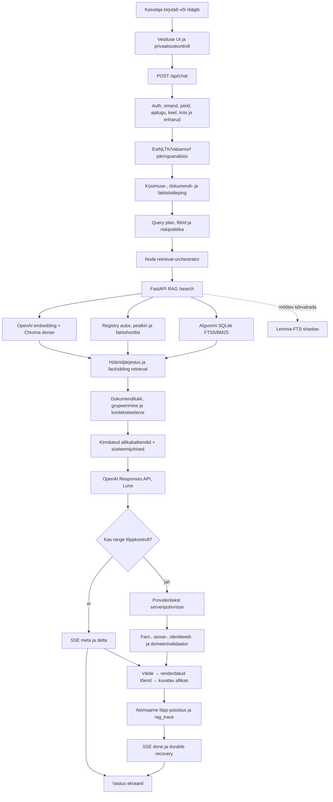
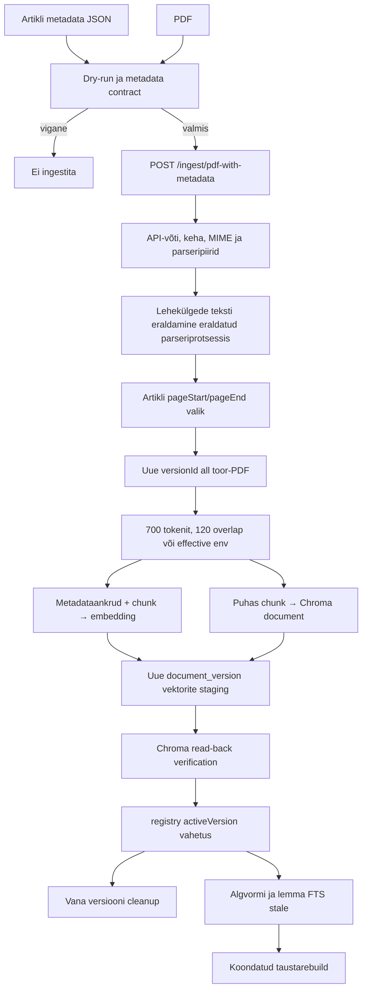

# SotsiaalAI RAG-süsteemi masterkaart

Uuendatud: 31.08.2026
Ulatus: autentitud vestlus, RAG-otsing, dokumendi ingest, indeksid, soojendus, tõendikontroll, allikad ja käitus
Rakenduse RAG-loogika: `main`-haru arhitektuur

## 0. Dokumendi roll ja tõeallikad

See on SotsiaalAI RAG-süsteemi üks tehniline põhikaart. Siin kirjeldatakse tervikut, mitte ühe auditi või ühe küsimuse parandust:

- mida teeb süsteem alates kasutaja küsimusest kuni ekraanile jõudva vastuse ja allikateni;
- mida teeb süsteem artikli, PDF-i, DOCX-i, teksti, HTML-i või URL-i ingestimisel;
- kus elavad originaalid, metaandmed, chunk'id, embeddingud ja indeksid;
- kuidas töötavad Chroma dense-otsing, algvormi FTS5 ja EstNLTK/Vabamorfi kihid;
- kuidas valitakse õige dokument, kaetakse kõik küsitud faktid ja tõkestatakse tõendamata vastus;
- kuidas toimub käivitus, indeksi soojendus, cache, tervisekontroll, uuendus ja kustutus;
- millised vead on fail-closed ja mida kasutaja nende korral näeb.

Dokument ei kanna projekti tööjärjekorda. Aktiivse töö seisu ainus allikas on `docs/platvormi arendus/SotsiaalAI.md`. Käesoleva kaardi autoriteetsuse järjekord on:

1. tegelik rakenduskood ja Prisma skeem;
2. teenuse käivitamisel laaditud keskkonnaseaded;
3. RAG-teenuse `registry.json` koos aktiivse Chroma kollektsiooniga;
4. `/health`, otsingu trace ja autentitud vestluse runtime-tõend;
5. käesolev dokument.

Kui dokument ja kood lähevad lahku, on kood tõene ning see fail tuleb samas muudatuses parandada. Saladusi, API-võtmeid, seansiküpsiseid ega kasutajate toorsisu siia ei kirjutata.

## 1. Süsteem ühe pilguga

SotsiaalAI ei ole pelgalt „vektorotsing + mudel”. See on mitmekihiline tõenditoru:



Põhireegel on: **otsingutulemus, mudeli kontekst, vastuse väide ja kasutajale kuvatav allikas on neli eri kihti**. Ühe kihi õnnestumine ei tõenda järgmise kihi õigsust.

Madala riskiga teel võivad `meta` ja `delta` sündmused jõuda kasutajani enne lõpp-püsistust; püsistus peab õnnestuma enne lõplikku `done` sündmust. Range exact-fact tee puhverdatakse ning valideerimata tekst kasutajani ei jõua.

## 2. Tootmistopoloogia ja protsessid

### 2.1 Põhiprotsessid

| Protsess | Roll | Põhiport või liides | Põhiseaded |
|---|---|---|---|
| Next.js frontend/backend | `/vestlus`, `/api/chat`, admin, püsistus, planner, kontekst, mudel, validatsioon ja allikad | `127.0.0.1:3000` ning avalik HTTPS | `/etc/sotsiaalai/frontend.env` |
| Python FastAPI RAG | ingest, parser, chunkimine, embedding, Chroma, registri- ja hübriidotsing, indeksid | `127.0.0.1:8000` | `/etc/sotsiaalai/rag.env` |
| PostgreSQL | kasutajad, vestlused, pöörded, admini RAG-kirjed, SourcePackage snapshotid, kasutusarvestus | Prisma | `DATABASE_URL` frontendi env-is |
| Research worker | pikkade uurimistööde järjekord; ei ole tavavestluse sünonüüm | systemd worker | frontendi env |

Teenused on systemd üksused `sotsiaalai-frontend.service`, `sotsiaalai-rag.service` ja `sotsiaalai-research-worker.service`. RAG käib ühe Uvicorn worker'iga käsureal `main:app --host 127.0.0.1 --port 8000 --workers 1`. Avalik veeb ei pöördu Chroma poole otse. Next.js suhtleb RAG-teenusega sisevõrgus ja lisab `X-API-Key`.

### 2.2 Põhihoidlad

```text
PostgreSQL
├─ Conversation / ConversationMessage / ChatTurn
├─ RagDocument                       # admini rakenduskirje, mitte kogu indeksi tõde
├─ SourcePackageSnapshot             # versioonitud allikapaketi snapshot
└─ kasutus-, tagasiside- ja töövooandmed

RAG_STORAGE_DIR
├─ registry.json                     # aktiivversiooni ja dokumendi metadata register
├─ registry.json.last-good           # viimane atomaarne varukoopia
├─ chroma/                           # püsiv Chroma kollektsioon ja embeddingud
├─ lexical-index.sqlite3             # algvormi FTS5
├─ lexical-index.sqlite3.stale       # stale-märgis, kui olemas
├─ lemma-index.sqlite3               # EstNLTK lemma-FTS shadow
├─ lemma-index.sqlite3.stale         # lemmaindeksi stale-märgis
├─ docs/<doc-hash>/versions/...      # ingestitud failide/URL-snapshotide versioonid
└─ .document-locks/                  # dokumendipõhised SHA256 lock-failid
```

`master_sources_final.json` on allikate korrastamise ja ingestimise kaart. Aktiivse otsingukorpuse tehniline tõde on `registry.json` + Chroma aktiivversioonid, mitte master-list ega ainult Prisma `RagDocument`.

### 2.3 Käituse effective põhisätted

Püsiv teenusekonfiguratsioon kasutab järgmisi põhisätteid; tabelis puuduvate valikute puhul rakendub vastava koodirea fallback:

| Kiht | Effective väärtus |
|---|---|
| RAG hoidla | `/var/lib/sotsiaalai-rag` |
| Chroma collection | `sotsiaalai` |
| embeddingmudel | `text-embedding-3-large` |
| chunkimine | tokenid; 700 tokenit, overlap 120, ühe chunk'i piir 1200 |
| maksimaalne fail | 25 MiB |
| chat-mudel | `gpt-5.6-luna` |
| reasoning / verbosity | `medium` / `medium` |
| retrieval | `topK=12`, timeout 30 000 ms, kuni 8 gruppi |
| mudelikonteksti RAG-osa | 8 500 märki; ühe grupi body kuni 1 500 märki |
| MMR lambda | 0,60 |

Need on süsteemi käitussätted, mitte eraldi „serveriversioon” arhitektuurist. Koodi fallback-tabelid allpool dokumenteerivad varukäitumist juhul, kui vastav env-seade puudub.

## 3. Kasutaja küsimuse täielik rada

### 3.1 Sisend brauseris

`app/vestlus/page.js` renderdab `/vestlus` serverlehe. `components/alalehed/ChatBody.jsx` ja `components/chat/hooks/useChatStream.js` viivad nii klaviatuuriteksti kui hääletranskriptsiooni samasse sõnumitorusse. Häälel ei ole eraldi, lihtsustatud RAG-i.

Enne saatmist klient:

1. kontrollib, et sõnum ei ole tühi ja eelmine saatmine ei ole pooleli;
2. loob või kontrollib vestluse `ensureConversationBeforeSend` kaudu;
3. loob stabiilse `clientTurnKey`-võtme;
4. lisab UI-sse optimistliku kasutajasõnumi ja tühja assistendisõnumi;
5. saadab `POST /api/chat` päringu.

Päringu leping võib sisaldada:

- kasutaja sõnumit;
- piiratud vestlusajalugu;
- `convId`, rolli, UI keelt ja vastuse keele vihjet;
- `stream`, `persist`, `inputModality` ja privaatsusotsust;
- ajutise kasutajadokumendi chunk'e;
- `combineSources`, `forceSources` või teadlikku töörežiimi;
- korduse/idempotentsuse võtmeid.

Kliendi tavaline vestlusrežiim on `rag`. Deep Research on eraldi püsiv järjekorratöövoog.

### 3.2 API eelkaitsed

`app/api/chat/route.js:POST` kutsub esmalt `lib/chat/requestBootstrap.js:bootstrapChatRequest`. Enne RAG-i või mudelit kontrollitakse:

- serverisessiooni ja autentimist;
- POST rate limit'i;
- JSON-keha, sõnumipikkust ja väljade kuju;
- vestluse omandit või ruumiliikmesust;
- vestluse arhiveerimist ja säilitusaega;
- rolli ja rollipõhiseid piiranguid;
- privaatsuskontrolli kinnitust;
- tellimuse ja kasutusühiku õigust;
- kliendiajaloo mahtu ning serverist loetud usaldatud taastumiskonteksti;
- sisendi keelt ja soovitud vastuse keelt;
- kriisisignaali;
- tervituse, dokumenditöövoo ja abisoovi/abipakkumise eriharusid.

Koodi vaikepiirid tavavestluses on:

| Piir | Vaikeväärtus |
|---|---:|
| kasutaja sõnum | 4000 märki |
| ajalugu | 8 elementi |
| ühe ajalooelemendi tekst | 800 märki |
| ajutised dokumendichunk'id | 80 |
| ühe ajutise chunki tekst | 1800 märki |
| kliendi dokumendikontekst | 1800 märki; kombineeritult 1200; kuni 4 chunk'i |
| spetsialisti dokumendikontekst | 2600 märki; kombineeritult 1600; kuni 6 chunk'i |
| tavavestluse POST rate | 24 päringut / 60 s |

Need on koodi fallback'id; keskkonnaseade võib neid kitsendada või laiendada. Lõplik pöördelimiit jõustatakse hiljem atomaarse `ChatTurn` claim'i sees, mitte ainult eellugemise põhjal.

### 3.3 Erirajad enne üldist RAG-i

Kõik sõnumid ei pea tegema korpuseotsingut.

| Rada | Käitumine |
|---|---|
| tühi esimene tervitus | deterministlik tervitus; RAG-i ei käivitata |
| tervitus koos sisulise küsimusega | läbib tavalise RAG-toru |
| kriis | kriisiohutus on ülimuslik; tõendit võib kasutada, kuid abi ei jäeta RAG-i taha |
| dokumendi loomine või muutmine | `handleDocumentWorkflowBranch` |
| abisoov või abipakkumine | `handleHelpWorkflowBranch` |
| lihtne assistendi võimekuse küsimus | üldjuhul välist allikat ei vajata |
| ajutise faili analüüs | kasutaja failikontekst; soovi korral kombineeritakse üldise RAG-iga |
| KOV-i mitmetähenduslik nimi | deterministlik täpsustusküsimus enne KOV-filtriga otsingut |

RAG-i puudumine ei tähenda automaatselt viga. Viga on siis, kui sisuline, allikapõhine küsimus liigitatakse ekslikult vestluseks või kasutajaliidese meta-küsimuseks.

### 3.4 Idempotentsus ja kasutusarvestus

Enne uut tasulist tööd kontrollib route sama `clientTurnKey` lõpetatud replay'd. Vestluse ja RAG-i kasutusühikud reserveeritakse eraldi ning idempotentselt. Edu korral need commititakse, katkestuse või teenuserikke korral vabastatakse.

See hoiab ära olukorra, kus:

- brauseri retry tekitab kaks vastust;
- kaks vahekaarti ületavad koos pöördelimiidi;
- võrguvea järel arvestatakse sama RAG-otsing kaks korda;
- klient peab katkenud SSE-d ekslikult uueks kasutajaküsimuseks.

## 4. Keel, EstNLTK ja morfoloogia õiges kihis

### 4.1 Kus morfoloogia töötab

`lib/chat/retrievalContextAssembler.js:assembleRetrievalContext` kutsub eesti või ebaselge ladina kirjas küsimuse puhul enne küsimuseplaani `lib/chat/retrievalOrchestrator.js:analyzeRagQuery`. See saadab kuni 2,5-sekundilise päringu RAG-teenuse `/analyze-query` endpointi.

`rag-service/main.py:/analyze-query` kasutab `rag-service/lemma_index.py:EstonianLemmaAnalyzer` klassi. Analüsaatori versioon on `estnltk-vabamorf-1.7.5-v2`.

Analüüs tagastab piiratud kujul:

- tokenid;
- võimalikud lemmad;
- liitsõnajuured;
- pärisnime span'id;
- keele vihje ja kindluse;
- analüüsi kestuse ning põhjuse, kui analüüs pole saadaval.

### 4.2 Mida morfoloogia ei tee

Morfoloogia **ei kirjuta kasutaja lauset ümber** ega asenda algteksti ühe ennustatud „õige” lausega. Näiteks sõnajärjega „täna piim mina ostma” säilib algne pindkuju, kuid planner ja leksikaalne päring saavad juurde `piim/piima` ja `ostma/ostan` tüüpi morfoloogilised kandidaadid.

Sama põhimõte kehtib nime, teenuse, dokumendipealkirja ja mis tahes muu sõna kohta:

- algtekst jääb dense-embeddingu ja täpse fraasi jaoks alles;
- pärisnime pindkuju säilib;
- lemma- ja vormivariandid lisatakse recall'i jaoks;
- algtekstist leitud tugev autor, pealkiri või faktislot võidab kanoonilise fallback'i;
- kanooniline kuju täidab ainult algtekstist puuduva semantilise välja.

Kui `/analyze-query` ebaõnnestub, jätkub küsimus algtekstiga. Morfoloogiateenuse tõrge ei tohi muuta sotsiaalvaldkonna küsimust automaatselt teemaväliseks.

### 4.3 Kaks eri lemmakihti

EstNLTK-d kasutatakse kahes eri kohas, mida ei tohi segi ajada:

1. **päringuülene morfoloogia enne planner'it ja retrieval'it** — see on aktiivne tootmisloogika ning aitab käänete, liitsõnade, nimekujude ja keele tuvastamisel;
2. **püsiv lemma-FTS indeks** — see on praegu shadow/observability kõrvalrada. Ta mõõdab, mida lemmaotsing oleks leidnud, kuid ei muuda tootmistulemuste järjestust.

Seega käändetaluvus ei sõltu praegu shadow-indeksi promotion'ist. Seda kannavad päringu morfoloogilised terminid, algvormi FTS, dense-embedding ja metadataankrud koos.

Arvsõnade ja arvuliste kvalifikaatorite normaliseerimine toimub sellest hiljem, lõplikus piiratud faktilepingu kihis. See ei ole EstNLTK lemmaotsing ega lemmaindeksi promotion. `lib/chat/factRelationSemantics.js` annab tõendi sidumisele, kaetuse kontrollile ja vastuse valideerimisele ühise piiratud suhtevõrdluse. Näiteks `rühmavestlus` ja `grupiintervjuu` võivad tähistada sama intervjuuliiki, kuid individuaal- ja rühmaintervjuu jäävad eri kategooriateks. Mitmesõnaline `täiendav abi` saab päris tekstivahemikuga mõistetokeni; pelk `abi` seda seost ei tõenda. See kiht ei kirjuta nimesid ümber ega võrdsusta suvalisi sarnase algusega sõnu tähenduse poolest.

## 5. Küsimuse semantiline leping

### 5.1 `questionPlanner`

`lib/chat/questionPlanner.js:buildQuestionPlan` teeb algsest küsimusest struktureeritud plaani. Plaan eristab vähemalt:

- tavalist teadmusküsimust;
- professionaalset meetodijuhist (`professional_method_guidance`);
- kliendi enda eluolukorra juhendamist (`life_situation_guidance`);
- konkreetse dokumendi või uuringu küsimust;
- autorit ja autori tööde inventari;
- KOV-teenust, toetust, kontakti ja kohalikku õigusakti;
- täpset paragrahvi või õigusviidet;
- ajaperioodi, trendi ja aastavõrdlust;
- mitmeallikalist sünteesi;
- numbrilist või kvalitatiivset täppisfakti;
- allikate jätkuküsimust.

Planner ei säilita ainult märksõnu. Ta koostab semantilised kandidaadid:

- `current_turn_document_identity`;
- `year_role_mentions`;
- `requested_numeric_slots`;
- `requested_fact_slots`;
- numbrilise väärtuse tüübi ja mõõdiku;
- relation-term'id ja morfoloogilised variandid;
- kvalitatiivse tegevuse, objekti ja polaarsuse;
- autori või autorite nimekujud;
- pealkirjavihje ja dokumendiliigi.

Sõnaselge `ajakiri Sotsiaaltöö` määrab väljaande ulatuse ka siis, kui kasutaja ei lisa sõnu `eri artiklid` või `ülevaade`. Teemaküsimus läheb ajakirja sünteesirajale; puuduva teemakohase artiklitõendi korral öeldakse seda, mitte ei küsita uuesti juba määratud väljaande tähendust.

#### Professionaalne meetodijuhis

`professional_method_guidance` on üldine sotsiaalvaldkonna tööprotsessi rada: küsimus küsib, kuidas hinnata, aidata, toetada või sekkuda. Planner ühendab protsessiküsimuse, tegevuse ja sotsiaalvaldkonna objekti signaalid ning eristab fookuseid `assessment`, `victim_support` ja `practice`. Rada ei nõua sessioonis spetsialisti rolli; tuvastatud kliendi eluolukorra küsimus, allikaotsing või mitme allika ülevaade suunatakse oma kavatsuserajale. Nimetatud dokumendi, autori, täpse õiguse ning KOV-teenuse erilepingud lahendatakse oma reeglite järgi. Üldine sõna `juhend` ei ole veel konkreetse dokumendi identiteet: selleks on vaja pealkirja või selget viidet konkreetsele dokumendile. Juhendi leidmise küsimus jääb allikaotsinguks, mitte meetodijuhiseks.

Plaan kasutab `retrieval_strategy=authoritative_guidance_then_complementary_evidence`, `selection_strategy=professional_method_guidance` ja `query_order=authoritative_guidance_first`. Esmased päringud otsivad aktiivset mitteajaloolist juhendit, seejärel lisatakse täiendavate meetodite päring ning säilivad algsed ja filtreerimata fallback-päringud. Seega on juhend esmane eelistus, mitte garantii, et otsing tagastab ainult ametlikke juhendeid. Riskipoliitika märgib raja `medium` / `actionable` / `current_authoritative_guidance` ning eelistab tugevat juhenditõendit.

`selectProfessionalMethodGuidanceGroups` valib kuni neli eri dokumendi kontekstigruppi. Ta jätab välja `inactive`, `archived` ja `stale` kandidaadid ning arvestab teemasobivust: vähemalt pool küsimuse teematerminitest ja vähemalt kaks terminit peavad sobima (ühe teematermini korral piisab ühest). Alles selle järel eelistatakse põhiallikaks aktiivset mitteajaloolist ametlikku juhendit või standardit, selle puudumisel aktiivset meetodi- või infomaterjali. Pelk ametlik päritolu ei tõsta teise teema juhendit esimeseks. Kui põhijuhendit ei kinnitata, võib säilida muu asjakohane tõend olekuga `primary_guidance_status=unconfirmed`; tühi valik on `missing`. Hindamisküsimus võib lisada pealkirja või tagide mudeli-/meetodisignaaliga täiendava allika, ülejäänud kohad täidab MMR. Konteksti mitmekesisus ei tähenda nelja kuvatava allika ega kõigi võimalike meetodite nõuet. Lisaks välistab küsimuses sõnaselgelt määratud lapse või täiskasvanu sihtrühm vastupidise ainsa sihtrühmaga allikapealkirja; ühine „abivajaduse hindamise” sõnavara ei kaalu seda vastuolu üles. Mõlemat sihtrühma käsitlev pealkiri jääb valitavaks. See on pealkirja konfliktikaitse, mitte kõigi tekstis leiduvate sihtrühmade ammendav klassifikaator.

### 5.2 Kõik faktislotid säilivad

Mitmeosalise küsimuse iga küsitud osa peab jääma eraldi slotiks. Näiteks „millised neli osakaalu ja kui palju inimesi neile vastas?” ei ole üks üldine numbriküsimus, vaid viis seosega faktislot'i.

Rinnastatud liitsõna ellips taastatakse kategooriana: `individuaal- ja rühmavestlused` annab eraldi individuaalvestluse ja rühmavestluse suhted. Üldsõnu ega asesõnu nagu `need` ei nõuta tõendis kohustusliku nähtusesildina.

Slot sisaldab vajaduse järgi:

- järjekorranumbrit;
- väärtusetüüpi (`count`, `proportion`, `calendar_year`, `duration`, kvalitatiivne jne);
- relation-term'e ja nende lemma-/vormivariante;
- eksplitsiitset ulatust või kategooriat;
- eeldatud kardinaalsust;
- tegevus–objekt sidet;
- eitust või jaatust;
- päritolu (`original` või `canonical_fallback`).

Planner'i slot ei ole veel tõendatud vastuseväärtus. Numbriline slot muutub pöörde rangeks lepinguks alles siis, kui kõrge kindlusega dokumendiidentiteet on lukus ja kõik küsitud slotid saab üheselt siduda sama lõpliku renderdatud allikabloki tõendiga. Piiratud arvsõnaparser tunneb eesti keeles arve 0–10 ning inglise ja vene keeles arve 1–10 koos toetatud käändevormidega. Parser tuvastab esmalt arvsõna ja seob alles seejärel vahetult järgneva toetatud ühiku, et näiteks „Neist kuus” ei neelduks ekslikult kuu-ühikuks. Kui tõendi arvsõna on sama sloti küsimusepoolses relation-term'is (näiteks „neljal kohtumisel”), jääb see ulatuseks ega muutu küsitud vastuseväärtuseks. Kandidaadiskoor eelistab arvule vahetult järgnevat või eelnevat nähtusesilti sama fragmendi kaugemale relation-term'ile; liiga lähedased konkureerivad täissobitused jäävad endiselt mitmetähenduslikuna fail-closed. See on faktilepingu arvunormaliseerimine, mitte EstNLTK lemmaotsing.

Kui küsimus palub selgitada küsimuses juba nimetatud arvude tähendusi, kannab iga arv eraldi `explicit_value_relation` slotti. Väärtus ei ole siis vastus iseeneses: sama lukustatud renderdatud tõend peab kinnitama ka selle kohaliku nähtuse või rühma, mida arv tähistab. Esmane provisional assignment lubab ainult täielikus explicit-slot'ide partiis iga sloti üht unikaalset sõnaselgelt küsitud arvuväärtust ega nõua, et küsimuse üldsõnad („näitaja”, „arv”) korduksid tõendilauses. Sama rada kasutatakse ka renderdatud tõendi coverage'is; mõlemad loevad ainult pealkirja- ja metapäiseta lõplikku `evidenceText`-i ning küsimuse ja tõendi arvujärjekord ei pea kattuma. Contract kasutab seejärel tõendist tuletatud arvulähedast descriptor-ankrut. Kui samas fragmendis kordub sama descriptor mitme arvu juures, lisatakse eristuseks kõrvalasuva faktirühma unikaalne descriptor; mitme tõendifragmendi korral kasutatakse eristavat sündmuseankrut. Segatud või korduvate requested-value slot'ide partii, sama väärtuse teine ankurdatud tõendikoht sõltumata skoorivahest, puuduv ankur või jätkuvalt eristamatu ankruskeem ei aktiveeri lepingut.

Arvu ja kategooria sidumine arvestab ka kohalikku süntaktilist piiri. `Kord kuus` ei tähenda arvu kuus; `kolme osalejaga grupiintervjuu` osalejate arv ei asenda intervjuude arvu. Kirjavahemärgi külge liitunud joonealuse märkuse number ei muutu mõõdikuks, samas säilib järgarvulise aastakirjutuse `2018. aastal` seos. Rinnastatud kategooriate eristav termin peab olema sama kohaliku arvuakna ja sulutaseme sees; kõrvalise sulgudes oleva protsendi või teise kategooria ankrust ei piisa. Semantilise lisatokeni loomine ei vähenda arvsõna kõrval kontrollitavate päris sõnade arvu.

PDF-i ühe reavahetusega katkenud lause võib siduda kategooria järgmise rea arvuga kuni 160 märgi ulatuses sama tõendiploki sees. Lõpetatud lause, tühi rida, teine plokk, vahepealne arv või teine sulutase seda kohalikku kategooriaseost üle ei kanna.

### 5.3 Jooksva pöörde dokumendiidentiteet

Tugevad identiteedisignaalid on:

- täpne pealkiri;
- kõik küsimuses nimetatud autorid;
- allika aasta, eraldi andmete või juhtumi aastast;
- dokumendiliik;
- olemasolev usaldatud `doc_id` jätkukontekstis.

Jooksva pöörde selge pealkiri või autor võidab eelmise vestluse dokumendi. Nõrk teema- või sisusarnasus ei tohi tugevat identiteeti üle kirjutada.

Täpselt nimetatud pealkiri on esmane. Kui kasutaja nimetab baaspealkirja, võib identiteedikiht arvestada ainult selle kanoonilisi `<pealkiri>[u] kokkuvõte` ja `<pealkiri>[u] lühikokkuvõte` õdesid, prioriteediga **täpne pealkiri > kokkuvõte > lühikokkuvõte**. Kui kasutaja nimetab kokkuvõtte või lühikokkuvõtte ise, on see eraldi dokument, mitte perepäring. Kaks sama prioriteediga eri `doc_id`-d jäävad mitmetähenduslikuks; vana usaldatud `doc_id` ei tohi jooksva pealkirja kõrgema prioriteediga vastet ületada.

### 5.4 `semanticTurnContract` ja sotsiaalvaldkonna scope

`lib/chat/semanticTurnContract.js` ühendab algteksti, morfoloogia, entity'd, planner'i ja olemasoleva tõendi ühe pöörde lepinguks. Domeeniscope ei põhine ainult ühel märksõnaloendil.

Kui küsimuse enda sõnavara on ebakindel, kuid RAG leiab selgelt sotsiaalvaldkonna materjali, võib valitud tõend scope'i sotsiaalvaldkonnaks tõsta. See väldib vale vastust „vastan ainult sotsiaaltöö küsimustele” olukorras, kus küsimus või leitud allikas on tegelikult valdkondlik.

## 6. Ajalugu, anafoor ja täpsustused

`lib/chat/retrievalOrchestrator.js:shouldUseAnswerHistory` lubab vastuseajalugu ainult siis, kui pöörde kuju seda vajab. Pelgalt sõna `selles`, `neid` või lühike lause ei anna ajaloole õigust tugevat jooksva pöörde identiteeti üle kirjutada.

Usaldatud jätk võib kasutada:

- eelmise vastuse kuvatud allikakomplekti;
- serverisse salvestatud RAG recovery-state'i;
- pooleliolevat KOV-täpsustust;
- sama dokumendi tõendatud `doc_id`-d;
- sama vestluse lõpetatud pöörde replay'd.

Kliendi saadetud vabatekstiline ajalugu ei ole iseseisvalt autoriteetne omandi, allika ega taastumise tõend.

Lühike käsk nagu `Räägi sellest paragrahvist lähemalt` on jätkuküsimus: `räägi` ei ole asesõna kohalik sisuline eelkäija. Kui jooksvas küsimuses puudub oma `§`-viide, võib query-plan kasutada vahetult eelmise kasutajapöörde üht sõnaselget paragrahvi koos tuvastatud seadusega. Rohkem kui üks varasem paragrahv ei anna selle raja kaudu üheselt määratud viidet; jooksva küsimuse selge viide võidab alati. Kohalik sisuline eelkäija samas küsimuses ei anna automaatselt põhjust vestlusajalugu kaasata.

### 6.1 KOV-i mitmetähendus

Kui kohanimi võib tähendada eri omavalitsusüksust ja küsimus sõltub KOV-ist, ei valita vaikimisi üht. Süsteem küsib näiteks „Kas mõtled Tartu linna või Tartu valda?”.

Järgmine lühivastus `linn` või `vald` seotakse serveris talletatud pakutud valikutega. Täisnimi töötab samuti. Kui eelnevat usaldatud täpsustust ei ole, ei tohi paljast `linn`/`vald` suvalise KOV-iga siduda.

## 7. Query plan ja Node'i retrieval-orchestrator

### 7.1 Päringute koostamine

`lib/chat/queryPlanner.js:buildRagQueryPlan` toodab:

- ühe või mitu semantilist päringut;
- algvormi leksikaalterminid;
- metadatafiltrid;
- soovitud retriever'id;
- `topK` ja dokumendisisese süvaotsingu mahu;
- valikustrateegia;
- audience-, KOV-, aasta-, autori-, pealkirja- või `doc_id` piirid.

Konkreetse uurimisfakti puhul võib `buildDocumentScopedResearchFactQueries` luua puuduva sloti järelpäringu, milles on sama pealkiri, kõik autorid ja lukustatud `doc_id`. See ei ole uus üle-korpuse küsimus, vaid sama dokumendi piires taastamine.

### 7.2 Filtrid

Filtreid ei kirjutata üksteisega üle. Need komponeeritakse `AND`/`OR` kujul ning võivad hõlmata:

- `audience` või `audiences`;
- `doc_id`/`document_id`;
- `source_type`, `item_type`, `resource_type`;
- `collection_id`;
- `municipality_id`, maakonda või jurisdiction'i;
- autorit või author-token'eid;
- aastat ja ajaloolisust;
- aktiivset/current versiooni;
- canonical item'i või SourcePackage'i.

Tavakasutaja ei saa planner'i kaudu RAG-teenuse suvalist filtrit otse määrata.

### 7.3 Mitme päringu ühendamine

`lib/chat/retrievalOrchestrator.js:searchRagQueries`:

1. deduplikeerib sisuliselt samad query'd;
2. käivitab piiratud paralleelsusega kuni kolm otsingut korraga;
3. säilitab põhipäringu tugevama kaalu;
4. ühendab tulemused ankurdatud reciprocal-rank fusion'i kaudu;
5. koondab timings/partial/degraded info;
6. eemaldab fail-closed keelatud või tagasivõetud teenuseprofiili tulemused.

Kõigi päringute ebaõnnestumine on tehniline RAG-viga. Mõne päringu ebaõnnestumine võib anda osalise tulemuse, kuid seda ei esitata trace'is täieliku otsinguna.

## 8. RAG-teenuse otsing

### 8.1 `/search` sisend ja autentimine

Node saadab `POST ${RAG_API_BASE}/search` päringu koos:

- `query` ja võimalike batch-query'dega;
- `top_k` väärtusega;
- normaliseeritud filtritega;
- soovitud kanalitega;
- faktisegmendi/dokumendisügavuse seadetega;
- query keele ja leksikaalterminitega;
- ühe loogilise pöörde `X-Request-Id` ning piiratud observability-päistega;
- `X-API-Key` võtmega.

FastAPI endpoint on `rag-service/main.py:/search`; põhiloogika on `_execute_search`.

### 8.2 Dense-kanal

1. Küsimus ja vajaduse korral faktisegmendid pakitakse ühte embedding-batch'i.
2. Vaikimisi embeddingmudel on `text-embedding-3-large`.
3. Sama loogilise retrieval'i identsed embeddingusisendid kasutavad single-flight jagamist.
4. Chroma `collection.query` otsib kogu aktiivsest vektorruumist.
5. Kandidaadibaas kasvab `top_k` järgi ning on teenuses piiratud.
6. Tulemusse jäävad dokumendi- ja chunk-metadata, distance/dense score ja retrieval-kanal.

Embeddinguteenuse 502/503 vea korral võib otsing jätkata kohaliku leksikaalse fallback'iga, kui leksikaalkanal oli küsitud. Vastus märgitakse `partial=true`, `degraded=true`, `dense_retrieval.available=false`. Ilma töötava tõendikanalita ei tagastata tühja rohelist tulemust.

### 8.3 Registripõhised täppiskanalid

`registry.json` võimaldab enne või kõrval Chroma semantilist rankingut teha piiratud shortlist'e:

- täpse või morfoloogiliselt sobiva autori järgi;
- pealkirja järgi;
- dokumendi kirjelduse faktisõnade järgi, kui identiteet kitseneb ühele aktiivsele allikale;
- aktiivse autori tööde täieliku inventari jaoks;
- kindla `doc_id` kõigi aktiivsete chunk'ide lugemiseks.

Need kanalid ei asenda sisutõendit. Registrikirje võib tõendada dokumendi identiteeti või olemasolu, kuid pelk registri metadata ei tohi olla lõpliku faktilise väite ainus allikas.

### 8.4 Algvormi FTS5/BM25

`rag-service/lexical_index.py:PersistentLexicalIndex` hoiab aktiivsete chunk'ide püsivat SQLite FTS5 indeksit. Schema versioon on `fts5-v2` ja tokenizer `unicode61 remove_diacritics 2`. FTS tabelis on eraldi kaalutavad väljad `title`, `body`, `authors`, `tags` ja `terms`; kõrvalolev tavapärane `chunks` tabel hoiab `chunk_id`, `doc_id`, `document_version`, kogu dokumenditeksti ja metadata JSON-i filtrite rakendamiseks. `body` välja läheb kuni 12 000 märki chunki algusest. `terms` lisab normaliseeritud pealkirja-, keha-, autori- ja tagiväljade 5- ning 8-märgilised prefiksiterminid.

Päringu ajal:

1. leksikaalterminid normaliseeritakse;
2. koostatakse FTS `MATCH` avaldis;
3. planner'i filter kompileeritakse SQL-i;
4. FTS tagastab piiratud kandidaadid ja `bm25` rank'i;
5. teenus arvutab coverage'i, nime-/pealkirjakatte ja exact phrase'i signaali;
6. kandidaat ühendatakse dense- ja teiste kanalitega.

Kui püsiv indeks pole registry generation'iga kooskõlas, ei märgita seda valmis indeksiks. Kui persistent FTS on lubatud, tagastab see kanal seisundi `persistent_fts5_unavailable`; dense- ja õnnestunud registrikanalid võivad jätkata, kuid stale indeksit ega peidetud korpuseskanni ei esitata valmis FTS-ina. Piiratud korpuseskann on legacy fallback ainult siis, kui püsiv indeks on konfiguratsioonis välja lülitatud või teadlikult vahele jäetud. Trace peab näitama kasutatud strateegiat ja täielikkust.

### 8.5 Lemma-FTS shadow

`rag-service/lemma_index.py:PersistentLemmaIndex` ehitab EstNLTK lemmadest eraldi SQLite FTS5 indeksi:

- schema `lemma-fts-shadow-v2`;
- analyzer `estnltk-vabamorf-1.7.5-v2`;
- pealkirjalemmad ja kehalemmad eraldi;
- iga rida seotakse aktiivse `chunk_id`, `doc_id` ja `document_version`-iga;
- generation peab kattuma registri generation'iga.

Lemmaindeksi vaatlus on asünkroonne kõrvalrada. Esmane päring võib saada `lemma_fts_shadow` objektis ainult `scheduled=true`; taustaworker arvutab tulemuse ja paneb selle piiratud observation-cache'i, kust korduspäring võib saada `async_cached` vaatluse. Neid tulemusi võrreldakse tootmisretrieval'iga, kuid neid ei lisata tootmise hübriidjärjestusse. Promotion vajaks eraldi mõõdetud otsust.

### 8.6 Hübriidjärjestus

Teenuse aktiivsed kanalid on:

- `dense`;
- `author_match`;
- `title_match`;
- `exact_phrase`;
- `bm25`;
- piiratud juhtudel `registry_fact`.

`_apply_hybrid_ranking` ühendab dense score'i, leksikaalskoori, RRF-signaali, kanaliboostid, BM25 coverage'i, nime-/pealkirjasignaali ning faktisegmendi signaali. `RAG_RRF_K` fallback on 60.

Täpset valemit ei tohi käsitleda tõenäosusena. See on järjestusfunktsioon. Kõrgeim skoor ei anna õigust ületada dokumendiidentiteedi, audience'i, versiooni või faktilepingu piiri.

### 8.7 Faktisegmendid ja sibling-chunk'id

Mitme faktiga või dokumendisisese küsimuse korral:

1. põhiküsimuse baseline säilib;
2. küsimus jagatakse piiratud faktisegmentideks;
3. valitakse tugevate dokumentide shortlist;
4. otsitakse segmentide kaupa sama dokumendi seest;
5. lisatakse parima chunki vahetud naabrid, et PDF-i piiril jätkuv lause ei kaoks;
6. sibling-kandidaate ei kärbita uuesti üldise väikese leksikaalpiiri taha;
7. lõppvalik peab katma faktisegmendid, mitte ainult andma kõrge keskmise skoori.

### 8.8 RAG-teenuse vastus Node'ile

RAG-teenus tagastab:

- `results` — chunk-taseme tulemused;
- `groups` — dokumendi/artikli järgi grupeeritud tulemused;
- `retrievers_used` ja `search_strategy`;
- `merge_strategy` ja kanalistatistika;
- `partial`/`degraded`;
- dense- ja lexical-kihi seisud;
- lemma-shadow vaatlus;
- strategy decisions;
- request ID ja etapitimings.

`partial=false` tähendab ainult otsinguteenuse lepingu täielikkust selles päringus. See ei tõenda, et õige fakt jõudis mudelikonteksti või lõppvastusesse.

## 9. Dokumendi valik ja konteksti koostamine

### 9.1 Grupeerimine

Node grupeerib chunk'id stabiilse artikli/dokumendiidentiteedi järgi, kasutades `articleId`, `doc_id` ja pealkirja. Ühe grupi sisse koondatakse:

- body chunk'id;
- lehed ja lehevahemikud;
- autorid, aasta, ajakirjanumber ja sektsioon;
- source type, canonical item ja KOV-metadata;
- retrieval-kanalid ning skoorid;
- värskuse ja ajaloolisuse info.

### 9.2 Täpse dokumendi lukk

Konkreetse uurimuse või artikli küsimuses lukustatakse dokument ainult kõrge kindlusega jooksva pöörde identiteeditõendi korral. Lukk võib tugineda täpsele jooksva pöörde pealkirjale, otsustavale kitsale kokkuvõttepere vastele, usaldatud jooksva pöörde autori kinnitusele või kõigi nimetatud autorite ja allika-aasta ühisele kinnitusele ning üheselt valitud aktiivsele `doc_id`-le.

Pärast lukku:

- puuduvat faktislotti otsitakse sama `doc_id` seest;
- naaberdokumendi sama number või sarnane sõnastus ei täida lepingut;
- recovery-query säilitab kõik autorid ja pealkirja;
- fact-search ja puuduva sloti recovery kasutavad sama `doc_id` filtrit ning hindavad iga lisatulemuse järel identiteedi uuesti;
- muu dokumendi valik kaotab luku fail-closed;
- identity mismatch annab täpsustuse või tõendipuuduse, mitte lähima dokumendi vastuse.

### 9.3 KOV-kontekst ja Service Map

Praegused KOV-kontaktid võivad tulla PostgreSQL-i Teenusekaardi registrist, mitte RAG-i vanast kontaktikoopiast. `retrievalContextAssembler` eristab:

- KOV-teenuse ja toetuse sisulist tõendit;
- õigusakti;
- ametlikku praegust kontakti;
- kontaktide seire-/värskuse meta-küsimust.

Teenusekaart võib olla kontaktide autoriteetne kontekst, kuid ei tohi täita ajakirja või uuringu faktislotti.

Taotlusvormi ja pöördumiskoha küsimus (`mis vorme on vaja ja kelle poole pöörduda`) on esmalt menetlusjuhis, kui kasutaja ei küsi nimelist, telefoni-, e-posti- või ajakohast kontakti. Puuduv kontrollitud isikukontakt ei tohi eemaldada ametliku teenuseallikaga tõendatud vormi- ja asutuseinfot. Kui vastus siiski sisaldab täpset isikukontakti, telefoninumbrit või e-posti, rakendub kontaktide range tõendikontroll; menetlusjuhise rada ei anna luba neid oletada.

### 9.4 Kontekstieelarve

`lib/chat/ragContext.js` renderdab ainult valitud tõendiplokid. `lib/chat/settings.js` koodi fallback'id on:

| Seade | Fallback |
|---|---:|
| `RAG_TOP_K` | 12 |
| `RAG_CONTEXT_GROUPS_MAX` | 8 gruppi |
| `RAG_CTX_MAX_CHARS` | 6000 märki |
| `RAG_CTX_HEADROOM` | 15% |
| `RAG_GROUP_BODY_MAX_CHARS` | 1100 märki |
| `RAG_MMR_LAMBDA` | 0,5 |
| `RAG_TIMEOUT_MS` | 30 000 ms |

Režiim võib kasutada spetsiifilisemat dokumendi- või grupieelarvet. Valitud `specific_research_fact` ja `professional_method_guidance` rada välistavad üldise sünteesi toorsõna-heuristika: näiteks sõna „kogemused” nimetatud artikli pealkirjas ei tohi käivitada ülevaate väiksemat chunk'i- ega body-eelarvet. Oluline pole ainult üldmaht, vaid see, et:

- kõik kohustuslikud faktislotid jõuaksid renderdatud blokki;
- ühe vale dokumendi paljud chunk'id ei täidaks kogu eelarvet;
- valitud body span'id ja nende kärped oleksid trace'is nähtavad;
- allika `evidenceText` oleks täpselt sama tekst, mida mudel nägi.

#### Lõplik renderdatud tõendileping

Numbriline faktileping ehitatakse valitud `budgeted.used` grupist ja sama indeksiga lõplikust `renderedBlocks[index]` tekstist; kvalitatiivne leping kasutab samast renderdatud tekstist koostatud `renderedEvidenceGroups` vaadet. Laiem grupi toorsisu ei tohi tõendada väärtust, mida mudelile tegelikult ei renderdatud.

Leping aktiveerub ainult siis, kui planner'i slotiloend on täielik, dokumendiidentiteet on kõrge kindlusega ning kõik slotid seotakse üheselt ühe renderdatud `source_id`/`doc_id` tõendiga. Mitmetähenduslik, kärbitud või puudulik mapping jääb välja lülitatuks ja vastamine jätkub fail-closed piiriga.

Iga seotud slot kannab vähemalt väärtusetüüpi ja tõendiväärtust ning vajaduse järgi ühikut, kvalifikaatorit, relation-term'e, ulatust, kardinaalsust ja minimaalset relation-term'ide kattuvust. Trace märgib aktiveeritud lepingu puhul `used_for_generation=true`, `used_for_validation=true` ning renderdatud tõendi räsi.

### 9.5 EvidencePackage ja SourcePackage

Kõrgema riski, täpse õiguse, KOV-paketi või pakendatud allika korral võib süsteem ehitada:

- `EvidencePackage` — konkreetse pöörde valitud tõendid ja nõuded;
- `SourcePackage` — canonical item'i versioonitud allikakomplekt, jaotised, puuduvad osad ja display-kandidaadid;
- section attribution — milline allikasektsioon tohib millist väitetüüpi toetada.

Puuduv kohustuslik jaotis ei muutu mudeli üldteadmisega „täidetuks”.

## 10. Prompt ja vastuse genereerimine

### 10.1 Mudelile mineva sisendi järjekord

`lib/chat/promptBuilder.js:toResponsesInput` koostab Responses API sisendi selles järjekorras:

1. stabiilne rolli-, keele-, kuupäeva- ja kriisisüsteemijuhis;
2. explicit prompt-cache breakpoint;
3. vajaduse korral dokumendianalüüsi juhis;
4. `Kinnitatud allikakatkendid` ehk renderdatud RAG-kontekst;
5. vajaduse korral nõrga või puuduva grounding'u teade;
6. ainult lubatud piiratud ajalugu;
7. pöördepõhised lisasüsteemijuhised, sealhulgas grounding'u-, riski-, KOV-i-, õiguse-, faktisloti- ja allikapiir;
8. kasutaja praegune küsimus.

Kui allikakonteksti ei ole, ütleb material message seda otseselt. Mudelile ei anta luba täita korpuseauku üldteadmisega.

#### Professionaalse meetodijuhise vastuseleping

Raja vastuseleping on `answer_contract=evidence_backed_method_phases_and_complementary_models`. `lib/chat/retrievalContextAssembler.js:buildProfessionalMethodGuidanceInstruction` koostab `PROFESSIONAL_METHOD_GUIDANCE_MODE` juhise, mis lisatakse `extraSystemInstructions` kaudu samasse vastusemudelikutsesse. Vastus peab lähtuma valitud juhenditõendist ning selgitama praktilisi samme ja otsustuskohti, mitte piirduma esimese tuttava mudeliga:

- hindamisfookuses eristatakse tõendi olemasolul kohest turvalisust või kiiret ohuhinnangut, eelhindamist, põhjalikku hindamist, tegevusplaani ja kordushindamist;
- muus abistamisfookuses eristatakse tõendi olemasolul turvalisust, toetavat kontakti, praktilisi tegevusi ning abi juurde suunamist või järeltegevust.

Need on prompti kaetuse kontrollpunktid, mitte automaatselt lisanduv tõend. Hindamisvaldkondi ei esitata eraldi meetoditena; valitud allikates olevad täiendavad mudelid ja nende roll selgitatakse eraldi. Ajaloolist praktikat ega täiendavat mudelit ei muudeta kohustuslikuks praeguseks menetluseks. Puuduvat sammu, mudelit, kohustust või kohalikku kättesaadavust ei leiutata ning olulise tõendamata etapi või meetodi piir nimetatakse lühidalt. `missing` või `unconfirmed` põhijuhendi korral lisatakse eraldi juhis mitte väita praegu ametlikult nõutavat menetlust ega ammendavat meetodiloendit.

See on genereerimise tõendiga piiratud vastuseleping, mitte eraldi deterministlik täieliku meetodivastuse validaator. Olemasolevad identiteedi-, faktiväite-, riski- ja allikaatributsiooni piirid jäävad kehtima; uus rada ei lisa teist vabalt genereerivat mudelikõnet.

### 10.2 Mudel ja cache

`lib/chat/settings.js` fallback'id:

- mudel `gpt-5.6-luna`;
- reasoning `low`;
- text verbosity `medium`;
- rollipõhine väljundlagi `promptBuilder.js` kaudu.

Prompt-cache võti on `sotsiaalai:chat:v2:<role>:<lang>:<crisis>`, TTL 30 min. Cache-breakpoint lõpeb enne RAG-konteksti, ajalugu ja kasutajaküsimust. See on providerile saadetav cache-leping, mitte garantii, et iga kutse saab cache hit'i. Kasutajate dünaamilist sisu ei jagata stabiilse prefiksi osana.

### 10.3 Stream ja puhverdamine

Tavalisel madala riskiga vastusel võib Responses API tekst voolata SSE delta'dena. Kui exact-fact või muu range tõendileping vajab lõppteksti terviklikku kontrolli, puhverdatakse provideriväljund serveris. Kasutaja ei näe valideerimata numbrit või väidet hetkekski.

## 11. Lõppvastuse validaator

`lib/chat/factContract.js:validateExactFactAnswer` kontrollib lõplikku vastust selle sama renderdatud tõendi ja query-plan'i vastu.

### 11.1 Kontrollitavad lepingud

- iga küsitud numbriline slot on olemas;
- sloti väärtusetüüp on õige;
- vastuse slotid seotakse globaalse üks-ühele sobitusega, mitte vastuse lausete või arvude järjekorra järgi;
- tõendiväärtus, protsendiliik, kohalik relation, ulatus ja vajaduse korral kvalifikaator peavad kõik sama slotiga sobima;
- `over`, `under`, `at_least`, `at_most` ja `about` säilivad; arvvahemikku ei teisendata üheks punktväärtuseks;
- korduv sama väärtus ei saa pelga `expected_cardinality` arvu abil relation-kontrollist mööduda; kõik ootamatud lisaarvud jäävad keelatuks ning kategooriate arv kontrollitakse ainult siis, kui kategooriasildid on eraldi tõendatud;
- protsent ja vastajate arv pole omavahel valesti tuletatud;
- arv on seotud kohaliku kategooria/relation-term'iga;
- küsimuses olev ulatusarv, näiteks vanus, ei muutu vastuse mõõdikuks;
- grupi kardinaalsus ei muutu koguarvuks;
- aastaarvul on õige roll: source-year, data-year, decision-year või episode-year;
- kvalitatiivne tegevus on seotud õige objektiga;
- tegevuse polaarsus säilib;
- kontakt kuulub õigesse KOV-i ja rolli;
- täpne õigusviide on valitud tõendis;
- väited tulevad lukustatud dokumendist;
- temporal aggregate ei muutu leiutatud aastareaks;
- allikakomplekti jätkuküsimus säilitab sama tõendatud komplekti.

Null või mitu täielikku sloti-assignment'i, puuduv lõplik renderdatud tõend, ebapiisav dokumendilukk või ootamatu lisaarv annavad `FAIL`. Kui täielik renderdatud faktileping on olemas, ei eeldata mudelilt planner'i algset arvujärjekorda: otsustab üheselt tõendatud seos.

Võrdsete rühmasuuruste ja sama valimi koguarvu jaoks on eraldi piiratud seosekontroll. See rakendub ainult kahele loendusslotile: rühma suurus koos oodatud rühmade arvuga ja koguarv. Allika sõnaselgest „igast rühmast viis, kokku viisteist” seosest võib tuletada rühmade arvu, kui jagatis on täisarv vahemikus 2–20; seda hoitakse eraldi allikas sõnaselgelt öeldud kardinaalsusest. Vastus peab kas ütlema üheselt, et igas nimetatud arvus rühmas oli sama palju osalejaid, või nimetama kõik eri tõendatud osalejarollid. Sama rolli käändeline kordamine ei täida uut rühma; kohtute, asutuste ja omavalitsuste arv ei ole osalejate arv. Koguarv peab esinema üks kord ning kõrvalarvud ei pääse sellest harust kontrollita läbi.

Meetodisloti tõendiankruks valitakse analüüsi või meetodi sisuline täpsustus, näiteks `temaatiline`, mitte pelgalt `intervjuude analüüs` ega sulgudes viidatud autori nimi. Vastuse meetod peab selle ankruga sobima. Osaliste hinnangute küsimuses ei korva õige järelhindamise kestus puuduvat osapoolt: nii arvuline kui ka kvalitatiivne leping peavad läbima. Koordineeritud rollipaari tõendiankur vajab osalemise või hindamise klausi ning mõlemal poolel osalist tähistavat nimisõna; koolituse teemade „ja/ning” loend ei ole isikute loend ega täida osapoolte lepingut.

Sama nähtuse kategooriaid eristavad määrangud (`palju`, `suur`, `väike`, `keskmine` jne) on nõutavad siis, kui kaas-slot jagab nähtuse põhisõna, kuid mitte määrangut. Üldised rahvastiku- või tegusõnad ei võistle kategooriamääranguga arvu kaugusseostamisel. Allika enda kohalik väljend „palju abi” võib anda vastava lisabi-alamkategooria ühele numbrilisele slotile `abi` variandi; see ei muuda `abi` ja `lisabi` üle süsteemi samatähenduslikuks. Määrangu puudumine, vale riskirühm või kategooriate arvude vahetamine jäävad blokeerituks.

Rühmade arvu jagatis tuletatakse ainult täpsetest operandidest: `vähemalt`, `kuni`, `üle`, `alla` ja `umbes` ei anna täpset kardinaalsust. Ka eraldi rühmakontrollis peab kvalifikaator säilima allika, slotilepingu ja iga vastusearvu vahel. Nimeline meetod võib olla ka predikaat või tegevuse objekt (`uurimismeetodiks oli vaatlus`, `andmekogumiseks kasutati osalusvaatlust`); see ei pea alati eelnema sõnale `analüüs`.

Vastuses eraldatakse ka `ja`/`ning` abil algav uus silt–arv klausel, kui sidesõna järel ja enne arvu on uue küsitud mõõdiku seos. See takistab eelmise arvu sidumist järgmise kategooriasildiga. Pelk sidesõna ühikute vahel ei lõika seost automaatselt läbi. Sama osalejarolli käändelised kordused deduplikeeritakse nii allika rühmade arvu tuletamisel kui ka vastuse täielikkuse kontrollimisel.

### 11.2 Vale vastuse korral

Validaatori läbikukkumine ei ole kasutajale nähtava vale teksti järel tehtav logimärge. Süsteem teeb fail-closed valiku:

- kasutab deterministlikult tõendatud vastuseosa;
- jätab toetamata sloti välja ja nimetab puuduva info;
- küsib täpsustuse;
- annab tõendipuuduse vastuse;
- taastab usaldatud recovery-state'i, et kasutaja saaks jätkata.

Tavapärane validator ei tee teist vabalt genereerivat paranduskutset. See piirab nii kulu kui ka võimalust, et „parandus” lisab uue tõendamata väite.

### 11.3 Domeenipiir pärast generatsiooni

Ka teemavälisuse kontroll toimub tõendipaketi kontekstis. Kui küsimus oli leksikaalselt ebaselge, kuid valitud materjal tõendab sotsiaalvaldkonna seost, ei tohi lõppvastust asendada üldise keeldumisega.

## 12. Allikaatributsioon

### 12.1 Neli allikakomplekti

Trace eristab vähemalt:

1. `retrieved_source_ids` — otsing leidis;
2. `selected_context_source_ids` / `model_context_source_ids` — jõudis mudelile;
3. `answer_source_ids` / claim support — toetab lõppvastuse väidet;
4. `displayed_source_ids` — kuvatakse kasutajale.

Need komplektid ei pea kogu torus olema võrdsed. Source-attribution'i universaalne konstruktsioonisuhe on:

```text
answer_sources ⊆ displayed_sources
```

`answer_source_ids` on kuvatavate kandidaatide alamhulk, millele claim- või validaatoritugi kinnitati. Tavapärases claim-põhises default-harus pääseb kuvasse ainult toetatud kandidaat, mistõttu kehtib selles harus ka vastassuund ja `answer_sources = displayed_sources`. Spetsialiseeritud harude allikavaliku lepingud jäävad eraldi; nende puhul mõõdab trace endiselt `displayed_not_in_answer_source_ids` ja `displayed_sources_subset_of_answer`. Samuti mõõdetakse `displayed_sources_subset_of_selected`, mitte ei eeldata seda tõendita.

`retrieved_source_ids` täielik toorkiht tuleb raw RAG retrieval metadata'st. `selected_context_source_ids` võib lisaks sisaldada kasutaja ajutise dokumendi konteksti, SourcePackage'i display-allikat või Service Map kontaktallikat, mis ei tulnud raw RAG `matches` hulgast. Seetõttu ei ole `selected_context_sources ⊆ retrieved_sources` universaalne seos. Exact validaatori eraldi toetav source ID võib vastuseallikasse siseneda ainult siis, kui see oli sama renderdatud konteksti osa.

### 12.2 Claim → source

`lib/chat/sourceAttribution.js:buildSourceAttribution` jagab lõppvastuse väideteks ja võrdleb neid iga allika täpse `evidenceText`-iga. `evidenceText` ei ole kogu algdokument ega kõik retrieve'itud chunk'id, vaid mudelile päriselt renderdatud blokk.

Kuvada ei tohi allikat, mis:

- oli ainult retrieval-kandidaat;
- ei jõudnud konteksti;
- toetas teist dokumenti või teist KOV-i;
- on pelk registriviide ilma sisutõendita;
- ei toeta ühtegi kasutajale antud väidet;
- kuulub validaatori järgi vigase vastuse juurde.

Puhas täpsustusküsimus, tõendipuuduse vastus või `factValidation.passed=false` tähendab null kuvatavat allikat.

Väide selle kohta, et kasutatud allikad ei kinnita vastust või vajalikku infot ei leitud, on teadmise piiri kirjeldus, mitte allikaga toetatav sisufakt. See jäetakse claim-loendist välja ka alusega algava sõnastuse („Saksamaa maksumust ei saa kinnitada”) või puuduva tulevase tõendi vajaduse korral. Kui vastus sisaldab ainult selliseid lauseid, on allikapaneel tühi; kui kõrval on iseseisvalt tõendatud sisuline vastuseosa, säilib selle allikatugi. Vastandav `kuid/aga` sisulise väite ees takistab terve lause käsitamist pelga tõendipuudusena. Tavaline faktieitus (`teenus ei sisalda transporti`) ei ole iseenesest tõendipuuduse lause.

#### Default-haru claim-cover ja redundantse toe kärbe

Default-haru vähendab juba tõendi- ja claim-toe kontrolli läbinud kandidaatide redundantsust. Allikad järjestatakse claim-support'i skoori järgi kahanevalt, võrdse skoori korral säilib sisendjärjekord. Ühe deterministliku läbimise käigus jääb allikas alles, kui ta lisab vähemalt ühe seni katmata claim-indeksi; hilisem kandidaat peidetakse põhjusega `claim_support_subsumed` ainult siis, kui tema täielik claim-indeksite hulk on varem hoitud allikate ühendiga juba kaetud. Puuduliku või 32-indeksi trace-piiri tõttu kärbitud support-info korral allikas säilib, sest tema üleliigsus ei ole tõendatud. Registriviide ei suurenda kaetud claim-indeksite hulka ega saa seetõttu sisulist tõendiallikat redundantseks muuta.

See on score-järjestuses greedy redundantsuskärbe, mitte matemaatiliselt väikseima allikakomplekti otsing ega semantilise entailment'i lisatõend. Ta ei rakenda fikseeritud allikaarvu, ei muuda retrieval'it ega mudelile antud konteksti ning ei eemalda allikat, mille teadaolev claim-tugi lisab uue väite. `claim_supported_source_ids` võib endiselt sisaldada peidetud redundantseid kandidaate; kasutajale kuvatav hulk ja `answer_source_ids` kirjeldavad lõplikult alles jäetud allikaid.

`professional_method_guidance` kasutab samuti seda generic claim-attribution haru: tema `needs_multiple_sources=true` lubab konteksti eri juhendeid või täiendavaid käsitlusmudeleid, kuid ei nõua kõigi kontekstiallikate kuvamist. Sünteesi eriharu kasutab kitsast sama claim-cover'i varianti ainult siis, kui vastus nimetab vähemalt ühe toetatud allika täispealkirja: kõik nimetatud allikad säilivad, nimetamata kandidaat säilib uue väite lisamisel. See eemaldab üldise sissejuhatusega kattuva redundantse tausta, mitte sisulist allikaloendit. Nimeliste viideteta mitmeallikavastus säilitab senise valiku.

Kärbe ei laiene edukalt faktivalideeritud vastusele, ajalisele rajale, täpsele õigusele, SourcePackage'ile, valideeritud kontaktidele, autorirajale, võrdlusele, kliendi eluolukorra juhendamisele, KOV-erirajale, allikate leidmisele ega allikakomplekti loendamisele, sealhulgas seda küsivale jätkuküsimusele. Nende harude senised allikavaliku lepingud jäävad muutmata.

### 12.3 Allikapaneel

`components/chat/hooks/useConversationSources.js` eelistab alati sõnumi `displayed_sources` välja. `components/alalehed/chat/ChatSourcesPanel.jsx` kuvab:

- viimase vastuse või kogu vestluse allikad;
- pealkirja, autorid, aasta, lehed/sektsiooni;
- URL-i või failiallika;
- värskus- ja ajaloolisusinfo;
- allikavea tagasiside.

UI ei rekonstrueeri allikaid toorest retrieval-trace'ist.

## 13. Püsistus, replay ja trace

### 13.1 Atomaarne pöördeclaim

`lib/chat/turnRegistry.js:claimChatTurn` kontrollib DB-luku/tehingu sees:

- kasutaja ja vestluse omandit;
- arhiveerimist;
- `clientTurnKey` replay'd või pooleliolevat sama pööret;
- teist aktiivset konkureerivat pööret;
- sessiooni pöördelimiiti.

Samas etapis kirjutatakse püsiv kasutajasõnum. Uut providerikutset ei tehta replay, in-flight, busy, session-limit, owner/archive ega `conversation_unavailable` tulemuse korral.

### 13.2 Assistendisõnum

`lib/chat/responseFinalizer.js` ja `lib/chat/persistence.js` kirjutavad lõpptehingus:

- kasutajale antud lõppteksti;
- ainult `displayed_sources` komplekti;
- `displayed_source_ids`;
- sanitiseeritud `rag_trace`;
- attribution decisions;
- workflow-, kriisi-, faili- ja orchestration-metadata;
- pöörde completion status'e;
- kasutusühiku lõpliku seisu.

Kui durable püsistus ebaõnnestub, ei saadeta kliendile eksitavat `done` sündmust.

### 13.3 Trace sisu ja privaatsus

`rag_trace` võib sisaldada:

- allikakihtide ID-komplekte;
- valitud konteksti pealkirju, sektsioone, piiratud body preview'd ja räse;
- retrieval-kanaleid, skoori- ja rank-välju;
- query-plan'i sanitiseeritud lepingut;
- dokumendiidentiteedi kinnitust;
- faktislot-, relation- ja validaatoritulemust;
- faktilepingu kvalifikaatorit, eeldatud kardinaalsust, minimaalset seosekatet, fragmendi- ja mainimisindekseid ning `used_for_generation`/`used_for_validation` lippe;
- partial/degraded state'i;
- etapikestusi;
- SourcePackage ja section-attribution kokkuvõtet.

Trace'i ei lisata uusi tooreid kasutaja relation-term'e, tegevusfraase ega PII-laadseid debug-loendeid. Logides ja trace'is kasutatakse piiratud pikkusi, enum'e, ID-sid, räse ja kokkuvõtteid.

### 13.4 SSE taastamine

SSE sündmused on `meta`, `delta`, `done` ja `error`; ühenduse elushoidmiseks saadetakse keepalive. Katkenud voo järel loeb klient sama pöörde `/api/chat/run` kaudu.

`app/api/chat/run/route.js` nõuab sessiooni, omandit ja mittearhiveeritud vestlust. Ta tagastab püsiva teksti ja metadata `displayed_sources`-iga. Vaikimisi loetakse 180 sekundi järel seisma jäänud run stalled-olekuks.

Stop/abort salvestab ainult tegelikult kasutajale emititud teksti `ABORTED` olekus. Range validaatori taga puhverdatud, kuid kuvamata provideritekst visatakse ära.

## 14. Dokumendi ja artikli ingest

### 14.1 Ingesti sisenemispunktid

RAG-teenus pakub järgmisi põhiradu:

| Endpoint | Kasutus |
|---|---|
| `POST /analyze` | ajutise faili parse ja chunkimine ilma püsistuse või indeksita |
| `POST /ingest/file` | JSON/base64 fail ingest |
| `POST /upload` | multipart fail ingest |
| `POST /ingest/text` | valmis teksti või tekstichunk'ide ingest |
| `POST /ingest/pdf-with-metadata` | PDF + range metadata, sh Sotsiaaltöö artiklid |
| `POST /ingest/url` | kontrollitud URL-i HTML-snapshot |
| `POST /ingest/articles` | struktureeritud artiklipakk |
| `POST /ingest/articles/{doc_id}` | ühe artiklipaki versioonitud asendus |

Admini UI kasutab kitsalt lubatud Next.js admin-proxy radu dokumentide, upload'i, PDF-i, artiklite, URL-i, reindexi, metadata, kustutuse ning algvormi leksikaalindeksi status/rebuild halduseks. Toored `/ingest/file`, `/ingest/text`, `/analyze`, `/search`, `/analyze-query` ja lemmaindeksi endpointid on server-to-server rajad ega ole brauseri catch-all proxy kaudu üldiselt avatud. Batch- ja allikaperekonna skriptid kasutavad sama API-võtmega teenuselepingut otse.

### 14.2 Sotsiaaltöö artikli konkreetne rada

`scripts/ingest-ajakiri-sotsiaaltoo.mjs` eeldab artikli JSON-i ja vastavat PDF-i.



Skript:

1. leiab issue-kaustad ja JSON/PDF paarid;
2. lahendab stabiilse `doc_id` ning kontrollib `article_id` sisaldumist identiteedis;
3. tõkestab duplikaatse article ID või doc ID;
4. valideerib nõutud metadata;
5. toetab `--dry-run`, `--resume`, `--skip-existing`, piiratud concurrency't ja append-only logi;
6. saadab multipart `file` + `metadata_text` teenuse `/ingest/pdf-with-metadata` rajale.

### 14.3 Metadata leping

RAG metadata schema fallback on `v2.5`. Kõigil allikatel pole kõik väljad kohustuslikud, kuid identiteedi ja õiguste jaoks kasutatakse muu hulgas:

- `doc_id` / `document_id` / `source_id`;
- `title`, `description`;
- `authors`;
- `source_type`, `legacy_source_type`;
- `article_id`, `journal_title`, `issue_id`, `issue_label`;
- `year`, `pages`, `pageRange`, PDF page start/end;
- `language`, `audience`, `audiences`;
- `authority`, `url_canonical`, `source_url`, `source_path`;
- `retrieved_at`, `last_checked`, `valid_from`, `valid_to`;
- `historical`, `source_status`, `content_status`;
- `canonical_item_id`, `collection_id`, `content_hash`;
- KOV, maakonna, district'i ja jurisdiction'i väljad;
- item/resource type;
- section index, heading path ning lubatud/keelatud claim type'id.

Metadata on nii dokumendi registrikirjes kui chunk'idel, et filter ja kuvatav allikas kirjeldaksid sama sisu.

RAG core ei tee kogu korpust läbivat automaatset `content_hash` dedupe'i. `doc_id` on asendamise ja versioonimise võti: sama `doc_id` loob uue aktiivversiooni, uus `doc_id` uue registrikirje. Allikaperekonna skriptid ja domeeniteenused peavad enne ingest'i ise jõustama oma identiteedi-, duplikaadi-, õiguse- ja lease-lepingud. Metadata `content_hash` on kirjeldav signaal, mitte RAG core'i globaalne unikaalsuspiir.

### 14.4 Sisendi turvapiirid

Enne kallist parserit või embeddingut rakenduvad:

- kohustuslik RAG API-võti;
- HTTP keha ülempiir;
- faili suuruse ülempiir;
- MIME tuvastus sisu, mitte ainult deklaratsiooni järgi;
- deklaratsiooni ja tegeliku sisu konfliktikontroll;
- DOCX ZIP expansion guard;
- PDF lehekülgede, objektide, CPU, mälu ja aja piir;
- teksti-, metadata-, chunk'i- ja query-pikkuse piir;
- failinime basename + storage-root containment;
- URL-ingestil skeemi, DNS-i, avaliku IP, redirect'i ja mahu kontroll.

Tootmise hardening võib lubatud MIME-loendit koodi üldisest fallback'ist kitsendada.

Koodi vaikimisi piirid on:

| Piir | Fallback |
|---|---:|
| fail | 20 MiB |
| tekstiingest | 2 000 000 märki |
| otsingupäring | 8 000 märki |
| explicit chunk'ide arv | 512 |
| üks explicit chunk | 32 000 märki |
| metadata fail | 1 MiB |
| PDF | 1 500 lehekülge / 250 000 objekti |
| parser | 30 s; toetatud platvormil 512 MiB / 20 s CPU |

URL-ingest lubab ainult kontrollitud avaliku IP-ga HTTP(S) sihtmärki, seob ühenduse DNS-kontrolli tulemusega ning järgib kõige rohkem viit redirect'i; iga järgmine siht läbib samad kontrollid.

### 14.5 Parser ja toormaterjal

- Parser käivitatakse eraldatud `spawn`-alamprotsessina. Parent timeout rakendub alati; mälu- ja CPU-piir rakendatakse operatsioonisüsteemil, kus Pythoni `resource` mehhanism on saadaval.
- PDF loetakse `pypdf` abil ning sellest säilitatakse `(page_number, text)` paarid.
- DOCX parsitakse `docx2txt` abil pärast ZIP expansion guard'i.
- HTML parsitakse `BeautifulSoup` abil; eemaldatakse `script`, `style` ja `noscript` elemendid ning normaliseeritakse whitespace. Eraldi `nav`- või sisupõhist boilerplate-filtrit parser selles kihis ei rakenda.
- TXT/Markdown dekodeeritakse tekstiks ja puhastatakse.
- URL-ingest salvestab allalaetud HTML-snapshoti; ta ei pretendeeri algseks PDF-iks.
- Fail-ingest hoiab versioonitud toorfaili kontrollitud RAG-hoidlas.

`source_path` metadata on päritolusilt. Faili lugemiseks kasutatav registri `path` peab jääma RAG-hoidla sisse; klient ei saa lasta teenusel suvalist serveriteed avada.

### 14.6 Chunkimine

Koodi fallback'id:

| Seade | Väärtus |
|---|---:|
| `RAG_CHUNK_MODE` | `tokens` |
| `RAG_CHUNK_TOKENS` | 700 |
| `RAG_CHUNK_TOKENS_OVERLAP` | 120 |
| üheks chunk'iks jäämise tokenipiir | 1200 |
| char-fallback chunk | 1200 märki |
| char-fallback overlap | 200 märki |
| üheks jäämise char-piir | vähemalt 3000 märki |

`RAG_ALWAYS_CHUNK=1` sunnib ka lühema materjali tükeldama. PDF-i chunk kannab lehte või lehelisti. Section index võib sundida chunkimist, et sektsioonimetadata ei kaoks.

Chunk ID põhineb `doc_id`, järjekorra ja chunk'i sisuräsi kombinatsioonil. Versioonitud Chroma ID lisab `document_version` väärtuse.

### 14.7 Mis läheb embeddingusse ja mis salvestatakse dokumendina

Embeddingusisend võib alata lühikeste ankrutega:

```text
[TITLE] ...
[AUTHORS] ...
[JOURNAL] ...
[ISSUE] ...
[SECTION] ...
[YEAR] ...
[ITEM_TYPE] ...
[STATUS] ...
[RESOURCE_TYPE] ...
[ADMIN_BODY] ...
[COUNTY] ...
[MUNICIPALITY] ...
<päris chunk'i tekst>
```

Chroma `document` väljal salvestatakse **ainult päris chunk'i tekst**. Dense-vektor on teadlikult arvutatud metadataankrute ja chunk'i koondist, seega pealkiri, autor, väljaanne ja muud lühikesed ankrud mõjutavad dense-skoori ka siis, kui neid Chroma body's ei korrata. Pikka description'it ei lisata iga chunki embeddinguprefiksisse.

Embeddingud pakitakse vaikimisi kuni 96 sisendiga ja kuni 200 000 tokeniga alambatch'idesse. Üle 8 000 tokeni pikk üksiksisend lükatakse tagasi; seda ei kärbita vaikides. Vastuses logitakse mudel, latency, input count ja tokenikasutus; embeddingu toorvektoreid trace'i ei kirjutata.

`POST /ingest/text` explicit `chunks` režiim on teadlik erand: valmis chunk'i tekst läheb nii embeddingusse kui Chroma `document` väljale ilma tavapärase metadataankrute prefiksita. Seetõttu peab explicit-chunk'i tootja ise andma piisava teksti ja kooskõlalise metadata.

### 14.8 Kaks artikliingesti mudelit

Süsteemis on kaks eri artiklikasutust, mida ei tohi omavahel segi ajada:

1. `scripts/ingest-ajakiri-sotsiaaltoo.mjs` saadab iga ajakirjaartikli PDF-i ja lehevahemiku `/ingest/pdf-with-metadata` rajale; iga artikkel saab oma stabiilse `doc_id` ning oma versioonitud allika.
2. RAG-teenuse `/ingest/articles` rada võtab juba registris oleva ühe parent-PDF-i, lõikab sellest mitu artiklivahemikku ja asendab selle **ühe parent `doc_id`** aktiivversiooni artiklichunk'ide koondiga. Artikleid eristavad chunk ID ja `article_id`, mitte eraldi registri `doc_id`.

### 14.9 Salvestatud allikas ja reindex

- `FILE` hoiab versioonikaustas ingestitud originaalbaiti.
- `TEXT` hoiab ingestile antud lähte-teksti või chunk'ide koondi failis `source.md`. Chroma jaoks rakendatakse sellele puhastus- ja chunkimisreegleid; snapshot ei pruugi olla byte-for-byte sama mis lõplik Chroma `document`.
- `URL` hoiab allalaetud HTML-i failis `source.html`.

Need on aktiivversiooni taastatavad snapshot'id, mitte kõigi ajalooliste versioonide arhiiv. Reindex loeb FILE-, TEXT- või URL-sisu registri aktiivse `path` snapshot'ist; URL-i ei tõmmata reindexi ajal uuesti võrgust. URL-i kasutajale avatav allikarada võib samal ajal suunata algsele live-URL-ile, seega „mida reindekseeriti” ja „milline veebileht praegu avaneb” on kaks eri tõendit.

## 15. Dokumendiversioon, aktiveerimine ja rollback

### 15.1 Aktiivversiooni leping

`rag-service/document_versions.py` kasutab dokumendipõhist file lock'i. Uue versiooni rada on:

1. genereeri uus `version_id`;
2. loe registry eelmine kirje ja vana versiooni Chroma ID-d;
3. lisa uued chunk'id Chroma ID-dega `<chunk-id>:version:<version-id>`;
4. loe uue versiooni kõik ID-d tagasi ja kontrolli täpset hulka;
5. kirjuta registry'sse `activeVersion=<new>`, `lifecycleState=ACTIVE`, `cleanupState=CLEAN`;
6. alles siis kustuta vana versiooni vektorid;
7. kui vana cleanup ebaõnnestub, jääb uus versioon aktiivseks ja `cleanupState=PENDING` teeb jäägi nähtavaks.

Otsingufunktsioon `is_active_document_version` lubab ainult registry aktiivversiooni. Vanad staged või cleanup'i ootavad chunk'id ei tohi vastusesse jõuda.

Kui registry aktiveerimine ebaõnnestub, kustutab stage uue versiooni Chroma read ja jätab senise registry osuti muutmata. Registry `.last-good` fail on operaatori taastamispunkt, mitte automaatne runtime rollback: katkise põhiregistri korral teenus annab vea ega vaheta seda omal käel backup'i vastu.

### 15.2 Faili ja vektori ühine commit

Fail-ingest hoiab uut toorfaili version source directory's. Kui vektorite või registri aktiveerimine ebaõnnestub, proovitakse uus staged vektoriversioon ja staged fail koristada; aktiivversiooni osuti ei vahetu, mistõttu võimalik orphan ei osale otsingus. Kui aktiveerimine õnnestub, vahetub registri `path` uuele versioonile ning vana allikas koristatakse kontrollitud best-effort järeltegevusena. Kui vana allikafaili koristus ebaõnnestub, proovitakse registry'sse kirjutada `fileCleanupState=PENDING`; selle markeri enda kirjutusviga ei muuda aktiivversiooni tagasi.

See on kompenseeritav versioonivahetus, mitte üks PostgreSQL tehing üle failisüsteemi ja Chroma. Autoriteetne commit-punkt on registry aktiivversiooni osuti.

### 15.3 Metadata update ja patch

- `POST /documents/{doc_id}/update-meta` töötab ainult FILE-dokumendiga: loeb salvestatud faili, parsib ja embedib selle uuesti ning teeb uue aktiivversiooni. Seda kasutatakse siis, kui metadata mõjutab ka embeddingu ankruid või PDF-i lehevahemikku.
- `POST /documents/{doc_id}/patch-meta` lubab piiratud skalaarvälju muuta ilma re-embeddinguta. Ta uuendab sama dokumendi füüsiliste Chroma ridade metadata ja registry kirje kooskõlaliselt. Kui Chroma update'i kontroll või registry commit ebaõnnestub, proovitakse vana metadata taastada ja viga tagastatakse. Chroma update/verify haru taastamise ebaõnnestumisel proovitakse kirjutada `metadataState=REPAIR_REQUIRED`; registry commit'i järel ebaõnnestunud Chroma rollback ei garanteeri praegu sama markerit, mistõttu operaator peab veateate korral registry ja Chroma kooskõla eraldi kontrollima.

Metadata muutus märgib mõlemad FTS indeksid stale'iks.

`POST /documents/{doc_id}/reindex` ei tõmba uut välist sisu. Ta loeb registry aktiivse FILE-, TEXT- või URL-snapshot'i, ehitab sellest uue vektoriversiooni ja säilitab olemasoleva dokumendiidentiteedi.

### 15.4 Kustutamine

Versionitud kustutuse õnnestunud rada on:

```text
ACTIVE
  -> DELETE_PENDING
  -> Chroma kõik doc_id vektorid kustutatud ja kontrollitud
  -> versioonitud allikas kustutatud
  -> DELETED + deletedAt + path=null + cleanupState=CLEAN
```

Kui esimene `DELETE_PENDING` registry-kirjutus ebaõnnestub, katkeb toiming enne vektorite või faili kustutamist ja vana kirje võib jääda `ACTIVE`; tagastatakse `TOMBSTONE_WRITE_FAILED`. Kui durable `DELETE_PENDING` on olemas, siis vektori või allika kustutuse viga proovitakse märkida `DELETE_FAILED`-iks. Lõpliku `DELETED` registry-kirjutuse viga võib jätta kirje `DELETE_PENDING` olekusse. Kõik registry's püsivalt nähtavad `DELETE_PENDING`, `DELETE_FAILED` ja `DELETED` kirjed on tootmisotsingust väljas.

## 16. Algvormi ja lemmaindeksi elutsükkel

### 16.1 Generation

Registry generation on kogu normaliseeritud registri SHA-256. Mõlemad SQLite indeksid talletavad generation'i, schema versiooni, chunk count'i, document count'i ja build time'i.

Indeks on `ready=true` ainult siis, kui:

- stale-marker puudub;
- SQLite fail on olemas ja loetav;
- schema/analyzer versioon klapib;
- olek on `ready`;
- indeksigeneration võrdub praeguse registry generation'iga;
- nõutud kontrollis läbib `PRAGMA quick_check`.

### 16.2 Atomaarne rebuild

Rebuild:

1. võtab indeksipõhise file lock'i;
2. loob uue ajutise SQLite faili;
3. loeb Chroma aktiivseid ridu lehekülgede kaupa;
4. jätab välja mitteaktiivsed versioonid;
5. kirjutab chunk'i, metadata ja FTS väljad;
6. lemmaindeksi puhul lemmatiseerib pealkirja ja kuni 12 000 märki keha;
7. kontrollib, et registry generation ei muutunud build'i ajal;
8. optimeerib FTS-i ja teeb `quick_check`;
9. fsync'ib faili;
10. vahetab ajutise faili `os.replace` abil aktiivseks;
11. eemaldab stale-marker'i.

Kui registry muutub ehituse ajal, uut indeksit ei aktiveerita.

### 16.3 Millal indeks stale'iks läheb

- dokumendiversiooni commit või rollback;
- ingest/reindex;
- metadata patch;
- tombstone/kustutus;
- administraatori explicit rebuild;
- generation-, schema- või analyzer mismatch.

Stale märgitakse kohe. Refresh schedule kasutab üht taustatöötajat ja koondab vahepeal saabuvad põhjused; iga ingest ei käivita korraga uut täisehitust.

## 17. Käivitus, külmkäivitus ja soojendus

FastAPI startup registreerib kolm järjestikust kihti.

### 17.1 Algvormi FTS startup

`_initialize_persistent_lexical_index`:

1. loeb registry;
2. kontrollib FTS state'i ja `quick_check`i;
3. kui indeks pole valmis, teeb startup'is sünkroonse rebuild'i;
4. logib chunkide, dokumentide ja faili mahu.

FTS startup-vea korral logitakse viga; health näitab indeksi mittevalmis olekut. Registry ja Chroma võivad olla endiselt kättesaadavad.

### 17.2 Lemma-FTS startup

`_initialize_lemma_fts_shadow`:

- kui generation ja analyzer klapivad, kasutatakse valmis indeksit;
- muidu märgitakse/loetakse põhjus ning ajastatakse background build;
- teenuse valmisolekut ei hoita lemma-shadow täisehituse taga.

See on teadlik, sest lemmaindeks ei juhi veel tootmisrankingut.

### 17.3 Dense warmup

`_warm_dense_index`:

1. loeb Chroma'st ühe olemasoleva embeddingu; tühja kollektsiooni korral lõpetab puhtalt ilma query-soojenduseta;
2. ei kutsu OpenAI-d ega kirjuta korpust;
3. teeb üldotsingu profiilid kandidaatmahuga 64, 96 ja 200;
4. võimaluse korral teeb sama dokumendi query, kolme faktisegmendi query ja bounded document read'i;
5. logib eraldi ajad.

Dense warmup'i tõrge peatab RAG-teenuse startup'i. Nii ei saa teenus muutuda „roheliseks” olukorras, kus esimene kasutaja avastaks loetamatu dense-indeksi.

### 17.4 Registri- ja spetsiaalradade warmup

`_warm_registry_and_lexical_paths` valib aktiivsest registrist sisuneutraalsed näidised ja soojendab:

- registry cache'i;
- autori shortlist'i ning bounded Chroma `get` rada;
- pealkirja shortlist'i;
- faktikirjelduse shortlist'i;
- ühe FTS5 päringu.

Selle spetsiaalwarmup'i tõrge logitakse warninguna. Dense valmisolek jääb eraldi tõeks.

### 17.5 Readiness ja health

Uvicorn ei raporteeri startup'i lõppu enne sünkroonse dense warmup'i valmimist. `/health`:

- loeb registry;
- loeb Chroma count'i;
- annab registry vea korral 503 `REGISTRY_*`;
- annab vector store'i vea korral 503 `VECTOR_STORE_UNAVAILABLE`;
- tagastab `vectors`, `documents`, algvormi FTS state'i ja lemma-shadow state'i.

Health 200 ei tõenda konkreetse küsimuse õiget vastust. See tõendab ainult hoidlate loetavust ja raporteeritud indeksite seisu.

## 18. Cache'id ja jõudluspiirid

### 18.1 Registry cache

`RegistryStore` hoiab immutable snapshot'i ning failisignatuuri. Muutumatu registry korduvlugemine ei parsi JSON-i iga kord uuesti. Commit on file lock + ajutine fail + fsync + `os.replace`; eelmine sisu säilib `.last-good` failis.

Katkine registry ei muutu vaikimisi tühjaks registriks. Ta on teenuserike.

### 18.2 Request-scoped Chroma read cache

Ühe loogilise chat retrieval'i sama `X-Request-Id` all võivad autor-, sibling- ja faktirajad küsida sama bounded `collection.get` tulemust. Single-flight cache:

- fallback `enabled=true`;
- TTL 30 s;
- max 48 kirjet;
- jagab ainult identset immutable read'i;
- ei jaga query score'i ega kasutajate filtreid väljaspool sama scope'i.

### 18.3 Embedding batch cache

Mitme query sama retrieval koondab korduvad embeddingusisendid ühte batch'i ja jagab sama batch'i tulemuse. Cache kasutab sama 30 s request-scope TTL-i ja hoiab kõige rohkem 8 kirjet. Search score arvutatakse endiselt iga query jaoks eraldi.

### 18.4 Muud protsessimälus cache'id

- tiktoken encoder luuakse laisalt üks kord ja hoitakse protsessis;
- EstNLTK/Vabamorfi teenus hoiab analüsaatori mudeli protsessis, et iga päring ei laadiks morfoloogiat uuesti;
- lemma-shadow vaatluscache hoiab kuni 32 viimast observation-objekti;
- registry immutable snapshot väldib muutumatu JSON-i korduvparse'i.

Süsteemis ei ole globaalset lõppvastuse ega kasutajatevahelist search-result cache'i. Päringutõend, filtrid, claim validation ja kuvatavad allikad arvutatakse pöörde kohta uuesti.

### 18.5 Prompt cache

Responses API cache-leping katab ainult stabiilse süsteemiprompti. Kasutaja ID-d ei kasutata sama prefiksi kunstlikuks killustamiseks; dünaamiline tõend ja ajalugu jäävad breakpoint'i järel. Tegelik cache hit/miss on provideri runtime-tulemus, mitte rakenduse eeldus.

### 18.6 Timeout'id

- morfoloogia `/analyze-query`: 2,5 s;
- Node → RAG search: fallback 30 s;
- kliendi tavavestluse pikk kaitseaeg: 180 s;
- parser: fallback 30 s ning eraldi CPU/mälu piir;
- URL fetch, ingest ja admini rajad kasutavad oma bounded timeout'e.

Timeout tähendab tehnilist katkestust, mitte „korpuses pole vastust”.

## 19. Turva- ja privaatsuspiirid

### 19.1 RAG-teenus

- teenus ei käivitu puuduva või nõrga API-võtmega;
- kõik haldus-, ingest-, dokument- ja search-endpointid peale health'i nõuavad võtit;
- teenus kuulab sisemisel aadressil;
- CORS ei asenda API-võtme kontrolli;
- request body piir rakendub enne parserit;
- MIME, ZIP, parseri ressursid ja URL-i SSRF on fail-closed;
- failitee peab jääma `RAG_STORAGE_DIR` sisse;
- otsingufiltrid normaliseeritakse lubatud lepinguks;
- kustutatud või mitteaktiivne versioon ei jõua vastusesse.

### 19.2 Vestlus

- sessioon ja vestluse omand kontrollitakse serveris;
- privaatsuskontroll toimub enne providerit;
- kliendiajalugu pole usaldatud recovery-state;
- usage ja turn claim on idempotentsed;
- kliendi abort katkestab võimaluse korral ka providerivoo;
- kuvatavad allikad tulevad serveri lõplikust atribuutikast;
- chat- ja RAG-vastused on `no-store`.

### 19.3 Allika õigused ja publik

Audience-filter ning source status rakenduvad enne kontekstivalikut. `CLIENT`, `SOCIAL_WORKER` ja `BOTH` ei ole ainult UI-silt. Tagasivõetud, ajaloolise või vales jurisdiktsioonis allika kasutamine peab olema kas blokeeritud või vastuses selgelt piiritletud vastavalt riskipoliitikale.

## 20. Observability ja tõendamine

### 20.1 Etapilogid

RAG-teenus logib piiratud observability-väljadega vähemalt:

- request ID;
- route ja stage;
- embeddingu latency ja kasutuse;
- dense, registry, lexical, sibling, fact segment ja total timing'u;
- cache hit/wait/miss/bypass loendurid;
- partial/degraded outcome'i;
- startup warmup'i tulemused;
- indeksi rebuild'i generation'i ja suuruse.

Node koondab retrieval timings, planner'i otsused, context source'id, validaatori ja attribution'i `rag_trace` objekti.

### 20.2 Neli eraldi kvaliteediväravat

Konkreetse küsimuse PASS vajab vajaduse järgi nelja eri tõendit:

1. **retrieval** — õige dokument ja õige chunk leiti;
2. **selected context** — vajalik tekst jõudis renderdatud mudelikonteksti;
3. **answer** — kasutajale antud fakt, seos ja ulatus on õiged;
4. **displayed sources** — kuvatud allikas toetab just seda vastust.

`/health`, direct `/search`, build või automaattest ei asenda autentitud vestluse lõppväravat.

### 20.3 Admini enesetest

Admini RAG-lehe käsitsi käivitatav enesetest kontrollib ühendust, otsingut ja OpenAI vastust. See on operatiivne tervisekontroll, mitte kogu 75 küsimuse kvaliteedihinne.

## 21. Vearežiimid ja kasutajale nähtav käitumine

| Rike või puudujääk | Süsteemi reaktsioon | Kasutajale nähtav põhimõte |
|---|---|---|
| sessioon puudub | 401/autoriseerimisviga | providerit ega RAG-i ei kutsuta |
| privaatsuskinnitus puudub | 409 kinnitusrada | sõnumit ei edastata |
| vestlus pole kasutaja oma | fail-closed | midagi ei genereerita |
| sama `clientTurnKey` kordub | replay või in-flight | topeltvastust ei tehta |
| registry katki | RAG 503 | ei teeselda tühja korpust |
| Chroma loetamatu | RAG 503/startup failure | ei teeselda „ei leidnud” |
| embedding provider 502/503 | lexical fallback, partial/degraded | vastus ainult siis, kui kohalik tõend piisab |
| algvormi FTS stale | `persistent_fts5_unavailable` + refresh; teised kanalid võivad jätkata | trace ei esita stale indeksit valmis FTS-ina |
| lemma-shadow stale | background rebuild | tootmisranking jätkub ilma shadow'ta |
| KOV mitmetähenduslik | täpsustusküsimus | linna/valda ei oletata |
| exact dokument või sama prioriteediga pealkirjapere õde ei kinnitu üheselt | täpsustus või tõendipuudus | naaberdokumendi fakte ei kasutata |
| üks faktislot puudu | recovery/osavastus/puuduv info | mudel ei täida üldteadmisega |
| arv on olemas, kuid seos, ulatus, kvalifikaator või üksühene slotipaigutus ei kinnitu | fact validation fail | vale või mitmeti seostatav number ei jõua ekraanile |
| tegevus õige objekti juures puudub | qualitative validation fail | semantiliselt vastupidist tegevust ei esitata |
| RAG timeout | tehnilise töötluse veateade/retry | ei öelda „materjalides pole” |
| allikas ei toeta lõppväidet | attribution filter | allikat ei kuvata |
| püsistus ebaõnnestub | `done` jääb saatmata | klient taastab sama pöörde, mitte ei loo uut |
| klient katkestab | provider abort + ABORTED | ainult tegelikult kuvatud tekst säilib |
| ingest staging ebaõnnestub | uus versioon abort | vana aktiivversioon jääb kasutusse |
| vana cleanup ebaõnnestub | `cleanupState=PENDING` | uus aktiivversioon töötab, jääk on nähtav |
| esimene tombstone'i kirjutus ebaõnnestub | kustutus katkeb enne side effect'e | vana dokument võib jääda aktiivseks; tõrget ei nimetata kustutatuks |
| kustutus tõrgub pärast durable tombstone'i | `DELETE_PENDING` või `DELETE_FAILED` | dokument ei ole otsingus aktiivne |

Admini `GET /documents/{doc_id}/chunks` on füüsilise Chroma `where={doc_id}` vaade. Kui vana versiooni koristus on `cleanupState=PENDING`, võib see haldusvaade ajutiselt näidata ka vana versiooni ridu. Tootmisotsing rakendab lisaks `activeVersion` filtrit, mistõttu haldusrea olemasolu ei tähenda, et see rida võiks vastusesse jõuda.

## 22. Deploy ja operatiivne töövoog

### 22.1 Koodimuudatuse deploy

`scripts/deploy-server.mjs` teeb kontrollitud ahela:

1. kontrollib serveri branch'i ja dirty state'i;
2. fetchib ning fast-forwardib `origin/main`;
3. kontrollib RAG Python requirements hash'i ja uuendab venv-i ainult muutusel;
4. teeb `npm ci`;
5. peatab build'i ajaks frontendi, RAG-i ja research workeri;
6. säilitab eelmise frontendi artefakti;
7. teeb Prisma generate + tootmisbuild'i;
8. teeb migratsiooni preflight'i ja bounded `prisma migrate deploy`;
9. restardib RAG-i;
10. ootab kuni 90 s `/health` valmimist, mis sisaldab dense warmup'i;
11. restardib research workeri ja frontendi;
12. kontrollib kolme teenuse aktiivsust;
13. loob kontrollitud current frontend artefakti ja koristab aegunud backup'id.

### 22.2 Deploy-järgne minimaalne tõend

Pärast RAG-muudatust kontrollitakse eraldi:

- local/origin/server SHA kattuvus;
- serveri tööpuu puhtus;
- kolme systemd teenuse aktiivsus;
- loopback ja avalik `/vestlus` HTTP;
- RAG `/health` koos vector/document/FTS/lemma state'iga;
- muudetud käitumise direct retrieval, kui see on vajalik;
- autentitud äpis mõjutatud küsimused;
- nende vastused ja avatud allikapaneel.

Teenuste aktiivsus ja health ei ole kvaliteediküsimuste PASS.

### 22.3 Ingesti järel

Pärast sisumuudatust kontrollitakse:

- endpointi vastuse `docId`, `versionId` ja chunk count;
- registry aktiivversiooni;
- dokumendi `GET /documents/{id}` ja chunk'e;
- direct search'i õige teksti ning metadata vastu;
- algvormi ja lemmaindeksi stale/refresh state'i;
- vajaduse korral autentitud chat'i;
- vana versiooni või tombstone'i puudumist aktiivses otsingus.

## 23. Konfiguratsiooni vastutus

Sama nimega seadistus vales env-failis ei juhi teenust.

| Seadete perekond | Autoriteetne protsess/env |
|---|---|
| `OPENAI_MODEL`, chat reasoning/verbosity, `RAG_TOP_K`, Node context budget, Node RAG timeout | frontend `/etc/sotsiaalai/frontend.env` |
| `RAG_STORAGE_DIR`, Chroma collection, embedding model, chunkimine, Python lexical/lemma indeks, parseri piirid | RAG `/etc/sotsiaalai/rag.env` |
| DB ja vestluse säilitus | frontend env + Prisma |
| deploy host/app dir/venv | lokaalse deploy-käsu `DEPLOY_*` seaded |

Olulised koodi fallback'id on käesoleva dokumendi vastavates peatükkides. Runtime'i effective väärtus tuleb teenuse keskkonnast; seda ei järeldata teise protsessi env-failist.

## 24. Failikaart

### 24.1 Kasutaja küsimus ja vastus

| Fail | Vastutus |
|---|---|
| `app/vestlus/page.js` | vestluse serverleht |
| `components/alalehed/ChatBody.jsx` | vestluse põhi-UI ja send flow |
| `components/chat/hooks/useChatStream.js` | POST, SSE, retry, abort ja client state |
| `components/chat/hooks/useConversationSources.js` | sõnumi kuvatavate allikate valik |
| `components/alalehed/chat/ChatSourcesPanel.jsx` | allikapaneel |
| `app/api/chat/route.js` | põhi-API ja harude orkestreerimine |
| `app/api/chat/run/route.js` | sama pöörde durable taastamine |
| `lib/chat/requestBootstrap.js` | auth, privaatsus, roll, ajalugu, keel, kriis |
| `lib/chat/sourceNeed.js` | välise tõendi vajadus |
| `lib/chat/languagePlan.js` | UI/query/retrieval/answer keeleleping |
| `lib/chat/questionPlanner.js` | kavatsus, identiteet ja faktislotid |
| `lib/chat/semanticTurnContract.js` | pöörde semantika ja domeeniscope |
| `lib/chat/queryPlanner.js` | query'd, filtrid ja valikustrateegia |
| `lib/chat/retrievalOrchestrator.js` | RAG HTTP, parallelism, RRF, timings |
| `lib/chat/retrievalContextAssembler.js` | KOV, kanoonilise pealkirjapere lukk, selection, lõplik renderdatud tõend ja faktilepingud |
| `lib/chat/ragContext.js` | grupp, MMR, span'id ja kontekstieelarve |
| `lib/chat/evidencePackage.js` | pöörde tõendipakett |
| `lib/chat/sourcePackages.js` | allikapaketi runtime-kuju |
| `lib/chat/packageAwareContext.js` | package-aware kontekst |
| `lib/chat/sectionAttribution.js` | jaotise taseme väitepiir |
| `lib/chat/promptBuilder.js` | Responses API sisend ja cache breakpoint |
| `lib/chat/openaiRuntime.js` | Luna non-stream/stream kutse ja kasutuslogi |
| `lib/chat/mainResponseHandler.js` | turn claim, generatsioon, valideeritud lepingutrace ja SSE |
| `lib/chat/factContract.js` | arvsõnade normaliseerimine ning seose-, kvalifikaatori-, ulatuse- ja slot↔claim fail-closed valideerimine |
| `lib/chat/factRelationSemantics.js` | tõendi ja vastuse ühised piiratud suhtevastavused ning tekstivahemikuga mõistetokenid |
| `lib/chat/qualitativeActionSemantics.js` | tegevus–objekt ja polaarsus |
| `lib/chat/sourceAttribution.js` | claim-to-source ja displayed sources |
| `lib/chat/persistence.js` | kasutaja/assistendi püsistus |
| `lib/chat/responseFinalizer.js` | lõppmeta ja attachment'id |
| `lib/chat/turnRegistry.js` | idempotentne ChatTurn claim/replay |

### 24.2 RAG-teenus ja indeksid

| Fail | Vastutus |
|---|---|
| `rag-service/main.py` | API, ingest, embedding, search, warmup ja health |
| `rag-service/auth_config.py` | teenusevõtme fail-closed laadimine |
| `rag-service/request_limits.py` | HTTP body ja ingestieelarve |
| `rag-service/upload_limits.py` | MIME/container/response piirid |
| `rag-service/parser_worker.py` | ressursipiiriga parse |
| `rag-service/pinned_fetch.py` | URL-i public-IP pinning ja bounded fetch |
| `rag-service/search_security.py` | lubatud otsingufiltrid |
| `rag-service/storage_paths.py` | basename ja storage containment |
| `rag-service/registry_store.py` | lukustatud atomaarne registry |
| `rag-service/document_versions.py` | Chroma staging, activeVersion ja delete lifecycle |
| `rag-service/lexical_index.py` | algvormi püsiv FTS5 |
| `rag-service/lemma_index.py` | EstNLTK analyzer ja lemma-FTS shadow |

### 24.3 Ingest ja haldus

| Fail või pere | Vastutus |
|---|---|
| `app/api/rag/[...path]/route.js` | auditeeritud admin-proxy RAG-teenusele |
| `app/api/rag/selftest/route.js` | käsitsi operatiivne RAG enesetest |
| `app/api/admin/rag/**` | admini RAG töövood |
| `lib/admin/rag/**` | admini teenuseloogika ja õigused |
| `components/admin/rag/**` | ingest, dokumendid, KOV, RT ja SourcePackage UI |
| `scripts/ingest-ajakiri-sotsiaaltoo.mjs` | Sotsiaaltöö PDF + JSON |
| `scripts/ingest-kov-rag.mjs` | KOV veebikiht |
| `scripts/ingest-kov-web-batch.mjs` | KOV veebibatch |
| `scripts/ingest-kov-rt-batch.mjs` | KOV Riigi Teataja batch |
| `scripts/ingest-national-rt-xml.mjs` | riiklik RT XML |
| `scripts/ingest-organization-rag-folder.mjs` | organisatsiooni materjalid |
| `scripts/ingest-knowledge-doc-folder.mjs` | teadmuspõhised dokumendid |
| `scripts/ingest-source-master-pdfs.mjs` | master-source PDF-id |
| `scripts/reindex-rag-documents.mjs` | olemasoleva registry allika reindex |
| `scripts/backfill-rag-metadata.mjs` | metadata backfill |
| `scripts/inventory-master-sources.mjs` | master-listi ja aktiivse korpuse inventuur |

### 24.4 Andmemudel

| Prisma mudel | RAG-seos |
|---|---|
| `RagDocument` | admini ingest/dokumendikirje ja remote ID; ei asenda registry't |
| `SourcePackageSnapshot` | canonical item'i versioonitud package snapshot ja review state |
| `Conversation` | kasutaja vestlus, roll, TTL ja metadata |
| `ConversationMessage` | sisu ning `displayed_sources`/trace metadata |
| `ChatTurn` | serveripoolne idempotentsus, claim ja replay |
| `ConversationRun` | käimasoleva/taastatava vastuse olek |
| `RagEntity`, `RagRelation`, `RagChunkEntity` | graph-lite entity/relation kõrvalkiht; ei asenda põhiretrieval'i |

## 25. Hooldusreeglid

Seda dokumenti uuendatakse samas plokis, kui muutub mõni järgmistest:

- `/api/chat` põhijärjekord või eriharu;
- EstNLTK/morfoloogia asukoht või promotion;
- question/query plan'i leping;
- retriever-kanalid, ranking või fusion;
- kontekstieelarve või dokumendilukk;
- fact validator või source attribution;
- ingest endpoint, metadata schema või chunkimine;
- embeddingmudel või Chroma kollektsioon;
- registry/document version lifecycle;
- algvormi või lemmaindeksi roll;
- startup/warmup/readiness;
- püsistus, trace või allikapaneel;
- systemd/deploy topoloogia.

Enne kaardi muutmist kontrollitakse tegelikku koodi. Dünaamilisi korpusearve, latency't ja kvaliteedihindeid ei kirjutata arhitektuurifaktideks ilma kuupäeva ja runtime-tõendita.

## 26. Mõistete sõnastik

| Mõiste | Tähendus selles süsteemis |
|---|---|
| dokument | stabiilse `doc_id`-ga allikaüksus |
| document version | ühe dokumendi korraga aktiivne Chroma/toorfaili versioon |
| chunk | tükeldatud päris sisutekst koos lehe ja metadataga |
| embedding text | lühikesed metadataankrud + chunk; kasutatakse vektori arvutamiseks |
| stored document | puhas chunk, mida RAG tagastab ja konteksti renderdab |
| registry | aktiivversiooni, lifecycle'i ja dokumendimetadata fail-closed register |
| dense retrieval | embedding + Chroma vektorotsing |
| lexical retrieval | algvormi FTS5/BM25 ja täpse fraasi kanal |
| morphology | küsimuse EstNLTK analüüs enne planner'it; algteksti rikastamine |
| lemma-FTS shadow | mõõtev püsiv lemmaindeks, mis ei juhi veel tootmisrankingut |
| query plan | struktureeritud päringud, filtrid, kanalid ja valikustrateegia |
| fact slot | üks kasutaja küsitud numbriline või kvalitatiivne fakt koos seose, ulatuse, kvalifikaatori ja vajaduse korral eeldatud kardinaalsusega |
| document lock | täpse pealkirja, kitsa kanoonilise pealkirjapere või muu tugeva identiteeditõendiga kinnitatud `doc_id` piir, millest täppisfakti otsing ei välju |
| selected context | tekst, mis valiti mudelile renderdamiseks |
| EvidencePackage | ühe pöörde tõendite ja riskinõuete pakett |
| SourcePackage | canonical item'i jaotiste/allikate versioonitud pakett |
| fact validation | lõppvastuse väärtuse, seose, objekti, aja, kvalifikaatori ja identiteedi kontroll koos globaalse üksühese slot↔claim sobitusega |
| answer source | allikas, mis toetab kasutajale antud väidet |
| displayed source | answer source'i alamhulk, mida UI näitab |
| partial | konkreetse otsingulepingu osaline tulemus; mitte kvaliteedihinne |
| degraded | vähemalt üks oluline retrieval-kanal oli rikkis või fallback'is |
| NOT_PROVEN | käitumist ei ole nõutud runtime-rajal tõendatud; ei tähenda automaatselt FAIL-i |
