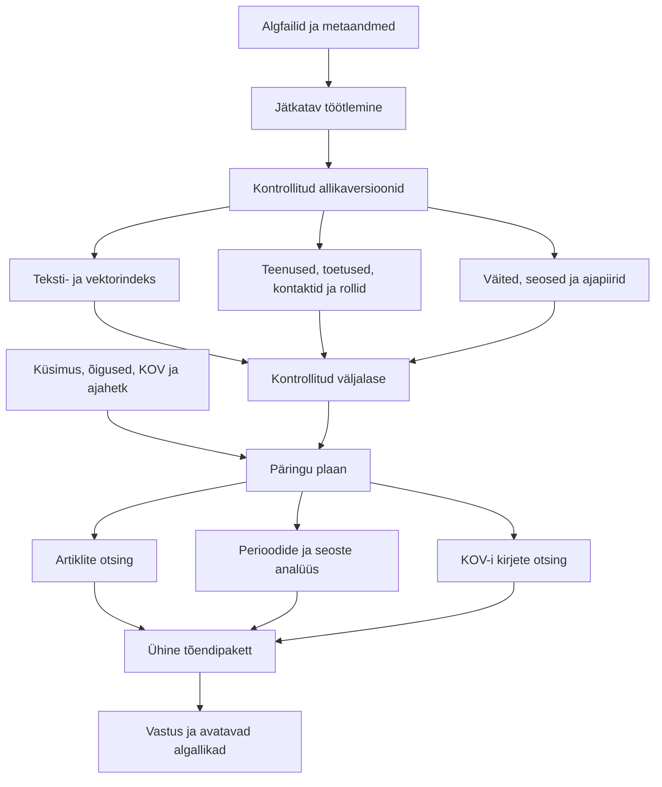

# RAG v2 / GraphRAG: hüpoteetiline teostusanalüüs Opusele

Kuupäev: 23.09.2026. Teine läbivaatus omaniku täpsustatud kasutuseesmärgi järgi; lisatud vestlusliku assistendi põhinõue.

## Dokumendi eesmärk ja staatus

See dokument kirjeldab, kuidas võiks olemasolevast RAG v2 teostusest ehitada ühe tugeva teadmistesüsteemi ajakirjainfo leidmiseks, teemade ja seoste uurimiseks eri ajaperioodidel ning KOV-i toetuste, teenuste ja kontaktisikute leidmiseks. Omanik kinnitas selle kasutuseesmärgi 23.09 ning lisas põhinõude: RAG-i kasutamine peab tunduma loomuliku vestlusena assistendiga. Otsing on assistendi taustal kasutatav võime. Dokument on terviklahenduse analüüs. Omaniku hilisema arendusloa järel teostati esimene kohalik vastuvõtu- ja keeleotsingu plokk; täpne ulatus ja piirid on [ADR-011-s](../rag-v2/adr-011-resumable-intake-and-language-search.md). Ülejäänud kirjeldatud lisavõimed on ettepanekud, mitte valmisolekuväited.

Aktiivset tööd ja tegelikku teemaseisu kannab jätkuvalt [SotsiaalAI.md S1.0/S2](../platvormi%20arendus/SotsiaalAI.md). Käesolev fail on dateeritud analüüs; see ei loo paralleelset tööseisu ega anna korraldust arendust, deploy'd või tasulisi mudelikutseid käivitada. Opusele on see esmalt lugemiseks ja kriitiliseks hindamiseks.

Analüüs tugineb kohaliku koodi, Giti ajaloo ja seotud dokumentide lugemisele. Vaatluse ajal oli kohaliku `main`-haru HEAD `61cf14d2d`; tööpuus oli varasemaid pooleliolevaid muudatusi. Viimane leitud RAG-i põhikoodi muudatus oli `ad44c302e` 08.09.2026 ning selle ühendustõendi dokumentatsioon `14ec3f053` samal päeval.

Serveri praegust seisu ega `origin/main`-i tegelikku kaugseisu selle analüüsi käigus ei mõõdetud. Viited serverile kirjeldavad dateeritud varasemaid mõõtmisi. Käitumisteste, build'i ega mudelikutseid analüüsi koostamisel ei käivitatud; jõudlus, kulu ja sisuline kvaliteet vajavad hiljem vastava muudatuse ulatuses tõendamist.

## 1. Põhijäreldus ja olemasolev alus

Hüpoteetiliselt ehitaksin lahenduse edasi olemasolevale PostgreSQL-i, Qdranti ja muutumatute allikaversioonide alusele. Ühine tuum annaks allikad, identiteedid, versioonid, õigused, ajainfo ja tõendilepingu. Selle sees kasutataks küsimuse järgi tekstiotsingut, struktureeritud kirjete otsingut, graafi läbimist või perioodide sünteesi. Kasutajal on üks jätkuv vestlus assistendiga, kes mõistab eesmärki, hoiab asjakohast konteksti ja valib vajadusel sobiva otsinguviisi. Kasutajalt ei eeldata märksõnapäringu koostamist, filtrite seadmist ega otsingurežiimi valimist.

Esimene analüüs käsitles mahutöötlust ja käitamist põhjalikumalt kui kasutaja tegelikke ülesandeid. Teises läbivaatuses lisanduvad kolm kasutusrada, allikatüübist sõltuv tõendi tähendus, teenuse/toetuse/kontakti andmemudel, ajakohastamine ning kasutusjuhtude vastuvõtt. Ajaline võimekus tuleb varakult esinduslikku kontrollvalimisse; kogu kümnendi täielik süntees võib valmida hiljem. Teisele organisatsioonile paigaldatavus säilib läbiva arhitektuurinõudena.

### 1.1. Üks süsteem, kolm põhikasutust

| Kasutaja eesmärk | Näidisküsimus, mitte lubatud vastus | Süsteemi vajalik käitumine |
| --- | --- | --- |
| Ajakirjadest teadmise leidmine | „Mida on kirjutatud eakate üksildusest ja milliseid lähenemisi on kirjeldatud?” | Leiab sobivad artiklid ja täpsed lõigud, eristab uurimistulemust, autori seisukohta ja praktikanäidet ning näitab autorit, aastat ja allikat. |
| Teemade ja seoste uurimine ajas | „Kuidas muutus lastekaitse töökoormuse käsitlus perioodidel 2016–2020 ja 2021–2026?” | Määrab võrreldavad perioodid ja korpuse katvuse, leiab ühised ning muutunud teemad, säilitab eriarvamused ja näitab muutuse allikalist alust. |
| KOV-i toetuse, teenuse või kontaktisiku leidmine | „Kust saan oma vallas koduteenuse kohta infot ja kelle poole pöörduda?” | Selgitab vajadusel KOV-i, leiab õige teenuse kirje, tingimused ja taotlemise ning seob selle ajakohase vastutava üksuse või kontaktisikuga. |

Segaküsimus võib kasutada mitut rada: näiteks „Mida ütlevad artiklid omastehooldajate toetamisest ja millist abi pakub minu vald?” Vastus seob üldise teadmise konkreetse kohaliku teenusega ning säilitab kummagi väite jaoks sobiva tõendi. Ajakirja soovitus ei muutu sellega automaatselt kohaliku toetuse tingimuseks.

### 1.2. Koodist ja andmekujust kontrollitud lähtekoht

Praeguses lahenduses on olemas:

- PDF-i, HTML-i, XML-i ja JSON-i töötlemise alus ning täpsed allikakohad; nelja vormingu kohalik ühendus on piiratud ulatuses kontrollitud.
- Muutumatud dokumendiversioonid, PostgreSQL-i leksikaalne otsing, Qdranti vektorid ja indeksi põlvkonnad.
- Allikasse ankurdatud väite- ja sõltuvuskandidaadid, piiratud graafiotsing ning haldaja teadmismustandi koostamine ja valimine.
- Piiratud vastamine, allikavaade, vestluse taastamine ja tasuliste päringute kuluregister.

Peamised piirid on nähtavad ka koodis:

| Piir | Kohalik alus | Järeldus arenduseks |
| --- | --- | --- |
| Ühe indeksi ülempiir on 5000 tekstiosa. | [search/indexing.js](../../lib/rag-v2/search/indexing.js), `indexSnapshot()` | Vaja on partiipõhist indekseerimist ja mahu tõendamist enne piiri muutmist. |
| Otsing laadib lubatud dokumentide tervikpaketid ja tekstiosad enne lõplikku valikut. | [search/retrieval.js](../../lib/rag-v2/search/retrieval.js), `retrieve()`; [search/postgres.js](../../lib/rag-v2/search/postgres.js), `bundles()` ja `units()` | Päring peab lugema indeksi kaudu valitud alamhulka. |
| Vastuvõtt ja otsing kasutavad arenduskasutuse õiguste lepingut. | [ingestion.js](../../lib/rag-v2/ingestion.js); [search/policy.js](../../lib/rag-v2/search/policy.js) | Tootekasutus vajab õiguste lepingu sisulist laiendamist ja kontrolli. |
| Qdranti päring kasutab `exact: true`. | [search/qdrant.js](../../lib/rag-v2/search/qdrant.js), `query()` | Suurema mahu puhul tuleb mõõta täpse ja ligikaudse otsingu sobivust. |
| Piloodi püsistus tunneb SotsiaalAI vestlustabeleid. | [pilot/store.js](../../lib/rag-v2/pilot/store.js) | Kliendispetsiifiline püsistus peab paiknema adapteris. |
| Päringu filtrileping hõlmab piirkonda, avaldamisvahemikku ja `valid_at` kuupäeva; eraldi teenuse-, kontaktrolli- ja üksusetüübi filtrid puuduvad sellest lepingust. | [search/ranking.js](../../lib/rag-v2/search/ranking.js), `validateQuery()` | Täpne KOV- ja kontaktotsing vajab struktureeritud otsingulepingu laiendust. |
| Praegune `valid_at` filter nõuab nii kehtivuse algust kui lõppu. | [search/ranking.js](../../lib/rag-v2/search/ranking.js), `filtersMatch()` | Teadmata kehtivus ja tõendatult avatud lõpuga kehtivus vajavad eri tähendust; praegust filtrit ei saa pidada valmis ajalise mudeli tõendiks. |
| Registreeritud allika adapter lubab `source` rolli; kontaktide eraldi koond on korpuse kirjelduses `reference_lookup`. | [registered-source.js](../../lib/rag-v2/registered-source.js); [ADR-009](../rag-v2/adr-009-corpus-rebuild.md) | Kontaktide kasutamine vajab vastendatud kirjete adapterit ja kvaliteedikontrolli. Rolli vaikne muutmine tavaliseks tekstiallikaks ei lahenda seda. |

23.09 struktuurivaatluses sisaldas ühe olemasoleva KOV-paketi valim eraldi `benefit`, `service`, `contact`, `form` ja `resource` kirjeid ning välju `application`, `relatedContacts`, `sourceKeys`, `municipality_id` ja ajametaandmeid. Eraldi kontaktikoond oli 1130 kirjega massiiv; esimese kirje väljade hulgas olid `role`, `department`, `serviceArea`, `phone`, `email`, `officialUrl` ja `confidence`. Kontrolliti andmekuju, mitte kontaktide tänast õigsust. Kogu andmekogule ei omistata ühe kirje põhjal täielikku või värsket katvust.

## 2. Allikad, indeks ja vastamisseadistus üheks väljalaskeks

Praegu saavad allikaregister, otsinguindeks ja M4 vastamisseadistus liikuda eri tempos. [08.09 väljalaskeraportis](rag-v2-release-integration-2026-09-08.md) mõõdetud `active_index_mismatch` näitab, miks nende kooskõla vajab selget juhtimist. See raport ei tõenda sama vea püsimist 23.09.

Lisaksin väljalaskekirje, mis määrab kasutatavad allikaversioonid, indeksipõlvkonna, otsinguprofiili, mudeliseadistuse ja tarkvara ühilduvuse. Päring kinnistatakse alguses sellele väljalaskele. Väljalase ei külmuta kasutaja õigusi: neid kontrollitakse päringu ajal värskelt.

Uus indeks ehitatakse taustal, kontrollitakse PostgreSQL-is ja Qdrantis ning alles siis aktiveeritakse. Kuna need kaks hoidlat ei jaga ühist tehingut, peab avaldamine olema mitme sammuga: ettevalmistus, kontroll ja lõpuks aktiivse väljalaske vahetus. Katkestus enne viimast sammu jätab senise väljalaske kasutatavaks. Säilitada tuleb olemasolev kaitse selle vastu, et hilinenud vana töö aktiveeriks end uuema töö asemel.

Pooleli import ei tohi mõjutada kasutaja vestlust. Ebaõnnestunud uuenduse järel peab saama taastada eelmise kooskõlalise terviku. Varasemate vastuste viited jäävad seotud nende allikaversioonidega, arvestades kehtivaid õigusi ja säilitamisreegleid.

Serveri praeguse seisu kontroll eelneb avaldamisele; kohalik arendus saab samal ajal jätkuda. Olemasoleva indeksi aktiveerimise ja M4 plaani lepingu migratsioon vajab eraldi väikest teostusplaani, et üleminekul ei tekiks kahte vastuolulist aktiivse väljalaske allikat.

## 3. Püsiv tööjärjekord ja allikapõhine edenemine

Ühe allika töötlemine koosneks eraldi taastatavatest etappidest: vastuvõtt, teksti eraldamine, struktuuri kontroll, tekstiosade loomine, valikuline teadmiste koostamine, vektorid ja indekseerimine. Teadmiste koostamine jääks valikuliseks, et tavaline allikapõhine otsing ei sõltuks kogu korpuse semantilise graafi valmimisest.

Partii nimekiri fikseeriks sisendi räsi, metaandmed, valitud kirje või dokumendiosa, töötlemisseadistuse ja kasutusõigused. Sama faili eri JSON-kirjed peavad jääma eristatavaks. Muutunud sisend tekitaks uue tööversiooni; sama sisendi korduv käivitamine kasutaks kontrollitud varasemat tulemust.

Tööseisu hoiaksin PostgreSQL-is. Esialgu piisaks ühest taustatöötlejast; hilisemaks paralleeltööks sobib lühikese tehinguga töö hõivamine ja tähtajaline töötlemisõigus. PostgreSQL-i `SKIP LOCKED` toetab sellist järjekorrast töö võtmist, kuid taastamine ja aegunud töötleja kirjutamise tõkestamine tuleb rakenduses juurde ehitada. Pikka parseritööd või välismudeli päringut ei hoitaks sama andmebaasitehingu sees. [PostgreSQL-i dokumentatsioon](https://www.postgresql.org/docs/current/sql-select.html)

Iga etapp salvestaks oma tulemuse ja kontrollpunkti püsivalt. Olemasolev ühe allika kirjutuslukk ja avaldamine tuleb tööjärjekorraga kooskõlastada; üksnes uue järjekorratabeli lisamine ei tõenda protsessi taastatavust.

Tasuliste kutsete puhul säilitaksin olemasoleva käitumise: kui päring saadeti välja, kuid vastuse saatus jäi teadmata, jääb töö eraldi lahendamist ootama. Automaatne taaskäivitus ei tohi seda pimesi uuesti tasuliselt saata. Selle alus on [praeguses teadmiste koostamise kuluregistris](../../lib/rag-v2/admin/knowledge-jobs.js) olemas. Kohaliku salvestuse korduv täitmine ja väliskutse kordamine on erineva riskiga toimingud.

Oodatud tulemus: serveri taaskäivitus jätkab lõpetamata tööd ning haldaja näeb iga allika juures, mis õnnestus, milline kulu on reserveeritud ja mis vajab sekkumist.

## 4. Sisendi kvaliteet ja muudatuste ulatus

PDF-i, HTML-i, XML-i ja JSON-i ühine väljund oleks endiselt allikasse tagasi viidav tekst koos struktuuriga. Vormingupõhised adapterid annavad juurde leheküljed, lõigud, õigusnormid või kirjepiirid. Olemasolev leping on [ADR-010-s](../rag-v2/adr-010-source-structure-and-chunking.md).

OCR-i ja keerukate tabelite jaoks lisaksin eraldi töötlemisraja. Puudulikult loetud dokument saab nähtava piirangu või jääb läbivaatust ootama. Kahtlane tekst ei tohiks muutuda vaikimisi usaldusväärseks teadmiseks. OCR-i väljundil peab säilima seos algse lehepildiga; kvaliteedipiir tuleb tõendada vastava sisendi valimil.

Pikad dokumendid töötleksin struktuursete osadena. Iga osa säilitaks seose peatüki ja algallikaga; osade vahelised viited lahendataks järgmises etapis. Osade kaupa koostatud teadmismustand ei tohi esineda kogu dokumendi täieliku analüüsina, kui ühendamise etapp on lõpetamata.

Eristaksin algfaili muutuse, teksti eraldamise muudatuse, teadmisseoste muudatuse ja embedding'u seadistuse muudatuse. Nii saab arvutada uuesti ainult sõltuvad tulemused. Olemasolevad versioonid ja viited säiliksid ühilduva lugemisraja kaudu.

Praegune dokumendiversiooni identiteet sisaldab ka metaandmeid, profiili, töötlemisseadistust ja õigusi. Nende sõltuvuste eristamine on ettepanek, mille täpne andmemudel vajab läbivaatust. Seda ei tohi teha ajalooliste tunnuste vaikse ümberarvutamisega. Vektorite taaskasutus peab endiselt sõltuma tegelikust mudelisisendist, embedding'u seadistusest ja lubatud kasutusulatusest.

Oodatud tulemus: ühe bibliograafiavea parandamine või graafiseose muutmine ei peaks automaatselt nõudma kogu korpuse kallist uuesti töötlemist.

### 4.1. Ühine andmemudel teksti ja täpsete kirjete jaoks

Teenusel, toetusel, omavalitsusel ja kontaktrollil oleks oma stabiilne identiteet. Neid kirjeldavad allikad ja väited võivad aja jooksul muutuda. Üks allikas võib kirjeldada mitut teenust; sama teenust võivad tõendada määrus, ametlik teenuseleht ja kontaktide leht. Allika identiteeti ei kasutata automaatselt teenuse identiteedina.

| Objekt | Vajalikud tunnused ja seosed |
| --- | --- |
| Artikkel ja väljaanne | Artikkel, autor, ilmumisaeg, number/väljaanne, leheküljed, teksti laad ning originaali ankrud. Sama artikli PDF/HTML või kordustrükk vastendatakse, et üks tekst ei paisutaks perioodi katvust. |
| Mõiste või teema | Stabiilne mõistetunnus, algallika sõnastus, sünonüümid, laiem/kitsam mõiste ning vajadusel ajaline tähendus. |
| KOV ja allüksus | Stabiilne tunnus, nimevariandid, asjakohane territoorium ja allüksused; linna ja samanimelist valda või linnaosa ei ühendata ainult nime järgi. |
| Teenus või toetus | KOV, kohaliku kirje nimi, üldise teenuseliigi vaste, sihtrühm, tingimused, võimalik summa/tasu ja ühik, taotlemine, vorm, osutaja ning vastutav üksus. Iga sisuline väli säilitab oma allika ja ajainfo. |
| Kontaktroll ja kontaktkirje | Asutus, üksus, ülesanne/teeninduspiirkond, vajadusel isik, ametinimetus, telefon, e-post, vastuvõtuinfo ja ametliku lehe allikas. Inimese ametisolek ning konkreetne kontaktkanal võivad kehtida eri ajavahemikul. |
| Väide ja seos | Algallika ankur, osapooled, suund, seoseliik, kohaldamisala, ajavahemik, päritolu ja kontrolliseis. |

Tabel kirjeldab loogilisi objekte, mitte nõuet luua kohe iga rea jaoks uus tabel. Esmalt tuleb vastendada need olemasoleva skeemi ja adapteritega. Üldise teenuse ning kohaliku variandi eristus võimaldab sama vajadust otsida eri KOV-idest, säilitades kohaliku nime ja tingimused.

Kontaktide leidmisel peab olema võimalik liikuda vajadusest teenuseni, sealt vastutava rollini ja lõpuks sobiva kontaktkanalini. Kontaktisik võib muutuda, kuigi roll ja teenus säilivad. Samuti võib teenuseosutaja erineda taotluse vastuvõtjast. Isikunime esinemine ajakirjaartiklis ei tõenda tema praegust töörolli.

Kirjete ühendamisel säilitatakse lähtetunnused, päritolu ja ühendamise põhjendus. Sarnane nimi või telefon üksi ei taga sama teenust või isikut. Kontaktikoondi `confidence` on imporditud hinnang; see ei kinnita automaatselt täpsust ega ajakohasust. Vastuolulised kandidaadid jäävad nähtavaks.

### 4.2. Allika sobivus, värskus ja ajakohastamine

Igal olulisel väljal tuleks eristada allika avaldamisaega, väite kehtivusaega, süsteemi kogumisaega ning viimast sisulist kontrolli. Artiklis kirjeldatud sündmuse või uurimisperioodi aeg võib erineda artikli ilmumisajast. Teadmata lõpukuupäev ei tähenda automaatselt tähtajatut kehtivust; allikas peab toetama avatud lõpu tõlgendust.

Tõendi sobivus sõltub küsimusest. Ajakiri sobib autori käsitluse või kirjeldatud praktika tõendiks; kohaliku toetuse tingimus vajab asjakohast õiguslikku allikat, taotlemine ametlikku menetlusinfot ning kontakt ametlikku kontaktilehte või kinnitatud registrikirjet. Kõige uuem või vektorotsingus sarnaseim tekst ei lahenda automaatselt allikate vastuolu. Vastuolulise tingimuse korral säilivad mõlemad allikad ja lahendamata seis.

Ajakohastamise tööd kasutaksid sama jätkatavat tööjärjekorda. Muutunud allikast luuakse uus versioon ning uuendatakse sellelt sõltuvad kirjed, seosed ja kokkuvõtted. Arhiiviartikli, toetuse tingimuse ja töötaja kontaktandmete kontrollivajadus on erinev; kontrollisagedus ja värskuse lubadus määratakse allikaliigi ning kasutusriski järgi, mõõdetava töömahu piires.

Veebilehe edukas laadimine ei tõenda kontaktisiku ametisolekut; kontroll peab jõudma vastava sisuni. Ebaõnnestunud kontroll ei kustuta automaatselt varasemat fakti, kuid selle seis muutub kasutajale arusaadavalt kinnitamata või aegunuks. Täpse isiku puudumisel võib näidata kontrollitud üldkontakti koos selle piiriga. Vastus ei esita vana isikukontakti praegusena.

Olemasolev KOV-korje ja kontaktikoond võetakse lähteandmeteks koos tegeliku päritoluga. Üldine uus veebikorje ei ole impordi eeltingimus. Konkreetse tänast infot lubava vastuse jaoks võib olla vajalik allika sihitud ajakohastamine. Korpuses puuduv kirje, piiratud otsingu tulemusteta jäämine ja ametlikult kinnitatud teenuse puudumine peavad olema eri tulemused. Käesolev analüüs ei aktiveeri korjet ega ajastatud töid.

## 5. Partiipõhine indekseerimine ja valikuline otsing

Enne otsingut koostaks süsteem kontrollitava päringuplaani: mida otsitakse, millise KOV-i või üksuse kohta, millise ajahetke/vahemiku jaoks, millist allikatüüpi on vaja ning kui laia katvust vastus lubab. Mudel võib aidata küsimust tõlgendada, kuid plaan peab läbima skeemi- ja õiguskontrolli. Madala kindlusega tõlgendus vajab täpsustust või nähtavat piirangut.

KOV-i küsitakse siis, kui kohalik vastus sellest sõltub; asukohta ei oletata keele ega IP järgi. Vestluses öeldud KOV ja periood säilivad piiratud kontekstis ning kasutaja uus valik asendab varasema. Küsimus „aga naabervallas?” peab muutma päringu ulatust ka siis, kui teema jääb samaks.

| Päringu vajadus | Hüpoteetiline otsinguviis |
| --- | --- |
| Täpne artikkel, autor, nimi, telefon või e-post | Struktureeritud või leksikaalne otsing; vajalikud väljad tagastatakse kontrollitud kirjest. |
| Sisuline küsimus ajakirjaartiklite kohta | Leksikaalne ja semantiline otsing, vajadusel kandidaatide ümberjärjestus ning naaber-/sõltuvuskontekst. |
| KOV-i teenus või toetus | KOV-i ja kirjetüübi filter, vajaduse seostamine teenuseliigiga, seejärel tingimuste, taotlemise ja kontaktide ühendamine. |
| Seoseid või sõltuvusi küsiv küsimus | Sobivad algleiud, kontrollitud suunaga piiratud graafi läbimine ning iga olulise seose algallikas. |
| Perioodide võrdlus või laia korpuse ülevaade | Katvuse määramine, allikate valik perioodide ja teemade kaupa, vahekokkuvõtted ning tõendatud üldistus. |
| „Kõik”, „mitu” või täielik nimekiri | Määratletud registriulatusest lehekülgede kaupa lugemine või struktureeritud loendus; osalise katvuse korral piiratud ulatusega vastus. |

Päringuplaan võib ühendada mitu rida ja teha piiratud lisapäringu, kui konkreetne vajalik tingimus või kontakt jäi puudu. Peatumise aluseks on piisav tõend, kindel puudujääk või aja/kulu piir. Allika nime või oodatud vastuse järgi erandeid ei lisata. Eesti käändevormide, nimevariantide ja valdkonna sünonüümide katvus tuleb eraldi mõõta; tõlgendus ei tohi muuta ametlikke nimesid ega kontakti väärtusi.

Mitme otsinguviisi kasutamise üldine põhjendus on kooskõlas ka Microsofti GraphRAG-i kohaliku ja kogu andmekogu otsingu eristusega. See on arhitektuuriline võrdlusallikas; konkreetse raamistiku kasutuselevõttu siin ei otsustata. [Microsoft GraphRAG-i päringuviisid](https://microsoft.github.io/graphrag/query/overview/)

Ühe piiratud tõendipäringu sees muudaksin järjekorda järgmiselt:

1. Õiguste, kasutusotstarbe ja metaandmete piirangud.
2. Kandidaatide leidmine päringuplaaniga valitud struktureeritud, leksikaalsest või vektorindeksist.
3. Valitud tekstiosade ja nende allikakohtade lugemine.
4. Asjakohaste struktuuri- ja sisuliste sõltuvuste piiratud lisamine.
5. Tõendipaketi koostamine ning õiguste korduskontroll.

Indekseerimine kirjutaks piiratud suurusega partiisid ja kontrollpunkte. Terviklikkuse kontroll jaguneks kaheks: põhjalik kontroll avaldamisel ning päringus kasutatud objektide päritolu ja õiguste kontroll. Praeguste kontrollide kaitse peab selle muudatusega säilima. Suurte tervikpakettide laadimise eemaldamine ei tohi lubada vigase või vale versiooni tekstiosa kasutamist.

Valikuline lugemine puudutab ka sõltuvuste läbimist ja kanoonilise viite avamist. Dokumentide metaandmed ning otsinguks sobivust määravad väljad peavad olema indekseeritavalt loetavad. Graafiseoste jaoks tuleb saada vajalikud naabrid ilma kogu korpuse objektide laadimiseta.

Qdranti päring kasutab praegu `exact: true`. Suurema mahu puhul võrdleksin seda ligikaudse indeksotsinguga ning valiksin mõõdetud kiiruse ja leidude säilimise järgi. Qdranti dokumentatsioon kinnitab, et täpne otsing võib teha täieliku läbivaatuse ning filtrite jaoks on olulised sobivad indeksid. [Qdranti otsing](https://qdrant.tech/documentation/search/), [indekseerimine](https://qdrant.tech/documentation/manage-data/indexing/)

Oodatud tulemus: ühe küsimuse töötlemine ei nõua kogu teadmistekogu rakenduse mällu laadimist. Pärast jätkatava indekseerimise ja valikulise lugemise tõendamist saab muuta 5000 tekstiosa piirangut. Täpne partii suurus, samaaegsus ja jõudluse sihttase valitakse mõõtmise järgi.

## 6. Õiguste mudel päriskasutuseks

Praegune tuum lubab teadlikult `local_private/development_only` kasutust. Tootekasutuseks tuleb määratleda organisatsiooni, kasutaja, allika ja kasutusotstarbe õigused. Olemasoleva piirangu eemaldamine üksi ei loo uut õiguste mudelit.

Õigusi kontrollitaks enne otsingut, enne materjali mudelile saatmist ja allika avamisel. Sama peab kehtima graafiseoste, kokkuvõtete, vahemälu ning taastatud vestluse kohta. Ligipääsu eemaldamine peab mõjutama ka allikast tuletatud materjali edasist kasutamist. Ajaloolise versiooni säilimine ei anna õigust seda endiselt lugeda.

Algallika kasutusluba ja kasutaja lugemisõigus on eri asjad: organisatsiooni ligipääs failile ei määra iseenesest kõiki lubatud töötlemisviise. Õiguste ja kasutusotstarbe muutuste mõju tööjärjekorrale, käimasolevale päringule ning tuletatud andmetele peab olema selgelt määratud.

Kliendi identiteet tuleb usaldatud serverikontekstist. Kasutaja antud tenant'i või dokumendi tunnus ei tohi ise anda ligipääsu. Sama organisatsiooni piires võivad eri kasutajatel olla eri õigused.

Oodatud tulemus: sama tuum saab teenindada eri organisatsioone nii, et nende materjalid ja tuletatud teadmised püsivad õiguste piires. See osa peab valmima enne vastava päriskasutuse avamist.

## 7. GraphRAG kontrollitavate väidete ja seoste kaudu

Graafi hoiaksin esialgu olemasolevas PostgreSQL-i andmekihis. Piiratud seoste läbimise jaoks saab seda edasi arendada; eraldi graafihoidla vajadust hindaksin mõõtmiste põhjal.

Graafis eristuksid allika struktuur, teenuste/asutuste/kontaktrollide seosed, allikas sõnaselgelt väljendatud sisulised sõltuvused ning analüüsis pakutud temaatilised seosed. Näiteks sama teema esinemine kahes artiklis võib aidata uurimisel uusi tekste leida, kuid ei tõenda põhjuslikkust ega seda, et üks artikkel toetab kõiki teise väiteid.

Dokumendist eraldatud väited ja tingimused jääksid alguses kandidaatideks. Dokumentidevaheliseks sidumiseks otsiks süsteem esmalt väikese hulga võimalikke vasteid ning kontrolliks nende algtekste. Kõigi väidete kõigiga võrdlemine kasvataks töömahtu kiiresti. Eelistada saab selgesõnalisi allikaviiteid, identiteete ja asjakohast kohaldamisala; teksti sarnasus üksi ei tõenda sõltuvust.

Iga seos vajaks tüüpi, suunda, allikakohta, kohaldamisala ja kontrolliseisu. Haldaja tehtud valik ning sisuline kinnitamine peaksid olema eristatavad toimingud. Ülevaatus peab näitama, kes mille alusel seose kinnitas, parandas või tagasi lükkas. Uus allikaversioon muudaks sellest sõltuvad seosed uuesti kontrollimist vajavaks; vana versiooni seos jääb ajalooliseks.

Ülevaatuse maht peab olema hallatav. Teemakandidaate võib kasutada märgistatud otsinguabina ning nende kvaliteeti hinnata valimil. Teenuse tingimust, erandit, kehtivust või konkreetset kontaktrolli kinnitav seos vajab selle riski jaoks sobivat tugevamat kontrolli. Süsteem võib pakkuda kasutajale põhjendatud võimalikku seost uurimiseks; selle staatus ja toetavad või vasturääkivad allikad peavad olema nähtavad. Mudeli kindlustunne ei asenda tõendit.

Näiteks kui allikas ütleb „A eeldab B-d”, peab vastamisse jõudma ka B. Kui kasutaja kohta pole teada, kas B kehtib, saab süsteem küsida täpsustust või anda tingimusliku vastuse. Puuduv asjaolu jääb teadmata. Säilitada tuleb suund, JA/VÕI, vastuolu ja lahendamata sõltuvus.

Kasutaja asjaolud tuleks siduda nende päritolu ja ulatusega: kasutaja enda öeldu, kinnitatud täpsustus või süsteemi oletus ei ole sama tugevusega alus. Ajapiirid peavad pärinema allikast või kontrollitud metaandmest. Mudeli tõlgendust ei muudeta vaikimisi deterministlikuks õigustatuse reegliks.

Oodatud tulemus: graaf aitab vastuses säilitada tingimused ja erandid. Täpne tsitaat ning sisuliselt õige seos on eraldi kontrollitavad omadused. Olemasoleva lepingu alused on [ADR-007-s](../rag-v2/adr-007-source-dependencies.md) ja [ADR-008-s](../rag-v2/adr-008-source-knowledge-preparation.md).

## 8. Vestlus assistendiga ja kontrollitav tõendipakett

Mudelile antav pakett sisaldaks valitud algtekste, asjakohaseid sõltuvusi, kasutaja kinnitatud asjaolusid ning nähtavaid teadmislünki. Päringu konteksti maht ja sõltuvuste läbimine jääksid piiratuks. Piiri tõttu välja jäänud oluline tingimus peab jätma nähtava puudulikkuse seisundi.

Vastuses eristuksid allikaga toetatud väide, tingimuslik järeldus ja täpsustamist vajav küsimus. Tehniliselt saab kontrollida, kas viide eksisteerib ja osutab õigele tekstile. Kas tekst tegelikult toetab vastuse mõtet, vajab lisaks sisulist hindamist.

Kasutajaliides säilitaks omaniku otsustatud lahenduse: allikad avanevad eraldi „Vastuste allikad” paneelis ning väite ja allika seos säilib süsteemi andmetes. Vastuse põhitekstis ei ole tootmisvaates viitemärke vaja. Algallikate avamine peab toimima ka vestluse taastamisel, arvestades värskeid õigusi.

Teenuse- ja kontaktvastusel oleks süsteemi sees struktureeritud tulemus: sobiv teenus/toetus, KOV, asjakohased tingimused, taotlemise järgmine samm, vastutav üksus või kontaktisik, kontaktkanal, allikas ja ajakohasuse seis. Telefon, e-post, nimi, URL ning allikaga kinnitatud summa/ühik tulevad kontrollitud väljadest ja säilitavad seose sama kirjega. Mudel aitab vajadust mõista ja infot selgitada; puuduvaid täpseid väärtusi ei täideta oletusega. Kasutajale esitatakse neist tema küsimusele vastav selgitus ja järgmine samm; kogu sisemist väljaloendit ei kuvata igas vastuses kohustusliku vormina.

Ühine vastuseleping kannaks küsitud ja tegelikult kaetud ulatust, ajahetke või perioodi, tõendite viiteid, värskuse kontrolli, lahendamata tingimusi ning katvuse piiri. Väljund võib olla toetatud vastus, osaline vastus, täpsustusküsimus või põhjendatud teade ebapiisavast infost. Nii saab sama liides esitada nii artikliülevaadet kui kontaktikirjet.

### 8.1. Vestluslikkus on tootenõue

Assistent reageerib inimese mõttele ja olukorrale, arendab sama arutelu edasi ning kohandab vastuse pikkust ja detailsust. Ta võib aidata võrrelda, selgitada, sõnastada järgmist sammu või uurida võimalikku seost. Allikate leidmine toetab neid tegevusi. Vastus algab kasutaja jaoks olulisest sisust; allikaloend ja tehniline otsingukäik jäävad vajaduspõhiseks.

| Vestluse olukord | Oodatud käitumine |
| --- | --- |
| Inimene kirjeldab muret vabas vormis | Assistent mõtestab eesmärgi ja annab võimalusel kohe kasulikku abi. Täpsustatakse ainult vastust määravaid puuduvaid asjaolusid, loomulikus järjekorras. |
| „Aga kas see kehtib ka pensionärile?” või „Kellele ma siis helistan?” | Assistent seob viite käimasoleva teenuse või teemaga. Mitme võimaliku viite korral küsib ta lühikese täpsustuse. |
| „Ma mõtlesin hoopis teist valda” või kasutaja parandab asjaolu | Parandus uuendab ulatust ning vajadusel tõendit. Vana eeldus ei jää järgmistes vastustes vaikimisi kehtima. |
| „Selgita lihtsamalt”, „tee lühemalt” või tänamine | Assistent kasutab sobival juhul olemasolevat konteksti ja tõendit. Selline pööre ei vaja automaatselt uut otsingut. |
| Lisandub uus faktiküsimus, KOV, ajaperiood või ajakohasuse nõue | Taustal tehakse vajalik uus või täiendav otsing; kasutajalt ei nõuta küsimuse täielikku uuesti sõnastamist. |
| Kasutaja liigub ajakirja arutelust kohaliku abi juurde | Assistent ühendab teemasid, säilitades üldise teadmise ja kohaliku võimaluse erineva tõendi. |
| Otsing on aeglane või tõend puudulik | Assistent annab vajadusel lühikese sisulise edenemisteate ning selgitab tulemust mõjutavat lünka tavakeeles. Oletatud fakte ei näidata enne tõendi saabumist. |

Vestluse juhtimine eristaks kasutaja eesmärki, kinnitatud asjaolusid, aktiivset teemat/teenust, KOV-i, ajavahemikku, lahtist täpsustust ning kasutatud tõendite tunnuseid. Assistendi varasem vastus ei muutu iseseisvaks allikaks. Oletus jääb oletuseks ka vestluse kokkuvõttes. Kontekst piiritletakse vestluse ja asjakohase ülesandega; kasutaja parandus, teemavahetus ning teise inimese kohta küsimine peavad seda vastavalt uuendama.

Iga pöörde korral otsustatakse, kas piisab vestluslikust vastusest või olemasoleva tõendi selgitamisest, on vaja täpsustust või tuleb hankida uut tõendit. See on hüpoteetiline täiendus olemasolevale piiratud M4 vestluskontekstile. Varasema tõendi taaskasutus peab arvestama õigusi, värskust ja ulatust; näiteks vana kontaktivastuse ümberjutustamine ei muuda seda tänaseks kontrolliks.

Vastuse põhisõnum, kontakt või järgmine samm võiks olla kohe arusaadav. Pikemad põhjendused, võrdlused ja allikad avatakse või lisatakse vajaduse järgi. Tehnilised mõisted nagu embedding, indeksipõlvkond, päringuprofiil või top-k ei kuulu tavapärasesse kasutajavestlusse. Allikate kontrollitavus, ebakindlus ja oluline ajakohasuse piir jäävad kasutajale kättesaadavaks arusaadavas keeles.

Vestluslikkuse vastuvõtt toimub tervete vestlusjadadega. Hea üksikvastus ei tõenda, et assistent mõistis jätkuküsimust, säilitas õige isiku/teenuse või rakendas parandust. Näiteks jadast „Vajan emale kodus abi” → KOV-i täpsustus → „Kellele helistada?” → „Aga naabervallas?” → „Ütle see lihtsamalt” peab moodustuma sidus vestlus, milles iga fakt vastab hetke ulatusele.

### 8.2. Kolm läbivat näidet

1. **Ajakirjaküsimus:** „Milliseid lahendusi on kirjeldatud omastehooldajate koormuse vähendamiseks?” Süsteem leiab mõistevariandid, sobivad artiklid ja lõigud, koondab lähenemised ning eristab uuritud mõju autori soovitusest. Vastuses säilivad viited ja võimalikud vasturääkivad tulemused.
2. **Perioodivõrdlus:** „Kas omastehoolduse käsitlus on kümne aastaga muutunud?” Süsteem määrab perioodid, kontrollib materjalide katvust, kogub võrreldavad väited ja eristab püsivat, lisandunud või muutunud rõhuasetust. Väide puudutab uuritud materjalide käsitlust; ühiskondliku muutuse või põhjuslikkuse väide vajab oma tõendit.
3. **Kohalik abi:** „Mul on vaja abi eaka koduse toimetulekuga; kelle poole pöörduda?” Vajadusel küsitakse KOV-i, seejärel leitakse asjakohased teenusekirjed ja vastutav roll. Näidatakse põhjendatud võimalusi, järgmisi samme ning kontrollitud kontakti. Kui kasutaja soovib toetuse eelduste hindamist, küsitakse ainult selleks vajalikud asjaolud; kontakti leidmiseks ei nõuta tervet isiklikku juhtumikirjeldust.

Oodatud tulemus: kasutaja saab vastuse põhjenduse algallikani jälgida ning süsteem ei peida ebapiisavat tõendit ladusa sõnastuse sisse. Tulevase vastuvõtu kvaliteedikriteeriumid ei tähenda, et käesoleva analüüsi või iga tehnilise paranduse ajal tuleks käivitada uus ulatuslik semantiline hindamisring.

### 8.3. Eesti käänded, inglise keel ja loomulik sõnastus

Omaniku nõue: toimimiseks ei koostata promptides käsitsi sõnade ega käänete loendeid. Keelevõimekus kuulub üldisesse otsingusse ja mudelisse, mitte allika või oodatud vastuse järgi tehtud eranditesse.

Kombineerida tuleb mitmekeelne tähendusotsing, algkuju säilitav täpne tekstotsing ja automaatne keeletöötlus. Sama töötlus rakendub indekseerimisel ja päringul. Sõnavormide normaliseerimine aitab käänete korral; embedding aitab parafraaside ja eri keelte vahel. Need ei asenda üksteist. Nimed, koodid, telefonid ja e-post peavad säilima täpsel kujul. Algallikasse ega mudelile antud tsitaati otsingu jaoks tuletatud sõnatüvesid ei kirjutata.

Automaatne tüvestamine on odav kohalik kandidaatide leidmise abi, kuid ei võrdu täieliku lemmatiseerimisega. [Snowballi eesti algoritm](https://snowballstem.org/algorithms/estonian/stemmer.html) on olemas; morfoloogilise analüüsi ja algvormide jaoks on võimalik hinnata [EstNLTK/Vabamorfi](https://github.com/estnltk/estnltk). Täiendava analüsaatori kasutuselevõtt peab parandama mõõdetud leidvust piisavalt, et õigustada käitamise keerukust. Ükski neist ei tõlgenda iseseisvalt inimese abivajadust.

Vastuvõtus tuleb võrrelda sama vajaduse eri sõnastusi: käänded, liitsõnad, eitus, väikesed kirjavead, ET→ET, EN→ET ja segakeelne küsimus. Võrreldakse oodatud allikate leidmist ja vastuse sisulist õigsust, mitte sõnasõnalt ühesuguseid vastuseid. Üldine mitmekeelsuse edetabel on eelsõel; meie allikatel sobivus vajab eraldi tõendit. [MMTEB uurimus](https://arxiv.org/abs/2502.13595) annab hindamise tausta.

23.09 kohalik teostus kasutab versioonitud Snowball 3.1.1 ET/EN/RU lisakanalit. „Koduteenust” leiab „koduteenus” ja „toetust” leiab „toetus”. Teadaolev piir: „lapsed” ja „lastele” ei saa selle tüvestajaga ühist otsingutunnust; seda ei parandata käsitsi sõnavormierandiga. Täielik keelepariteet ning pärismudeli semantiline võimekus jäävad mõõtmata. Teostuse ja kontrollide täpne ulatus on [ADR-011-s](../rag-v2/adr-011-resumable-intake-and-language-search.md).

### 8.4. Olukorra kirjeldusest abini

Näide: „Olen üksi kodus, raske on toimetulek, tööd ei ole.” Assistent peab eristama kasutaja öeldut, võimalikku vajadust ja teadmata asjaolu. Üksi kodus olemine ei tõenda üksildust; töö puudumine ei tõenda sissetuleku täielikku puudumist; toimetulekuraskus võib puudutada raha, igapäevategevusi või mõlemat. Järeldus ei muutu kasutajafaktiks.

Esimene kasulik samm võib olla lühike loomulik täpsustus: mis teeb toimetuleku kõige raskemaks ja millises omavalitsuses inimene elab. Kui need asjaolud on vestluses olemas, ei küsita neid uuesti. Vastus võib sisaldada juba tõendatud osalist abi; inimene ei pea enne saama teenuste nimetuste ega toetustingimuste eksperdiks.

Tulevane valdkonnakiht seob vajaduse teenuse või toetuse kandidaadiga, selle tingimuste, piirkonna, kehtivuse, taotlemise sammu ja vastutava rolliga. Seos „võib olla asjakohane” ei võrdu „sul on õigus seda saada”. JA/VÕI tingimused, teadmata asjaolud, eri KOV-id ja ajahetked säilivad. Otsingutulemuste seast valitakse inimese olukorra jaoks mõni põhjendatud võimalus, mitte pikk teenuseloend. Kontakt ja järgmine samm peavad pärinema samale teenusele/piirkonnale kohaldatavast tõendist.

Vastuvõtujada: üldine mure → vajaduse/KOV-i täpsustus → asjakohased võimalused → „kellele helistan?” → kasutaja parandab asukohta → lihtsam selgitus. Kontrollida tuleb ka vastupidiseid asjaolusid, teise inimese kohta küsimist ja olukorda, kus korpuses sobivat kohalikku allikat pole. Katsesse ei anta ette õiget vastust ega kirjutata tootmiskoodi katse sõnastusele reageerivat haru.

### 8.5. Kulu: üks vastust koostav mudelikutse tavapöörde kohta

RAG on meetod, mitte kohustuslik lisavestlus teise AI-ga. Tavaline rada saab olla: kasutaja tekst ja lubatud vestluskontekst → kohalik tekstotsing koos vajadusel küsimuse embedding'uga → piiratud graafipäring → üks allikate toel vastav mudelikutse. Eraldi AI-plaan, küsimuse ümberkirjutamine, mudeliga ümberjärjestamine ega vastuse automaatne paranduskutse pole iga pöörde eeldus.

Allikate parsimine ja indekseerimine tehakse ettevalmistuses; muutumatuid sisendeid taaskasutatakse. Tavapöörde kulu eristab küsimuse vektorit, vastuse sisendit/väljundit ning kohaliku otsingu aega. Vestlusmudelile antakse valitud allikakohad ja vajalik kontekst; tervet korpust ei saadeta. Vektori vahemälu peab arvestama mudelit, kasutajat/õigusi ja vestluse ulatust. Sama kasutajategevuse võrgu kordussaatmine ei tohi muutuda uueks tasuliseks katseks.

Praeguses `PilotService` rajal on juba maksimaalselt üks embedding'u ja üks vastuse etapp, püsiv eelarve ning teadmata tulemusega kutse automaatse kordamise keeld. Lisatud olukorra mõistmise juhised lähevad samasse vastusekutsesse. Päris tarne hind ja sisuline kvaliteet tuleb mõõta; teenuste arv või arhitektuuri kihtide arv üksi hinda ei näita.

Pelga „selgita lihtsamalt” turvaline tuvastamine ja tõendi taaskasutus vajavad eraldi üldistatavat lahendust. Praegune jätkuvestlus teeb üldjuhul uue otsingu; seda ei peideta väitena, et taaskasutus oleks juba valmis. Keelepõhiseid fraasiloendeid või uut tasulist klassifitseerimiskutset ei lisata ainult väikese embedding'u kokkuhoiuks. Sügavam perioodivõrdlus võib vajada teistsugust töömahtu ja oma eelarvet.

## 9. Ajaline ja kogu korpuse süntees

Ajalise sünteesi jaoks eristaksin avaldamisaega, allikas kirjeldatud sündmuse või uuringu aega, sisulist kehtivusaega ja süsteemi kogumis-/kontrolliaega. Küsimuse „mis oli 2019. aastal?” jaoks tuleb määrata, millist neist mõeldakse. Perioodide võrdlus algaks katvuse kontrollist: milliste aastate, väljaannete ja teemade kohta on materjali ning kui suur osa valitud kogumist on tegelikult läbi töötatud?

Ülevaated koostaksin astmeliselt allikalõikudest teemakokkuvõteteks ja neist perioodivõrdluseks. Mõisted ja ajaloolised nimevariandid seotakse, säilitades algse sõnastuse ja võimaliku tähendusmuutuse. Valik peab katma küsitud perioode ning säilitama eriarvamused; üksikud kõige sarnasemad lõigud ei tõenda kogu ajavahemiku arengut.

Iga üldistus peab säilitama tee algallikateni. Ühest aastast puuduvad materjalid tähendavad katvuslünka; nende põhjal ei saa järeldada nähtuse puudumist. Sagedasem kajastus korpuses ei tõenda iseenesest nähtuse sagedasemat esinemist ühiskonnas. Arvulisel võrdlusel tuleb näidata loendusühikut, duplikaatide käsitlust ja nimetajat, näiteks teemaga seotud artiklite osa sama perioodi analüüsitud artiklitest. Artiklite, lõikude ja mainimiste arvu ei segata.

Süsteem eristaks vähemalt nelja tulemust: allikates otseselt kirjeldatud muutus, võrreldavate allikate põhjal toetatud erinevus, võimalik seos edasiseks uurimiseks ning ebapiisav tõend. Ajaliselt järgnev sündmus või teemade koosesinemine ei tõenda põhjuslikku seost. Küsitud „seoste loomine” hõlmab ka kasulike hüpoteeside pakkumist koos tõendi ja ebakindluse nähtavaks tegemisega.

Kokkuvõtted vajavad samuti versioone, õigusi ja aegumise käsitlust. Kokkuvõtte kasutusulatus peab järgima alusallikaid; lubamatu allika sisu ei tohi jõuda kasutajani eelnevalt tehtud üldistuse kaudu. Allika muutmisel või õiguse eemaldamisel tuleb mõjutatud kokkuvõtted uuendada või nende kasutamine peatada.

See on sama süsteemi eraldi päringurada, sest paljude aastate võrdlus vajab teistsugust tõendivalikut kui üks konkreetne faktiküsimus. Microsofti GraphRAG-i kogu andmekogu otsing kasutab samuti vahekokkuvõtteid ja koondamist; selle kvaliteedi- ja ressursipiirid sõltuvad valitud katvusest. Meie ajaliste väidete kontroll ja allikate kehtivus vajavad sellest sõltumatut lepingut. [Microsoft GraphRAG Global Search](https://microsoft.github.io/graphrag/query/global_search/)

Piiratud perioodivõrdlus tuleb esimesse kõiki kasutusjuhte katvasse valimisse. Kõik kogu korpuse ajalise sünteesi võimalused ei pea valmima enne esimest piiratud kliendipilooti.

## 10. Korduvkasutatav tuum ja paigaldatav toode

Tuum annaks selged liidesed allikate vastuvõtuks, indeksi avaldamiseks, struktureeritud kirjete ja teksti otsinguks, seoste läbimiseks, tõendipaketi koostamiseks ja allikate avamiseks. SotsiaalAI sisselogimine, vestlustabelid ja kasutajaliides jääksid adapteritesse. Praegune [vestluse salvestus](../../lib/rag-v2/pilot/store.js) näitab üht sellist eralduskohta.

Kliendiseadistus määraks korpuse, valdkonnaprofiili, mõiste- ja teenuseliikide vastendused, allikatüüpide tõendi- ja värskusreeglid, õiguspoliitika, mudelid ja hoidlad. Eesti KOV-ide, Riigi Teataja ja ajakirjade konkreetsed vormingud kuuluvad adapteritesse. Kliendi allika nime, ID või oodatud vastuse järgi runtime-erandeid ei lisata. Mudeli või embedding'u vahetus peab säilitama liidese lepingu ning arvestama sobiva indeksipõlvkonnaga.

Paigaldatav tervik sisaldaks püsivaid andmeradu, migratsioone, varundamist, taastamist, kulunäitu ja tõrgete jälgimist. Taastamine peab hõlmama omavahel kooskõlalisi allikaversioone, indekseid ja väljalaskeseadistust. Admini käsitsi käivitatav RAG-i enesetest säiliks tootefunktsioonina.

Teise organisatsiooni piiratud piloot tõendaks, et sama tuum töötab teise korpuse ja seadistusega. Piloot annaks mõõdetava sisendi paigalduse, toe ja kasutuskulu kohta. Majutus- ja müügimudelit see analüüs ei lukusta.

## 11. Teostusplokid ja valmimise tõend

| Plokk | Valmimise tõend |
| --- | --- |
| Ühine allika- ja kirjeleping ning jätkatav vastuvõtt | Piiratud valimis on artiklid eri perioodidest, kahe KOV-i teenused/toetused, õiguslikud allikad ja kontaktrollid. Katkestuse järel töö jätkub; päritolu ja täpsed väljad säilivad. |
| Kolme kasutusraja läbiv ühendus valimil | Sama jätkuva assistendivestluse kaudu toimivad artikliküsimus, põhjendatud piiratud perioodivõrdlus ja KOV-i teenusest kontaktini jõudmine. Jätkuküsimused, parandused, katvuse piir, allikad ja õigused säilivad. |
| Mahutöötlus, valikuline otsing ja kontrollitud avaldamine | Suurem indeks valmib piiratud mäluga; päring loeb vajalikku alamhulka. Poolik või hilinenud vana töö ei aktiveeru; tagasipöördumine läbib kontrolli. |
| Sisulised seosed ja ajakohastamine | Teises dokumendis olev tingimus jõuab vastusesse; muutunud allikas uuendab seotud kirjeid. Kontaktivahetus, vastuolu ja puuduv asjaolu käsitletakse õigesti. |
| Laiem ajaline süntees ja kasutuse kvaliteet | Perioodivõrdlus säilitab katvuse, lüngad, eriarvamused ja mõõdetava loendusaluse ka kasvaval korpusel. Kõigi kolme raja kvaliteet hinnatakse eraldi. |
| Piiritletud kliendipiloot ja paigaldatav tervik | Sama väljalase töötab teise organisatsiooni materjalide ja adapteritega; kokkulepitud kasutusulatus, õiguste eraldatus, uuendamine, taastamine ja kulu on kontrollitud. |

Tabel kirjeldab vastuvõetavaid tööplokke, mille detailne ulatus määratakse enne vastavat teostust. Õiguste, väljalaske ja tuuma eraldatuse lepingud tuleb arvestada kohe esimestes muudatustes; tabeli järjekord ei luba neid nõudeid jätta päriskasutuse avamise järel tehtavaks. Piiratud valimi edu ei tähenda kogu korpuse valmisolekut. Piiritletud kliendipiloot võib alata enne kõigi ajaliste võimaluste valmimist, kuid see ei eemalda omaniku ajakirja- ja perioodianalüüsi eesmärki.

### 11.1. Mida tähendab „väga hea süsteem” mõõdetavalt?

Omaniku 23.09 täpsustus: tasulised mudelitestid ei ole arenduse ega töö valmimise nõue. Allolevad kvaliteedieesmärgid ei tähenda kohustuslikku tasulist hindamisringi. Tehnilist käitumist kontrollitakse kohalike sihttestide, testadapterite ja olemasolevate tõenditega; pärismudeli kontrollimata kvaliteeti kirjeldatakse piiranguna ning sõltumatu arendustöö jätkub.

Kvaliteeti hinnatakse iga kasutusraja kohta eraldi. Üks koondhinne võib peita olukorra, kus üldised artiklivastused on head, kuid kontaktid või kohalikud tingimused eksivad. Tulevane esinduslik kontrollvalim sisaldaks sisuliselt määratud oodatavaid allikaid, täpseid välju ja lubatud puudulikkust. Osa näiteid jääks arenduses kasutamata kontrollvalimiks; õige vastuse järgi runtime-erandeid ei tehta.

| Kontroll | Vajalik tõend või mõõdik |
| --- | --- |
| Artikliinfo leidmine | Asjakohaste allikate leitavus, vastuse väidete toetus, korrektne autor/aasta/lehekülg ning autori arvamuse ja uurimistulemuse eristus. |
| Perioodide võrdlus | Katvus mõlemas perioodis, toetatud muutusväited, vastunäidete säilimine ja korrektne loendusühik/nimetaja. |
| Teenuse/toetuse leidmine | Õige KOV ja kohalik variant, asjakohased tingimused, kehtivuse piir ning õige taotlemisrada. |
| Kontakti leidmine | Õige asutus/roll/teeninduspiirkond, täpne telefon/e-post, allikas ja värskuse seis; asendatud kontakt ei ilmu põhjendamatult praegusena. |
| Segaküsimus | Üldine artikliteadmine ja kohalik rakendus jäävad oma tõenditega eristatuks ning vajalikud seosed on jälgitavad. |
| Puuduv või vastuoluline info | Puuduv KOV toob täpsustuse; lünk või ebaõnnestunud kontroll ei muutu väljamõeldud faktiks ega põhjendamata väiteks „teenust pole”. |
| Loendamine ja täielikkus | „Kõik” või arvuline koond kasutab määratletud registriulatusest saadud tulemust; otsingu top-k ei esine täieliku nimekirjana. |
| Aja- ja vestluspiirid | Piirkuupäevad, avatud/teadmata kehtivus, linna/linnaosa eristus ning vestluses KOV-i või perioodi vahetamine toimivad. |
| Loomulik assistendivestlus | Tervetes vestlusjadades mõõdetakse eesmärgini jõudmist, viidete („see”, „seal”, „tema”) õiget mõistmist, paranduste rakendamist ning tarbetute täpsustuste ja korduvküsimuste hulka. Kasutaja saab jätkata oma sõnadega. |
| Otsingu põhjendatud kasutus | Lihtsustamine ja muu tõendit säilitav jätkupööre ei tee tarbetut uut otsingut; uus ulatus või värskust vajav fakt käivitab vajaliku kontrolli. Mõõdetakse kõnevoorude viivitust ja põhjendamata otsingukutseid. |
| Käitamine ja õigused | Katkestusest jätkamine, kulupiir, vana töötleja tõkestamine, võõra organisatsiooni andmete välistamine ja loa tagasivõtmine läbivad konkreetsed katsed. |

Vastuvõtuvalimis oleks kriitiliste vigade lubatud arv null: vale KOV-i andmete esitamine õigena, välja mõeldud kontakt või summa, toetamata kindel tingimus ja lubamatu andmeväljastus. See nõue käib kontrollitud valimi kohta ega ole lubadus süsteemi veatusest kõigis tulevastes küsimustes. Ebapiisava tõendi aus esitamine on lubatud tulemus, mille kasulikkust hinnatakse eraldi.

Leitavuse ja sisulise kvaliteedi arvulised sihid lepitakse kokku enne vastuvõttu pärast lähtejoone mõõtmist. Jõudlusest mõõdetakse päringuviisi kaupa vähemalt vastamisaega, otsingu ja mudeli osa, loetud andmemahtu, mälukasutust ning kulu. Kontaktotsingu ja paljude aastate sünteesi oodatav töömaht on erinev; nende teeninduspiirid peavad olema selgelt määratud. Hindamisplaan on tulevane töö, seda analüüsis ei käivitatud.

Maksumuse arvutaksin pärast esindusliku valimi ilma tasuliste mudelikutseteta tekstitöötlust: eraldi vektoriseerimise tokenid, teadmiste koostamise sisend ja väljund, inimülevaatus ning käitamiskulu. Arvesse tuleb võtta kohaliku arvutuse ja salvestuse kulu, vektorite taaskasutust ning teadmata tulemusega kutsete reserveeringuid. Hind, kogulagi ja mudelipiirid kontrollitakse enne tasulise partii käivitamist.

Esimese konkreetse arendusülesande piiraksin jätkatava vastuvõtu ning ühise allika- ja kirjelepinguga, kasutades algusest peale kõiki kolme eesmärki esindavat valimit. Selle tehnilised vastuvõtukatsed oleksid katkestamine, taaskäivitamine, muutunud sisend, vigane allikas, täpsete väljade/ajainfo säilimine ja kulupiiri saavutamine. Järgmine plokk ühendaks valimi kolme päringurajaga. Kulukäitumist saab esmalt kontrollida testadapteriga; see ei tõenda pärismudeli kvaliteeti.

Tähtaega või lõplikku hinda sellest analüüsist ei tuletata. Esimese ploki täpne töömaht sõltub olemasoleva vastuvõtu, kirjutusluku, kuluregistri ja indeksi avaldamise ühendamise lahendusest.

## 12. Opuse läbivaatuse fookus

Omanik soovis esmalt hüpoteetilist analüüsi ning täpsustas ühe süsteemi kolm põhikasutust. Läbivaatuses tuleb eristada kinnitatud kasutuseesmärki, olemasoleva koodi fakti, analüüsi järeldust ja uut teostusettepanekut:

1. Kas kirjeldatud muudatused kasutavad olemasolevat arhitektuuri mõistlikult ning kas mõni osa on juba teostatud?
2. Kas üks ühine tuum koos eri päringuviisidega katab ajakirjaotsingu, ajalise seoseanalüüsi ja KOV-i teenuse/toetuse/kontakti leidmise? Milline väikseim läbiv valim seda tõendaks?
3. Kuidas ühendada väljalaskekirje, allikaregister ja praegune indeksi/M4 leping ilma uue vastuolulise seisuallikata?
4. Milliseid tervikluse ja õiguste kontrolle tuleb valikulise lugemise juures säilitada ning kuidas neid tõendada?
5. Kas allikaversiooni ja tuletatud tulemuste eristamine on kohe vajalik või saab seda teha väiksema muutusega?
6. Kuidas kontrollida testadapteriga väliskutse järel taastamist, teadmata tulemuse käsitlust ja vana töötleja hilinenud kirjutamise tõkestamist?
7. Milline on sisulise graafiseose kinnitamise minimaalne usaldusväärne leping ning kuidas eristada tõendatud sõltuvust, temaatilist seost ja uurimishüpoteesi hallatava inimülevaatuse mahuga?
8. Kas teenuse/toetuse, KOV-i, kontaktrolli ja allikaversiooni eristus on piisav? Kuidas vastendada olemasolevad paketid ja kontaktikoond duplikaate või valeidentiteete tekitamata?
9. Kuidas tõendada ajakohasust, avatud/teadmata kehtivust ja perioodide katvust? Kuidas vältida vanast artiklist praeguse kontakti või tingimuse tuletamist?
10. Kas assistent suudab pidada sidusat vestlust, valida uue otsingu ja olemasoleva tõendi kasutamise vahel ning käsitleda jätkuküsimusi ja parandusi ilma kasutajat otsinguvormi rolli surumata?
11. Milline on väikseim sidus esimene arendusplokk ning millised ettepanekud võivad jääda hilisemaks, säilitades kõik kolm kasutuseesmärki ja vestlusliku kasutuskogemuse?

Läbivaatuse järeldus võiks nimetada tugevad osad, konkreetsed puudused, põhjendatud alternatiivid ning järgmise arendusploki vastuvõtupiiri. Teostus on omaniku 23.09 juhisel alanud; läbivaatus täpsustab jätkuvat tööd ega nõua arenduse alustamiseks uut luba.

## Seotud projekti alusmaterjalid

- [SotsiaalAI.md — aktiivne seis, eelkõige S1.0 ja S2](../platvormi%20arendus/SotsiaalAI.md).
- [08.09 nelja vormingu ühenduse ja väljalaske raport](rag-v2-release-integration-2026-09-08.md).
- [ADR-009 — korpuse uus vastuvõtt ja mahutöötluse vajadus](../rag-v2/adr-009-corpus-rebuild.md).
- [ADR-010 — allika struktuur ja tekstiosad](../rag-v2/adr-010-source-structure-and-chunking.md).
- [ADR-007 — allikasse ankurdatud sõltuvused](../rag-v2/adr-007-source-dependencies.md).
- [ADR-008 — teadmismustandi koostamine](../rag-v2/adr-008-source-knowledge-preparation.md).
- [Üldine arendusteekaart](../SOTSIAALAI_RAG_GRAPH_ARENDUSTEEKAART_v0_1.md). Selle 05.09 seisukirjeldused on ajaloolised; aktiivne seis tuleb SotsiaalAI.md-st.
