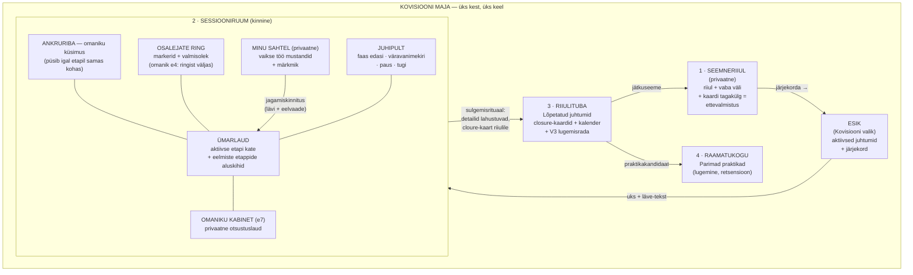

# Fable 5: Kovisiooni tervikvoo teadmistekaart ja sihtkontroll

Kuupäev: 14.07.2026 (õhtu)
Koostaja: Fable 5
Staatus: **COMPLETE** — kogu määratud sihtkontroll lõpetatud; eraldi piirangud on loetletud peatükis 11.
Ülesanne: teadmistekaardi sihtkontroll — tehniline verifitseerimine aktiivse `main`-i vastu (mitte uus täismahus audit). Rakenduskoodi ei muudetud.
Kontrollitud rada:

```text
Teemaseeme → Kovisiooni sessiooni etapid 1–8 → etapi 8 atomaarne sulgemine
→ Lõpetatud juhtum → järeltegevus või jätkamine → parima praktika kandidaat
→ retsensendi töövoog → avaldamine → RAG-sünk
```

Tõendusastmed: **[KOOD]** staatiliselt loetud · **[TEST]** käivitatud automaattest · **[RUNTIME]** töötava rakenduse API vastu autenditud sessiooniga kontrollitud · **[DB]** andmebaasist otse kinnitatud · **[LAHTINE]** selles keskkonnas ei olnud võimalik kontrollida.

Kontrollikeskkond: `main` @ `80848212` (puhas tööpuu, võrdne `origin/main`-iga); lokaalne dev-server pordil 3000; PostgreSQL `localhost:5432/sotsiaal_ai`; kaks olemasolevat testkontot (`codex.spatial.test@local.invalid` = juhtumi omanik/autor A, `claude.admin@sotsiaal.ai` = retsensent/avaldaja B); sisselogimine repo enda `LoginTempToken` mehhanismiga. RAG-teenuse võtit keskkonnas ei ole (RAG-sünk kontrollitud võtmeta-haruni). Kõik loodud sünteetilised andmed kustutati kontrolli lõpus (ptk 10).

---

## 1. Kokkuvõte

**Kontrollitud rada töötab otsast lõpuni ja on serveris jõustatud kuni avaldamise ning RAG-tööjärjekorra ohutu võtmeta `skipped`-haruni.** Päris RAG-ingest võtmega keskkonnas jäi selle kontrolli ulatusest välja ja on eraldi märgitud peatükis 11. Kõik kaheksa sessioonietappi on ehitatud serveripoolsete väravatega; etapi 8 lõpetamine teeb atomaarse sulgemise, mis ühes tehingus loob üldistatud lõpptulemuse (closure + järeltegevus + omanikupakk + soovi korral praktikakandidaat), muudab seemne olekut ja **kustutab sessiooni detailandmed** (privaatsuse-by-design). Lõpetatud juhtumi elutsükkel (järeltegevus → otsus → jätkuseeme/sulgemine/arhiiv) ja parima praktika retsensendiahel (võimekused → määrangud → 3 rolli heakskiit → avaldamine → versioonisnapshot → RAG-tööjärjekord) töötavad versioonikindlalt. Omaniku-/osalejapiirded pidasid kõigil IDOR-sondidel (ka ADMIN ei möödu). 265/265 sihttesti on rohelised.

Varasem teadmus („etapid 1–4 ehitatud, 5–8 platseholderid; demo-lõuend") on **aegunud** — vana `CovisionSession.jsx` on importimata surnud kood; aktiivne UI on `CovisionWorkspace`, mis töötab päris andmekihiga.

Leiti 2 väikest koodileidu (P3), 1 keskkonnaleid (lahendatud kohapeal) ja 1 keskkonnapiirang — ükski ei katkesta rada ega leki andmeid (ptk 9).

---

## 2. Raja arhitektuurikaart

### 2.1. Andmemudelid (prisma/schema.prisma) **[KOOD]**

| Mudel | Roll rajas | Võtmeväljad |
|---|---|---|
| `TopicSeed` (:1943) | omaniku privaatne ettevalmistus | `status` DRAFT→WAITING→IN_COVISION→FOLLOW_UP→CLOSED; `sharedCardSnapshot` (külmutatud kaart); `ownerConfirmedAt`; `covisionCaseId @unique` |
| `CovisionCase` (:1971) | juhtum | `status` DRAFT/ACTIVE/SUMMARY_READY/CLOSED/ARCHIVED; `anonymityConfirmedAt`; seosed `sessionState`, `closure`, `sourceTopicSeed` |
| `CovisionSessionState` (:2090) | serveri omanduses sessiooniseis | `stage` 1–8, `phase`, **`version` (CAS)**, `caseConfirmedAt`, `settingsConfirmedAt`, paus |
| `CovisionParticipantState` (:2116) | osaleja valmisolek | presentAt / roleConfirmedAt / agreementConfirmedAt / readyAt |
| `CovisionWorkItem` (:2133) | jagatud tööobjektid etapi kaupa | kind/status/visibility, autor-osaleja |
| `CovisionPrivateState` (:2157) | privaatsed mustandid/otsused kasutaja kaupa | `@@unique([sessionId,userId,stage,kind])`; serializer laadib ainult aktiivse vaataja omad |
| `CovisionStageSnapshot` (:2176) | etapi lõpetamise külmutatud tõend | `@@unique([sessionId,stage])`, payload, completedBy |
| `CovisionClosure` (:2197) | üldistatud lõpptulemus | generalizedTitle/workFocus/selectedDirection/nextStep/timeframe/progressMarker; `lifecycleStatus`; `practiceStatus`; `retentionStatus`; **`version` (CAS)**; `continuationTopicSeedId @unique` |
| `CovisionFollowUp` (:2240) | järeltegevused | SCHEDULED/COMPLETED/RESCHEDULED/CANCELLED; tulemusevaljad |
| `CovisionOwnerPackage` (:2268) | omaniku kinnitatud pakk | content JSON (ainult valitud väljad) |
| `EffectivePractice` (:2322) | praktikakandidaat/avaldatud praktika | `status` DRAFT→SUBMITTED→IN_REVIEW→READY_TO_PUBLISH→PUBLISHED (+NEEDS_CHANGES/RE_REVIEW/HIDDEN/ARCHIVED); `version` + `contentVersion` + `publishedVersion`; `ownerConfirmedNoIdentifiers*`; `ragSourceId/ragMetadata`; `sourceClosureId @unique` |
| `PracticeCapability` (:2382) | retsensendivõimekus | REVIEWER/ETHICS/EDITOR/APPROVER; validUntil; grantBasis; revokedAt |
| `EffectivePracticeReviewAssignment` (:2426) | määrang | `@@unique([practiceId,reviewerId,capabilityType,contentVersion])` |
| `EffectivePracticeReview` (:2403) | otsus | APPROVED/NEEDS_CHANGES/DECLINED/CONFLICT + conflictStatus |
| `EffectivePracticeVersion` (:2447) | muutumatu avaldamissnapshot | `@@unique([practiceId,version])`, publicSnapshot, reviewRoles |
| `EffectivePracticeApplication`, `PracticeCapabilityAudit`, `EffectivePracticeAuditEvent` | rakendamiskogemused, võimekuste audit, praktika auditijada | — |

### 2.2. Teenused (lib/) **[KOOD]**

- `topicSeeds.js` (392 r) — omanik-ainult CRUD; `queueTopicSeed` = DRAFT→WAITING atomaarne CAS + kohustuslik `confirmedNoIdentifiers` + külmutatud `sharedCardSnapshot`; idempotentne kordus.
- `covisionSessionShared.js` (939 r) — **kõigi 8 etapi faasikataloog** (`COVISION_STAGE_PHASES`), edasiliikumise rajad (`COVISION_STAGE_PROGRESS_PHASES`), lõpetamisfaasid, etapi tööobjektiliikide whitelist'id, **etapiväravad `gateStageOne..Eight`** + `assertCovisionStageGate` (409 `stage_gate` + `missing[]`).
- `covisionSession.js` (1284 r) — `startCovisionFromTopicSeed` (advisory-lock tehing: case+OWNER-osaleja+session+seed IN_COVISION, idempotentne; :530–603); `applyCovisionSessionAction` (12 actionit; **`pg_advisory_xact_lock` juhtumi kaupa + `bumpSession` updateMany-CAS versioonil**; :1031–1284); `buildServerStageGateState` — **COMPLETE_STAGE tõendid arvutatakse serveris DB-st, kliendi evidence'it ei usaldata** (:826–941); post-sulgemise lukk (`SESSION_STAGE_WORK_COMPLETED`, :1044–1049); `assertCovisionCreator` (ADMIN|SOCIAL_WORKER; :258–262).
- `covisionCompletedCases.js` (962 r) — `createClosureFromStageSnapshotsTx` (:600–688): closure ainult etappide 2/3/7/8 snapshotite whitelist-väljadest + omanikukinnituste kontroll (:524–529); **`purgeSessionDetailTx`** (:551–591): kustutab privaatseisud, tööobjektid, etappide 1–7 snapshotid, sõnumid, osapooled, sammud, riskid, kokkuvõtte, COVISION-kõned; asendab etapi 8 snapshoti markeriga `{stage:8, closureCreated:true}`; tühjendab juhtumi sisuväljad ja asendab pealkirja üldistatuga; juhtum → CLOSED. Elutsükkel: `updateCompletedCaseFollowUp` (complete→DECISION_PENDING; reschedule), `decideCompletedCase` (close / new_follow_up / **continue → uus jätku-TopicSeed DRAFT + CONTINUATION_PENDING + vana seeme CLOSED** / practice_candidate), `archiveCompletedCase`; kõik closure-`version` CAS + advisory lock.
- `effectivePractices.js` (2331 r) — `createPracticeDraftFromClosureTx` (:2221): kandidaat **ainult closure'i üldistatud väljadest**, idempotentne `sourceClosureId` kaudu; `candidateReady` (:184) + `containsDirectIdentifier` (regexid e-post/telefon/isikukood, :206); submit → `assignReviewersTx` (REVIEWER/ETHICS/EDITOR aktiivsete võimekustega, autor välistatud, HIGH-risk 2 eri REVIEWER-it; :255); review nõuab ASSIGNED määrangut sama `contentVersion`-iga + `conflictStatus`; heakskiidulävi 3 rolli (:1343–1351); publish: APPROVER, mitte autor ega allikjuhtumi osaleja, anonüümsuskontroll sama contentVersion, `nextReviewAt` kohustuslik, versioonisnapshot + RAG-guard-job (:1372–1461); `processRagIngest` püsiv retry-job (versioonivalve, superseded-koristus, idempotentne linkimine; :829–939); review-scheduler (advisory lock, REVIEW_DUE/ASSIGNMENT_OVERDUE markerid; :946+).
- `covisionKnowledge.js` — legacy `EffectivePractice→RAG` sünk (PUBLISHED→ingest, peidetud→delete).

### 2.3. API-marsruudid ja lehed **[KOOD]**

- Seemned: `GET/POST /api/topic-seeds`, `PATCH /api/topic-seeds/[id]`, `POST /api/topic-seeds/[id]/queue`, `POST /api/topic-seeds/[id]/covision` — kõik `requireCovisionAuth` taga; start lisaks `assertCovisionCreator`.
- Sessioon: `GET /api/covision/[id]/session`, `POST /api/covision/[id]/session/actions`; varu-sulgemistee `POST /api/covision/[id]/close` (idempotentne; nõuab phase=complete + stage-8 snapshotit).
- Lõpetatud: `GET /api/covision/completed`, `GET /api/covision/completed/[id]`, `PATCH …/follow-up`, `POST …/decision`, `POST …/archive`.
- Praktikad: `GET/POST /api/effective-practices`, `GET/PATCH /api/effective-practices/[id]`, `POST …/[id]/actions` (submit/review/publish/archive/re_review), `…/applications`, `GET/POST …/capabilities` (POST = ainult admin); auth = sama `requireCovisionAuth` (re-export `requireEffectivePracticeAuth`).
- Lehed: `/teemaseemned`, `/kovisioon` (→ `CovisionPage` → **`CovisionWorkspace`**), `/lopetatud-juhtumid` (`CompletedCasesPage`), `/parimad-praktikad` (`EffectivePracticesPage`) — kõigil serveripoolne sessiooni + `canUseCovisionRole` värav (redirect). Vana `CovisionSession.jsx` demo-komponenti ei impordi ükski fail → surnud kood.

---

## 3. Sessioonimasin: 8 etappi **[KOOD + RUNTIME]**

- Faasid on etapi kaupa fikseeritud kataloogis; `SET_PHASE` lubab liikuda ainult mööda edasirada sammu kaupa (`normalizePhaseTransition`, covisionSession.js:204–215) — hüpped → 409 `PHASE_TRANSITION_CONFLICT`.
- `COMPLETE_STAGE` nõuab: payload.stage == sessiooni stage, payload.phase == sessiooni phase == etapi lõpetamisfaas; **tõendid arvutatakse serveris** (jagatud tööobjektid + omaniku privaatseisud + osalejate valmisolek); värav 409 + `missing[]` loendiga; snapshot on unikaalne (topeltlõpetamine → `STAGE_ALREADY_COMPLETED`).
- Väravate sisu (valik): etapp 1 — kõik osalejad present+roll+kokkulepe+valmis, juhtum ja seaded kinnitatud; etapp 2 — jagatud `case_anchor` + omaniku pildi/fookuse kinnitus + privaatsuse ülevaatus (SUMMARY_REVIEWER-i olemasolul tema oma); etapp 6 — kriitilised eeldused lahendatud; etapp 7 — suund+järgmine samm (**ainult omaniku mõjuulatuses**, `actorType=owner`)+ajaraam+edenemismärk+järeltegevus+omaniku kinnitus, mis peab olema **värskem kui viimane muudatus** (`stageSevenOwnerConfirmationIsFresh`, :792–810); etapp 8 — pakk+järeltegevus+üldistamis-/õppimis-/säilitus-/praktikaotsus+lõppkinnitus, otsuste juurde nõutavad tööobjektid (owner_package, group_generalization, practice_candidate_decision).
- Rollid: LEADER (OWNER/CO_MODERATOR) juhib faase/lõpetamist/kutseid; OBSERVER saab ainult kinnitada; kutsumata/ACCEPTED-ta kasutaja ei saa muteerida; omanikku ei saa kutsuda osalejaks; korraga üks `active` tööobjekt etapis.
- Runtime: kogu jada START_SESSION → CONFIRM_SETTINGS → CONFIRM_CASE → CONFIRM_PARTICIPANT → faasid → COMPLETE_STAGE × 8 läbiti versioonidega v0→v95; iga vahe-COMPLETE viis järgmise etapi algfaasi; etapi 8 COMPLETE → `phase="complete"`. **[RUNTIME]**

## 4. Atomaarne sulgemine ja purge **[KOOD + RUNTIME + DB]**

Etapi 8 `COMPLETE_STAGE` kutsub samas advisory-lock tehingus `createClosureFromStageSnapshotsTx`. Tulemus (runtime + DB kinnitus):

- `CovisionClosure`: FOLLOW_UP_PENDING; väljad täpselt etappide 3/8 (workFocus/generalizedTitle) ja 7 (suund/samm/ajaraam/märk/järeltegevus) snapshotitest; `practiceStatus=PRIVATE_DRAFT` (kuna otsus `create_draft`); `retentionStatus=RETAINED_SELECTED_OUTPUT`; järeltegevus SCHEDULED (kuupäev „28.07.2026" parsiti `scheduledFor`-iks); omanikupakk CONFIRMED (ainult 5 valitud välja).
- `EffectivePractice` DRAFT loodi closure'i üldistatud väljadest (autor = juhtumi omanik; `sourceClosureId` unikaalne → idempotentne).
- Seeme → `FOLLOW_UP`.
- **Purge (DB-st kinnitatud):** workItems 0, privateStates 0, snapshotid ainult `{stage:8, closureCreated:true}`, sõnumid / juhtumiosalised (`CovisionParty`) / sammud / riskid / kokkuvõte / kõned 0; juhtumi `summary/anonymizedDescription/centralQuestion=null`, `topics/tags/expectedHelpTypes=[]`, `sourcePreInquiryId=null`, pealkiri = üldistatud pealkiri, staatus CLOSED. Sessiooniosalejad (`CovisionParticipant`) jäävad closure'i õiguste aluseks.
- Sulgemisjärgne suvaline action → 409 `SESSION_STAGE_WORK_COMPLETED`. **[RUNTIME]**

## 5. Lõpetatud juhtumi elutsükkel **[KOOD + RUNTIME]**

- Nähtavus: omanik või closure'i `assignedFollowUpUserId` + ACCEPTED-osaleja (`accessWhere/scopeWhere`); teine kasutaja (ka ADMIN): loend tühi, detail 404. **[RUNTIME]**
- Järeltegevuse lõpetamine: ainult omanik või aktiivne määratud täitja; `expectedVersion` CAS (vale → 409 **[RUNTIME]**); complete → DECISION_PENDING + tulemusevaljad. **[RUNTIME]**
- Otsus „continue": DECISION_PENDING|CONTINUATION_PENDING → loob **jätku-TopicSeed'i** (DRAFT, pealkiri üldistatud pealkirjast, `whyNow` = uus küsimus), closure → CONTINUATION_PENDING, vana seeme → CLOSED; idempotentne (`continuationTopicSeedId` olemasolul ei loo uut). **[RUNTIME]** — seemneloendis olid pärast: algne CLOSED + jätkuseeme DRAFT.
- Otsused „close" (põhjendusega, juhtum+seeme CLOSED), „new_follow_up", „practice_candidate" (idempotentne draft) ja „archive" (ainult CLOSED|CONTINUATION_PENDING pealt) — **[KOOD]**, kaetud testidega (completedCasesService/RouteContract).

## 6. Praktika: retsensendi töövoog → avaldamine → RAG **[KOOD + TEST + RUNTIME]**

Runtime-jada (autor A = SOCIAL_WORKER, retsensent/avaldaja B):

1. Admin GRANT B-le REVIEWER+EDITOR+ETHICS+APPROVER (tähtaeg + alus kohustuslikud) → 4×OK. GRANT/REVOKE on ainult admin; auditikirjed tekkisid.
2. A täiendas kandidaati (conditions+limitations) + `ownerConfirmedNoIdentifiers:true` → version/contentVersion tõusid; sisumuutus nullib anonüümsuskinnituse ja -kontrolli (versioonipõhine leping).
3. A `submit` → SUBMITTED; **3 määrangut** (REVIEWER/EDITOR/ETHICS, contentVersion 2) tekkisid B-le.
4. B `review` APPROVED×3 (`conflictStatus:"NONE"` kohustuslik): REVIEWER→IN_REVIEW, EDITOR→IN_REVIEW, ETHICS→**READY_TO_PUBLISH** (3 rolli lävi; ETHICS täitis ühtlasi anonüümsuskontrolli).
5. Negatiiv: **A `publish` → 403** (SELF_PUBLISH_FORBIDDEN).
6. B `publish` (nextReviewAt 2027-01-15) → **PUBLISHED, publishedVersion=1**; `EffectivePracticeVersion` v1 muutumatu snapshot rollidega [REVIEWER, EDITOR, ETHICS]; auditijada SUBMITTED→3×REVIEW_APPROVED→PUBLISHED; määrangud COMPLETED. **[DB]**
7. RAG: võtmeta keskkonnas `ragMetadata={syncStatus:"skipped", reason:"rag_key_missing", publishedVersion:1}`, `ragSourceId=null`; publish'i loodud guard-job (`RAG_DELETE`, externalRef = deterministlik `effective-practice::<publicId>::v1`) suleti `done`. Võtmega keskkonnas sama tee → `/ingest/text` + püsiv retry (`processRagIngest`: versioonivalve, superseded→delete-koristus, `PUBLISH_LINK_STALE` kaitse) — **[KOOD+TEST]** (`ragIngestRetry.test.js`); päris ingest **[LAHTINE]** (võti puudub).
8. Negatiiv: **A `archive` PUBLISHED pealt → 409** (PUBLISHED_ARCHIVE_REQUIRES_REVIEW); tagasivõtutee on ETHICS-võimekusega `re_review` (→ RAG removal_pending + uus retsensiooniring) **[KOOD]**.

Huvide konflikt: allikjuhtumi osaleja ei saa retsenseerida ilma `conflictStatus=DECLINED`-ita ega olla APPROVER (`sourceCaseParticipantTx`); assignment-repair (P1) parandab autor-retsensendi vastuolud **[KOOD+TEST]**.

## 7. Õiguste piirid (IDOR-sondid) **[RUNTIME]**

| Sond (kasutaja B = ADMIN, mitteosaleja) | Tulemus |
|---|---|
| GET võõra juhtumi sessioon / juhtum | 404 / 404 |
| PATCH võõras seeme; B seemneloend | 404; ainult enda (0) |
| GET võõras closure-loend / detail; PATCH follow-up | tühi / 404 / 404 |
| POST decision võõral closure'il | 404 |
| Autentimata: topic-seeds / covision / completed / effective-practices | 401 kõikjal |
| Kandidaadi detail: võõras ilma määranguta | 404 (`capabilityCanReadCandidate`) **[KOOD]** |

Privaatseisude leke: sessiooni serializer laadib `privateStates` ainult `where:{userId}` (covisionSession.js:352–355) — teise osaleja privaatala ei välju kunagi **[KOOD]**; kaetud `workspaceServerPrivacy.test.js`-ga.

## 8. Testid **[TEST]**

`node --import ./scripts/register-node-test-loader.mjs --test "tests/topicSeeds/**/*.test.js" "tests/covision/**/*.test.js" "tests/effectivePractices/**/*.test.js"` → **265 pass / 0 fail** (~0,9 s). Katvus: sessionMachine/Schema/Service/RouteContract, completedCases (schema/service/route/klient), workspaceServerPrivacy, liveSession, preInquiryCovisionInput, knowledge (RAG-tekst), legacyWriteLifecycle, uiConcurrency; effectivePractices contract/service, assignmentRepair, ragIngestRetry, reviewScheduler, justificationHistory, accountDeletion, deployGate; topicSeeds klient-leping. (NB: glob peab olema `**/*.test.js` — paljas `**` haarab kataloogid ja raporteerib valefaile.)

## 9. Leiud

1. **KOV-ENV-1 (Keskkond — LAHENDATUD kohapeal).** Lokaalne dev-DB oli `main`-ist 6 migratsiooni maas (`wellbeing_covision_handoff`, U3, U8-lite, P1, U4, U1/U2) → mh `GET /api/service-map/entries` 500 ja `User`-update'ide `42703 notificationEmailEnabled`. Rakendasin `npx prisma migrate deploy` → 92/92, „Database schema is up to date"; service-map → 200. Reegel: pärast main-i uuendust jooksuta lokaalis migratsioonid. Kontrollitav rada ise neist migratsioonidest ei sõltunud (kõik voog töötas ka enne).
2. **KOV-P3-1 (P3 — rolliebasümmeetria praktika-autorluses).** `assertCovisionCreator` lubab ADMIN-il olla juhtumi omanik (lib/covisionSession.js:258–262) ja sulgemine loob talle praktikakandidaadi, kuid effective-practices autoriteed nõuavad rolli SOCIAL_WORKER|SERVICE_PROVIDER (lib/effectivePractices.js: createCandidate :1142, updateCandidate :1165, getDetail autoriharu :1213, submit :1223) → **ADMIN-autor saab omaenda kandidaadile 404 ega saa seda esitada**. Runtime-tõend: ADMIN-ina GET kandidaat → 404; sama kasutaja SOCIAL_WORKER-ina → kind:candidate. Mõjutab ainult admin-kontosid (test-/halduskasutus); tavaautoritel probleemi pole. Otsustada: kas ühtlustada (lubada adminile autorivaade) või keelata adminil kovisiooni omanikuks olemine.
3. **KOV-P3-2 (P3 — lehevärava streaming-redirect).** Autentimata `GET /teemaseemned|/kovisioon|/lopetatud-juhtumid|/parimad-praktikad` → HTTP **200**, mille kehas on NEXT_REDIRECT-marker (`/vestlus?login=1`) + lehe staatiline SSR-shell (nupunimed, 0-loendurid; ~400 KB). Andmeid ei leki — kirjed laaditakse ainult autenditud API-dest (401) ja SSR ei sisalda ühtegi kirjet — kuid puhas 307 eeldaks sessioonikontrolli enne esimest flush'i. Tõend: `curl -s /teemaseemned` → size≈406k, `NEXT_REDIRECT|login=1`=5 vastet, „Uus teemaseeme"=3 vastet.
4. **KOV-LIMIT-1 (Keskkonnapiirang — mitte koodileid).** Claude'i brauseripaanis selle rakenduse route-segmentide klient-hüdratsioon ei käivitu (nuppudel puudub `__reactProps`, React-efektid/fetch'id ei jookse, loendurid jäävad SSR-0 olekusse; konsool puhas). Seetõttu piirdus UI-kiht siin SSR-DOM-i ja API-dega; lõuendi visuaalne käitumine on varasemates sessioonides päris brauseris kinnitatud. (Seostub teadaoleva paani-screenshotide timeout-probleemiga ruumi-tausta lehtedel.)
5. **KOV-NOTE-1 (Märkus, mitte leid).** `review`-action nõuab `conflictStatus` välja ka APPROVED puhul (lib/effectivePractices.js:1269–1271) — teadlik lepingudisain (huvide konflikti deklaratsioon on kohustuslik), API-kasutajal lihtsalt teada.

## 10. Sünteetilised andmed ja koristus

Loodud ja **kustutatud**: 1 TopicSeed + 1 jätku-TopicSeed; 1 CovisionCase (+osaleja, sessioon, snapshotid — cascade); 1 CovisionClosure (+2 FollowUp kirjet, OwnerPackage — cascade); 1 EffectivePractice (+3 määrangut, 3 review'd, 1 versioon, auditikirjed — cascade) + 2 DataDeletionJob rida; 4 PracticeCapability + 4 auditikirjet; 7 LoginTempTokenit; NotificationEvent'e ei tekkinud (0). Kasutaja `codex.spatial.test` roll taastati ADMIN-iks (oli kontrolli ajaks SOCIAL_WORKER, et autor-rada oleks realistlik). Jääkide kontroll: seemned/juhtumid/closure'id/praktikad/võimekused = 0. Rakenduskoodi ei muudetud (`git status`: ainult dokumendifailid). Püsiv keskkonna­muudatus: lokaalse DB 6 puuduvat migratsiooni rakendatud (leid 1) — see viib dev-keskkonna main-iga kooskõlla ega ole testandmete jääk.

## 11. Mida see kontroll EI kata

- RAG-i päris ingest/eemaldus võtmega keskkonnas (siin ainult `skipped`-haru + testid); AI-assist (`/api/covision/assist`) sisu; kõned/LiveKit (COVISION-kõnede API on olemas, provider konfigureerimata); mitme päris osaleja samaaegne sessioon (concurrency on kaetud CAS/lock-testidega, mitte mitme brauseriga); UI piksli-/interaktsioonikiht (leid 4); review-scheduler'i ja U1-teavituste käitumine timeriga (P1/U1 auditid katsid need eraldi).

---

*Iga väide viitab failile/reale või on märgitud RUNTIME/DB/TEST tõendiga; runtime-jada täpsed sammud (versioonid v0→v95, staatusekoodid) on selle sessiooni transcriptis. See dokument on teadmistekaardi (fable-5-uue-akna-orientatsioon-ja-teadmistekaart.md, ptk 8) laiendus Kovisiooni tervikvoo kohta.*

---

## KOV-Q1 — Kovisiooni metodoloogiline alus

Kuupäev: 14.07.2026 (hilisõhtu)
Koostaja: Fable 5
Staatus: **COMPLETE** — kõik neli määratud metodoloogilist allikat on täies mahus läbi töötatud.
Ülesanne: vastata ühele küsimusele — **milline on nelja metodoloogilise allika põhjal Kovisiooni tuum, mida digitaalne ja tulevane ruumiline kasutajaliides ei tohi moonutada ega kaotada.** See peatükk on metodoloogiline alusdokument, mitte tehniline audit (see on ptk 1–11) ega ruumilise disaini ettepanek (see tuleb eraldi sammuna).

**Allikad** (kõik loetud täies mahus; viitelühendid kehtivad selles peatükis):

| Lühend | Allikas | Iseloom | Viitamine |
|---|---|---|---|
| **[PJ]** | `Kovisioon – praktiline juhend kolleegidevahelise nõustamise korraldamiseks.pdf` — Erasmus+ INDIVERSO, Josefsheim gGmbH / M. Künemund, august 2017; protsessikirjeldus dr K.-O. Tietze, rakendusskeem R. Zeiler (2012) | lühike praktiline juhend (10 lk), kutseõppe/rehabilitatsiooni kontekst; ainus allikas, mis loetleb eksplitsiitselt meetodi **piirid** | lk nr |
| **[KJ]** | `kovisiooni-juhend.docx` — mahukas 8-peatükiline käsiraamat (olemus ja mõju; juhtideta juhtimine; grupiprotsess; suhtlemiskunst; küsimused; sessiooni juhtimine; 15+ mudelit; kovisioonisüsteem) | kõige põhjalikum ja rangeim coaching-paradigma allikas; autor kirjeldab end ESCÜ presidendiks valitud koolitajana — sisu kattub S. Vesso „Kovisiooni käsiraamatu“ (2020) ainestikuga [TULETIS] | ptk nr (failis pole lk-numbreid) |
| **[LK]** | `Kovisiooni-juhend-lastekaitsetootajatele.pdf` — S. Roots, Sotsiaalkindlustusamet 2025 | sotsiaalvaldkonna (lastekaitse) ametlik juhend, 15 lk, töölehtedega; sihtrühmalt platvormile kõige lähem | lk nr |
| **[BM]** | `Kuidas käib kovisiooni baasmudel.pdf` — A. Kaljakin, allankaljakin.eu | veebiartikkel (5 lk), baasmudeli (incident method) kompaktseim kirjeldus; mainib otse virtuaalset läbiviimist | lk nr |

Märgis **[TULETIS]** tähistab järeldust, mida ükski allikas otse ei ütle (nt AI-võrdlus), kuid mis tuleneb allikate põhimõtetest. Platvormi vasted on nimetatud ainult sidumiseks — nende tehniline seis on tõendatud ptk 1–11 ja seda siin ei korrata.

### Q1.0 Metodoloogiline tuum — invariandid, mida ükski liides ei tohi murda

Nelja allika ühisosa kokku võttes on Kovisiooni tuum **kaksteist invarianti**. Kõik ülejäänud (mudelivalik, etappide arv, ajaraamid, abivahendid) on kokkuleppe küsimus; need kaksteist ei ole.

1. **Struktuur ON meetod, mitte pakend.** Kovisiooni eristab vabast vestlusest just kokkulepitud etapiline struktuur, kus igal etapil on oma aeg ja fookus ([KJ] ptk 6: „Struktuur pole mõeldud osalejate ahistamiseks, vaid eelkõige tõhususe jaoks. Kõige ebatõhusamad on üldse ilma struktuurita arutelud“; [PJ] lk 5; [BM] lk 1). Empiiriline tugi: ainult *struktureeritud* (ametlik) kovisioon seostub parema stressiga toimetulekuga; vaba tööteemaline suhtlus mitte (T. Peiteli 2017 magistritöö viide, [KJ] ptk 8).
2. **Juhtumiomanik on oma loo ja lahenduse ainuekspert.** Grupp laiendab vaatenurki, kuid otsuse teeb ja lahenduse konstrueerib omanik ise; on täiesti aktsepteeritav, et ta ei kasuta ühtegi grupi ideed ([BM] lk 3; [PJ] lk 5, 8; [KJ] ptk 2 ja 6). Ta ei pea midagi õigustama ([PJ] lk 8) ja võib jätta küsimusele vastamata ([KJ] ptk 7).
3. **Nõu ei anta — jagatakse oma kogemust.** Lahendused sõnastatakse vormis „MINA teeksin…“, mitte „Sina peaksid…“ ([KJ] ptk 6; [LK] lk 7; [BM] lk 3). „Kõige suurem lõks kovisioonis on eksperdi rolli lõks“ ([KJ] ptk 4). ([PJ] keelekasutus on siin leebem — vt Q1.11.)
4. **Etapid on eraldatud: uurimine enne lahendusi.** Küsimuste etapis ei tohi peita soovitusi; lahenduste pakkumine enne uurimisfaasi lõppu on protsessiviga, millesse protsessijuht sekkub ([KJ] ptk 6; [PJ] lk 7; [LK] lk 7; [BM] lk 2–3).
5. **Kirjalik-vaikne individuaaltöö enne jagamist.** Küsimused ja lahendused pannakse esmalt vaikides kirja ja alles siis jagatakse — see annab võrdse aja, väldib grupimõtlemist ja tagab, et „ka kõige vaiksem grupiliige saab oma küsimuse esitatud ja lahenduse pakutud“ ([BM] lk 3; [KJ] ptk 6–7). [BM] lk 2 nimetab virtuaalse sessiooni vestlusakent selle otsese ekvivalendina.
6. **Hinnanguvabadus — ka varjatud kujul.** Ettepanekuid ei kommenteerita ega hinnata; hinnanguline on ka grimass, hääletoon, sildistamine, diagnoosimine ja isegi **kiitmine** probleemi jagamise peale ([KJ] ptk 4, R. Boltoni järgi; [LK] lk 3; [BM] lk 3–4). Ainus ette nähtud vastus panusele on „tänan“ ([KJ] ptk 6; [BM] lk 3).
7. **Võrdsus ja roteerumine.** Osalejad on sama hierarhiatasandi kolleegid; juhtimisrollid käivad ringi; püsirollidega grupp „kaotab aja jooksul oma efektiivsuse ja loovuse“ ([PJ] lk 8; [KJ] ptk 1–2; [LK] lk 10). Ülemuse kohalolu ja konkurentsisurve pärsivad avatust ([PJ] lk 9; [KJ] ptk 8).
8. **Vabatahtlikkus ja teadlik pühendumine.** Osalemist ei saa sundida; grupp sõlmib koostöölepingu ja grupikokkulepped, mille iga liige on läbi arutanud ja omaks võtnud ([PJ] lk 9; [KJ] ptk 3; [LK] lk 8, 13).
9. **Konfidentsiaalsus ja kinnine grupp.** Juhtumeid käsitletakse konfidentsiaalselt; grupp on püsiva koosseisuga ja kinnine; külaline ainult siis, kui see sobib kõigile; talletatakse ainult üldistatud jälg (kuupäev, osalejad, tööviis, teemad üldistatult), mitte juhtumi sisu ([PJ] lk 9; [KJ] ptk 3 ja 8, ESCÜ protokollinäide; [LK] lk 8–9).
10. **Refleksioon on võtmetegevus ja õppimine on kahesuunaline.** Sessioon lõpeb alati lõpuringiga, kus **iga** osaleja sõnastab oma õppimise; pärast omaniku kokkuvõtet juhtumit edasi ei lahendata ([KJ] ptk 1 ja 6–7: „Kogemus ilma mõtestamiseta on raiskamine“; [BM] lk 3; [LK] lk 7, 10, 14).
11. **Regulaarsus ja protsessilisus.** Kovisioon on korduv grupiprotsess samade osalejatega, mitte üksiksündmus; järgmisel kohtumisel vaadatakse, „kuidas on vahepeal läinud“ ([KJ] ptk 1 ja 3; [PJ] lk 10: mitte harvem kui 4 nädala tagant; [LK] lk 4, 10).
12. **Selged piirid:** ainult tööalased, omaniku enda reaalsed juhtumid; mitte teraapia, mitte suurte erimeelsuste ega grupisiseste konfliktide lahendamise koht; ei asenda koolitust ega supervisiooni ([PJ] lk 9; [KJ] ptk 1 ja 6).

### Q1.1 Kovisiooni eesmärk ja piirid

**Eesmärk.** Kõik neli allikat defineerivad kovisiooni sama viie tunnusega ([KJ] ptk 1 ja [LK] lk 3 sõna-sõnalt kattuvana): kokkulepitud formaadi alusel, sarnast tööd tegevate professionaalide grupis toimuv, refleksioonile suunatud õppimise protsess, eesmärgiga saada endast teadlikumaks ja leida lahendusi tööga seotud probleemidele ja väljakutsetele. Konkreetsemad sihid: õppida tundma iseennast ja oma reaktsioone, saada teadlikumaks oma tööalasest käitumisest, muuta mittetoimivaid mustreid, tulla paremini toime töösituatsioonidega ([BM] lk 2); emotsionaalne ja professionaalne tugi, läbipõlemise ennetamine, professionaalse mõtlemise areng ([LK] lk 3; [KJ] ptk 1 — kuulumine, võimestamine, eesmärkide tugi); murekoormast vabanemine ([PJ] lk 9).

**Sisulised piirid** (rikkumine muudab tegevuse millekski muuks kui kovisioon):

- **Ainult tööalased juhtumid.** Isiklikud mured ilma ametialase seoseta ei kuulu kovisiooni ([PJ] lk 9).
- **Ainult omaniku enda, reaalsed juhtumid** — juhtunud või lähiajal juhtumas; omanik peab olema olukorraga isiklikult seotud ja siiralt huvitatud ([KJ] ptk 6). Juhtumitüüpe on neli: aktuaalne väljakutse, mineviku õnnestumine, mineviku keeruline olukord, soovitud tulevikuolukord ([KJ] ptk 6) — st ka edukogemus on täisväärtuslik juhtum ([LK] lk 10 soovitab tuua ka kahtlusi ja edulugusid).
- **Mitte teraapia ega ravi.** Osalejad ei ole kvalifitseeritud nõustajad ega terapeudid ega tohi pakkuda ravialast abi; sellised teemad vajavad professionaali või arsti ([PJ] lk 9).
- **Mitte konfliktilahenduse instrument.** Suurte erimeelsuste jaoks tuleb otsida välist abi; grupisiseste suhete, konfliktide ja koostöö teemadega kovisioonis ei tegeleta, sest siis oleksid kõik osalejad ise juhtumiomanikud ehk emotsionaalselt seotud ([PJ] lk 9; [KJ] ptk 1).
- **Ei asenda** ametialast koolitust ([PJ] lk 9) ega teisi arenguvorme — kovisioon *täiendab* neid ([KJ] ptk 3, koostöölepingu näidisprintsiip 4); supervisioonist eristab väljaõppinud juhendaja puudumine (vt Q1.8).
- **Vabatahtlikkus** on eeltingimus, mitte soovitus ([PJ] lk 9; [KJ] ptk 1 ja 3).

### Q1.2 Osalejate rollid ja vastutus

Rollide kataloog on allikates eri detailsusega, kuid sama loogikaga. Kõige täielikum on [KJ] ptk 2, mis eristab **kuut rolli kolmel juhtimistasandil** (kui mõni on läbi rääkimata, „hakkab see grupi tööd segama“):

| Tasand | Roll | Vastutus | Allikad |
|---|---|---|---|
| Süsteem | **Koordinaator** | kovisioonisüsteem organisatsioonis: koolitused, supervisioonid, tugi; ise grupis ei osale | [KJ] ptk 2 |
| Grupp | **Grupijuht** | grupi algatamine, koostööleping, vahekokkuvõtted; kontakt koordinaatoriga | [KJ] ptk 2; [LK] lk 8–9 |
| Kohtumine | **Kohtumise juht** | roteeruv; logistika (ruum, ring, vahendid) + tervikprotsess (päevakava, avaring, ajakava, kokkuvõte) | [KJ] ptk 2–3 |
| Sessioon | **Sessiooni juht / moderaator** | ühe juhtumi arutelu juhtimine kokkulepitud mudeli järgi; aja- ja reeglivalve; turvalise õhkkonna hoidmine; **ei tohi olla juhtumiomanik** | [KJ] ptk 2; [PJ] lk 7–8; [BM] lk 2 |
| Sessioon | **Juhtumiomanik** | toob juhtumi, sõnastab küsimuse, vastab, kuulab, valib lahenduse, teeb kokkuvõtte | kõik neli |
| Sessioon | **Grupiliige / nõustaja** | kuulab, küsib, reflekteerib, jagab oma kogemust; peab kinni kokkulepetest | kõik neli |
| (valikuline) | **Protokollija** | märgib üles pakutud ideed, et omanik saaks keskenduda kuulamisele | ainult [PJ] lk 7–8 |

Vastutuse põhimõtted:

- **Juhtimine on jagatud ja roteeruv.** Kovisioonigrupil pole hierarhilist juhti — „kõik grupi liikmed täidavad kordamööda liidri rolli“ ([KJ] ptk 2); rollid jagatakse enne iga uue juhtumi arutamist ümber ([PJ] lk 8; [LK] lk 10). [KJ] ptk 2 kirjeldab kolme legitiimset juhtimisvormi (täielikult roteeruv; püsiva grupijuhiga; välise juhendajaga alustamine) koos riskide ja maandustega — valik sõltub grupi kogemusest.
- **Kollektiivne vastutus kokkulepete eest.** Iga grupiliige vastutab grupi toimimise eest; juhtimise eest vastutatakse kollektiivselt ([KJ] ptk 3).
- **Protsessijuht on neutraalne.** Grupijuht/sessioonijuht „ei ole ekspert ega probleemilahendaja, vaid neutraalne protsessi juhtija“ ([LK] lk 8); ideaalis ei paku ta ise lahendusi ([PJ] lk 8; [KJ] ptk 2 lubab kaasalöömist ainult siis, kui metoodika on kõigile selge — juhirolli arvelt mitte kunagi). Tema tähtsaim omadus on kohalolek: „roll seisneb rohkem olemises kui tegemises“ ([KJ] ptk 2).
- **Juhtumiomanik „teeb kõik õigesti“** — ta on aktsepteeritud sellisena, nagu ta on; samas ei tohi ka tema võtta grupi suhtes eksperdipositsiooni ega halvustada pakutud ideid ([KJ] ptk 2).
- Platvormi rollivaste: OWNER/CO_MODERATOR (LEADER) ≈ sessioonijuhi funktsioon, osalejad ≈ grupiliikmed. Platvormi OBSERVER-il ja SUMMARY_REVIEWER-il allikates otsest vastet ei ole — lähim on külaline/väline juhendaja, kes on lubatud ainult kõigi nõusolekul ([KJ] ptk 3; [PJ] lk 10). See tähendab: vaatleja lisamine sessioonile on metodoloogiliselt konsensuse-, mitte omaniku otsus.

### Q1.3 Protsessi põhifaasid

Allikad kirjeldavad protsessi **kolmel pesastatud tasandil** ([KJ] ptk 2) — seda kihilisust ei tohi liides kokku suruda:

1. **Grupi tervikprotsess** (kuud–aastad): loomine → eesmärk ja koostööleping → regulaarsed kohtumised → vahehindamised → lõpetamine ([KJ] ptk 2–3, 8; [PJ] lk 10, Zeileri 7-astmeline kasutuselevõtuskeem; [LK] lk 8).
2. **Üks kohtumine** (1,5–3 h): soojendus ja häälestus → avaring „kuidas on vahepeal läinud“ (sh eelmiste juhtumiomanike järelkaja) → juhtumi(te) valik → 1–2 juhtumisessiooni → kohtumise kokkuvõte ([KJ] ptk 3; [LK] lk 4; [BM] lk 2 avaring). Soojendust ei tohi ära jätta — kontakti arvelt aja kokkuhoidmine viib selleni, et „kellelgi pole juhtumeid“ ([KJ] ptk 6).
3. **Üks juhtumisessioon** (45–90 min): siin elavad mudelid.

Juhtumisessiooni **makrofaasid on invariantsed**: minimaalselt **olukord → uurimine → lahendused** ([KJ] ptk 6; [LK] lk 4), täiskujul kuus: olukord, küsimused, mõistmise süvendamine, lahendused, ressursid, õppimine ([KJ] ptk 6). Konkreetne mudel on kokkuleppe küsimus — [KJ] ptk 7 kirjeldab üle kümne mudeli (baasmudel, väljakutse-küsimustega, sokraatiline, ajurünnakuga, kliendi tugevustele suunatud, 10 sammu, konsultantide meeskond, ringlev diskussioon, rollikogemus, juhtumikliinik, kolm edumudelit, Gibbs, mõttekoda, GROW), [LK] lk 5–6 viit; kõik jaotuvad samadesse makrofaasidesse.

**Baasmudel** on kõigi nelja allika ühine tuummudel ja soovitatav alustuspunkt ([LK] lk 5: „Baasmudeliga on hea alustada“). Selle kanooniline kuju ([KJ] ptk 7, 8 etappi; sisult sama [BM] lk 2–3 ja [LK] lk 7):

| # | Etapp | Tuum | Aeg |
|---|---|---|---|
| 1 | Juhtumi kirjeldus ja küsimus | omanik räägib segamatult; sõnastab küsimuse „Kuidas…?“ ja **kirjutab selle nähtavale** | ~10 min |
| 2 | Grupiliikmete küsimused | **vaikides kirjalikult**, 1–2 küsimust; ainult küsimused, mitte varjatud soovitused | 3–5 min |
| 3 | Küsimustele vastamine | omanik vastab lühidalt; teemat ei arendata; korduvküsimustele teist korda ei vastata | ~10 min |
| 4 | Arutelu / refleksiooniring | omanik istub **eemale, kuulab, ei sekku**, teeb märkmeid; grupp avab loo kihte **ühisseisukohta otsimata**, hinnanguid andmata | ~10 min |
| 5 | Lahenduste kirjapanek | vaikides, vormis „MINA …“ | ~5 min |
| 6 | Lahenduste üleandmine | igaüks loeb ette (ka sarnased!) ja annab kirjapandu omanikule; omanik vastab ainult „tänan“ | 5–7 min |
| 7 | Juhtumiomaniku kokkuvõte | taipamised + järgmine samm; „vajan mõtlemisaega“ on täisväärtuslik vastus | 3–5 min |
| 8 | Grupiliikmete kokkuvõte (lõpuring) | iga osaleja oma õppimine; **juhtumit edasi ei lahendata, omanikule ideid ei lisata** | ~10 min |

Lisaetapp **jõustamine/ressursid** („Mina usun, et sa saavutad soovitu, sest …“) on [BM] lk 3 valikuline ja [KJ] ptk 6 sõnaselge soovitus *kõikide* mudelite juurde — platvormi 8-etapilise selgroo etapp 6 („Ressursid ja jõustamine“) on sellega kooskõlas.

Ajaraamid on osa meetodist (kindel ajaraam on baasmudeli tugevus, [BM] lk 3; kestused igas tabelis [PJ] lk 7, [LK] lk 7, [KJ] ptk 7), kuid neid valvab inimene (sessioonijuht), mitte kell iseseisvalt — vt Q1.10.

**Sügavuse kolm taset.** Sama mudel võib töötada kolmel sügavusel: 1) lahendused, 2) eneseteadlikkus, 3) transformatiivne muutus — sügavus sõltub grupi usaldusest ja refleksioonioskustest, mitte tööriistast; algajad alustavad tasemelt 1 ([KJ] ptk 6). Liides ei saa sügavust peale sundida — see kasvab grupiga.

### Q1.4 Juhtumi tooja, protsessi juhtija ja grupi ülesanded

**Juhtumiomanik (juhtumi tooja):**

- valmistab juhtumi ette, soovitatavalt kirjalikult (juhtumikirjeldus + toetavad küsimused: miks oluline, kes seotud, mida olen proovinud, mis on mu küsimus) ([KJ] ptk 6 ja 8) — platvormi Teemaseeme on selle ettevalmistuse digitaalne vorm;
- hindab avaringis oma motivatsiooni (nt skaala 1–10) juhtumi valimiseks ([BM] lk 2; [KJ] ptk 6);
- kirjeldab olukorda neutraalselt, lahendusi pakkumata ([LK] lk 7); sõnastab **ise** oma küsimuse — protsessijuhi (või kellegi teise) ümbersõnastus võib tabada valesti ja sulgeda omaniku ([KJ] ptk 6);
- vastab küsimustele lühidalt; võib jätta vastamata, kui vastus on liiga isiklik või pole veel küps ([KJ] ptk 7);
- refleksiooniringis kuulab eemal, sekkumata; lahenduste vastuvõtul tänab igaüht ilma kommenteerimata; kokkuvõttes sõnastab taipamised ja järgmise sammu; järgmisel kohtumisel jagab, kuidas on läinud ([KJ] ptk 3–4, 6; [BM] lk 3).

**Protsessi juhtija (sessioonijuht/moderaator):**

- tuletab enne igat etappi meelde selle eesmärgi ja reeglid („töösisend“) ([KJ] ptk 6);
- valvab aega ja mudelist kinnipidamist; sekkub kohe, kui ilmneb protsessi mittetoetav käitumine (hinnang, nõuanne küsimuse kujul, vaidlus, „agatamine“), kokkulepitud viisil (märk, sõna) ja ise hinnanguid andmata — „Ole vait!“ asemel „Aitäh, annan sõnajärje edasi“ ([KJ] ptk 2–3, 6);
- hoiab võrdset osalust ja hirmuvaba õhkkonda; loeb sessiooni lõpus rituaalid lõpuni (tänamised, lõpuring) ([KJ] ptk 6; [LK] lk 9);
- valmistab ette vahendid ja visuaalid (küsimus nähtaval, ideed kõigile näha) ([KJ] ptk 6);
- [PJ] lk 7 lisab: juhib meetodi valikut võtmeküsimuse jaoks ja langetab otsuse „kõikide osaliste heakskiidul“.

**Grupp (grupiliikmed):**

- annavad omanikule täieliku tähelepanu; kuulavad ka seda, mida ei öelda ([KJ] ptk 4 ja 7);
- kirjutavad küsimused ja lahendused vaikides valmis; loevad kõik ette, ka korduvad ([KJ] ptk 6);
- refleksiooniringis avavad loo eri kihte üksteise tähelepanekutele toetudes, ühisseisukohta otsimata; arvestavad, et info on paratamatult poolik, ja see on aktsepteeritud tööseisund ([KJ] ptk 6);
- jagavad lahendusi ainult „MINA …“ vormis ja oma kogemuse piirest; lõpuringis sõnastavad oma õppimise ([KJ] ptk 6–7);
- vastutavad ühiselt kokkulepete toimimise ja üksteise reeglipärase käitumise toetamise eest ([KJ] ptk 3).

### Q1.5 Küsimise, kuulamise, refleksiooni ja tagasiside põhimõtted

**Küsimine** ([KJ] ptk 5–6; [BM] lk 1):

- avatud küsimused on meetodi mootor — „ei anta nõu, vaid toetatakse arengut avatud küsimuste kaudu“ ([BM] lk 1);
- omaniku küsimus algab „KUIDAS…?“; „KAS…?“ ei sobi (grupp ei saa võtta omaniku eest vastutust) ja „MIKS ta nii käitus?“ ei sobi (otsitakse omaniku tegutsemisruumi, mitte teiste motiive) ([KJ] ptk 6);
- üks küsimus korraga; küsimusse ei peideta soovitust („Oled sa mõelnud, et võiksid…?“ on ettepanek, mitte küsimus) ([KJ] ptk 5–6);
- kirjalik sõnastamine enne esitamist teeb küsimuse täpsemaks ja maandab emotsioone ([KJ] ptk 6);
- hääletoon ja pehmendajad eristavad uurimist ülekuulamisest; omanik on ringis üksinda ja läheb järskude küsimuste peale kaitsesse ([KJ] ptk 5);
- skaalaküsimused (1–10) täpsustavad motivatsiooni, pühendumist ja edenemist ([KJ] ptk 5; [BM] lk 2);
- faktiküsimustest sügavamale viivad uurivad küsimused (olukord → omanik ise → lahendused; Diltsi tasandid keskkonnast missioonini) ([KJ] ptk 5).

**Kuulamine** ([KJ] ptk 4):

- väline kuulamine (fookus rääkijal, „tühi valge leht“) vs sisemine kuulamine (fookus iseendal) — kovisioon eeldab esimest;
- kuulatakse ka „sõnadetagust maailma“: keelekasutus, üldistused („alati“, „mitte kunagi“), valikute puudumise keel („pean“), piiravad uskumused;
- R. Boltoni kolm oskusrühma: tähelepanu väljendamine (kehahoiak, silmside, segajate vältimine — 85% suhtlusest on mitteverbaalne), jälgimisoskused (ukseavajad, väikesed julgustused, *vähesed* küsimused, tähelepanelik vaikimine), peegeldamisoskused (ümbersõnastamine, tunnete ja tähenduse peegeldamine, kokkuvõtlik peegeldamine);
- vaikus on tööriist, mitte tühimik: „Vaikuse vägi. Vaikus annab ruumi refleksioonile“ ([KJ] ptk 5); kui kõik töötavad individuaalselt, siis on vaikus ([KJ] ptk 6).

**Refleksioon:**

- refleksioon on kovisiooni võtmetegevus ja õppimise mehhanism ([KJ] ptk 1); grupp on „õppimise labor“ ja „heureka-hetkede labor“ ([KJ] ptk 1);
- refleksiooniring ilma omanikuta on baasmudeli sügavaim element: metatasandile minek, loo kihtide avamine, ühisseisukoha teadlik vältimine ([KJ] ptk 6–7; [BM] lk 3);
- individuaalne refleksioon on protsessi osa enne kohtumist (juhtumi valik), kohtumise ajal (märkmed) ja pärast (päevik, refleksioonileht pärast igat kohtumist) ([KJ] ptk 4; [LK] lk 10, 14);
- refleksiooni süvendamise raamistikud: õpieesmärgid (SMART), Petersoni „neli suunda“ ja „kuus ajaraamistikku“, Korthageni-Vasalose sibulamudel ([KJ] ptk 4).

**Tagasiside:**

- tagasiside on peegeldus ja kogemuse jagamine, mitte hinnang; hinnangulisuse neli varjatud vormi — kritiseerimine (ka mittesõnaline), sildistamine, diagnoosipanek, **kiitmine** probleemi peale — kõik kahjustavad ([KJ] ptk 4);
- jõustav tagasiside on suunatud omaniku tugevustele ja ressurssidele („Miks ma usun, et ta saavutab soovitu“) ([KJ] ptk 6; [BM] lk 3);
- protsessijuhile antakse tagasisidet ainult siis, kui ta seda soovib; tagasiside peab tegema saaja tugevamaks, mitte nõrgemaks ([KJ] ptk 3);
- negatiivse hinnangu hind on konkreetne: inimene ei julge enam avaldada arvamust ja järgmisel korral väheneb valmisolek osaleda ([BM] lk 4; [LK] lk 3 halva praktika näide).

### Q1.6 Turvalisuse, konfidentsiaalsuse ja nõusoleku piirid

- **Turvalisus luuakse teadlikult ja selle eest võetakse vastutus** — see ei teki iseenesest: selged rollid, ühiselt sõnastatud kokkulepped, hinnanguvabadus, võrdsus ([KJ] ptk 4; [LK] lk 8–9). Usaldus kasvab samm-sammult; mida suurem avatus, seda suurem haavatavuse risk, mistõttu reeglid on kaitsemehhanism ([KJ] ptk 4).
- **Konfidentsiaalsus on absoluutne baaskokkulepe** ([PJ] lk 9: „Loomulikult käsitletakse juhtumeid konfidentsiaalselt“; [LK] lk 8; [KJ] ptk 3 ja 8). Selle **tähendus tuleb grupis lahti rääkida** — ühele tähendab see nimede mittemainimist, teisele et „juhtumid jäävad 100% nende seinte vahele“ ([KJ] ptk 3). Kirjalik jälg on üldistatud: ESCÜ protokollinäites kuupäev, kestus, kohalolijad, tööviis ja teemad „üldistatult“ — mitte juhtumi sisu ([KJ] ptk 8).
- **Kinnine grupp.** Koosseis on püsiv; külalise kutsumine peab teenima grupi eesmärke ja sobima kõigile — kui üks liige tunneb end külalise tõttu ebamugavalt, tuleb kutsumisest loobuda ([KJ] ptk 3). Väline juhendaja/nõustaja on ajutine tugi, mitte püsiosaleja ([PJ] lk 10; [KJ] ptk 2).
- **Hierarhia- ja konkurentsivaba ruum.** Ülemuste kohalolu võib avatust pärssida; konkurentsisurve mõjub konfidentsiaalsele õhustikule halvasti ([PJ] lk 9); konkurentsikultuuris kovisioon ideoloogiliselt ei tööta ([KJ] ptk 8).
- **Nõusolek on mitmekihiline:** osalemine on vabatahtlik; pühendumine (kohalolek, nt 80–100%) lepitakse kokku ([KJ] ptk 3); tundlike juhtumite käsitlemise kord lepitakse kokku ette ([LK] lk 8); rolli kandmiseks küsitakse nõusolekut ([KJ] ptk 7, rollikogemuse mudel); omanik kontrollib ise, kui sügavale ta läheb — tal on õigus vastamata jätta ja protsess peab seda taluma ([KJ] ptk 7).
- **Kolmandate isikute kaitse.** Allikad käsitlevad konfidentsiaalsust eeskätt grupisisese saladusena; klientide anonüümimine juhtumi esitamisel on neis kaudne (tundlike juhtumite kord [LK] lk 8; üldistatud protokoll [KJ] ptk 8). Platvormi kohustuslik anonüümsuskinnitus enne jagamist on seega allikate vaimu range digitaalne tugevdus, mitte moonutus — digikeskkonnas, kus kirjalik jälg tekib paratamatult, muutub see kohustuslikuks kaitsekihiks [TULETIS].

### Q1.7 Tegevused, mis vajavad inimese teadlikku kinnitust

Allikatest tuletatav kinnituste kaart (platvormi olemasolev vaste sulgudes; see loend on metodoloogiline nõue, mitte tehniline spetsifikatsioon):

1. **Grupiga liitumine ja formaadile pühendumine** — vabatahtlik, kokkuleppega ([PJ] lk 9; [KJ] ptk 3). *(Vaste: kutse vastuvõtt, ACCEPTED-osalus.)*
2. **Grupikokkulepete ja koostöölepingu omaksvõtt** — iga liige arutab läbi ja nõustub; kokkulepe pole kehtiv, kui see on kellegi eest „ära täidetud“ ([KJ] ptk 3). *(Vaste: agreementConfirmedAt; kokkulepete sisu peab jääma grupi loodavaks, mitte süsteemi etteantuks.)*
3. **Rolli vastuvõtt igaks sessiooniks** — sh eksplitsiitne nõusolek rollimudelites rolli kanda ([PJ] lk 7; [KJ] ptk 7). *(Vaste: roleConfirmedAt.)*
4. **Juhtumi toomine ja jagamise ulatus** — omanik otsustab, mida ja kui palju avada; enne jagamist kontrollib, et lugu on jagamiskõlblik (tundlike juhtumite kord, [LK] lk 8). *(Vaste: seemne jagamisjärjekorda panek kohustusliku anonüümsuskinnitusega.)*
5. **Juhtumi valik sessiooniks** — motivatsiooni enesehindamine skaalal või eelnev kokkulepe; valik on inimeste, mitte algoritmi otsus ([BM] lk 2; [KJ] ptk 6).
6. **Küsimuse sõnastus** — ainult omanik ise; teiste (sh süsteemi) ümbersõnastus vajab tema kinnitust ([KJ] ptk 6).
7. **Etapi lõpetamine ja edasiliikumine** — protsessijuhi/grupi teadlik otsus, mitte taimeri või süsteemi automaatne käik; 10 sammu mudelis otsustab omanik, millal uurimisest „on küllalt“ ([KJ] ptk 6–7). *(Vaste: COMPLETE_STAGE on LEADER-i tegevus serveriväravatega.)*
8. **Lahenduse valik ja järgmine samm** — ainult omanik; „vajan mõtlemisaega“ on lubatud lõpptulemus ([KJ] ptk 6–7; [BM] lk 3; [PJ] lk 5). *(Vaste: etapi 7 omanikukinnitus, mis peab olema muudatustest värskem.)*
9. **Mis juhtumist säilib** — üldistatud jälg on kokkuleppe küsimus; kõik sisulisem kui üldistatud kokkuvõte vajab omaniku (ja grupi) otsust ([KJ] ptk 8). *(Vaste: omanikupakk CONFIRMED; detailide purge.)*
10. **Loo viimine grupist välja** — igasugune taaskasutus väljaspool gruppi (nt õppematerjaliks/praktikaks üldistamine) ületab konfidentsiaalsuspiiri ja vajab teadlikku, sisu nägevat kinnitust ([PJ] lk 9 + [KJ] ptk 3 ja 8 koosmõju) [TULETIS]. *(Vaste: praktikakandidaadi otsus sulgemisel + anonüümsuskinnitused + retsensiooniahel.)*
11. **Külalise/vaatleja lisamine** — kõigi liikmete sobivus, mitte ainult omaniku ([KJ] ptk 3).
12. **Tagasiside protsessijuhile** — ainult tema enda soovil ([KJ] ptk 3).
13. **Salvestamine/talletamine üldse** — allikad eeldavad vaikimisi, et arutelu sisu ei talletata sõna-sõnalt; iga püsiv jälg (sh transkriptsioon) vajaks kõigi osalejate eraldi nõusolekut [TULETIS konfidentsiaalsuspõhimõttest]. *(Vaste: platvormi nõusolekupõhine salvestusmuster; kovisiooni detailide kustutus sulgemisel.)*

### Q1.8 Mis eristab kovisiooni koosolekust, juhtumiarutelust ja AI-vestlusest

**Kovisioon vs tavaline koosolek / vaba arutelu.** [KJ] ptk 6 kirjeldab „niisama arutamise“ anatoomiat: etapid toimuvad juhuslikus järjekorras, räägitakse läbisegi, üks pakub kohe lahendust, teine lisab oma loo — paralleelsed monoloogid ilma fookuseta; jõutakse rääkida probleemist, aga mitte lahendusteni, mis toodab abitust; reegleid (sh konfidentsiaalsust) pole, mistõttu pool tundi hiljem võib kohvinurgas kõlada „Tead, mis ma kuulsin…“. Kovisioonis on etapid eraldatud, igal etapil oma aeg ja fookus, kõik saavad võrdselt ruumi ja kehtivad kokkulepped. Grupijuht ei luba arutelul muutuda „jututoaks“ ([LK] lk 9); vaba mõttevahetuse „refleksioon refleksioonile“ ohtu ohjab päevakava ([KJ] ptk 3).

**Kovisioon vs (ametlik) juhtumiarutelu/võrgustikukohtumine.** Kovisiooni tulemus ei ole otsus, menetlustoiming ega juhtumiplaan — see on juhtumiomaniku *õppimine ja järgmine samm*, mille ta ise valib. Omanik ei pea midagi õigustama ([PJ] lk 8); teda ei hinnata; arutelu käib teadlikult pooliku info tingimustes ja see on aktsepteeritud ([KJ] ptk 6). Fookus on tooja professionaalsel arengul, mitte kliendijuhtumi ametlikul lahendamisel — kliendi teemad kuuluvad ametlikesse kanalitesse (platvormi kontekstis: STAR2 jääb ametlikuks registriks; kovisioon ei tooda ametlikku kirjet).

**Kovisioon vs supervisioon/mentorlus.** Supervisiooni juhib alati väljaõppega superviisor, kes disainib protsessi kohapeal ja töötab ka grupi suhete, rollide ja kvaliteediteemadega; mentor on ekspert, kes jagab „mida ja kuidas teha“. Kovisioonis on kõik võrdsed, protsessi juhitakse kordamööda kokkulepitud mudeli järgi ja eksperdiroll jääb juhtumiomanikule ([PJ] lk 6; [KJ] ptk 1).

**Kovisioon vs AI-vestlus** [TULETIS — allikad AI-d ei käsitle; järeldused nende põhimõtetest]:

- AI-vestluse loomulik muster — küsid ja saad vastuse — on kovisiooni terminites *eksperdilõks puhtal kujul*: „lihtsalt nõu andmisest pole kasu, ent kui sa küsitled inimest ja suunad teda lahendust otsima, siis loob see palju suurema eelduse muutuseks“ ([KJ] ptk 1, neuroteaduse alapeatükk); „edukas muutusealgatus peab olema inimese enda oma“ ([KJ] ptk 1).
- Kovisiooni väärtus tekib **mitme sõltumatu inimperspektiivi** kõrvutamisest (iga liige kirjutab vaikides ise, grupimõtlemist välditakse — [KJ] ptk 7) ja **elavast grupist**: kuulumine, õlatunne, võimestumine, vastastikune õppimine ([KJ] ptk 1). Üks vastaja — ka väga hea — ei ole grupp; tal pole isiklikku professionaalset kogemust, mida „MINA teeksin“ vormis panustada, ega õppimist, mida lõpuringis jagada.
- Kovisioon on *aeglustatud* protsess (vaikus, kirjutamine, kuulamisjärjekord), sest aeglus ongi taipamiste mehhanism; AI-vestlus optimeerib vastuse kiirust. Need on vastandlikud disainisihid.
- Sellest ei järeldu, et AI-l pole platvormil kohta — vaid et tema legitiimne koht on protsessi *teenindamine* (logistika, meeldetuletused, etapijuhiste esitamine, kasutaja enda sõnade mustandituge), mitte arutelus osalemine, küsimuste-lahenduste genereerimine ega omaniku eest kokkuvõtete tegemine. See ühtib platvormi püsireegliga „AI teeb ainult mustandeid; inimene kinnitab“, kuid kovisiooni sees on latt kõrgemal: sisuline panus peab tulema inimestelt (vt Q1.10).

### Q1.9 Metodoloogilised põhimõtted, mis peavad digitaalses kasutajaliideses nähtavad olema

Allikad ütlevad korduvalt, et meetod töötab ainult siis, kui osalejad *näevad ja teavad*, kus nad protsessis on ja mis reeglid parasjagu kehtivad. Digitaalne liides peab seega tegema nähtavaks (mitte ainult jõustama serveris):

1. **Aktiivne etapp ja faas + selle etapi „töösisend“** — mida praegu tehakse, mida tohib ja mida (veel) ei tohi (nt „praegu ainult küsimused, lahenduste jaoks on oma etapp“) ([KJ] ptk 6; [LK] lk 7). Sessioonijuhi etapi-meeldetuletus on allikais inimese ülesanne; liides võib seda toetada, mitte asendada.
2. **Rollid selles sessioonis** — kes on juhtumiomanik, kes juhib protsessi, kes on grupiliikmed; rollid määratakse enne algust ja on kõigile teada ([PJ] lk 7–8; [LK] lk 5).
3. **Juhtumiomaniku küsimus püsivalt nähtaval** — digitaalne ekvivalent A4-lehele markeriga kirjutatud ja seinale pandud küsimusele; kui küsimus pole silme ees, kaob grupi fookus ([KJ] ptk 6, sh näide, kus grupp hakkas arutama töötaja vallandamist, kuigi omanik küsis juhtimise kohta). *(Vaste: case_anchor-tüüpi tööobjekt.)*
4. **Etappide ajaraamid** — soovitusliku raamina, mida inimene juhib ([BM] lk 3; [LK] lk 7).
5. **Vaikne-kirjalik individuaalfaas** — liides peab eristama „igaüks kirjutab privaatselt“ seisundit „jagame ja loeme ette“ seisundist; privaatne mustand ei tohi enne jagamishetke kellelegi paista ([KJ] ptk 6–7; [BM] lk 2–3). *(Vaste: CovisionPrivateState, mille serializer laadib ainult vaataja omad.)*
6. **„MINA …“ vorm lahendustel** — sisendiväli/juhis, mis kannab vormi ette ([KJ] ptk 6; [LK] lk 7).
7. **Hinnanguvaba tsoon** — teiste panuste peal ei tohi olla hindamis- ega reaktsioonimehhanisme (meeldimised, emotikonid, skoorid); ainus ette nähtud vastus on „tänan“ ([KJ] ptk 4 ja 6). Tavapärane sotsiaal-UI muster oleks siin otsene metodoloogia rikkumine.
8. **Refleksiooniringi eristaatus** — omanik on kohal ja kuuleb kõike, kuid ei saa sekkuda; grupp ei saa teda kõnetada; nähtav peab olema ka reegel „ühisseisukohta ei otsita“ ([KJ] ptk 6; [BM] lk 3).
9. **Grupi kokkulepped kättesaadavad ja meeldetuletatavad** — kokkulepped on grupi enda loodud tekst, mille juurde protsessijuht saab sekkumisel viidata ([KJ] ptk 3; [LK] lk 8, 13).
10. **Kinnisus ja konfidentsiaalsus nähtavana** — kes on ruumis, kes näeb, mis jälg jääb (üldistatud kokkuvõte) ja mis kustub ([KJ] ptk 8; [LK] lk 13: „valin sobiva füüsilise või digitaalse ruumi“ — digitaalne ruum on allikas endas ette nähtud).
11. **Lõpetamise rituaalid** — omaniku kokkuvõte, tänamine, lõpuring, ja pärast lõpuringi juhtumi *suletus* („juhtumit edasi ei lahendata“) peab olema liideses lõplik seisund, mitte soovitus ([KJ] ptk 7; [BM] lk 3). *(Vaste: sulgemisjärgne actioni-lukk.)*
12. **Järelkaja järgmisel kohtumisel** — „kuidas on vahepeal läinud“ on protsessi osa, mitte lisafunktsioon ([KJ] ptk 3–4). *(Vaste: järeltegevus/FollowUp ja Lõpetatud juhtumid.)*
13. **Ettevalmistuse koht** — omaniku kirjalik ettevalmistus enne sessiooni ([KJ] ptk 6 ja 8) ning iga osaleja individuaalne refleksioon enne/järel ([LK] lk 10, 14). *(Vaste: Teemaseeme; refleksioonileht on kontseptsioonina katmata — see on tähelepanek, mitte auditileid.)*

### Q1.10 Mida ei tohi automatiseerida, kiirendada ega muuta pelgaks vormitäitmiseks

1. **Omaniku küsimuse sõnastamist.** Isegi inimesest sessioonijuhi ümbersõnastus võib olla vale ja panna omaniku kaitsesse ([KJ] ptk 6) — AI eeltäide oleks sama vea automatiseeritud vorm. AI võib pakkuda tuge ainult omaniku enda sõnade peegeldamisena ja tulemus vajab tema kinnitust.
2. **Küsimuste, lahenduste ja peegelduste genereerimist.** Panuste väärtus on selles, et need on *konkreetsete kolleegide isiklik professionaalne kogemus* („mida MINA teeksin“) — genereeritud sisu ei kanna vastutust ega kogemust ja õõnestab „kingituse“ loogikat ([KJ] ptk 2 ja 6). ([KJ] ptk 7 „väljakutse küsimustega mudel“ näitab, et *valmis küsimuste pank*, millest inimesed valivad ja mida nad kohandavad, on legitiimne abivahend — valiku ja esitamise teeb inimene.)
3. **Jõustamist ja tagasisidet.** „Mina usun, et sa saavutad soovitu, sest…“ on väärtuslik ainult inimeselt tulles ([BM] lk 3; [KJ] ptk 6).
4. **Omaniku kokkuvõtet ja taipamisi.** Taipamine peab tulema seestpoolt, „mitte etteantud valmis järeldusena“ ([KJ] ptk 1); süsteemi genereeritud „kokkuvõte sinu õppimisest“ oleks meetodi tuuma otsene moonutus.
5. **Etappide läbimist ja tempot.** Taimer võib olla nähtav, kuid etappi ei lõpeta kell ega süsteem — selle otsustab inimene, kui etapi sisu on täidetud ([KJ] ptk 6–7). Vaikuse- ja kirjutamisminutid ei ole „ooteaeg“, mida optimeerida; need on meetodi tööosa („Kui on vaikus, siis on vaikus“, [KJ] ptk 6). Kiirendamine kontakti arvelt viib selleni, et „kellelgi pole juhtumeid“ ([KJ] ptk 6).
6. **Kinnitusi.** Iga Q1.7 kinnitus peab kandma sisulist otsust; kui kinnitused muutuvad läbiklikitavateks linnukesteks, kaob kokkulepete kaitsev jõud — kokkulepete *sõlmimise protsess* on sama oluline kui nende sisu ([KJ] ptk 3). Liides peab hoidma kinnitused harvad, tähenduslikud ja tagajärgedega seotud, mitte lisama neid igale sammule [TULETIS].
7. **Juhtumi ja juhtumiomaniku valikut.** Motivatsiooniskaala on enesehinnang; süsteem ei järjesta ega vali inimeste eest ([BM] lk 2; [KJ] ptk 6).
8. **Grupikokkulepete sisu.** Näidised on lubatud lähtekohad ([KJ] ptk 3 näidislepingud), kuid kokkulepped peab grupp ise sõnastama ja tähenduseni lahti rääkima — etteantud, muutmatu „reeglileht“ oleks vormitäide.
9. **Osaluse ja „edu“ mõõtmist.** Edetabelid, kiiruse/aktiivsuse skoorid, võrdlusstatistika osalejate või gruppide vahel tooksid sisse konkurentsisurve, mis on allikais otsesõnu kahjulik ([PJ] lk 9; [KJ] ptk 8). Ka automaatne „konstruktiivsuse“ hindamine oleks hinnangu andmise automatiseerimine — keelatud tsoonis.
10. **Sisu talletamist vaikimisi.** Vaikeseis on kustumine ja üldistatud jälg; sõnasõnaline salvestus/transkriptsioon ainult kõigi teadlikul nõusolekul ([KJ] ptk 8; Q1.7 p 13). *(Platvormi purge-sulgemine on selle põhimõttega kooskõlas.)*
11. **Kohaloleku fiktsiooni.** „Present“ ei tohi tähendada „aken on lahti“ — kohalolek on allikais teadlik seisund (mobiilid välja, [KJ] ptk 8; kohalolu kui sessioonijuhi tähtsaim omadus, [KJ] ptk 2). Valmisoleku kinnitus peab jääma inimese teadlikuks tegevuseks.

### Q1.11 Allikate omavahelised erinevused ja vastuolud

1. **Nõuandmise lubatavus — ainus sisuline paradigmaerinevus.** [PJ] (Tietze/Zeileri saksa „kollegiale Fallberatung“ traditsioon) kasutab läbivalt sõnu „nõustajad“ ja „nõuanded“ ning lubab meetodina ka „hea nõu“ ja „tegevuste soovitused“ (lk 7–8); [KJ] ja [BM] (coaching-traditsioon) keelavad nõu andmise põhimõtteliselt — nõuandmine on „juhtumiomaniku rumalamale positsioonile asetamine“ ([KJ] ptk 4) — ja nõuavad „MINA teeksin“ vormi; [LK] on vahepealne (lk 3 kasutegurites „anda ja saada praktilisi lahendusideid“, kuid lk 3 halva praktika näide hukkamõistab „konkreetsete soovituste andmise“ ja lk 7 tabel kasutab „Mina teeksin…“ vormi). **Ühisosa, mis lahendab vastuolu:** ka [PJ] järgi austavad nõustajad omaniku vaatenurka, pakuvad võimalikult *erinevaid* lahendusi ja omanikul on „vabad käed“ (lk 5, 8); üheski allikas ei kommenteerita ega hinnata ettepanekuid ja otsus jääb omanikule. Platvormil on põhjendatud järgida rangemat ([KJ]/[BM]) vormi, sest see kaitseb ka nõrgema grupikultuuri korral — leebem vorm on rangema alamhulk, vastupidi mitte.
2. **Etappide arv ja liigendus.** [PJ] 6 etappi (sh eraldi „meetodi valik“); [LK] 5-etapiline struktuur (tabelis 6 rida); [BM] 6 etappi + valikuline võimestamine; [KJ] baasmudel 8 etappi ja teised mudelid 5–10. Vastuolu pole: kõik jagunevad makrofaasidesse olukord → uurimine → lahendused (+ õppimine), mida [KJ] ptk 6 ja [LK] lk 4 ütlevad otse. Platvormi 8-etapiline selgroog kattub [KJ] baasmudeli liigendusega ja mahutab teiste allikate lühemad mudelid; metodoloogiliselt oluline on, et kasutatav mudel oleks grupile *nähtav ja kokkulepitud*, mitte varjatud töövoog.
3. **Juhtumiomaniku valik.** [BM] lk 2: avaringi motivatsiooniskaala (kõige motiveeritum saab fookuse); [KJ] ptk 6 ja [LK] lk 4: nii eelnev kokkulepe kui kohapealne valik (hääletus, skaala, arutelu) on võrdväärsed, kord fikseeritakse koostöölepingus. Platvormi jagamisjärjekord teostab „eelneva kokkuleppe“ variandi; skaalapõhine kohapealne valik on allikais sama legitiimne.
4. **Protsessijuhi kaasalöömine sisus.** [PJ] lk 8: moderaator ideaalis ei anna nõu; [LK] lk 9: grupijuht on ka „küsimuste küsija“; [KJ] ptk 2: sessioonijuht võib sisutöös osaleda ainult siis, kui metoodika on kõigil selge, ja juhiroll on alati esmane. Kergelt erinevad rõhud, mitte vastuolu.
5. **Grupi koosseis.** [PJ] lk 6 lubab eri valdkondade spetsialiste (soovitavalt sama hierarhiatasand); [KJ] ptk 1 ja [LK] lk 3 rõhutavad sama valdkonna / sarnase rolli gruppi. Ühine miinimum: võrdne positsioon ja samalaadsed töökogemused.
6. **Protokollija ja kirjalik jälg.** Ainult [PJ]-l on protokollija roll (lk 7–8, ideede üleskirjutajana omaniku heaks); [KJ] ptk 8 näeb ette üldistatud protokolli kvaliteedisüsteemi jaoks; [LK] ja [BM] kirjalikku jälge ei nõua (sedelid antakse omanikule kaasa). Konsensus: kirjapandu kuulub omanikule, püsiv jälg on üldistatud.
7. **Suurus ja kestus (väike hajuvus).** Grupp: 6–10 ([PJ] lk 10), 5–7 „hästi töötav“ / 4–8 ([KJ] ptk 1 ja 8), 4–8 ([LK] lk 4). Juhtum: 45–60 min ([PJ] lk 10), ~60 min ([BM] etappide summa), kuni 90 min ([LK] lk 4), 1,5–2 h sessioon ([KJ] ptk 8). Praktiline konsensus: 4–8 inimest, üks juhtum 45–90 min.
8. **Terminoloogia.** „Grupijuht“, „moderaator“, „sessioonijuht“ ja „kohtumise juht“ tähistavad allikates osalt sama, osalt eri rolle — [KJ] ptk 2 neljatasandiline eristus on kõige täpsem ja sobib platvormi mõistekaardi aluseks; teiste allikate „grupijuht/moderaator“ katab tavaliselt korraga kohtumise ja sessiooni juhi funktsiooni.
9. **Autorlus ja staatus.** [KJ] on isiklikus toonis käsiraamat (kogemuslood, ESCÜ näited), [LK] riigiasutuse ametlik juhend (mis viitab kirjanduses Vesso töödele), [PJ] EL-projekti tõlkematerjal (viitab Wikipediale ja saksa allikatele), [BM] koolitaja turundusartikkel. Sisulises tuumas nad ei vastandu; usaldusjärjekord detailiküsimustes: [KJ] (sügavaim) → [LK] (valdkondlik ametlik) → [PJ] → [BM].

### Q1.12 Kokkuvõte: mõõdupuu edasisele disainile

Iga tulevane kovisiooni-liidese otsus (sh ruumiline) tuleb kontrollida Q1.0 kaheteistkümne invariandi vastu; Q1.9 loetleb, mis peab olema *nähtav*, Q1.10 selle, mida ei tohi *automatiseerida*, ja Q1.7 kinnitused, mis peavad jääma *inimese teadlikeks otsusteks*. Kõige suurem digitaalse keskkonna spetsiifiline risk ei ole allikate järgi mitte funktsiooni puudumine, vaid harjumuspäraste UI-mustrite (reaktsioonid, soovitused, autotäide, kiirus- ja aktiivsusmõõdikud, automaatsed kokkuvõtted, vaikimisi talletamine) märkamatu sissetung, millest igaüks rikub mõnd invarianti. Ruumilise disaini ettepanekuid selles peatükis teadlikult ei tehta.

### Q1.13 Avatud metodoloogia-tooteotsused

1. **KOV-Q1-DEC-1 — grupi ja kohtumise elutsükli ulatus.** Allikad käsitlevad kolme pesastatud tasandit: püsiva grupi tervikprotsess, üks kohtumine ning üks juhtumisessioon. Aktiivne platvorm katab peamiselt juhtumisessiooni. Otsustada tuleb, kas tulevane Kovisiooni toode hõlmab ka grupi koostöölepingut, püsivat koosseisu, regulaarseid kohtumisi, avaringi „kuidas on vahepeal läinud“ ja grupi lõpetamist või jääb teadlikult üksiksessiooni tööriistaks. Ruumiline disain ei tohi kujutada neid tasandeid valmis funktsioonidena enne otsust.
2. **KOV-Q1-DEC-2 — OBSERVER-i metodoloogiline alus.** Allikates pole platvormi OBSERVER-rollile otsest vastet. Lähim analoog on külaline või ajutine väline juhendaja, kelle lisamine eeldab kogu grupi sobivust ja konsensust. Otsustada tuleb, kas OBSERVER eemaldada/ümber nimetada või muuta tema lisamine kõigi aktiivsete osalejate teadlikku nõusolekut nõudvaks tegevuseks.
3. **KOV-Q1-DEC-3 — nõuandmise paradigma.** Allikate ainus sisuline paradigmaerinevus on nõuannete lubatavus. KOV-Q1 soovitab lukustada rangema coaching-vormi: „Sina peaksid“ nõuande asemel jagab iga osaleja oma kogemust vormis „MINA teeksin“. See soovitus vajab enne lõpliku sisestus- ja juhendikeele kinnitamist teadlikku tooteotsust.

*Peatükk KOV-Q1 lisatud 14.07.2026 hilisõhtul; põhineb ainult neljal loetletud allikal (loetud täies mahus) ja seob need platvormi olemasolevate mõistetega ilma koodi muutmata ja ptk 1–11 tehnilist sihtkontrolli kordamata.*

---

## KOV-Q2 — Kovisiooni ruumilised kujundusvariandid

Kuupäev: 14.07.2026 (öö)
Koostaja: Fable 5
Küsimus: **milline ruumiline kasutajaliidese mudel säilitaks kõige paremini KOV-Q1 kaksteist metodoloogilist invarianti ning muudaks kogu valmis raja — Teemaseeme → etapid 1–8 → Lõpetatud juhtum → Parim praktika — arusaadavaks, rahulikuks ja juhitavaks?**

Alused: metodoloogia = **KOV-Q1** (eriti Q1.0 invariandid, Q1.9 nähtavuspõhimõtted, Q1.10 automatiseerimiskeelud); tehniline tõeallikas = ptk 1–11 (koodi ei muudetud, auditit ei korratud). Ruumilise disaini sisendid, loetud täies mahus: `ruumilise-kogemuse-lahtekoht.md` (edaspidi **[RL]**), `public/room/flight-effect.md` (**[FE]**), `uue-kovisiooni-funktsiooni-visioon-ja-8-etapiline-selgroog.md` (**[VIS]**), `teemaseeme-professionaalne-funktsioon.md` (**[TS]**), `Uus leht-lopetatud-juhtumid-pohileht.md` (**[LJ]**), `Uus leht-parimad-praktikad-pohileht-ja-loogika.md` (**[PP]**). Visuaalsed lähtepildid (Teemaseemne loomisvaade, etapid 1–8, Lõpetatud juhtumid, Parim praktika) on vaadatud kujundusliku **kavatsusena, mitte koodiseisuna** — tähelepanekud allpool.

**Terminipiir (kohustuslik):** selles peatükis tähendab *flight-sisuteekond* täpselt [FE]/[RL] §4.3 mõistet — **järgmine päris tööetapp, tabel või sisupind keritakse sügavusest ette ja eelmine taandub**. See EI ole (a) pooleliolev *ruumikaadrite teekond* (ruumi taustapildid vahetuvad kerides; `lib/room-frames.js` + `public/room/ruumi pildid` — eraldi prototüüp) ega (b) *helix-galerii*. [RL] §4.3 loetleb flight-prototüübi kohustuslikud piirid (otselingid, back/forward, reduced-motion lame variant, aktiivne on ainult eesolev pind, mobiilimõõtmised) — need kehtivad allpool V1-le täies mahus.

**Tähelepanekud visuaalsetest lähtepiltidest** (kavatsuse lugemiseks, mitte etteheiteks):

1. Piltides on **kaks põlvkonda**: etapid 1–4 on rahulik „pruun galerii" (üks hero, klaaskihid, soe abstraktne taust — kooskõlas [VIS] §26 kaanoniga); etapid 5–6 on tihe tume dashboard mitme samaaegse paneeli, rohelise/punase olekuvärvi ja loendurite virnaga — see läheb vastuollu [VIS] §26.1 („üks tagasihoidlik aktsent") ja §26.4 vältimisloendiga („staatilised infopaneelide read"). Kaanon on dokument, mitte pilt.
2. „Kovisiooni etapp 8.png" ja „etapp 8 lisa.png" näitavad kahte eri kesta (HUD-riba vs külgmenüü) ning „etapp 8 lisa" kasutab **vana etapinimestikku** (Ühenduse loomine, Fookuse seadmine, …) — ajalooline iteratsioon, mitte kehtiv 8 etapi kaart ([VIS] §13).
3. Teemaseemne pilt näitab loomisvaates „Paus/Vajan tuge" nuppe ja „Sessiooni juht" rolli — [TS] v1.1 §33.2 on selle juba tagasi pööranud (loomisvaates sessioonifunktsioone EI ole). Sama muster kordub: spetsifikatsioon on piltidest värskem.
4. Läbivalt kinnistunud head mustrid, mida iga variant peaks pärima: 8-etapi stepper linnukestega; „Tänane juhtum" hero; kokkulepete loend isikukinnitustega; alumine väravariba „mitteaktiivne CTA + nähtav põhjus"; etapi juhis („mida teeme / mida veel ei tee"); etapi 7 privaatvaate hoiatusriba; etapi 8 sulgemise ülevaade koos säilitamisolekutega; „Parimad praktikad" kui *teadmiste raamatukogu* (mitte juhtumihaldus) [PP] §35.1.
5. Aktsendivärvi lahtine küsimus: [TS] §33.3 ütleb „violett jääb kovisioonisessiooni aktsendiks", pildid kasutavad sessioonis merevaiku. **[OTSUS?]** — ei blokeeri ühtegi varianti, tuleb lukustada enne prototüübi viimistlust.

### Q2.0 Ühine selgroog — variandist sõltumatud kaitsed

Kõik kolm varianti jagavad sama alusgrammatikat; ilma selleta ei päästa ükski ruumiline mudel invariante. Need on ühtlasi vastus Q1.9 variandineutraalsetele põhimõtetele (nr 1, 2, 4, 6, 7, 9, 13 osaliselt):

1. **Vaatamine ≠ tegutsemine.** Kaamera, kihi või suumi liikumine ei muuda kunagi sessiooni olekut; ainus edasiviija on serveri värav (`COMPLETE_STAGE` + `missing[]`). Ükski üleminek ei käivitu ajast ega kerimisest. (Kaitseb invariante 1 ja 4; Q1.10 p 5.)
2. **Ankrukapsel.** Omaniku küsimus + tööfookus elavad fikseeritud kihis, mis on igas etapis samas kohas nähtav (platvormi vaste: `case_anchor` tööobjekt; [VIS] §6.2). Enne 2. etappi näitab kapsel ausalt „täpsustub loo järel".
3. **Privaatkiht** on eristatud lukumärgi ja sügavama klaasiga, mitte värviga ([TS] §33.3); privaatse sisu serveripiir on juba olemas (serializer laadib ainult vaataja `privateStates`).
4. **Hinnanguvaba pind.** Teise inimese panusekaardil ei ole ühtegi tegevusnuppu peale omaniku „Tänan" (õiges faasis); ei ühtegi reaktsiooni, emotikoni, skoori, edetabelit ega „aktiivsuse" mõõdikut (Q1.0 inv 6; Q1.10 p 9). See on ruumilise UI kõige kergemini rikutav koht — tavapärased sotsiaal-UI mustrid on siin keelatud tsoonis.
5. **Aeglustuse disain.** Vaikuseseisund on esmaklassiline UI-olek („Vaikne kirjutamine käib — teised ei näe su mustandit"), mitte tühi ootamine; taimerid on informatiivsed juhi tööriistad; „Vajan mõtlemisaega" on nähtav ja auväärne valik (etapi 7 pilt näitab seda juba).
6. **Aus olek + väravapõhjus.** Mitteaktiivne edasiliikumisnupp ütleb alati, mis puudu on ([VIS] §12.1–12.2; piltide alumine riba). Purge on nähtav rituaal, aga „kustutatud" kuvatakse alles päriskustutuse järel ([LJ] §25).
7. **AI ainult privaatse mustandi abilisena**, märgistatud ja kinnitatav ([VIS] §24; Q1.10). Ühisele pinnale AI otse ei kirjuta.
8. **Ligipääsetavusleping** ([RL] §10 + [FE] piirid): iga etapp/olek on otselingiga avatav; brauseri tagasi-edasi töötab; klaviatuuriga saab teha samu sisulisi tegevusi; `prefers-reduced-motion` annab sama sisu rahuliku/lameda esituse, mitte kärbitud variandi; lõuendireegel (aktiivne tööpind ei keri) kehtib pinna sees; ruumiülene juhtpaneel + ohutu ülatsoon ([RL] §9.1–9.2) jäävad.
9. **Nähtavustekst ruumipiiril.** Iga sisenemine jagatud alasse kannab tekstilist kinnitust, kes sisu näeb ([RL] §4.3 piir 4 analoog) — ruumivahetus üksi ei ole kunagi privaatsuspiiri selgitus.
10. **MINA-vorm (KOV-Q1-DEC-3).** Võimaluste/lahenduste sisendid algavad malliga „Mina …" („Mina alustaksin…", „Mina prooviksin…"); „Sina peaksid…" mustrit märkav mikrotugi on privaatne vihje kirjutajale ([VIS] §9.1), mitte avalik korrektsioon. Erand on jõustamisring — „Mina usun, et sa saavutad soovitu, sest …" on lubatud pöördumine, sest see peegeldab nähtud tugevust, mitte ei anna nõu ([VIS] §19).

### Q2.1 V1 — „Süvarada": lineaarne flight-sisuteekond

Idee: kogu juhtumi rada on üks sügavusse laotud jada. Iga **etapp on üks päris tööpind** (mitte dekoratiivne slaid), mis keritakse värava avanedes ette; läbitud etapp taandub, kuid jääb loetavaks. Tehniline alus: [FE] ühetasandi-`translateZ` retsept (juba tõestatud `RoomStage`'i saabumisteekonnas), lehepõhine „FlightStack"; sama lehe kerimist juhib ainult see süsteem ([RL] §4.3).

1. **Sisenemine Teemaseemnest:** omanik valib seemne ja Kovisioonipaki **enne lendu** (praeguses Teemaseemnete vaates; [TS] §27.1 hetktõmmis). „Alusta sessiooni" → seemnekaart ise on esimene plaan: see taandub sügavusse ja selle asemele keritakse 1. etapi „Tänane juhtum" — sama objekt jätkub, mitte uus leht.
2. **Asukoht etappides:** fikseeritud HUD-stepper 1–8 (mitte plaan) + „etapp N/8, taga X, ees Y"; kaamera asendid on **ainult** etapipeatused (snap), etapisisesed faasid on sama plaani olekud, mitte eraldi sügavused. Ees olevaid plaane ei renderdata enne värava avanemist — ees paistab vaid tuhm „järgmise etapi lävi" nimega.
3. **Omaniku küsimus:** ankrukapsel (Q2.0 p 2) on HUD-i osa, seega iga plaani kohal samas kohas — lend ei vii küsimust kunagi kaadrist välja.
4. **Faaside eristus:** vaikne kirjutamine = **privaatne lähikiht** kaamera ja ühisplaani vahel (ühisplaan hämardub; HUD ütleb olekut); jagamine = kaardi nähtav liikumine lähikihilt ühisplaanile (üleandmisrituaal, kinnitusega); refleksioon = punkt 6; lahendused = ühisplaani harud, mis ilmuvad alles ettelugemise järjekorras.
5. **Rollid, reeglid, kinnitused:** rolliriba HUD-i servas; kokkulepped on 1. etapi plaani sisu ja hiljem HUD-ist avatav kiht; värav on plaani „serv": edasikerimine peatub pehmelt vastu suletud värava ja kuvab serveri `missing[]` põhjused; etapi lõpetab ainult juhi teadlik nupp. Kerimine on alati ainult vaatamine (Q2.0 p 1).
6. **Refleksiooniring, omanik kohal ega sekku:** omaniku kaamera astub poole sammu taha-kõrvale — ta näeb ühisplaani täielikult, kuid tema sisendid on lukus ja aktiivne on ainult privaatne märkmekiht; grupi vaates seisab omaniku marker plaani serval olekuga „kuulab eemal". Ringi naasmine toimub etapi lõpetamisega, mitte omaniku klõpsuga.
7. **Reaktsioonide ja kiirenduse vältimine:** Q2.0 p 4–5 + flight-spetsiifiline reegel: kaamera ei liigu kunagi ajast, taimerist ega „valmiduse protsendist"; järgmist plaani ei eksisteeri enne väravat, seega pole „ette kerimist", mida ihaldada; automaatkokkuvõtteid ei looda — 8. etapi plaan täitub ainult inimeste kinnitatud sisuga.
8. **Rituaalne lõpp:** 8. etapi plaan = kokkuvõte + sulgemise ülevaade (etapi 8 pildi muster). „Sulge kohtumine" → plaanid 2–7 tuhmuvad ja lahustuvad nähtavalt (purge visualiseering), alles jäävad üldistatud closure-kaart ja omaniku pakk; viimane lühike lend viib closure-kaardi „Lõpetatud juhtumite riiulile" (sihtleht = praegune [LJ] leht). Praktikakandidaadi otsus on 8. etapi plaani element, mitte lennuosa.
9. **Võrreldavus:** reegel — **võrdlus elab plaani sees, järgnevus sügavuses.** Korraga peavad koos olema: juhtumikaart + küsimused (etapp 3), kõik võimaluste harud (etapp 5), teed + ressursid + tingimused (etapp 6), omaniku teede võrdlus (etapp 7 privaatvaade), sulgemise kontroll-loend (etapp 8). Ühekaupa tulevad: aktiivne küsimus, ressursiringi kõneleja, lahenduste ettelugemine. Flight EI tohi kunagi jagada võrdlust vajavat sisu eri sügavustele.
10. **Otselingid, back/forward, klaviatuur, puude, mobiil, reduced-motion:** iga etapp on ankur-URL (`…?stage=N` laadne); back/forward liigub etapivaadete vahel (läbitud = lugemisrežiimis snapshot); klaviatuuril nooled/PageUp-Down etappide vahel, Tab plaani sees; puutel vertikaalne kerimine = kaamera; mobiilis kohustuslikud FPS/mälu/dekodeerimismõõtmised enne kasutuselevõttu ([FE] §5–6; NB: Galaxy-WebGL taust + suured plaanid on topeltkoormus); reduced-motion → sama sisu lame järjestus ([FE] `--flat` muster). Live-sessioonis järgib jagatud fookus juhi väravaid; tahapoole vaatav osaleja saab püsiva „Naase aktiivsesse etappi" nupu.
11. **Olemasolevast säilib:** kogu andme- ja väravakiht 1:1 (SessionState/phase-kataloog, COMPLETE_STAGE väravad, WorkItem/PrivateState/StageSnapshot, atomaarne purge); stepper ja etapijuhised; `RoomStage`'i tõestatud võte. Teemaseemnete, Lõpetatud ja Praktikate lehed jäävad esialgu praegusele kujule — lend katab ainult sessiooni ja sisenemis-/väljumisrituaalid.
12. **Keerukus ja riskid:** tehniline keerukus **kõrge** (uus FlightStack; jagatud fookuse sünk; kahe kerimissüsteemi konflikti oht; jõudlus koos WebGL-taustaga; paani-verifitseerimise piirang KOV-LIMIT-1 → kontroll ainult päris brauseris). Kasutatavusrisk: liikumisväsimus 60–90-minutilises sessioonis; tabelite loetavus üleminekul ([FE] tekstivõbeluse lõksud). **Metodoloogiline moonutusrisk: keskmine** — liikumiskeel võib tekitada „läbimise tempo" tunde ja etappide slaidistumise; maandus on range Q2.0 p 1 + punkt 2 (ees renderdamata).

### Q2.2 V2 — „Ümarlaud-stuudio": püsiv Kovisiooniruum

Idee: **üks püsiv ruum, kus kasutaja jääb paigale ja töö tuleb laua peale.** Keskel ühine laud (juhtumi ankur + aktiivse etapi töökiht), all igaühe privaatne sahtel, külgedel rollide/kokkulepete sein ja etapi juhise sein, laes 8-etapi valgusriba. Etapi vahetus = laua katte vahetus + eelmise kihi voltimine laua serva „kaustaks" ([VIS] §6: etapp on sama lõuendi töörežiim, mitte uus lehekülg; [RL] §4.2 muutuv stuudio). See on olemasoleva `CovisionWorkspace`'i otsene spatialiseerimine — piltide 1–4 kavatsus ongi sisuliselt see mudel.

1. **Sisenemine Teemaseemnest:** seeme + pakk valitakse praeguses Teemaseemnete vaates; „Alusta sessiooni" avab **ukse**: lühike valgus-/sügavusüleminek (võib kasutada ühte [FE] tõuget rituaalina, kuid pole nõutav) + kohustuslik läve-tekst „Sisened sessiooniruumi. Sinu jagatud sisu näevad: {osalejad}" (Q2.0 p 9). Ruumis on laual juba 1. etapi „Tänane juhtum".
2. **Asukoht etappides:** lae valgusriba = praegune stepper, spatialiseeritud (läbitud linnukestega, aktiivne valgustatud); etapi nimi + lühijuhis püsivalt paremal seinal; laual on **ainult aktiivse etapi kate** — „kus ma olen" = „mis laual on".
3. **Omaniku küsimus:** ankrukaart on füüsiliselt laua keskne püsiobjekt; kõik etapikihid paigutuvad selle ümber, mitte peale. Küsimus ei lahku kunagi lauast.
4. **Faaside eristus:** privaatne vaikne kirjutamine = **sahtel** — alaserva privaatala (lukk + sügavam klaas), mis vaikefaasis tõuseb esile, samal ajal ühislaud hämardub; jagamine = kaardi nähtav tõstmine sahtlist lauale (kinnitusega; [VIS] §7.3 „üleandmine"); refleksioon = ringirežiim (p 6); lahendused = „MINA …" harud laual, nähtavale alles ettelugemisega. Neli faasi on seega neli *füüsiliselt eri kohta/olekut*: sahtel → laud → ring → harud.
5. **Rollid, reeglid, kinnitused:** vasak sein = osalejad + rollid + valmisolekukinnitused (etapi 1 pildi muster); parem sein = kokkulepped (isikukinnituste loend) + etapi juhis + avatav kompass; alumine väravariba = tingimused + mitteaktiivne „Liigu järgmisse etappi" koos nähtava põhjusega (etapi 2 pildi „edasiliikumise valmidus"). Kõik kinnitused on isiklikud teadlikud klõpsud; etapi sulgeb juht.
6. **Refleksiooniring, omanik kohal ega sekku:** omaniku **iste liigub laua ringist väljapoole** — tema vaates nihkub laud veidi kaugemale, sisendid asenduvad privaatse märkmikuga („Kuulad eemalt. Märkmed jäävad sulle"); grupi vaates istub omaniku marker ringist taga, halli sildiga „kuulab". Grupi kaardid ei ole selles faasis omanikule adresseeritavad (pole „küsi omanikult" toimingut). See on allikate füüsilise ruumi žesti („istub ringist väljas, seljaga") kõige otsesem digitaalne tõlge.
7. **Reaktsioonide ja kiirenduse vältimine:** Q2.0 p 4–5 täies mahus; lisaks „üks hero korraga" distsipliin ([VIS] §26.3) — fookuskapsel laua kohal (aktiivne küsimus / kõneleja / ettelugemine) hoiab ühekaupa-elemendid ühes kohas ega lase lehel dashboardistuda (etappide 5–6 piltide õppetund).
8. **Rituaalne lõpp:** 8. etapis laud **koristatakse nähtavalt** — detailkaardid kogunevad ja lahustuvad (purge), alles jäävad closure-kaart ja omaniku pakk (kohvriobjekt, „ainult sulle"); lõpuring käib ümber laua (igaüks sõnastab oma õppimise; jagamine vabatahtlik); „Sulge kohtumine" → valgus vaibub, closure-kaart liigub ruumi serval nähtavale „Lõpetatud juhtumite riiulile" ja uks avaneb [LJ] lehele; soovi korral tekib privaatne praktikakandidaadi mustand (märgitud „privaatne kandidaat", nagu etapi 8 pildil).
9. **Võrreldavus:** laud ON võrdluspind — kõik, mida tuleb kõrvutada, elab samal kihil (p 9 loetelu = sama mis V1 p 9); varasemad kihid on laua serva kaustad, avatavad lugemiseks (mitte redigeerimiseks). Ühekaupa-elemendid elavad fookuskapslis laua kohal.
10. **Otselingid, back/forward, klaviatuur, puude, mobiil, reduced-motion:** URL kannab sessiooni + etappi; back/forward vahetab etapivaateid (läbitud = kausta lugemisrežiim); klaviatuur: tsoonide vahel tsükkel (à la F6), laua sees Tab/nooled; **ükski toiming ei nõua lohistamist** — igal ruumilisel žestil on nupualternatiiv ([RL] §5); mobiil: tsoonid = lehed (laud keskel, sahtel = bottom-sheet, seinad = külgpaneelid), sama olekumasin; reduced-motion: kihivahetused hetkelised, valgusrituaalid staatiliste olekumärgistena.
11. **Olemasolevast säilib kõige rohkem:** see variant ON `CovisionWorkspace` ümberpaigutatuna — kogu serverileping, stepper, väravaribad, rollipaneelid, privaatseisud jäävad; Teemaseemnete/Lõpetatud/Praktikate lehed jäävad praegusteks „maja tubadeks" (seemneriiul → stuudio → järelvaate töölaud [LJ] → teadmiste raamatukogu [PP]), mille ruumilise identiteedi saab lisada hiljem ilma sessioonimudelit muutmata.
12. **Keerukus ja riskid:** tehniline keerukus **madal–keskmine** (CSS-kihid ja kerged üleminekud; uut kerimissüsteemi ei teki; blur-kihtidele ei panda transform-animatsioone — /vestlus lepingu õppetund). Kasutatavusrisk: paneelitihedus ja „ruumilisuse" alaladastamine (võib jääda „ilusaks dashboardiks", kui sahtli/ringi/kaustade füüsilisus jääb nõrgaks). **Metodoloogiline moonutusrisk: madal** — mudel kattub allikate füüsilise ruumi grammatikaga (laud, ring, eemale istumine, seinad, kinnine uks) peaaegu üks-ühele.

### Q2.3 V3 — „Teekonnakaart": suumitav tervikrada (mitte-flight)

Idee: kogu juhtumi elutsükkel on **üks suumitav kaart** (ZUI): vasakul Teemaseeme, keskel 8 „jaama" sessiooni jaoks, paremal järelvaade → Lõpetatud juhtum → (haruna) praktika-raamatukogu. Suum välja = kogu rada ühe pilguga; suum sisse = jaam avaneb töölauana (jaama sisemus taaskasutab V2 laua mustreid). Erinevalt V1-st ei ole liikumine lineaarne sundlend, vaid vaba orienteerumine — **mis ongi ühtaegu tugevus (tervikpilt, järelkaja) ja põhirisk (live-fookuse hajumine).**

1. **Sisenemine Teemaseemnest:** seemnekaart on raja algusjaam; „Alusta sessiooni" suumib sessiooni esimesse jaama, mis avaneb töölauana. Ilma aktiivse sessioonita on rada lugemisrežiimis.
2. **Asukoht etappides:** suum-välja vaade näitab kogu rada; jaamas olles on nurgas püsiv **minikaart** (aktiivne jaam esile tõstetud, läbitud linnukestega, ees lukus). Orientatsioon = alati üks suum kaugusel.
3. **Omaniku küsimus:** iga jaama päises sama ankrukapsel; suum-välja vaates on küsimus kogu raja pealkiri — küsimus on seega nähtav mõlemal kõrgusel.
4. **Faaside eristus:** jaama sees samad mustrid mis V2 (sahtel, fookuskapsel, harud); vaikse kirjutamise ajal minikaart tuhmub ja suum lukustub (keegi ei „rända" faasi ajal minema).
5. **Rollid, reeglid, kinnitused:** jaama sissepääsul „väravapost" — tingimused + kinnitused + `missing[]` põhjused; ees olevad jaamad on kaardil ainult nimega kestad (sisu ei renderdata enneaegselt); rollid ja kokkulepped jaama seintel nagu V2.
6. **Refleksiooniring:** jaamasisene, sama mis V2 p 6; lisaks kaardi eripära — refleksioonifaasis kehtib **fookuslukk kõigile**: suumida ei saa, kuni ring kestab.
7. **Reaktsioonide ja kiirenduse vältimine:** Q2.0 p 4–5 + kaardireeglid: live-sessioonis on vaba suum lukustatud aktiivse jaama külge (vaba uurimine ainult enne/pärast sessiooni); kaardil pole „progressi protsenti" ega jaamadevahelisi kiirusenäitajaid; rada ei võrdle juhtumeid omavahel (ei mingit „kiirem grupp" vaadet — [LJ] §15 keelud).
8. **Rituaalne lõpp:** 8. jaama sulgemine kustutab jaamade 2–7 sisu — kaardile jäävad **tühjad kestad märkega „detailid kustutatud"** (aus jälg, [LJ] §25); rada pikeneb nähtavalt järelvaate jaamani; suum-välja vaade ONGI hiljem Lõpetatud juhtumi detailvaate loomulik kuju; praktikakandidaat on raja haru raamatukogu suunas.
9. **Võrreldavus:** kaardi ainulaadne tugevus on **makrovõrdlus** — kogu raja seis ühe pilguga, mitme juhtumi rajad hiljem [LJ] lehel kõrvuti; jaama sees samad võrdluspinnad mis V2; ühekaupa-elemendid samad (fookuskapsel).
10. **Otselingid, back/forward, klaviatuur, puude, mobiil, reduced-motion:** URL = jaam (suumiajalugu EI lähe brauseriajalukku — ainult jaamatase, muidu back/forward mürab); klaviatuur: nooled jaamade vahel, +/− suum; mobiilis on pinch-suum konfliktne ja kaart taandub jaamaloendiks (= tavaline leht); reduced-motion: suumianimatsioonid asenduvad lõigetega. ZUI tüpograafia vahesuumidel on eraldi loetavusrisk.
11. **Olemasolevast säilib:** andmekiht 1:1; jaamasisu = V2/praeguse workspace'i komponendid; praegune stepper muutub minikaardiks; [LJ] leht saaks hiljem radade lisavaate; [PP] jääb raamatukoguks.
12. **Keerukus ja riskid:** tehniline keerukus **kõrgeim** (ZUI-mootor, suumitasemete tüpograafia ja jõudlus, fookusluku sünk); kasutatavusrisk: orienteerumiskadu suumides, mobiili taandvariant „kaotab" põhivõlu; **metodoloogiline moonutusrisk: keskmine** — vaba liikumine töötab live-ringi vastu ja vajab fookuslukku, mis võtab sessiooni ajaks ära just selle vabaduse, mille pärast mudel valiti. Mudeli tegelik jõud on **asünkroonsetes faasides** (ettevalmistus, järelvaade, õppimise ülevaade), mitte elavas ringis.

### Q2.4 Hindamine KOV-Q1 invariantide ja Q1.9 nähtavuspõhimõtete vastu

Sümbolid: **●** variandi loomus toetab; **◐** toetatav nimetatud lisameetmega; **○** variandi loomusega pinges (püsiv risk). Hindamise kaal on metodoloogial, mitte visuaalsel efektil.

**12 invarianti (Q1.0):**

| # | Invariant | V1 Süvarada | V2 Ümarlaud | V3 Teekonnakaart |
|---|---|---|---|---|
| 1 | Struktuur ON meetod | ● sügavusjärjestus kehastab; värav peatab kerimise | ● kihid + väravariba | ◐ vajab live-fookuslukku |
| 2 | Omanik ainuekspert | ● 7. etapi privaatplaan | ● privaatvaade laual | ● jaamas sama |
| 3 | MINA-vorm, mitte nõu | ◐ ühiskiht (Q2.0 p 10) | ◐ ühiskiht | ◐ ühiskiht |
| 4 | Uurimine enne lahendusi | ● tulevasi plaane ei renderdata | ● tööriistad lukus kihiti | ◐ ees paistavad kestad (nimi) |
| 5 | Vaikne-kirjalik enne jagamist | ◐ privaat-lähikiht liikuvas süsteemis | ● sahtel on mudeli tuum | ● jaamasisene sahtel |
| 6 | Hinnanguvabadus (ka kiitus) | ● ühiskiht (0 reaktsiooni) | ● ühiskiht | ● ühiskiht |
| 7 | Võrdsus ja roteerumine | ◐ „juhi kaamera" võib juhikeskseks kalduda | ● ümarlaud kehastab võrdsust | ◐ neutraalne |
| 8 | Vabatahtlikkus ja pühendumine | ● kinnituskiht | ● kinnituskiht | ● kinnituskiht |
| 9 | Konfidentsiaalsus ja kinnisus | ◐ vajab läve-tekste; avar liikumiskeel | ● suletud ruum + uks + riiul | ◐ „maastikustumine" vajab selgeid piire |
| 10 | Refleksioon ja lõpuring | ◐ kaameranihe toimib, ring vähem kehaline | ● ring ümber laua on loomulik | ◐ jaamasisene + fookuslukk |
| 11 | Regulaarsus, protsessilisus, järelkaja | ◐ riiul lennu lõpus | ◐ riiul + eeskoja liitekoht | ● rada näitab elutsüklit parimini |
| 12 | Piirid (mitte teraapia/otsus) | ● tekstikiht | ● tekstikiht | ● tekstikiht |

**13 nähtavuspõhimõtet (Q1.9):**

| # | Põhimõte | V1 | V2 | V3 |
|---|---|---|---|---|
| 1 | Aktiivne etapp + töösisend | ● HUD-stepper + plaanijuhis | ● valgusriba + juhise sein | ● minikaart + jaamajuhis |
| 2 | Rollid nähtavad | ◐ HUD-i servas, väike | ● rollisein | ● jaama sein |
| 3 | Omaniku küsimus püsivalt | ● ankrukapsel HUD-is | ● laua keskobjekt | ● jaama päis + raja nimi |
| 4 | Ajaraamid inimese käes | ● ühiskiht | ● ühiskiht | ● ühiskiht |
| 5 | Vaikse-kirjaliku faasi eristus | ◐ lähikiht | ● sahtel + laua hämardus | ● sahtel + suumilukk |
| 6 | „MINA …" vorm | ◐ ühiskiht | ◐ ühiskiht | ◐ ühiskiht |
| 7 | Hinnanguvaba tsoon | ● ühiskiht | ● ühiskiht | ● ühiskiht |
| 8 | Refleksiooniringi eristaatus | ◐ kaameranihe + lukk | ● iste ringist väljas | ◐ rõdu + fookuslukk |
| 9 | Kokkulepped kättesaadavad | ◐ kihina HUD-ist | ● püsiv sein | ● jaama sein |
| 10 | Kinnisus ja jälg nähtavana | ◐ läve-tekstid + lahustumine | ● uks + riiul + nähtav purge | ◐ kestad „kustutatud" märkega |
| 11 | Lõpetamise rituaalid + suletus | ● lõpp-plaan + lahustumine | ● laua koristus + valguse vaibumine | ● raja pikenemine + kestad |
| 12 | Järelkaja järgmisel kohtumisel | ◐ liitekoht [KAVAS] | ◐ eeskoda [KAVAS] | ● raja loomulik osa |
| 13 | Ettevalmistuse koht | ● seemneplaan enne lendu | ● seemneriiul enne ust | ● raja algusjaam |

**Kokkuvõte hindamisest.** V2 on ainus variant, millel pole ühtegi püsivat pingekohta ühegi invariandiga, ja ta katab 13 nähtavuspõhimõttest 11 loomuldasa. V1 tugevus on järgnevuse kehastamine ja rituaalide jõud, nõrkus tempo- ja juhikesksuse surve ning kõrgeim tehniline hind. V3 on ületamatu tervikraja ja järelkaja näitamisel (inv 11, põhimõte 12), kuid elava ringi ajal töötab tema põhiloomus (vaba liikumine) metoodika vastu ja vajab pidevat lukustamist.

### Q2.5 Avatud otsuste käsitlus

**KOV-Q1-DEC-1 (üksiksessioon vs grupi/kohtumise elutsükkel).** Kõik kolm varianti on kirjeldatud **praeguse üksiksessiooni tasandil** ja töötavad ilma grupi- või kohtumiseobjektita (nagu praegune andmekiht). Liitepunktid hilisemaks, kujutamata neid valmis funktsioonidena: (a) *kohtumise tasand* = „eeskoda" enne sessiooniruumi — sinna kuuluks avaring „kuidas on vahepeal läinud" järelvaatekaartidega ([VIS] §5.1); V1-s eellend enne juhtumi rada, V2-s eraldi ruum enne ust, V3-s kohtumise rada jaamade kohal; (b) *grupi tasand* = kokkulepete sein hakkab hiljem lugema grupi koostöölepingu objekti; seni näitab see sessioonipõhiseid kokkuleppeid (nagu praegu). Prototüüpi eeskoda EI ehitata.
**KOV-Q1-DEC-2 (vaatleja/külaline ainult konsensusega).** Üheski variandis ei ole omanikul ega juhil „lisa vaatleja" nuppu. Ruumiline reegel: vaatleja iste/marker renderdatakse alles siis, kui **iga** ACCEPTED-osaleja on andnud eraldi kinnituse (sama muster nagu kokkulepete isikukinnitused); kuni sellist konsensusvoogu pole ehitatud, jääb vaatleja roll ruumilisest UI-st **välja** — andmemudeli OBSERVER-rolli olemasolu ei kohusta liidest seda pakkuma. Läve-tekst (Q2.0 p 9) peab vaatleja olemasolu alati eraldi nimetama.
**KOV-Q1-DEC-3 (MINA-vorm).** Lahendatud ühiskihis (Q2.0 p 10) — kehtib kõigis variantides ühtemoodi; jõustamisringi „Mina usun, et sa saavutad soovitu, sest …" jääb ainsa lubatud omaniku poole pöörduva vormelina.

### Q2.6 Soovitus

**Põhivariant: V2 „Ümarlaud-stuudio".** Põhjendus (mitte visuaalne efekt, vaid invariandid): (1) ainus variant ilma püsiva invariandipingeta — allikate füüsilise ruumi grammatika (laud, ring, eemale istumine, kinnine uks, riiul) tõlgitakse otse, mitte metafoori kaudu; (2) väikseim metodoloogilise moonutuse ja tehnilise riski korrutis; (3) see on runtime-tõendatud `CovisionWorkspace`'i evolutsioon, mitte asendus — serverileping, väravad ja privaatsuskiht jäävad 1:1; (4) piltide 1–4 kujunduskavatsus ongi sisuliselt see mudel, st visuaalne suund on juba olemas.

**Teistest variantidest võetakse üle:**

- **V1-st:** üleminekurituaal — värava läbimisel üks lühike sügavustõuge (läbitud kiht taandub laua taha „kaustaks", uus kate saabub; sama tõestatud `translateZ` võte, EI täislendu) + sisenemis- ja väljumisrituaal (seemnekaart → laud; closure-kaart → riiul). Nii saab liikumiskeel rituaali jõu ilma tempo-surveta.
- **V3-st:** suum-välja **teekonnakaart lugemisrežiimis** kahes kohas: Teemaseemne ettevalmistuses („kus mu juhtum rajal on") ja Lõpetatud juhtumi detailvaates (kogu läbitud rada + järelvaade + kestad); hiljem sama kaart eeskoja avaringi taustaks [KAVAS]. Live-sessiooni sisse suumi ei tooda.

**Ausalt nimetatud V2 nõrkused, mida tuleb teadlikult valvata:** dashboardistumise oht (etappide 5–6 piltide tihedus EI ole eeskuju — „üks hero korraga" on kohustuslik); „ruumilisuse" alaladastamine (kui sahtel, ring ja kaustad jäävad pelgalt paneelistiiliks, kaob mudeli mõte — füüsilisustunne tuleb just neist kolmest žestist); järelkaja/kohtumise tasand jääb esialgu katmata (DEC-1 liitekoht, mitte puudus).

### Q2.7 Esimene väikese riskiga prototüüp

**Ulatus:** V2 tuum kolme kõige hapramate invariandi peal — etappide **4 → värav → 5** lõik ühes sessioonis:

1. püsiv **ankrukapsel** (omaniku küsimus + tööfookus);
2. **privaatsahtel** vaikse kirjutamise faasis (PrivateState UI + laua hämardus + olekutekst „teised ei näe su mustandit");
3. **refleksiooniringi omaniku-olek** etapis 4 (iste ringist väljas: sisendid lukus, privaatmärkmik aktiivne, grupi vaates „kuulab eemal");
4. **väravarituaal** COMPLETE_STAGE-il: aktiivse kihi üks sügavustõuge kausta + uue katte saabumine (~0,5 s; reduced-motion: hetkeline vahetus), värava põhjused nähtavad enne;
5. **„MINA …" sisestusmall** etapi 5 võimalustel + privaatne mikrovihje „Sina peaksid" mustri peale;
6. **hinnanguvaba pind**: teiste kaartidel 0 tegevusnuppu (omaniku „Tänan" alles etapi 6 ringis — prototüübi ulatusest väljas, kuid nuppude puudumine on juba tõendatav).

**Millist olemasolevat vaadet prototüüp muudab:** ainult aktiivset **`CovisionWorkspace`'i** `/kovisioon` lehel (see, mis on `main`-is andmekihiga seotud; surnud `CovisionSession.jsx` demot ei puudutata). Ei mingeid skeemimuudatusi, uusi marsruute ega API-lepingu muudatusi — kõik kuus elementi istuvad olemasolevate `stage/phase/PrivateState/COMPLETE_STAGE` peale. Teemaseemnete, Lõpetatud juhtumite ja Parimate praktikate lehti prototüüp ei puuduta.

**Mida prototüüp peab kasutajatega tõendama enne päris ehitamist** (läbiviimine päris brauseris — paani hüdratsioonipiirang KOV-LIMIT-1 ja ruumitausta screenshot-timeout välistavad paani-põhise kontrolli; server käivitada `preview_start` config'iga `next-dev`):

1. **Etapiteadlikkus:** osaleja oskab igal hetkel öelda, mis etapp käib ja mida praegu tohib/ei tohi (sihiks ≥9/10 õiget vastust vahekontrollides).
2. **Privaatsuse eksimatus (kriitiline, 0 viga):** kasutaja ütleb iga kaardi kohta õigesti, kas grupp näeb seda — sahtli ja laua eristus ei tohi jätta ühtegi kahtlusjuhtu.
3. **Küsimuse püsivus:** omaniku küsimus on meenutatav ilma vaatamata ka etapi 5 keskel (ankrukapsel täidab rolli).
4. **Ringi puutumatus:** refleksioonifaasis omanik ei ürita sekkuda ja grupp ei adresseeri teda — vaatlusandmed, mitte küsitlus.
5. **Värav ≠ dekoratsioon:** kasutajad kirjeldavad üleminekut kui „etapp lõppes/algas", mitte „ilus animatsioon"; keegi ei oota, et aeg või kerimine ise edasi viiks.
6. **MINA-vormi loomulikkus:** võimalused algavad mina-vormis ilma juhi meeldetuletuseta või mikrovihje toimib märkamatult.
7. **Pariteet:** sama stsenaarium on läbitav ainult klaviatuuriga ja reduced-motion režiimis ilma sisu kaotamata.
8. **Rahu:** osalejad ei taju süsteemi kiirustavana; vaikuseminutid tunduvad toetatud, mitte „ootamisena" (lühiküsitlus sessiooni järel).
9. **Jõudlus:** üleminekud sujuvad päris masinatel koos Galaxy-taustaga (blur-kihtidel transform-animatsioone ei ole; mõõdetakse enne/pärast).

Kui punktid 2, 4 ja 5 ei tõendu, ei päästa ükski suurem ruumiline ehitus mudelit — need kolm ongi kogu ruumilise Kovisiooni mõte.

---

*Peatükk KOV-Q2 lisatud 14.07.2026 öösel; disainianalüüs ainult — rakenduskoodi ei muudetud, teste ei korratud, uut auditit ei alustatud. Metodoloogiline tõeallikas on KOV-Q1, tehniline ptk 1–11; kuus ruumilise disaini dokumenti on loetud täies mahus ja 11 lähtepilti vaadatud kujundusliku kavatsusena.*

---

# KOV-R — Kovisiooni ruumiline tervikmudel

STATUS: COMPLETE

Kuupäev: 15.07.2026 (varahommik)
Koostaja: Fable 5
Ülesanne: Kovisiooni etappide 1–8 tööruumi ruumiline, visuaalne ja navigatsiooniline tervikmudel + rakendusvalmis kujundusplaan. Rakenduskoodi, skeemi ega migratsioone ei muudetud; ei commit'itud ega deploy'itud.

**Lähtealus (kõik läbi töötatud):** ptk 1–11 tehniline tervikvoog; **KOV-Q1** metodoloogiline alus (12 invarianti, Q1.7 kinnitused, Q1.9 nähtavus, Q1.10 automatiseerimiskeelud); **KOV-Q2** ruumivariandid ja soovitus (V2 + V1/V3 laenud); aktiivse `main`-i Kovisiooni UI kood (`CovisionWorkspace.jsx` 470 r, `CovisionLiveSession.jsx` 1536 r, `TeemaseemnedPage.jsx`, `CompletedCasesPage.jsx`, `EffectivePracticesPage.jsx`, `app/styles/covision.css` 1920 r, `teemaseeme.css`) **[KOOD]**; `fable-pildid/kovisioon-tervikvoog/README.md` täies mahus + **kõik 15 PNG-d ükshaaval täissuuruses** (põhivoog 01–10 = päriselt läbi mängitud rada localhost'is; 4 kasutaja kuvatõmmist = loomisvaade ×2, Parimad praktikad, Lõpetatud juhtumid sortimisega; `error-edasi-ei-saa.png` = UX-tupik) **[PILT]**; `ruumilise-kogemuse-lahtekoht.md` **[RL]**; Flight/heliks ainult interaktsioonimustrite võrdluseks KOV-Q2 terminipiiri kaudu. Kasutaja kuvatõmmised kinnitavad põhivoo pilte 1:1 (sama kest, sama sisu, sama tupik) — lahknevusi failide 01–10 ja kasutaja tõmmiste vahel ei leitud. Serveri-, andme-, õiguste-, RAG- ja regressiooniauditit ei korrata (tõendatud ptk 1–11).

Tõendusmärgised selles osas: **[KOOD]** aktiivsest koodist · **[PILT nr]** kuvatõendist · **[Q1/Q2]** varasemast peatükist · **[RL]** ruumilise kogemuse lähtekohast · **[OTSUS?]** tooteomaniku otsust vajav.

---

## R1. Praeguse ruumilise lahenduse hinnang

### R1.1 Milline praegune lahendus tegelikult on

Kovisiooni tervikvoog elab täna **neljas eri kestas**, mis ei jaga ühist ruumikeelt:

| Kest | Leht | Paradigma | Tõend |
|---|---|---|---|
| A. Seemneväli | `/teemaseemned` | kosmosetaust + päisekaart + filtripillid + **vabalt liigutatavad kaardid** tühjal väljal; ülal pill-nav „Kovisiooni ruum · Teemaseemned · Parimad praktikad" | [PILT 01] |
| B. Loomisvaade | „Uus teemaseeme" | vormileht 5-sammulise rajaga (ehitatud on ainult samm 1), turvavärav, 6 küsimust, külmutatava kaardi eelvaade, privaatse ettevalmistuse pillid; **sisemine kerimisriba** | [PILT 010717, 010728] |
| C. Sessioonikest | `/kovisioon?case=…` | HUD-tööruum: identiteediriba (sigil + juhtumi pealkiri + 2 kella + Vajan tuge/Paus/↻ + rollikiip), 8-etapi stepper nimedega, 3 veergu (Ühine ring · töölõuend orbiitidega · Kompass), **püsiv alumine väravariba** | [PILT 02–09; KOOD cvl-shell, grid :891] |
| D. Järelkihi dashboard | `/lopetatud-juhtumid`, `/parimad-praktikad` | SaaS-külgmenüü (KOVISIOON, Uus Kovisioon, Teemaseemned, …, MINU VAATED), 5 KPI-kasti, serif-display pealkirjad, otsing+filtrid+vaatelülitid | [PILT 10, 010802, 011446] |

**Etappide 1–8 vahel liikumine** on serveri tõde: stepper näitab etappi, alumine väravariba nimetab nõutava oleku (nt „Tööfaas peab enne jõudma olekusse ‚valmis uurima'") ja **järgmise etapi nimelise CTA** („Liigu uurivatesse küsimustesse" → „…peegeldusringi" → „…võimaluste loomisse" → „…ressursside juurde" → „…omaniku valikusse" → „Kinnita juhtumitöö tulemus" → „Sulge juhtum") [PILT 02–09]. Etapi viib edasi ainult juht (LEADER) läbi serveri värava; kerimine/klõps vaadet ei muuda [KOOD ptk 3]. Etapisisesed **faasid** vahetuvad juhi ühe nupuga „Jätka: ‹järgmine faas›" keskveeru allosas [KOOD :1184–1213].

**Kas üks ruum või kaheksa vormilehte?** Sessiooni sees on vastus selge: **üks püsiv ruum** — kest, stepper, osalejad, kompass ja väravariba püsivad; vahetub ainult keskveeru kate ja alumise tööala etapipaneelid [PILT 02→09 järjepidevus; KOOD]. See EI ole kaheksa järjestikust vormilehte. Probleem on tasand kõrgemal: **tervikvoog (seeme → sessioon → lõpetatud → praktika) on neli eri rakendust**, mitte üks Kovisiooni ruum.

### R1.2 Mis aitab tööprotsessi (säilitada)

1. **Püsiv etapikontekst:** stepper linnukestega + aktiivne etapp; juhtumi pealkiri alati identiteediribal [PILT 02–09].
2. **Kompass** — iga etapi metoodiline juhis on erakordselt hea tekstikiht: „Küsimus enne tõlgendust… Vastus võib pilti avardada", „Peegeldus on ettevaatlik vaatenurk, mitte diagnoos ega lahendus", „Loome eri suundades võimalusi **ilma hääletamise, pingerea või kohese teostatavushinnanguta**", „Ressursipilt ei hinda inimest", „Rühm ei hääleta. Omanik otsustab ning jagab alles kinnitatu" [PILT 04–08] — Q1 invariandid 2–6 on juba sõnastatud.
3. **Aus väravariba:** mitteaktiivne CTA + nõutav olek + tingimuste arv; etapp 8 roheline „Kõik nähtavad tingimused on täidetud" [PILT 09]; server annab `missing[]` [KOOD].
4. **Kaks kella** (kohtumine + etapp) ja **rollikiip** („juhtumi tooja") on püsivalt nähtavad [PILT 02–09].
5. **Privaatala märgistus:** lukk ⌁ + „ainult sina näed" tekstid etapi 7/8 paneelidel ja loomisvaate „Valikuline privaatne ettevalmistus. Jääb ainult sulle" [KOOD :998–1074; PILT 010728].
6. **Hero-slot + kuni 5 tugikaarti** — „üks fookus korraga" muster on lõuendil olemas [KOOD WorkField :547–599; PILT 09 kaks jagatud kaarti, hero esiletõstetud].
7. **URL kannab juhtumit** (`?case=`, pushState + popstate) ja **F5 taastab serveri tõe** (stage/phase tulevad serverist); 5 s nähtavuspõhine polling sünkroniseerib teised osalejad [KOOD CovisionWorkspace :26, :142–177, :198–216].
8. Osalejakinnituste 1-2-3 jada (roll → kokkulepe → valmis) järjestatud lukustusega [KOOD :470–494].

### R1.3 Mis tekitab segadust või on pooleli (parandada)

| # | Probleem | Tõend |
|---|---|---|
| **R1-P0** | **Lõuendireegel on uues kestas rikutud (kasutaja kinnitatud põhihäiring, 15.07):** etappide 1–8 sisu EI mahu ekraanile — tabeleid/kaste tuleb alla kerida; lõuend on „poolikult ekraanil". Koodijuur: kogu kest on ise kerimiskonteiner (`.cvl-shell { overflow-y: auto }` covision-live.css:17) ja tsoonid (topbar+stepper+3 veergu+lower-workspace komposeri/etapipaneelidega) on VIRNAS, ilma kõrgusgridita; lisaks surub `.cvl-canvas { min-height: clamp(29rem, 57vh, 43rem) }` (:614) tööpaneelid ekraanist välja. Vana `cv1-*` demo täitis reeglit teadlikult (veerud `max-height:100%` + sisekerimise turvaklapp, koodikommentaar „tellija lõuendireegel 11.07" — covision.css:892–905); uus kest seda mustrit ei pärinud. Sama rikkumine loomisvaates (sisekerimisriba [PILT 010717]). | [KOOD covision-live.css:14–17, :614; covision.css:892–905; PILT 02–09 lõigatud alaosa; kasutaja 15.07] |
| R1-P1 | **Neli kesta, kolm navigatsiooniparadigmat** (pill-nav ↔ HUD „Tagasi Kovisiooni valikusse" ↔ külgmenüü) + kaks tüpograafiakeelt (sessiooni sans-HUD vs järelkihi serif-display) — kasutaja õpib sama toote sees kolm eri „maja" | [PILT 01 vs 02 vs 10] |
| R1-P2 | **UX-tupik (kriitiline):** loomisvaate 5-sammuline rada + lõpu checkbox „Pärast loomist jätkan privaatse ettevalmistusega" viivad lehele, mille sammud 2–5 on platseholder; ainus CTA on „Tagasi Teemaseemnete lehele"; sealt peab kasutaja ISE teadma: leia seeme → pane järjekorda → alusta Kovisiooni | [PILT error; 010728 checkbox; README] |
| R1-P3 | **Faasid on nähtamatud:** stepper näitab etappe, aga mitte etapisiseseid faase; faasi vahetab juhi nupp keskveeru sisekerimise all; osaleja ei näe püsivalt, MIS faas käib, KES parasjagu tegutseb ja MIDA temalt oodatakse (kompass ütleb ainult etapi üldjuhise) | [KOOD :1184–1213; PILT 02–09 — faasiriba puudub] |
| R1-P4 | **Tühi lõuend ei juhenda:** „0 jagatud kaarti" + tühi hero („Esimene jagatud kaart…") on etappide ainus sisuolek enne panuseid; komposer (kirjutamiskoht!) on sisekerimise all peidus — „mida ma praegu teen?" vastus pole esimesel ekraanil | [PILT 02–08] |
| R1-P5 | **Pöördloendur „Kohtumisest alles 01:2x"** (etapist 2 alates; etapil 1 „Kohtumine kestnud") — kaks eri ajaloogikat + tempo-surve, mis on Q1.10 p 5 vastane signaal (kell ei tohi protsessi juhtida) | [PILT 02 vs 03–09] |
| R1-P6 | **Väravariba näitab tingimuste ARVU, mitte loendit** („Veel 4 tingimust vajab lõpetamist") — server teab `missing[]` nimekirja, kasutaja mitte; juht peab ära arvama, mis puudu | [PILT 02–07; KOOD gate `missing[]`] |
| R1-P7 | **Vaikne vs ühine töö pole ruumiliselt eristatud:** komposeril on shared/private lüliti ja tekstid, kuid vaikse kirjutamise faasis ei muutu ruum (lõuend ei hämardu, privaatala ei tõuse esile) — Q1 inv 5 elab ainult tekstis | [KOOD Composer :724–761; PILT] |
| R1-P8 | **Refleksiooniringi „omanik kohal, ei sekku" pole teostatud:** etapp 4 on sama paigutus samade õigustega; omaniku eemalolek on ainult kompassi lause | [PILT 05; KOOD — eraldi olekut pole] |
| R1-P9 | **Teiste osalejate seis on ainult täpp** (●/○ readiness); faasivalmidust („kirjutab veel / valmis") ei ole — mitme osalejaga vaikefaasis ei tea juht sisuvabalt, kas võib edasi viia | [KOOD serializeParticipant; PILT 02 vasak rail] |
| R1-P10 | **Reduced-motion/mobiili kate on tehniline, mitte sisuline:** `covision-live.css`-il on globaalne kiirenduskate (:1193 — kõik animatsioonid 0.01ms) ja `prefers-contrast` plokk (:1204) ning 3 breakpointi (1180/820/560) — need on OLEMAS; `covision.css` reduced-motion katab ainult surnud `cv1`. Puudu on SISULINE lame variant (rituaalide tähendus staatiliselt, R10) ja mobiilimudel, mis ei süvendaks P0-kerimist (tsoonid virnastuvad kitsalt veelgi pikemaks) | [KOOD covision-live.css :1062, :1083, :1143, :1193–1204; covision.css :1421] |
| R1-P11 | **Järelkihi KPI-värvid** (punane hoiatuskolmnurk, roheline linnuke) toovad hinnangu-esteetika Kovisiooni kõrvale; „Juhtumi tooja: Juhtumi tooja" duplikaat-tekst kaardil | [PILT 10, 011446] |
| R1-P12 | **Ankur on pealkiri, mitte küsimus:** identiteediribal püsib juhtumi PEALKIRI; omaniku „Kuidas…?" fookusküsimus (Q1.9 p 3 keskne nõue) ei ole pärast etappi 2 püsivalt nähtav element | [PILT 02–09; KOOD — eraldi ankruelementi pole] |
| R1-P13 | Sessioonil puudub etapi-URL (ainult `?case=`) — otselinki konkreetsesse etappi/vaatesse pole; back/forward töötab ainult hub↔sessioon tasandil | [KOOD :26, :198–216] |

**Professionaalse ettevalmistuse katkise raja erikäsitlus (R1-P2).** Rada lubab visuaalselt viit sammu (1 Kiire seeme → 2 Professionaalne ettevalmistus → 3 Võrgustik ja senine töö → 4 Fookus ja soovitud muutus → 5 Eelvaade, jagamine ja töövorm) ja loomisvaate checkbox saadab kasutaja otse sammu 2, mis ütleb: moodulid on „järgmises ehitusjärgus" ning ainus toimiv tegevus on tagasi. See ei ole kasutaja eksimus — vaade lubab jätkuvat protsessi, kuid käitub tupikuna; esmakasutaja jaoks katkeb kogu Kovisiooni sisenemise lugu just kohas, kus metoodika nõuab omaniku ettevalmistust (Q1.4). Lahendus on R12 paketis 1 (tupiku eemaldus) + tooteotsus R13-D1 (kas sammud 2–5 ehitatakse või rada kärbitakse üheks sammuks kuni ehituseni).

### R1.4 Kas kasutaja mõistab? (seitsme küsimuse kontroll)

| Küsimus | Praegu | Alus |
|---|---|---|
| Kus ma asun? | **Jah** etapi tasandil (stepper+kompass); **ei** faasi tasandil | R1-P3 |
| Kes parajasti tegutseb? | **Ei** — pole „praegu räägib / kirjutatakse vaikselt / juht otsustab" signaali | R1-P3/P9 |
| Mida minult oodatakse? | **Osaliselt** — kompassi üldjuhis jah, konkreetne „sinu järgmine tegevus" ei (komposer peidus) | R1-P4 |
| Mis on privaatne? | **Jah** seal, kus lukk ⌁ ja tekstid on (etapp 7/8, ettevalmistus); **nõrk** vaikefaasides | R1-P7 |
| Mis on jagatud? | **Jah** — „jagatud" sildid kaartidel, „N jagatud kaarti" loendur | [PILT 09] |
| Millal etapp lõpeb? | **Osaliselt** — värav+CTA jah, aga tingimused arvuna, mitte nimekirjana | R1-P6 |
| Mida teised näevad? | **Osaliselt** — jagatud/privaatne piir jah; teiste REAALAJAS-vaade (kes mida näeb faasis) ei | R1-P7/P9 |

### R1.5 Verdikt

**`SIHITULT ÜMBER EHITADA`** — mitte asendada. Põhjendus kolmes lauses: (1) sessioonikest C on juba **üks püsiv ruum** õigete püsielementidega (stepper, kompass, värav, rollikiip, kaks kella) ja serveri-tõe navigatsiooniga — see on KOV-Q2 V2 „Ümarlaud-stuudio" poolik teostus, mida tuleb süvendada (ankur-küsimus, faasiriba, sahtel, ring), mitte välja vahetada; (2) `ASENDADA` oleks põhjendatud ainult siis, kui kest töötaks metoodika vastu — ta ei tööta, ta on lihtsalt **poolnähtav** (faasid, tingimused, vaikefaas on tekstis, mitte ruumis); (3) `SÄILITADA` muutmata kujul välistavad lõuendireegli rikkumine R1-P0, kriitiline tupik R1-P2 ja nelja kesta killustatus R1-P1. Ümberehituse siht: **üks Kovisiooni maja** (A–D ühes ruumikeeles), sessiooniruumi kolm puuduvat füüsilist žesti (sahtel-vaiketöö, ring-refleksioon, ankur-küsimus) **ja lõuendireegli taastamine: iga etapp mahub tervikuna ekraanile** (R5.0).

---

## R2. Etappide 1–8 ruumiline kaart

Ühine leping enne tabeleid: kõik kaheksa etappi toimuvad **samas ruumis** — vahetub laua kate ja fookus, mitte ruum (R5). „Serveri värav" all on ptk 3 tõendatud tingimused; „nähtav tingimus" tähendab sama loendi kuvamist väravaribal nimekirjana (R1-P6 parandus). Faaside arvud on koodi faasikataloogist [KOOD covisionSessionShared].

**Etapp 1 — Algus** (7 faasi / 4 põhirada)

| Väli | Sisu |
|---|---|
| Metoodiline eesmärk | turvaline ühine algus: kohalolu, rollid, kokkulepped, juhtumi piir enne sisulist tööd (Q1 inv 7–9; [PILT 02] „Kinnitame rollid, konfidentsiaalsuse ja juhtumi piiri") |
| Osalejad | saabuvad; kinnitavad 1-2-3 (roll → kokkulepe → valmis) |
| Juhtumiomanik | kinnitab juhtumi piiri ja anonüümsuse („ühine tööpilt on õige ja piisavalt anonüümne" [PILT 02]) |
| Protsessijuht | avab sessiooni, kinnitab seaded, kutsub vajadusel osalejaid, viib faase edasi |
| Vaikne/ühine | ühine (saabumis-häälestus) |
| Privaatne/jagatud | jagatud: osalejate seis, kokkulepped; privaatset sisu veel pole |
| Praeguse UI tugevus | 1-2-3 järjestatud kinnitused; „ÜHINE RING Osalejad" rail; kompass [PILT 02] |
| Praeguse UI probleem | kokkulepete tekst ja seaded sisekerimises; värava 4 tingimust arvuna (R1-P6) |
| Soovitatud ruumiline võte | **lävi + ring**: sisenemisel läve-tekst („Kinnine ruum. Sisu näevad: …"); osalejad ümber tühja laua; iga kinnitus süütab osaleja markeri; laual ainult juhtumikaart (seemne külmutatud kaart) |
| Etapi lõpu nähtav tingimus | tingimuste NIMEKIRI: iga osaleja kohal+roll+kokkulepe+valmis; juhtum kinnitatud; seaded kinnitatud → CTA „Ava juhtumi lugu" |
| Kaasa liigub | kinnitatud raam: kokkulepped, seaded, osalejad, juhtumi piir |

**Etapp 2 — Lugu** (9/6)

| Väli | Sisu |
|---|---|
| Metoodiline eesmärk | omaniku segamatu lugu → rühma ühine pilt; fookusküsimuse sõnastamine (Q1.3 baasmudel e1; inv 2) |
| Osalejad | kuulavad; täpsustavad kaarte ainult pildi jaoks („Kõrvalkaardid täpsustavad, mitte ei võistle" [PILT 03]) |
| Juhtumiomanik | räägib loo; sõnastab ISE küsimuse; kinnitab pildi ja fookuse; privaatsuse ülevaatus |
| Protsessijuht | hoiab lugu segamatuna; viib faasid lugu→pilt→fookus |
| Vaikne/ühine | ühine (kuulamine); lühike vaikne täpsustuskaartide loomine |
| Privaatne/jagatud | jagatud: case_anchor + pildikaardid; privaatne: omaniku kinnituse-eelsed mustandid |
| UI tugevus | eyebrow „TOOJA LUGU, RÜHMA ÜHINE PILT"; ankru-kaart hero-slotis [KOOD] |
| UI probleem | küsimus ei „tõuse" püsiankruks (R1-P12); jutustamisfaasi kuulamisolek pole ruumis nähtav |
| Ruumiline võte | **ankru sünd**: loo lõpus omaniku küsimus „naelutatakse" identiteediriba alla püsiribale (edaspidi igal etapil sama koht); laual ankur keskel, pildikaardid ringis ümber |
| Lõpu nähtav tingimus | jagatud ankur ✓; omaniku pildikinnitus ✓; fookusekinnitus ✓; privaatsuse ülevaatus ✓ → „Liigu uurivatesse küsimustesse" |
| Kaasa liigub | ankur (küsimus) + ühine pilt (kaardid jäävad laua „aluskihiks") |

**Etapp 3 — Uurimine** (11/9)

| Väli | Sisu |
|---|---|
| Metoodiline eesmärk | küsimus enne tõlgendust; pilt avardub omaniku vastustega (Q1 inv 4–5; baasmudel e2–3) |
| Osalejad | **kirjutavad küsimused vaikselt**; jagavad ükshaaval; ei arenda teemat |
| Juhtumiomanik | vastab lühidalt; võib jätta vastamata (õigus nähtav!) |
| Protsessijuht | hoiab järjekorda „üks küsimus korraga"; peatab varjatud soovitused; küsib omanikult „kas piisab?" |
| Vaikne/ühine | vaikne (silent_preparation) → ühine (question_queue → active_question) |
| Privaatne/jagatud | privaatne: küsimusemustandid sahtlis; jagatud: esitatud küsimused + vastusemärkmed |
| UI tugevus | kompass „Aktiivne küsimus on korraga ainus keskne objekt" [PILT 04]; hero-slot toetab seda [KOOD] |
| UI probleem | vaikefaas pole ruumiline (R1-P7); järjekord ja „kelle kord" nähtamatu (R1-P3/P9) |
| Ruumiline võte | **sahtel + kõnejärjekord**: vaikefaasis laud hämardub, igaühe sahtel esile; jagamisel kaart liigub sahtlist järjekorda; aktiivne küsimus hero-fookuses, vastus kinnitub selle külge |
| Lõpu nähtav tingimus | ≥1 jagatud küsimus ✓; omaniku „piisab uurimisest" ✓ → „Liigu peegeldusringi" |
| Kaasa liigub | avardunud pilt (küsimused+vastused kokkuvolditult ankru all) |

**Etapp 4 — Peegeldus** (12/10)

| Väli | Sisu |
|---|---|
| Metoodiline eesmärk | ring ilma omanikuta: tähelepanekud ja võimalikud tähendused, ühisseisukohta otsimata (Q1 inv 9; baasmudel e4) |
| Osalejad | jagavad peegeldusi „ettevaatliku vaatenurgana, mitte diagnoosina" [PILT 05]; toetuvad üksteise omadele |
| Juhtumiomanik | **kohal, kuulab, EI sekku**; teeb privaatseid märkmeid; lõpus märgib resonantsi |
| Protsessijuht | avab/sulgeb ringi; valvab, et omanikku ei kõnetata |
| Vaikne/ühine | vaikne mustand → ühine ring |
| Privaatne/jagatud | privaatne: omaniku märkmik + resonants; jagatud: peegelduskaardid |
| UI tugevus | kompass „Kuulamisrežiim" [PILT 05] |
| UI probleem | omaniku eemalolek pole teostatud üheski kihis (R1-P8); NB: ka server ei keela omaniku panust siin — invariant elab ainult tekstis |
| Ruumiline võte | **ringinihe**: omaniku iste liigub ringist väljapoole (tema vaates laud kaugeneb, sisendid lukus, aktiivne ainult märkmik „Kuulad eemalt. Märkmed jäävad sulle"); grupi vaates omaniku marker laua taga sildiga „kuulab"; peegelduskaardid ei ole omanikule adresseeritavad |
| Lõpu nähtav tingimus | ≥1 jagatud peegeldus ✓; omaniku „valmis edasi" (resonants märgitud) ✓ → „Liigu võimaluste loomisse" |
| Kaasa liigub | peegelduste kiht (sh pargitud ideed) omaniku resonantsimärkidega |

**Etapp 5 — Võimalused** (12/10)

| Väli | Sisu |
|---|---|
| Metoodiline eesmärk | paljusus enne valikut; „MINA …" vormis kogemuspanused ilma hääletuse/pingereata (Q1 inv 3, 6; [PILT 06]) |
| Osalejad | kirjutavad võimalusi vaikselt; loevad ette ükshaaval; ka sarnased loetakse |
| Juhtumiomanik | võtab vastu, vastab ainult „tänan"; resonantsivalmidus lõpus |
| Protsessijuht | hoiab loomisfaasi hinnanguvabana; teine loominguring vajadusel |
| Vaikne/ühine | vaikne (silent_ideation) → ühine (queue → field) |
| Privaatne/jagatud | privaatne: mustandid; jagatud: võimaluste väli |
| UI tugevus | kompass keelab pingerea/hääletuse otse [PILT 06] |
| UI probleem | „MINA …" mall puudub sisendist (ainult kompassi vihje); väli vs hero tasakaal — võimalused vajavad KÕRVUTI-vaadet |
| Ruumiline võte | **võimaluste väli**: kaardid laotuvad lauale võrdsete kaartidena (mitte virna); hero-fookus ainult ettelugemise hetkel; „Tänan" on omaniku ainuke nupp kaardil; sisendiväli algab malliga „Mina …" |
| Lõpu nähtav tingimus | ≥1 jagatud võimalus ✓; ükski kaart pole „aktiivne" ✓; omaniku resonantsivalmidus ✓ → „Liigu ressursside juurde" |
| Kaasa liigub | võimaluste väli tervikuna (võrdsena, järjestamata) |

**Etapp 6 — Ressursid** (13/11)

| Väli | Sisu |
|---|---|
| Metoodiline eesmärk | „mis saab suunda päriselt toetada" — ressursid, tingimused, piirid, kriitilised eeldused; jõustamine ([PILT 07]; Q1.3 lisaetapp) |
| Osalejad | seovad võimalusi ressursside/tingimustega; jõustamisring („Mina usun, et sa saavutad soovitu, sest …") |
| Juhtumiomanik | vaatab tugipilti; märgib mõjuulatuse |
| Protsessijuht | faktitäpsustused; kriitiliste eelduste lahendatus |
| Vaikne/ühine | vaikne skann → ühine sidumine |
| Privaatne/jagatud | jagatud: ressursi-/tingimuse-/barjäärikaardid seostena võimaluste küljes |
| UI tugevus | kompass „Ressursipilt ei hinda inimest" [PILT 07] |
| UI probleem | seosed (võimalus↔ressurss) pole visuaalselt seotavad — kaardid on lamedas loendis |
| Ruumiline võte | **sidumislaud**: ressursikaart dokitakse võimaluse külge (nähtav seos); kriitiline eeldus saab markeri, mis peab enne väravat „rohestuma"; jõustamiskaardid omaniku poole suunatud |
| Lõpu nähtav tingimus | ≥1 ressurss/tingimus ✓; mõju ülevaadatud ✓; kriitilised eeldused lahendatud ✓; omanik valmis ✓ → „Liigu omaniku valikusse" |
| Kaasa liigub | võimalused + nende tugipilt (omaniku privaatvalikusse) |

**Etapp 7 — Valik** (15/13)

| Väli | Sisu |
|---|---|
| Metoodiline eesmärk | omaniku privaatne otsus: suund, esimene samm omaniku mõjuväljas, ajaraam, edenemismärk, järeltegevus; rühm EI hääleta (Q1 inv 2; [PILT 08]) |
| Osalejad | ootel / toetavas kohalolus; näevad ainult seda, mille omanik kinnitab |
| Juhtumiomanik | privaatses otsustusruumis täidab 4 plokki; kinnitus peab olema muudatustest värskem [KOOD stage7 fresh] |
| Protsessijuht | hoiab ruumi vaikse; ei kiirusta |
| Vaikne/ühine | omaniku privaatne töö; lühike ühine kinnitushetk lõpus |
| Privaatne/jagatud | privaatne: kogu otsustustöö [KOOD ⌁ :998]; jagatud: ainult kinnitatud tulemus |
| UI tugevus | privaatpaneel lukuga; 4 vormi + värskuse-loogika on olemas [KOOD :1007–1072] |
| UI probleem | osalejate „ootel-olek" pole kujundatud (mida NEMAD näevad/teevad sel ajal?) |
| Ruumiline võte | **omaniku kabinet**: omaniku vaates avaneb privaatlaud (ühislaud taandub); teiste vaates laud hämardub + olekutekst „Omanik teeb valikut — ruum ootab vaikselt"; kinnitusel naaseb ühislaud kinnitatud suunakaardiga |
| Lõpu nähtav tingimus | suund ✓ samm (omaniku mõjuväljas) ✓ ajaraam ✓ märk ✓ järeltegevus ✓ omaniku kinnitus ✓ → „Kinnita juhtumitöö tulemus" |
| Kaasa liigub | kinnitatud suunapakett (5 välja) — ainus, mis etapist 7 ühisruumi naaseb |

**Etapp 8 — Lõpp** (17/11)

| Väli | Sisu |
|---|---|
| Metoodiline eesmärk | õppimine ja üleandmine: omaniku pakett, järelvaade, rühma üldistus, säilitus- ja praktikaotsus; lõpuring sulgeb (Q1 inv 10, 12–13) |
| Osalejad | lõpuring: igaüks sõnastab OMA õppimise; juhtumit edasi ei lahendata |
| Juhtumiomanik | kinnitab paketi, järelvaate, 4 otsust (üldistus/õppimine/säilitus/praktika) [KOOD StageEightPanel] |
| Protsessijuht | loeb rituaalid lõpuni; sulgeb kohtumise |
| Vaikne/ühine | ühine ring + omaniku privaatsed lõppotsused |
| Privaatne/jagatud | jagatud: omaniku pakett + rühma üldistus [PILT 09]; privaatne: otsustepaneel ⌁ |
| UI tugevus | „SESSIOONI VÄLJUNDI KÜLMUTAMINE"; 2 jagatud kaarti; roheline värav „Kõik nähtavad tingimused täidetud"; „Sulge juhtum" [PILT 09] |
| UI probleem | purge (detailide kustumine) pole rituaalina nähtav — sulgemine on nupp, mitte „laua koristus"; lõpuringi järjekord pole kujundatud |
| Ruumiline võte | **koristusrituaal**: sulgemisel detailkaardid kogunevad ja lahustuvad nähtavalt; alles jäävad closure-kaart + omaniku pakk; kaart liigub „riiulile" (Lõpetatud juhtumid); tekst ütleb ausalt, mis kustus ja mis säilis |
| Lõpu nähtav tingimus | pakett ✓ järelvaade ✓ üldistusotsus ✓ õppimisotsus ✓ säilitusotsus ✓ praktikaotsus ✓ lõppkinnitus ✓ → „Sulge juhtum" (atomaarne, ptk 4) |
| Kaasa liigub | AINULT closure + omanikupakk (+ soovil praktikakandidaat + jätkuseeme); kõik muu kustub — see ON kaasaliikumise leping |

**Sidususe reegel:** iga etapi „kaasa liigub" rida on järgmise etapi laua ALUSKIHT (kokkuvolditud, avatav lugemiseks) — nii moodustavad kaheksa etappi ühe kasvava laua, mitte kaheksa ekraani; ja etapi 8 leping pöörab kasvu teadlikult tagasi (purge kui meetodi osa).

---

## R3. Metoodiliste invariantide nähtavus

Kategooriad: **S** = serveris jõustatud (ptk 1–11 tõendatud) · **T** = tekstilise juhisega (kompass/juhised) · **R** = ruumiliselt/visuaalselt nähtav · **✗** = praegu nähtamatu või puuduv. Sihtveerg näitab R5 mudeli katet.

| Põhimõte | S | T | R | Praegu puudu | Siht R5-s |
|---|---|---|---|---|---|
| Struktuur on meetodi osa | ✓ faasikataloog+väravad | ✓ kompass | ◐ stepper (etapid) | faasid nähtamatud (R1-P3) | faasiriba stepperi all + väravanimekiri |
| Omanik on oma olukorra ekspert | ✓ etapi 7 privaatotsus; omaniku kinnitused | ✓ „Rühm ei hääleta" | ◐ ⌁ paneel | osalejate ootevaade | omaniku kabinet + „ruum ootab" olek |
| Uurimine enne lahendusi | ✓ kind-whitelist etapiti | ✓ | ◐ tulevased etapid lukus stepperis | — | + tulevane etapp „lävi" (nimi, sisu ei renderdata) |
| Nõu ei anta | ✗ (vorm pole jõustatav) | ✓ kompass | ✗ | „MINA …" mall sisendis | komposeri mall + privaatne mikrovihje |
| Vaikne kirjutamine enne arutelu | ✓ PrivateState piir | ✓ | ✗ | ruumiolek (R1-P7) | sahtel + laua hämardus + olekutekst |
| Kõik rollid võrdsed | ✓ võrdsed mutatsiooniõigused | — | ✓ ühine ring; 0 edetabelit | — | ring säilib; ei lisata mõõdikuid |
| Protsessijuht juhib vormi, mitte sisu | ✓ LEADER=faasid/värav | ✓ | ◐ rollikiip | juhi „vormipult" hajus | juhipult = faasid+värav ühes kohas, sisutööst eraldi |
| Omaniku küsimus püsivalt nähtav | ✓ case_anchor olemas | — | ✗ (R1-P12) | püsiankur | ankruriba igal etapil samas kohas |
| Refleksiooniringis omanik ei sekku | **✗ server ei keela** | ✓ kompass | ✗ (R1-P8) | kogu teostus | ringinihe (UI-lukk); serveri jõustus = otsus R13-D4 |
| Hinnanguid/aktiivsusmõõdikuid ei ole | ✓ mudelis pole skoore | — | ✓ sessioonis 0 reaktsiooni [KOOD ItemCard] | järelkihi KPI-värvid (R1-P11) | KPI→neutraalsed loendurid; värvireegel R9 |
| Panusele vastatakse neutraalselt | ✗ | ◐ kompass | ✗ | „Tänan" rituaal | omaniku ainunupp „Tänan" panusekaardil (e5–6) |
| Lõpuring lõpetab sessiooni | ✓ värav+purge+lukk (409) | ✓ | ✓ roheline värav + „Sulge juhtum" | lõpuringi järjekord | ringi kord + koristusrituaal |
| Konfidentsiaalsus ei kao lõppedes | ✓ purge, closure-whitelist, IDOR | ✓ „jääb ainult sulle" | ◐ „KINNINE …TÖÖRUUM" silt | läve-tekst sisenemisel; purge nähtavus | uks+lävi tekstiga „kes näeb"; koristusrituaal + aus järeltekst |

Kokkuvõte: serverikiht on tugev (11/13 vähemalt osaliselt S), tekstikiht hea, **ruumiline kiht on nõrgim** — täpselt nagu R1 verdikt ütles: mitte vale ruum, vaid poolnähtav ruum. Kaks tõsist auku: omaniku küsimuse püsiankur ja refleksiooniringi teostus (kus ka server ei jõusta).

---

## R4. Ruumilised variandid

Kolm sisuliselt erinevat varianti on defineeritud ja invariantide vastu hinnatud KOV-Q2-s (Q2.1–Q2.4): **V1 „Süvarada"** (lineaarne flight-sisuteekond), **V2 „Ümarlaud-stuudio"** (püsiv ühine ruum + keskne laud + etappidega muutuv fookus — ülesande nõutud baasvariant), **V3 „Teekonnakaart"** (suumitav tervikrada). KOV-R ei defineeri neid ümber; siin lisandub **uus tõendusbaas** (päris kuvatõendid 01–10 + kood), mis hinnangut täpsustab, ning kümne kriteeriumi koondtabel.

**Uue tõendi mõju hinnangule:**

1. Sessioonikest C **juba ON** V2 poolik teostus (püsiv kest, stepper, kompass, värav, kaks kella, hero+tugikaardid) [PILT 02–09] → V2 teostushind langeb veelgi: puudu on ankruriba, faasiriba, sahtel, ring, kabinet-olek ja väravanimekiri — mitte kest.
2. V1 täislennuna tähendaks töötava kesta ASENDAMIST (uus FlightStack + kerimissüsteem) — verdikt R1.5 („ümber ehitada, mitte asendada") välistab selle põhivariandina; flight jääb **rituaalilaenuks** (üks sügavustõuge väravaüleminekul; sisenemine/väljumine).
3. V3 tegelik jõud on asünkroonne tervikpilt — ja järelkihi dashboard [PILT 10] ongi selle vale-esteetikaga eelvorm: KPI-kastide asemel peaks seal olema **rada/riiul** (V3 lugemisrežiim). V3 element saab järelkihi ümberkujunduse aluseks, mitte live-sessiooni mudeliks.
4. Heliks / pöörlev galerii (võrdluseks, KOV-Q2 terminipiiri järgi): pöörlev sirvimine tähendab, et osa sisu on alati „selja taga" — ühisfaasides rikub see võrdse nähtavuse (inv 6–7: kõik panused võrdselt väljas, [PILT 06] kompassinõue) ja koormab liikumistundlikke kasutajaid; lubatav kasutuskoht on ainult **ühe kasutaja privaatne sirvimine suletud hulgas** (nt Praktikakogu sirvimine raamatukogus, omaniku enda seemnete riiul) — mitte kunagi ringifaasi ega võimaluste välja esitus. Live-sessiooni ükski faas heliksit ei kasuta.

**Kümme kriteeriumi (● hea · ◐ lisameetmega · ○ püsiv risk):**

| Kriteerium | V1 Süvarada | V2 Ümarlaud | V3 Teekonnakaart |
|---|---|---|---|
| Metoodiline sobivus (Q2.4 koond) | ◐ tempo-surve risk | **●** ainus ilma püsipingeta | ◐ vaba liikumine vs ring |
| Privaatsuspiir | ◐ lähikiht liikuvas süsteemis | ● sahtel/kabinet = füüsiline piir | ● jaamasisene sahtel |
| Töömälu säilimine (eelmiste etappide sisu) | ◐ taanduvad plaanid loetavad | ● laua aluskihid/kaustad | ● kogu rada nähtav |
| Grupitöö sobivus (live) | ◐ jagatud kaamera sünk | ● kõik samas ruumis, fookus juhilt | ○ vajab fookuslukku |
| Navigeerimise selgus | ◐ lineaarne, aga „kus ma olen sügavuses" | ● „mis laual, see käib" | ◐ suum + minikaart |
| Ligipääsetavus | ◐ lame variant kohustuslik | ● väikseim liikumissõltuvus | ○ ZUI klaviatuur/lugeja raske |
| Mobiilivaade | ○ sügavus kitsalt ekraanil | ● tsoonid→lehed loomulikult | ○ pinch-konflikt, taandub loendiks |
| Tehniline risk | ○ kõrge (uus mootor, 2 kerimissüsteemi) | ● madal–keskmine (CSS-kihid olemasoleva peal) | ○ kõrgeim (ZUI) |
| Jõudlus (koos Galaxy-WebGL taustaga) | ○ suured plaanid + taust | ● kerged kihid; blur-transform keeld kehtib | ○ suumitasemete renderdus |
| Reduced-motion variant | ◐ lame jada (sisu sama) | ● olekud toimivad ka ilma liikumiseta | ◐ lõiked suumide asemel |

**Valik:** V2 kinnitatakse (kooskõlas Q2.6) — nüüd ka empiirilise lisapõhjendusega: see on ainus variant, mille poole olemasolev kood juba liigub, seega ainus, mis täidab R1.5 verdikti „sihitult ümber ehitada".

---

## R5. Soovitatud ruumimudel: „Kovisiooni maja + ümarlaud"

Põhivariant = **V2 Ümarlaud-stuudio** sessioonile + **üks ühine majakest** kõigile neljale kestale (R1-P1 parandus) + V1 rituaalilaenud + V3 lugemiskaart järelkihile.

### R5.0 Lõuendireegel — lukustatud lähtepiirang (R1-P0 parandus)

Kasutaja lukustatud reegel (11.07, kinnitatud uuesti 15.07) kehtib ka uuele kestale: **iga etapp 1–8 mahub tervikuna ekraanile; lehte ega kesta ei kerita** (referentsresolutsioonid 1920×1080 ja 1536×864; mobiilierand R10 järgi). See ei ole viimistlusdetail, vaid mudeli piirang, mille vastu iga paigutusotsus kontrollitakse:

1. **Kest ei keri kunagi:** `.cvl-shell` overflow → hidden; kõrgus = ekraan; tsoonid saavad kõrguse grid'ist (vana `cv1-main` muster: veerud `max-height:100%`, `min-height:0` — pretsedent on repos olemas, covision.css:892–905).
2. **Alati nähtavad (fikseeritud kõrgusega):** identiteediriba, ankruriba, stepper+faasiriba, osalejate ring, kompass, juhipult/väravariba, sahtli serv. Need EI tohi kunagi olla „allpool".
3. **Ainus muutuv pind on laua kate** — ja faasipõhisus ONGI mahutamise mehhanism: kuna korraga näidatakse ainult aktiivse faasi tööpinda (mitte kõiki etapipaneele virnas — praeguse `cvl-lower-workspace` viga), väheneb samaaegne sisu loomulikult. Etapipaneelid (e1 seaded, e7 kabinet, e8 otsused) ei ole laua ALL, vaid ON laua kate oma faasis.
4. **Sisekerimise turvaklapp** on lubatud AINULT kaartide loendi sees laua piires (palju panuseid) ja kausta lugemisvaates — mitte kunagi primaartegevuste (komposer, faasinupp, värav, kinnitused) kättesaamiseks.
5. **`.cvl-canvas min-height 57vh` asendub** paindliku `flex/grid`-kõrgusega (laud võtab järelejäänud ruumi, mitte ei nõua miinimumi, mis teisi välja surub).
6. **Samaaegse info vähendamine käib etappideks/faasideks jagamisega, mitte kirja vähendamisega** [RL §-viide: „vähendatakse etappideks jagamisega, mitte teksti liiga väikeseks tegemisega"] — kui faasi sisu ei mahu, jagatakse faas, mitte ei kahandata teksti ega lisata kerimist.
7. **Kontrollmõõt on kohustuslik** igas paketis, mis paigutust puudutab (R12 P2–P6), mõlemal referentsresolutsioonil; rikkumine = pakett pole valmis.

### R5.1 Ruumi üldplaan

Kovisioon on **üks maja nelja toaga**, mida seob sama kest (ülal püsiv majanavigatsioon, sama tüpograafia, sama aktsent, sama kaardikeel):

1. **Seemneriiul** (praegune `/teemaseemned`) — omaniku privaatne ettevalmistustuba: riiul (seisude kaupa: mustandid / järjekorras / kovisioonis / järelvaates / suletud) + vaba väli kaartidele; loomisvaade on sama toa süvenemisrežiim, MITTE eraldi 5-sammuline rakendus (R1-P2 kaob: rada kärbitakse üheks „Kiire seeme" sammuks + valikuline „privaatne ettevalmistus" avaneb sama seemnekaardi TAGAKÜLJENA, kui moodulid valmivad — kuni selleta ühtegi lubavat sammunumbrit ei kuvata).
2. **Sessiooniruum** (praegune `/kovisioon?case=`) — ümarlaud (allpool R5.2–R5.8).
3. **Riiulituba / Lõpetatud juhtumid** — closure-kaardid riiulil + järelvaadete kalender; V3 lugemiskaart (juhtumi läbitud rada kestadena „detailid kustutatud" märkega) on detailvaate selgroog; KPI-värvirida asendub neutraalsete loenduritega (R9).
4. **Raamatukogu / Parimad praktikad** — avaldatud praktikate lugemistuba (serif-display võib JÄÄDA siia kui „raamatukogu hääl" — vt R9); heliks-sirvimine lubatav siin ainult privaatse lisavaatena.

Uksed tubade vahel on majanavigatsioon; sessiooniruumi uks kannab läve-teksti (kes näeb). „Kovisiooni valik" (praegune `CovisionWorkspace` hub) jääb sessiooniruumi **eeskojaks**: aktiivsed juhtumid + järjekorras seemned — st mitte viies tuba, vaid sessioonitoa esik.

### R5.2 Korruseplaan



### R5.3 Sisenemine sessiooniruumi

Esikust (või seemneriiulilt „Alusta") → **uks**: üks lühike sügavustõuge (V1 laen; reduced-motion: hetkvahetus) + kohustuslik lävi-kaart: „Sisened kinnisesse sessiooniruumi. Siin jagatut näevad ainult: ‹osalejad rollidega›. Ruumist jääb pärast sulgemist alles ainult üldistatud kokkuvõte." + „Sisenen" kinnitus. Seemnekaart ise liigub kasutajaga kaasa ja asetub lauale — sama objekt jätkub (mitte uus leht).

### R5.4 Ruumi anatoomia sees (tsoonide leping)

| Tsoon | Sisu | Püsivus |
|---|---|---|
| **Ankruriba** (identiteediriba all, kogu laius) | omaniku „Kuidas…?" küsimus + tööfookus; enne etappi 2: „täpsustub loo järel" | püsib KÕIGIL etappidel samas kohas; ei keri kunagi ära |
| **Stepper + faasiriba** | 8 etappi (praegune) + AKTIIVSE etapi faasid punktireana stepperi all: läbitud · **aktiivne (nimi + kes tegutseb)** · ees | püsiv; faasinimi + tegutseja („Vaikne kirjutamine — igaüks oma sahtlis" / „Ring — räägib ‹nimi›" / „Juht otsustab") |
| **Ümarlaud** (keskveerg) | aktiivse etapi kate: ankur keskel, panused ümber; eelmiste etappide kihid volditud „kaustadeks" laua serval (avatavad lugemiseks) | kate vahetub väravaga; laud ise mitte kunagi |
| **Osalejate ring** (vasak) | markerid + rollid + kinnitused; faasivalmiduse täpp („kirjutab / valmis") ilma sisuta | püsiv; e4-s omaniku marker ringist väljas |
| **Minu sahtel** (alaserv, ⌁) | privaatsed mustandid, märkmik, resonantsimärgid; vaikefaasis tõuseb esile ja laud hämardub | püsiv, alati ühe žestiga avatav |
| **Juhipult** (väravariba laiendus) | faasinupp „Jätka: ‹faas›" + **väravanimekiri** (`missing[]` inimloetavana, iga rida ✓/◇) + paus/tugi | ainult LEADER-il aktiivne; teistele loetav olek |
| **Kompass** (parem) | etapi+faasi metoodiline juhis (praegused tekstid säilivad) + kokkulepete avamine | püsiv |

### R5.5 Nõutud elementide vastavus (ülesande kontrollnimekiri)

- **Osalejate paiknemine:** ring vasakul rail'ina (mitte dekoratiivne ringjoon — loend, mille järjekord on neutraalne liitumisjärjekord; edetabelivaba).
- **Keskne küsimus:** ankruriba (R5.4) — Q1.9 p 3 täidetud.
- **Ühine laud:** keskveeru lõuend praeguse hero+tugikaartide mustri peal; etapil 5 „väli" (võrdsed kaardid), etapil 6 „sidumislaud" (dokitavad seosed).
- **Juhtumiomaniku ala:** sahtel (nagu kõigil) + kabinet (e7) + ringist-väljas iste (e4) + „Tänan" ainunupp (e5–6).
- **Protsessijuhi juhtnupud:** juhipult — faasid, väravanimekiri, paus, tugi; sisutöö nupud on tal SAMAD mis osalejail (vorm vs sisu lahusus nähtav).
- **Vaikse töö ala:** sahtel + laua hämardus + faasiriba tekst „teised ei näe su mustandit".
- **Jagatud panuste ala:** laud; jagamine = kaardi tõstmine sahtlist lauale läbi kinnituslävendi (eelvaade + „Jaga ruumi").
- **Privaatsed märkmed:** sahtli märkmik — elab kogu sessiooni, ei jagata kunagi automaatselt; sulgemisel kustub koos detailidega (tekst ütleb seda ette).
- **Etappide näitamine:** stepper + faasiriba + laua kate.
- **Lõpetatud etappide mälu:** kaustad laua serval (loetav snapshot; pärast sulgemist kestad „detailid kustutatud").
- **Kinnitatud väljundite asukoht:** ankru alla kogunev „kinnitatud rida" (pildikinnitus → fookus → suunapakett → pakett/üldistus) — see, mis closure'i läheb, on kogu aeg ühes kohas näha.
- **Väljumine ja naasmine:** „Välju ruumist" (sessioon jääb käima; esik näitab „käimas" olekut; naasmine samasse faasi — server-tõde); lõplik „Sulge juhtum" = koristusrituaal → riiulituba.

### R5.6 Mida mudel teadlikult EI tee

Ei lisa: reaktsioone/emotikone/skoore; osalejate aktiivsusmõõdikuid; automaatset faasivahetust; taimeripõhist sundi (kellad jäävad informatiivseks — vaikimisi kulunud aeg, mitte pöördloendur, R13-D3); AI-panuseid ühislauale; heliksit/karusselli ühisfaasidesse; eraldi „vestlusakent" (panused ON kaardid; vaba jutt käib häälega päris ruumis või kõnes — mitte paralleelchatis, mis killustaks fookuse ja tekitaks modereerimiskihi).

### R5.7 Etapi lehed — info liigutamine ühe ekraani piires (kasutaja hüpoteesid, 15.07)

Kasutaja suund: kui elemendid ei mahu ühele ekraanile, ei ole lahendus kerimine, vaid **info liigutamine ekraani piires** — etapp võib koosneda mitmest pinnast/lehest, millest kuvatakse ühte ja teisele saab igal hetkel minna; osade vahel liigutakse loogilises järjekorras ja neid saab vajadusel vahetada. See tõstetakse siin mudeli osaks järgmisel kujul (hüpoteesid H1–H3, testitakse prototüübis, otsus R13-D8):

**H1 — Iga etapp = kaks püsivat lehte: ÜHINE LEHT ja MINU LEHT.** See kattub metoodika kahesusega (ühine ring ↔ vaikne individuaaltöö, Q1 inv 5): sahtel (R5.4) üldistub täisleheks. Üks leht on korraga ekraanil, teine on ALATI ühe žestiga käes (püsiv lehevahetuskontroll kesta servas — sama koht igal etapil; klahvi-, puute- ja nupualternatiiv). Lehe vahetamine on **ainult vaatamine** — see ei muuda kunagi sessiooni olekut (Q2.0 p 1 kehtib).

**H2 — Töö järjekord on lineaarne, vaatamine vaba.** „Loogiline järjekord osade vahel" = serveri faasijärjekord (juba jõustatud, samm-sammult); „vahetamine vajadusel" = vaba lehe-flip igal hetkel. Need kaks EI segune: faase viib edasi juht (töö), lehte vahetab igaüks ise (vaade). Faasiriba (R5.4) näitab alati, kummal lehel aktiivne TÖÖ parasjagu käib („Vaikne kirjutamine — sinu leht" / „Ring — ühine leht").

**H3 — Pindade grammatika** (millal millist liigutusvõtet kasutada):

| Võte | Kasutus | Kus mudelis |
|---|---|---|
| **Lehevahetus (flip)** | kahe võrdse töökonteksti vahel: Ühine ↔ Minu | H1, iga etapp |
| **Kate** | etapi/faasi vahetus SAMA lehe sees (laua sisu vahetub) | R5.4 laud |
| **Esiletõus + hämardus** | ajutine fookusnihe lehe sees (aktiivne küsimus, ettelugemine) | hero-slot |
| **Voltimine** | minevik kättesaadavaks ilma ruumi võtmata (eelmiste etappide kaustad; seemne „tagakülg") | laua serv |
| **Dokk** | seose loomine kahe objekti vahel samal lehel | e6 sidumislaud |
| Keelatud | kerimine primaarsisu kättesaamiseks; kolmas+ paralleelne täisleht (killustab); karussell/heliks ühisfaasis | R5.0; R4 p 4 |

**Lehtede jaotus etapiti** (Ühine leht = laud + ring; Minu leht = minu tööpind + märkmik; mõlemal püsivad ankruriba/faasiriba/värav):

| Etapp | ÜHINE LEHT | MINU LEHT |
|---|---|---|
| 1 Algus | ring + juhtumi piir + seadete seis | kokkulepete tekst + MINU kinnitused 1-2-3 |
| 2 Lugu | omaniku lugu → ankru sünd + pildikaardid | kuulamismärkmed; (omanikul) seemne tugipunktid |
| 3 Uurimine | aktiivne küsimus + järjekord + vastused | minu küsimuste mustandid |
| 4 Peegeldus | peegelduste ring | osalejal: peegelduse mustand; **omanikul: märkmik+resonants — tema flip on ringi ajaks LUKUS Minu lehele** (ringinihke teostus!) |
| 5 Võimalused | võimaluste väli + ettelugemisfookus | „Mina …" mustandid |
| 6 Ressursid | sidumislaud + kriitilised eeldused | minu ressursi-/jõustamiskaardi mustand |
| 7 Valik | „ruum ootab" + kinnitatud suund saabudes | osalejal: ootejuhis+märkmik; **omanikul: kabinet (4 plokki)** |
| 8 Lõpp | pakett + üldistus + lõpuring | minu õppimise sõnastus; (omanikul) otsustepaneel |

Märgid: lehevahetuskontroll kannab alati mõlema lehe nime + väikest täppi, kui TEISEL lehel on uut (nt aktiivne küsimus vahetus) — täpp, mitte arv ega värvihäire (inv 6); ekraanilugejale on lehed kaks nimega `region`-it/tab'i; reduced-motion: flip = hetkvahetus. E4 omaniku-lukk teeb ringinihke (R7) tehniliselt lihtsaks: mitte eraldi „eemale liikuv laud", vaid flip-luku + Ühise lehe read-only kombinatsioon.

### R5.8 Liikumiskeele hierarhia ja info kolm kihti (kasutaja täpsustus, 15.07)

Kasutaja täpsustas flight'i algse motiivi: see oli mõeldud **ühe etapi ruumi SEES eri faaside/osade vahel liikumiseks** (mitte etappide vahel), lisades et võib olla paremaid variante; ning nõudis igale etapile oma info-nuppu + üldist Kovisiooni infot.

**H4 — Liikumise suurus kannab struktuuri taset.** Etapisisene faasiliikumine saab flight'i ruumitunde ilma täislennu tempo-surveta: sama sügavuskeel, eri amplituudiga. Nii muutub struktuur (inv 1) füüsiliselt loetavaks — kasutaja TUNNEB, kas vahetus oli faas, etapp või ainult vaade:

| Tase | Liikumine | Käivitaja | Mida muudab |
|---|---|---|---|
| Maja: tuba ↔ tuba | uks (üleminek + läve-tekst) | kasutaja | asukoht majas |
| **Etapp → etapp** | **suur sügavustõuge** (~0,5 s; kate + kaust voltub) | juht (värav) | sessiooni olek |
| **Faas → faas etapi sees** | **mikro-tõuge / õrn nihe** (~0,2 s; sama laua kate teiseneb) | juht (faasinupp) | sessiooni olek |
| Leht: Ühine ↔ Minu | flip | igaüks, igal hetkel | AINULT vaade |
| Fookus lehe sees | hero esiletõus / hämardus | faasi loogika | rõhuasetus |

Kõik tasemed reduced-motion režiimis = hetkvahetus sama tähendusega; kerimist ei kasutata liikumiseks üheski tasemes (R5.0); täispidev kaamerasõit (V1) jääb kõrvale — kui prototüüp näitab, et mikro-tõuge ei anna piisavat „liigun etapi sees" tunnet, on alternatiivid õrn külgnihe või valgusfookuse rändamine (test R11 kriteerium 14; kuulub D8 otsustuspaketti).

**Info kolm kihti** (iga kiht avaneb KIHINA ruumi peal — ei lahku, ei keri; Esc sulgeb; sama sisu ekraanilugeja `region`-ina; ükski ei hüppa ise ette):

| Kiht | Kus | Sisu | Allikas |
|---|---|---|---|
| 1. **Kovisiooni teejuht** (üldine) | maja kesta ⓘ — koht on esikul juba olemas [PILT hub 15.07] | mis on kovisioon ja mis EI ole; 12 põhimõtet lihtkeeles; 8 etapi kaart; rollid; konfidentsiaalsus ja jälje-leping („mis salvestub, mis kustub"); avatav igast toast, ka enne sessiooni | KOV-Q1 (Q1.0/Q1.8) kokkuvõte |
| 2. **Etapi kaart** (igal etapil oma ⓘ) | stepperi aktiivsel sõlmel + etapi pealkirja kõrval | selle etapi eesmärk; „mida teeme / mida veel EI tee"; MINU roll selles etapis (rollide kaupa); tüüpilised libastumised (nt soovitus küsimuse kujul e3-s); soovituslik aeg | olemasolev stage-meta + kompass, laiendatuna KOV-Q1 etapikirjeldustega |
| 3. **Faasi mikrojuhis** | faasiriba + kompass (olemas, jääb) | mis faas, kes tegutseb, mida minult oodatakse | olemasolevad tekstid |

Piir: info-kihid on abimaterjal, mitte protsessijuhi asendus (Q1.9 p 1 — juhi „töösisend" jääb inimese ülesandeks; liides toetab). Etapi kaart EI sisalda edenemisnõudeid ega kiirustamist — ainult mõistmist.

**Esiku tähelepanek [PILT hub 15.07]:** „Kovisiooni valik" lehel on neljatoaline navigatsioon juba koos (Uus Kovisioon · Teemaseemned · Lõpetatud juhtumid · Parimad praktikad) ja järjekorra paneelil on eeskujulik jälje-lause („Kovisiooni liigub ainult külmutatud üldistus. Privaatne ettevalmistus jääb Teemaseemne omanikule."). P1 maja-kest üldistab täpselt selle mustri kõigile tubadele; kesta ⓘ ülal paremal on teejuhi loomulik kodu.

**Platvormiülene üldistus:** sama mustri (faasid + flip + voltimine + värav, 0 kerimist) rakendus SUVALISELE pikale lehele on eraldi failis `ruumilised-lehe-faasid.md` — teooria, teisendusretsept ja kolm töönäidet (Kovisiooni etapp kui referents; Dokumendi koostamine; Tööheaolu Tööprotsessid). Kovisiooni prototüüp (R11) testib aluse; B/C näited on järgmised kandidaadid.

---

## R6. Etappidevaheline liikumine

| Küsimus | Leping |
|---|---|
| Vahetusmehhanism | **Klikk, mitte kerimine.** Etapp: juhi värava-CTA (praegune, nimeline); faas: juhi faasinupp juhipuldis. Flight-tõuge on ainult ülemineku VISUAAL (V1 laen), mitte sisend; kerimine/suum ei muuda kunagi olekut [Q2.0 p 1]. |
| Kes viib edasi | LEADER (omanik/kaasjuht) — serveris juba jõustatud [KOOD ptk 3]; teised näevad sama nuppu loetava, kuid mitteaktiivsena („Etapi sulgeb protsessijuht"). |
| Mida näeb enne üleminekut | Väravanimekiri: iga tingimus reana ✓/◇ inimkeeles (serveri `missing[]` tõlgituna — R1-P6 parandus); CTA nimetab sihi („Liigu peegeldusringi"); faasiribal paistab järgmise etapi nimi tuhmi „lävena" (sisu ei renderdata — inv 4). |
| Millal nõutakse kinnitust | Tavaline etapivärav = juhi teadlik klõps (lisamodalita — Q1.10 p 6 keelab kinnituste devalveerimise). AINUS topeltkinnitus on etapi 8 „Sulge juhtum": modal ütleb, mis säilib (closure+pakk) ja mis kustub jäädavalt (detailid), nõuab teadlikku kinnitust [Q1.7 p 9; ptk 4 pöördumatus]. |
| Kogemata edasiliikumise vältimine | CTA on lukus kuni värav täis (praegu olemas); väravanimekiri näitab põhjuseid; faasinupp näitab alati sihtfaasi nime (mitte anonüümne „Edasi"); 409 kaitseb topeltklõpsu eest (snapshot-unikaalsus [KOOD]). |
| Back / Forward | Praegu: esik ↔ sessioon (`?case=` + popstate [KOOD :198–216]). Siht: + **vaatetasand** `view=stage-N` — back/forward liigub VAADETE vahel (läbitud etapi kaust avaneb lugemisrežiimis), mitte kunagi sessiooni OLEKU vahel; „Naase aktiivsesse" nupp on alati nähtav, kui vaade ≠ aktiivne faas. |
| URL | `/kovisioon?case=‹id›&view=‹stage-N|live›` — `case` = ruum, `view` = ainult vaatekoht. Otselink läbitud etappi avab kausta (lugemine); aktiivsesse — elava laua; tulevasse — läve („avaneb väravaga"). Ilma `view`-ta = alati elav seis. |
| F5 taastumine | Server on tõde: stage/phase/version tulevad `GET /session`-ist (praegu töötab [KOOD]); `view` taastub URL-ist. Mustandikaitse: sahtli pooleliolev tekst hoitakse enne jagamist localStorage-mustandina (kaotsimineku vastu; serverisse EI saadeta enne jagamiskinnitust — privaatsusleping). |
| Stale / 409 | Praegune CAS+lock jääb [KOOD ptk 3]. UI-leping: 409 → vaikne refetch + riba „Ruum liikus edasi — värskendasin seisu" (mitte veamodal); tegevusnupud lukus kuni uus `version` käes; 5 s nähtavuspõhine polling katab passiivsed osalejad [KOOD :165–177]. |
| Teiste valmisolek ilma hindamiseta | Faasivalmiduse märk osaleja markeril: „kirjutab" (sahtel avatud) / „valmis" — **ilma sisuta, ajata ja järjestuseta** (ei „kes esimesena", ei kestust — inv 6, Q1.10 p 9). Juht näeb koondina „3/5 valmis"; nimeline järjekord puudub teadlikult. Vajab uut kerget signaali (PrivateState olemasolu-fakt faasi kohta, mitte sisu) — teostuspakett R12-7, serverileping R13-D5. |
| **Etapisisene lehevahetus (R5.7)** | Ühine ↔ Minu leht: püsiv kontroll kesta servas (sama koht igal etapil) + klahv + puude; **ainult vaade, olekut ei muuda**; ei lähe URL-i ega brauseriajalukku (efemeerne, nagu sahtli avamine); F5 → vaikimisi leht, kus aktiivne töö käib (faasiriba järgi); e4-s omaniku flip lukus Minu lehele. |

## R7. Rollide visuaalne käitumine

Ühine reegel: rollimärgid on **funktsioonisildid, mitte staatused** — sama kaardikeel, sama suurus, sama toon kõigil; erineb ainult sildi tekst ja tööriistade komplekt. Ei mingit „juht suurem/esimene" paigutust; osalejate järjekord = liitumisjärjekord.

| Roll | Näeb | Saab muuta | Kirjutab | Ainult kuulab | Kinnitab | Nähtavus ilma hierarhiata |
|---|---|---|---|---|---|---|
| **Juhtumiomanik** | kõik jagatu + OMA sahtel/kabinet; väravanimekiri loetav | oma kaardid; „Tänan" teiste panustel (e5–6 ainunupp) | lugu (e2), vastused (e3), resonants/märkmik (e4 privaatne), kabinet (e7), otsused (e8) | **e4 ring: jah** — sisendid lukus, ainult märkmik | juhtumi piir (e1), pilt+fookus (e2), „piisab" (e3), suunapakett (e7), pakett+4 otsust+lõpp (e8) | kiip „juhtumi tooja" (olemas); e4-s marker ringist väljas sildiga „kuulab" |
| **Protsessijuht** (omanik või kaasjuht) | sama mis osaleja + juhipult aktiivne | faasid, väravad, paus, kutsed [KOOD LEADER] | sisupanused SAMADEL õigustel kui osaleja (vorm≠sisu lahusus nähtav: pult on eraldi tsoon) | ringifaasides nagu kõik | seaded (e1); etapiväravad | kiip „protsessijuht"; pult on tema juures nähtav, teistele loetav-lukus |
| **Osaleja** | kõik jagatu + OMA sahtel | oma kaardid (sisu ainult autor [KOOD :1180–1188]) | küsimused (e3), peegeldused (e4), võimalused „Mina …" (e5), ressursid+jõustamine (e6), õppimine (e8) | e2 lugu; e7 omaniku töö ajal („ruum ootab") | roll+kokkulepe+valmis (e1); vajadusel observer-konsensus | marker ringis; faasivalmiduse täpp |
| **Vaatleja** (kui säilib — R13-D2) | jagatud laud read-only | ei midagi | ei | alati | oma kohaloleku + konfidentsiaalsuse kinnitus | iste ringi TAGA, silt „vaatleja (kokkuleppel)"; läve-tekst nimetab teda alati; ilma kõigi osalejate kinnituseta ruumi ei renderdata [Q2.5 DEC-2] |

**Refleksiooniringi erikontroll (e4, „kohal, aga ei sekku"):** omaniku vaates — laud astub poole sammu kaugemale, komposer/„Tänan"/kõik sisendid lukus, aktiivne AINULT privaatmärkmik + resonantsimärgid; faasiriba ütleb „Peegeldusring — sina kuulad"; grupi vaates — omaniku marker väljaspool ringi, halli sildiga „kuulab", peegelduskaartidel pole ühtegi omanikule suunatud toimingut. Ringist naasmine toimub AINULT faasivahetusega (juht), mitte omaniku klõpsuga. NB: praegu ei jõusta seda ei UI ega server (R3) — UI-lukk tuleb paketiga R12-3; kas lisada ka serveripiir (omaniku SUBMIT_WORK_ITEM keeld e4 ringifaasides), on tooteotsus R13-D4, sest see muudaks API-lepingut.

## R8. Privaatsuse ruumiline esitus

Platvormi andmemudelis on **kaks jagamistaset** (privaatseis = rangelt isiklik; tööobjekt = kogu ruum [KOOD ptk 7]) + väljundi- ja kustumisleping. Vahetasemeid „ainult omanik näeb" / „ainult juht näeb" EI OLE ega looda — see kaitseb võrdsust (inv 7) ja hoiab piiri õpitavana. Iga tase = **ikoon + sõna + asukoht** (mitte kunagi ainult värv/animatsioon):

| Tase | Märk | Sõnaline leping (alati kaardil/tsoonil) | Asukoht ruumis | Saatus sulgemisel |
|---|---|---|---|---|
| 1. Ainult mina | ⌁ lukk | „Ainult sina näed. Kustub sessiooni sulgemisel." | Sahtel / kabinet (alaserv, sügavam klaas) | kustub (purge) — öeldakse ETTE |
| 2. Kogu ruum | ring-ikoon + „jagatud" silt (olemas [PILT 09]) | „Näevad kõik selle ruumi osalejad: ‹n›" | Laud | kustub, KUI ei kuulu väljundisse — kaustad kannavad märget „detailid kustuvad sulgemisel" |
| 3. Kinnitatud väljundisse | ✓-rida ankru all | „Läheb üldistatud kokkuvõttesse" | Ankru kinnitusrida (pilt→fookus→suund→pakett) | säilib closure'is |
| 4. Säilib riiulil | riiuli-ikoon | „Jääb alles Lõpetatud juhtumites: pealkiri, fookus, suund, samm, järelvaade" | Closure-kaart + omanikupakk | säilib (whitelist [KOOD ptk 4]) |
| 5. Ruumist välja | raamatukogu-ikoon | „Praktikakandidaat — vajab sinu kinnitusi ja retsensiooni enne avaldamist" | e8 otsus → raamatukogu | eraldi elutsükkel (ptk 6) |

**Jagamisülemineku lävi (1→2):** kaart liigub sahtlist lauale ainult läbi kinnituskaardi: EELVAADE (täpselt see tekst) + saajate loend („näevad: Mari, Jaan, …") + „Jaga ruumi" / „Jäta sahtlisse". Sama muster, mis platvormi shareKeys-etalon (ptk „üleandmise muster"). Tagasivõtt: jagatud kaardi saab autor „parkida" (olemas [KOOD]), mis viib ta laua servale märkega „tagasi võetud" — sisu jääb nähtavaks (ausus: ruum nägi seda juba), kuid ei osale edasises töös.

**Semantiline kiht:** iga tsoon kannab `aria`-kirjeldust sama sõnalise lepinguga; ekraanilugeja kuuleb kaardi juures alati taset („privaatne mustand — ainult sina…"). Värv/hämardus on toetav, mitte kandev (R10).

---

## R9. Visuaalne kujunduskeel

**Lähtekoht on olemas, mitte leiutamist vajav:** sessioonikesta soe tume klaas + merevaigu-aktsent [PILT 02–09] on rahulik ja professionaalne; probleem on kihtide killustatus (R1-P1) ja järelkihi dashboard-esteetika [PILT 10]. Suund:

1. **Materjal ja valgus.** Üks tume soe ruum (praegune Galaxy-taust jääb maja ühiseks „õhuks"); pinnad = klaasikihid kolmes sügavuses: ruum (taust) → laud (põhipind) → sahtel/kabinet (sügavaim + ⌁). Valgus on oleku keel: aktiivne faasitsoon on valgustatud, ülejäänu hämardub kraadi võrra; blur-kihtidel EI OLE transform-animatsioone (kehtiv leping).
2. **Keskse küsimuse hierarhia.** Ankruriba on ainus alati-esiletõstetud tekstielement: suurim püsiv kiri pärast lehe pealkirja, soe ääris, mitte kastikaart teiste seas. Kõik muu (sh kellad) on sellest visuaalselt madalamal.
3. **Rollitähistus.** Ainult kiibid (olemas) — sama kuju/suurus kõigil; erineb tekst. Omaniku e4-eemalolek = asend + hall „kuulab" silt, mitte värvikood.
4. **Etapi- ja faasitähistus.** Stepper (olemas) + faasiriba punktid; läbitud = ✓ + tuhm, aktiivne = valgus, ees = kontuur „lävi". Faasinimi alati sõnana (mitte ainult punkt).
5. **Kaardid ja panused.** Üks kaardikeel kogu majas (seemnekaart = sama perekond [PILT 01]); kaardi päis = liik (KÜSIMUS/PEEGELDUS/VÕIMALUS/RESSURSS — olemas [KOOD kindLabel]) + jagamistase (R8); autor jaluses väikselt — panus ees, autor taga (hinnanguvabadus).
6. **Aktiivne vs lõpetatud töö.** Aktiivne = valgustatud + täisklaas; lõpetatud = kaust laua serval (madalam, jahedam, ✓); kustunud = kest kontuurjoonega + „detailid kustutatud" (aus jälg [Q2 V3 laen]).
7. **Välditav.** Punane/roheline olekusemantika inimtöö peal (praegused KPI-kastid [PILT 10] → neutraalsed loendurid; punane jääb AINULT päris veaseisunditele); pulseerivad/hüplevad elemendid; konfeti-laadsed „edu" efektid; progressiprotsendid; skoorid; avatari-emotikonid; SaaS-tabelite zebra-esteetika sessioonis. Mänguline liikumine on lubatud AINULT rituaalihetkedel (uks, jagamine, koristus) ja reduced-motion peab andma sama tähenduse staatiliselt.
8. **Tüpograafia.** Sessioon + seemned + esik: praegune sans-HUD keel. Raamatukogu serif-display [PILT 010802] võib jääda SELLE toa hääleks (lugemisruum), aga Lõpetatud juhtumid (töötuba) liigub sessiooni keelde — kaks häält majas (töö vs lugemine), mitte kolm. **[OTSUS? R13-D6]**
9. **Aktsent.** Pildid kasutavad sessioonis merevaiku; varasem spec ütles „violett jääb kovisioonile" [Q2 tähelepanek 5]. Kujunduskeel toimib kummagagi; vajab lukustamist enne viimistluspaketti. **[OTSUS? R13-D6]**
10. **Mitte-SaaS-dashboard.** Kontrollküsimus igale uuele paneelile: „kas see on ruumi ese (laud/sahtel/riiul/uks) või mõõdik?" Mõõdikud, mis ei teeni käimasolevat faasi, ei tule sessiooniruumi.

## R10. Mobiil ja ligipääsetavus

**Põhimõte:** ruumiline esitus on sama olekumasina RIKASTATUD vaade; iga seisund on mõistetav ja kasutatav ka lamedas esituses [RL §10; Q2.0 p 8].

| Sihtrühm | Mudel |
|---|---|
| Kitsas ekraan (≤68rem; praegu ainus breakpoint [KOOD :1393]) | Tsoonid = lehed-sektsioonid ühes kerimisjärjekorras: (1) ankur + faasiriba (kleepuv päis), (2) laud, (3) minu sahtel (bottom-sheet, ⌁ nupp püsivalt ekraani allservas), (4) osalejad + kompass (avatavad paneelid), (5) juhipult (juhil kleepuv jalus). Sama olekumasin; ükski funktsioon ei kao. E4 omaniku-olek: laud read-only + sheet=märkmik. |
| Klaviatuur | Tsoonitsükkel (F6-laadne): ankur → laud → sahtel → ring → pult → kompass; laua sees nooled kaartide vahel, Enter avab; jagamislävi = tavaline dialoog fookuslõksuga; faasi-/väravanupud tavalised nupud. Ei ühtegi ainult-lohistatavat toimingut (kehtiv [RL §5] leping). |
| Ekraanilugeja | Iga tsoon = `region` + nimi; faasivahetus ja „ruum liikus edasi" = `aria-live=polite` teated; kaardi loetav kuju: „‹liik›, ‹jagamistase R8›, ‹tekst›"; väravanimekiri = list ✓/◇ tekstidena; omaniku e4-lukk teatatakse („sisendid suletud — kuulamisfaas"). |
| `prefers-reduced-motion` | KÕIK cvl-liikumine (orbiidid, tõuked, rituaalid) → staatilised olekud: uks=hetkvahetus+lävikaart, jagamine=kaart ilmub lauale + kinnitusteade, koristus=loendtekst „kustutatud: …". Praegu katmata (R1-P10 — reduced-motion käib ainult surnud cv1 kohta) → pakett R12-6 kohustuslik. |
| Suurendatud tekst (200%) | Tsoonid murduvad samas järjekorras nagu kitsas ekraan; ankur ja faasiriba ei tohi kärpuda (need on orientatsioon); sisekerimine ainult laua sees, mitte lehel tervikuna. |
| Vähene kontrastitaju | Jagamistase ja olek EI sõltu värvist: ⌁/silt/asukoht (R8), ✓/◇ kujud, faasipunktid + sõna. Kontrasti alammäär tekstidel klaasil ≥ WCAG AA; hämardus ei vii kunagi teksti alla AA. |
| Otselink etappi | `?case=…&view=stage-N` (R6): läbitud → kaust-lugemine; aktiivne → elav; tulevane → lävi. Link on jagatav ainult osalejate ringis (server 404 võõrale — olemas). |
| Lame täisvariant | `view=flat` (või reduced-motion auto): järjestikused sektsioonid ilma ruumikihtideta — ankur, faas, laud-loend, sahtel, värav; 100% sama funktsioonihulk. See EI ole eraldi rakendus, vaid sama komponendipuu teine paigutus. |

## R11. Väikseim kasulik prototüüp

Ulatus = KOV-Q2 Q2.7 prototüüp (e4 → värav → e5), **laiendatud kolme KOV-R kriitilise lisandiga**: väravanimekiri (R1-P6), faasiriba (R1-P3) ja URL-`view` (R6) — sest need on uue mudeli kõige riskantsemad *navigatsiooni*-otsused, mida Q2.7 ei katnud.

**Tõestatavad otsused (8 nõutut + 3 lisa):**

1. Üks püsiv ruum: e4→e5 üleminek vahetab AINULT laua katte + kausta voltumise; kest/ankur/ring püsivad → kasutaja kirjeldab „etapp vahetus", mitte „uus leht".
2. Keskse küsimuse püsimine: ankruriba mõlemal etapil; kontrollküsimus osalejale suvalisel hetkel.
3. Vaikse ja ühise töö eristus: e5 silent_ideation → sahtel esile + laud hämardub + faasiriba „teised ei näe su mustandit"; jagamislävi eelvaatega.
4. Rollide tegevusõigus: juhil pult (faas+värav), osalejal mitte (loetav-lukus); omanikul e4-lukk + märkmik; e5-l „Tänan" ainunupp.
5. Etapi vahetamine: väravanimekiri ✓/◇ → juhi CTA → rituaaltõuge (≤0,5 s).
6. Privaatse/jagatud lävi: sahtlikaart → eelvaade+saajad → laud; „pargi" tagasivõtt.
7. Reduced-motion: kogu stsenaarium lamedas variandis (sama sisu, hetkvahetused).
8. Back/Forward + URL: `view=stage-4` kaust-lugemine pärast e5-le liikumist; back → kaust, „Naase aktiivsesse" nähtav; F5 mõlemas seisus õige.
9. (lisa) Faasiriba arusaadavus: osaleja nimetab faasi ja tegutseja ilma kompassi lugemata.
10. (lisa) 409-rahu: kaks akent, üks juht viib faasi edasi → teine saab riba „ruum liikus", mitte vea.
11. (lisa) „Ruum ootab" olek (e7 eelvaadeldav e5 lõpus ei ole vajalik — jääb välja; piisab e4 omaniku-olekust).
12. (lisa, **blokeeriv**) Lõuendireegel R5.0: mõlemal etapil (4 ja 5) mahub KÕIK ekraanile 1920×1080 JA 1536×864 juures — kest ei keri; komposer/sahtel, faasinupp ja värav on alati nähtavad; ainus kerimine on kaartide loend laua sees. Kui see ei täitu, on prototüüp läbi kukkunud sõltumata muust.
13. (lisa) Kahe lehe hüpotees H1–H2 (R5.7): Ühine↔Minu flip töötab ühe žestiga mõlemal etapil; kasutaja oskab öelda, kummal lehel ta on ja kus töö käib; flip ei muuda kunagi olekut; e4-s omaniku flip on lukus Minu lehele ja ta kirjeldab seda kui „kuulan eemalt", mitte kui viga. Kui flip tekitab segadust („kuhu mu asjad kadusid?"), kukub H1 ja naastakse sahtel-overlay variandile — SEE ongi hüpoteesi test.
14. (lisa) Liikumishierarhia + info-kihid (R5.8 H4): kasutaja eristab pimesi, kas toimus faasi- või etapivahetus (liikumise suurus loetav); etapi ⓘ kaart avaneb mõlemal etapil ja vastab küsimusele „mida siin tehakse / mida veel ei tehta" ilma kompassi lugemata; teejuht avaneb kestast ega vii ruumist välja. Kui mikro-tõuge ei anna „liigun etapi sees" tunnet, proovitakse alternatiive (õrn nihe / valgusfookus) enne D8 lukustamist.

**Olemasolevast kasutatakse:** `CovisionWorkspace`+`CovisionLiveSession` kest, session-API täies mahus (ühtegi serverimuudatust pole vaja — faasiriba/värav loevad juba tagastatavat `stage/phase/missing`+`version`; valmisoleku-signaal R6 viimane rida JÄÄB prototüübist välja, et serverit mitte puutuda), PrivateState/WorkItem UI, jagamiskinnituse muster, covision.css kihid.
**Simuleeritakse:** teine osaleja = teine brauseriaken kahe testkontoga (ptk 2 retsept); „kirjutab/valmis" täpp näidatakse ainult lokaalse teadmisena (oma aken) või jäetakse prototüübis välja.
**Etapid päriselt:** 4 ja 5 (päris andmekiht, päris värav COMPLETE_STAGE-ga); teised stepperis tuhmid.
**Stseenid:** (a) juht+osaleja+omanik kolmes aknas: e4 ring → omanik lukus/märkmik; (b) e4 värav nimekirjaga → tõuge → e5; (c) e5 vaiketöö → jagamislävi → väli → omaniku „Tänan"; (d) sama klaviatuuriga; (e) sama reduced-motion; (f) back/F5/409 stsenaarium.
**Õnnestumise lävi:** Q2.7 mõõdikud (eriti privaatsuse 0-viga, ringi puutumatus, värav≠dekoratsioon) + uus: 9/10 osalejat vastab faasiküsimusele õigesti; back/F5 ei tekita ühtegi „kuhu ma sattusin?" juhtumit. Läbiviimine päris brauseris (KOV-LIMIT-1 välistab paani).

---

## R12. Rakendusvalmis teostusplaan (10 paketti)

Ühised reeglid: serverilepingut EI muudeta pakettides 1–10 (erandid ainult otsuste D4/D5 järel eraldi paketina); iga pakett on eraldi harus, eraldi auditiga; ükski pakett ei nimeta ehitamata osa valmiks. „Puutepind" = tõenäolised failid aktiivses main-is.

**P1 — Ruumikest, majanavigatsioon ja tupiku kõrvaldus.**
Eesmärk: neli kesta → üks maja (R5.1); loomisvaate 5-sammu rada asendub ausa ühe-sammu vooga (D1 järgi); „Kovisiooni valik" = esik.
Puutepind: `TeemaseemnedPage.jsx` (loomisvaade+rada), `CovisionWorkspace.jsx` (esik), `CompletedCasesPage.jsx`/`EffectivePracticesPage.jsx` (kest), `app/styles/teemaseeme.css`, `covision.css`, majanavi komponent (uus, väike).
Säilitada: kõik andmevood, seemne turvavärav+küsimused, filtrid.
Asendada: pill-nav/külgmenüü/HUD-tagasi → üks majanavi; sammurada; „järgmises ehitusjärgus" tekstid.
Sõltuvused: D1, D7. Invariant: Q1.9 p 13 (ettevalmistuse koht); tupik = sisenemisloo katkestus.
Valmis: R1-P1/P2 suletud; esmakasutaja jõuab seemnest sessioonini ilma juhendita; loomisvaade mahub ekraanile ilma sisekerimiseta (R5.0 laieneb ka sinna — turvavärav + küsimused faasidena, mitte pika vormina); **Kovisiooni teejuht (R5.8 kiht 1) elab maja kesta ⓘ all ja avaneb igast toast** (esiku muster [PILT hub] üldistatuna).
Test: klient-lepingutest „rada ei luba ehitamata sammu"; navigatsiooni smoke kolmes toas.
Audit: sõltumatu read-only UI-lepingu audit (Opus-muster, nagu U-pakettidel).

**P2 — Kõrgusmudel (lõuendireegel), ankruriba, faasiriba ja rolliriba.**
Eesmärk: **R1-P0 sulgemine — kest lõpetab kerimise** (R5.0 p 1–5: shell overflow→hidden, tsoonid kõrgusgridi, canvas min-height maha, etapipaneelid laua katteks) + R1-P3/P12 — omaniku küsimus püsiankruna; faasid nähtavaks (nimi+tegutseja); kellad D3 järgi.
Puutepind: **`covision-live.css` (kõrgusmudel :3–17, :614, tsoonigrid)**, `CovisionLiveSession.jsx` (topbar+stepper tsoon; lower-workspace → faasikate), `messages/et|en|ru`.
Säilitada: stepper, kompass, rollikiip, kaks kella (loogika D3); cv1 kõrguspretsedent mustrina.
Asendada: „Kohtumisest alles" pöördloendur (D3); ankru puudumine; kesta kerimine + paneelivirn.
Sõltuvused: D3; serverist tulevad `stage/phase` (olemas).
Invariant: Q1.9 p 1–3; **R5.0**.
Valmis: R1.4 tabeli read 1–3 → „jah"; **0 kesta-kerimist mõlemal referentsresolutsioonil igal etapil 1–8** (mõõdetud); **liikumishierarhia H4 teostatud (mikro-tõuge faasil, suur tõuge väraval, mõlemad reduced-motion hetkvahetusega) + etapi ⓘ kaart igal etapil (R5.8 kiht 2)**.
Test: faasiriba kuvab kõik faasikataloogi nimed õigesti (source-contract test kataloogi vastu); ankur renderdub igal etapil; **kõrguslepingu CSS-test (shell'il pole overflow-y:auto; primaartsoonid fikseeritud)**; etapi kaardi sisu olemas kõigil 8 etapil (i18n-pariteet).
Audit: tekstide metoodiline ülevaatus (KOV-Q1 vastu) + UI-audit + resolutsioonimõõt.

**P3 — Vaikse ja ühise töö alad: Ühine/Minu leht (R5.7 H1–H2), ring, kabinet.**
Eesmärk: R1-P7/P8 — kahe lehe mudel flip-kontrolliga (või sahtel-overlay, kui prototüüp H1 kummutab); e4 ringinihe = omaniku flip-lukk + Ühise lehe read-only; e7 „ruum ootab" + omaniku kabinet Minu lehel.
Puutepind: `CovisionLiveSession.jsx` (Composer→Minu leht; WorkField=Ühine leht; flip-kontroll kesta; e4/e7 olekukihid), `covision-live.css`.
Säilitada: PrivateState/WorkItem lepingud, jagamisnupud, ⌁ märgid.
Asendada: komposeri „režiimilüliti" → leheflip; e4 tavapaigutus.
Sõltuvused: P2 (faasiriba ütleb oleku); D4 (serverilukk — EI kuulu siia paketti).
Invariant: Q1 inv 5, 9 (kohal-ei-sekku UI-tasand), 2; R5.0 (sahtel ei tohi kesta kerima panna).
Valmis: R11 stseenid a+c toimivad; privaatsuse 0-viga kontroll; 0 kesta-kerimist säilib.
Test: e4 omaniku vaates sisendid disabled (DOM-lepingutest); sahtli sisu ei renderdu teise kasutaja serialiseeringus (olemas serveripiir — klienditest kinnitab kuvamata jätmist).
Audit: privaatsuspiiri UI-audit kahes aknas.

**P4 — Etappide sisupaneelid (katted).**
Eesmärk: R2 „soovitatud ruumiline võte" igale etapile: e2 ankru sünd; e3 kõnejärjekord; e5 väli+„Tänan"+„Mina …" mall; e6 sidumislaud+kriitilise eelduse marker; e8 kinnitusrida ankru all.
Puutepind: `CovisionLiveSession.jsx` (WorkField/ItemCard/StageEight jt paneelid), `covision.css`, sõnumid.
Säilitada: hero+tugikaardid muster, kind-whitelist, olemasolevad vormid (e7 4 plokki, e8 4 otsust).
Asendada: lame kaardiloend seal, kus etapp nõuab välja/sidumist.
Sõltuvused: P2, P3. Invariant: inv 3–6, 10–11; Q1.9 p 6–7; R5.0.
Valmis: iga etapi tabelirea „ruumiline võte" on ekraanil tuvastatav; „Tänan" on omaniku ainunupp e5–6 kaartidel; **iga kate mahub ekraanile ilma kesta kerimata (turvaklapp ainult kaardiloendis)**.
Test: e5 sisend algab malliga „Mina " (source-contract); teiste kaartidel 0 tegevusnuppu mitte-juhile.
Audit: metoodiline läbimäng (kolm rolli) juhendite vastu.

**P5 — Privaatsuse ja jagamise läved.**
Eesmärk: R8 täielikult — tasemete märgid, jagamis-eelvaade saajate loendiga, park-tagasivõtu esitus, ukse läve-tekst, e8 koristusrituaal + aus järeltekst.
Puutepind: `CovisionLiveSession.jsx`, esiku sisenemistee (`CovisionWorkspace.jsx`), `covision.css`, sõnumid.
Säilitada: purge-loogika (server, ptk 4) — UI ainult NÄITAB seda ausalt.
Sõltuvused: P3. Invariant: inv 9, 13; Q1.7 p 4, 9–10.
Valmis: R8 tabeli iga tase leitav ekraanilt tekst+ikoon+asukoht kujul; sulgemismodal loetleb säiliva/kustuva.
Test: jagamislävi ei lase kaarti lauale ilma eelvaate-kinnituseta (klienditest); läve-tekst sisaldab osalejate loendit.
Audit: R8 semantika ekraanilugejaga läbi.

**P6 — Mobiil ja reduced-motion.**
Eesmärk: R10 mudel; R1-P10 sulgemine (tehniline kiirenduskate on olemas — lisada SISULINE lame variant, mille rituaalid kannavad tähendust staatiliselt; kitsas ekraan tsoonid-lehtedena ilma P0-kerimist taastootmata; flat-view).
Puutepind: `covision.css` (media-plokid), `CovisionLiveSession.jsx` (sheet/järjekord), võimalik `view=flat` haru.
Säilitada: 68rem murdepunkt alusena.
Sõltuvused: P2–P5 (katab nende olekud). Invariant: [RL §10]; struktuur mõistetav liikumiseta.
Valmis: R11 stseenid d+e läbitavad; ükski cvl-animatsioon ei mängi reduced-motion all.
Test: CSS-lepingutest „prefers-reduced-motion katab cvl-*"; klaviatuuri tsoonitsükli DOM-test.
Audit: a11y-audit (lugeja+klaviatuur+200%).

**P7 — URL-olek, jätkamine ja mitmeosaleja rahu.**
Eesmärk: R6 — `view=stage-N|flat`, back/forward vaadete vahel, „Naase aktiivsesse", 409-riba, mustandi localStorage-kaitse; (valikuline, D5 järel eraldi serveripakett: sisuvaba faasivalmiduse signaal).
Puutepind: `CovisionWorkspace.jsx` (URL-loogika laieneb), `CovisionLiveSession.jsx` (kaust-lugemisvaade snapshotitest), sõnumid.
Säilitada: `?case=` + popstate + 5 s poll + server-tõde.
Sõltuvused: P2 (kaustad), D5 (ainult valikosa). Invariant: [RL] otselingid/back-forward leping; Q2.0 p 8.
Valmis: R11 stseen f; otselink igasse läbitud etappi avab kausta.
Test: popstate/pushState lepingutest; 409→refetch→riba (mock-API klienditest).
Audit: navigatsiooni sõltumatu läbimäng kahes aknas.

**P8 — Visuaalne viimistlus.**
Eesmärk: R9 — KPI-värvid→neutraalsed, tüpograafia kaks häält, aktsendi lukustus (D6), valguskeel, kaartide ühtlus majas.
Puutepind: `covision.css`, `teemaseeme.css`, järelkihi lehed, `CardIcons` jm väiksed.
Sõltuvused: D6, D7; P1–P5 valmis kujud. Invariant: inv 6 (hinnanguvärvid maha); R9 p 7 vältimisloend.
Valmis: R9 kontrollküsimus läbib kõik paneelid; kontrastid AA.
Test: css:budget + kontrasti-kontroll; „punane ainult veal" lepingu grep-test.
Audit: disainiülevaatus piltide 01–10 uue põlvkonna vastu (uued kuvatõendid samasse kausta).

**P9 — Regressioonitestid.**
Eesmärk: uue UI-lepingu lukustus: faasiriba↔faasikataloog, väravanimekiri↔`missing[]` võtmed, e4-lukk, jagamislävi, R8 tekstid, aria-lepingud, reduced-motion kate.
Puutepind: `tests/covision/*` (uued klient-lepingutestid olemasoleva 265 kõrvale), vajadusel `tests/topicSeeds/*` (P1 rada).
Sõltuvused: P1–P7. Valmis: kõik uued testid + olemasolev komplekt rohelised; i18n:check pariteet.
Test: ise ongi. Audit: testide veaavastusvõime pistelised mutatsioonid (käsitsi).

**P10 — Autenditud brauserikontroll.**
Eesmärk: R11 stseenid a–f päris brauseris kahe kontoga (ptk 2 temp-tokeni retsept); **lõuendireegli mõõt igal etapil 1–8 mõlemal referentsresolutsioonil (1920×1080, 1536×864)**; uued kuvatõendid kausta `fable-pildid/kovisioon-tervikvoog/` (v2 alamkaust); README uuendus jätkamispunktiga.
Sõltuvused: P1–P9. Valmis: kõik R11 läviväärtused (sh blokeeriv nr 12) täidetud ja dokumenteeritud; ükski „kuhu ma sattusin?" juhtum.
Audit: sõltumatu läbimängija (mitte ehitaja) + kasutaja enda kinnitus.

**Järjekord ja rööpsus:** P1 → P2 → P3 → P4 → P5 on jada (iga järgmine ehitab eelmise peale); P6 ja P7 võivad käia rööbiti alates P3 lõpust; P8 pärast P5; P9 jooksvalt + koond enne P10. Prototüüp (R11) = P2+P3 tuum e4–e5 peal enne täies mahus P4 ehitust — kui prototüübi läviväärtused ei täitu, peatutakse ja korrigeeritakse mudelit, mitte ei ehitata edasi.

## R13. Tooteomaniku otsused

| ID | Otsus | Valikud | Mõju | Soovitus | Mõjutatud paketid |
|---|---|---|---|---|---|
| R13-D1 | Ettevalmistusraja saatus (tupik R1-P2) | (a) ehitada sammud 2–5 päriselt; (b) kärpida rada üheks sammuks + ettevalmistus hiljem seemnekaardi „tagaküljena"; (c) jätta rada, lisada „ehitamisel" lukud | sisenemisloo terviklikkus; esmakasutaja usaldus | **(b)** — aus ja väike; (c) jätab lubaduse õhku; (a) on eraldi suur funktsioon (Q1.4 ettevalmistus väärib ehitamist, aga mitte tupiku hinnaga) | P1 |
| R13-D2 | OBSERVER ruumis | (a) eemaldada UI-st kuni konsensusvoog olemas (Q2.5); (b) ehitada konsensusvoog kohe; (c) kuvada read-only istmena omaniku loal | inv 7, 9; kinnisuse selgus | **(a)** — andmemudel jääb, UI ei paku; (b) on eraldi pakett hiljem | P2, P4 |
| R13-D3 | Kellade loogika | (a) kulunud aeg (mõlemad kellad); (b) praegune pöördloendur; (c) kulunud + juhi puldis valikuline sihtaeg (näitab ainult juhile) | Q1.10 p 5 tempo-surve vs ajajuhtimise tugi | **(c)** — aeg on juhi tööriist, mitte ruumi surve | P2 |
| R13-D4 | Refleksiooniringi serveripiir | (a) ainult UI-lukk (P3); (b) + serveris omaniku panusekeeld e4 ringifaasides (API-lepingu muudatus) | inv 9 jõustusaste; API stabiilsus | **(a) nüüd, (b) eraldi otsustuspakett** pärast prototüüpi — kui UI-lukk osutub piisavaks, ei muudeta API-t | P3 (+uus serveripakett kui b) |
| R13-D5 | Faasivalmiduse signaal | (a) ilma (juht küsib häälega); (b) sisuvaba „valmis" fakt serverisse (uus kerge action/väli) | mitmeosaleja vaikefaaside juhitavus vs andmeminimalism | **(b)**, kuid alles pärast prototüüpi — prototüüp mõõdab, kas (a) piisab | P7 valikosa |
| R13-D6 | Aktsent + tüpograafia hääled | merevaik vs violett sessioonis; raamatukogu serif jääb/ei jää | maja ühtsus; [Q2 tähelepanek 5] | merevaik sessioonis (piltide järjepidevus), serif ainult raamatukogus | P8 |
| R13-D7 | Järelkihi ümberehituse ulatus esimeses ringis | (a) ainult kest+värvid (P1/P8 miinimum); (b) + V3 lugemisrada detailvaatesse kohe | maht vs tervikpilt | **(a)** esimeses ringis; V3-rada eraldi paketina pärast P10 | P1, P8 |
| R13-D8 | Etapi lehtede mudel (kasutaja hüpoteesid R5.7) | (a) kaks püsivat täislehte Ühine/Minu + flip (H1); (b) üks leht + sahtel-overlay (Q2 algne); (c) etapiti erinev (nt ainult e4/e7 täisleht) | mahutamine (R5.0), vaiketöö selgus, õpitavus | **(a) prototüüpi H1–H2 kujul; otsus tehakse prototüübi tulemusega** (R11 kriteerium 13 on test); (c) on tagavara, kui flip võidab ainult privaatrasketes etappides | P3, P4, P6 |

## R14. Lõppväljund (koond ja jätkamispunkt)

1. **Verdikt:** `SIHITULT ÜMBER EHITADA` (R1.5) — sessioonikest säilib ja süveneb; maja ühendatakse; tupik kaob.
2. **Kaheksa etapi ruumiline kaart:** R2 (võte + nähtav värav + kaasa liikuv iga etapi kohta).
3. **Variandid:** V1/V2/V3 [KOV-Q2] + KOV-R kümne kriteeriumi tabel ja uue tõendi mõju (R4).
4. **Põhivariant:** „Kovisiooni maja + ümarlaud" = V2 + V1 rituaalilaenud + V3 lugemiskaart järelkihis (R5).
5. **Ruumiplaan:** R5.2 Mermaid-korruseplaan + R5.4 tsoonide leping.
6. **Navigeerimismudel:** R6 (klikk-väravad; `case`+`view` URL; back/forward=vaated; F5=server-tõde; 409=rahulik riba).
7. **Rollide mudel:** R7 (funktsioonisildid; omaniku e4-lukk; juhi pult=vorm, mitte sisu; vaatleja ainult konsensusega).
8. **Privaatsuse nähtav mudel:** R8 (5 taset; tekst+ikoon+asukoht; jagamislävi eelvaatega; aus kustumisleping).
9. **Kujunduskeel:** R9 (soe tume klaas; valgus=olek; hinnanguvärvide keeld; kaks tüpograafiahäält).
10. **Mobiil ja ligipääsetavus:** R10 (tsoonid-lehed; flat-view; reduced-motion täiskate; aria-lepingud).
11. **Prototüüp:** R11 (e4→värav→e5 + faasiriba + väravanimekiri + URL-view; läviväärtused).
12. **Teostuspakettide järjekord:** R12 (P1→P5 jada; P6/P7 rööbiti; P8→P9→P10; prototüüp enne P4 täismahtu).
13. **Tooteotsused:** R13 (D1–D7 koos soovitustega).
14. **Täpne jätkamispunkt prototüübi ehitamiseks:** loo värskest `main`-ist haru `codex/kov-r-prototype`; ehita AINULT R11 ulatus (P2+P3 tuum etappidel 4–5) failides `CovisionLiveSession.jsx` + `covision-live.css` + sõnumikataloogid, ilma ühegi serveri-/skeemimuudatuseta; **esimene töö on kõrgusmudel (R5.0: shell ei keri, tsoonid gridi, canvas min-height maha) ja teine Ühine/Minu leheflip (R5.7 H1) — kõik muu ehitub nende peale**; D8 otsustatakse prototüübi tulemusega (kriteerium 13), mitte ette; ära puuduta `CovisionSession.jsx` (surnud demo) ega järelkihi lehti; kontrolli kahe olemasoleva testkontoga (ptk 2 temp-tokeni retsept, `?case=` URL); mõõda R11 läviväärtused päris brauseris; jäädvusta kuvatõendid `fable-pildid/kovisioon-tervikvoog/v2-prototype/` + uuenda selle kausta README jätkamispunkt; seejärel R12-P9 sihttestid ja sõltumatu audit enne mis tahes merge-otsust. Enne ehitust vajavad kasutaja vastust ainult D1 ja D3 (ülejäänud otsused ei blokeeri prototüüpi).

*KOV-R lisatud 15.07.2026 varahommikul. Ainult dokumendimuudatus: rakenduskoodi, skeemi, migratsioone ei puudutatud; ei commit'itud ega deploy'itud. Tõendusbaas: aktiivse main-i UI-kood ridade täpsusega, 15 kuvatõendit täissuuruses, KOV-Q1 metodoloogia, KOV-Q2 variandianalüüs, [RL] ruumigrammatika. Serveri-, õiguste- ja RAG-kihti ei auditeeritud uuesti (ptk 1–11).*
